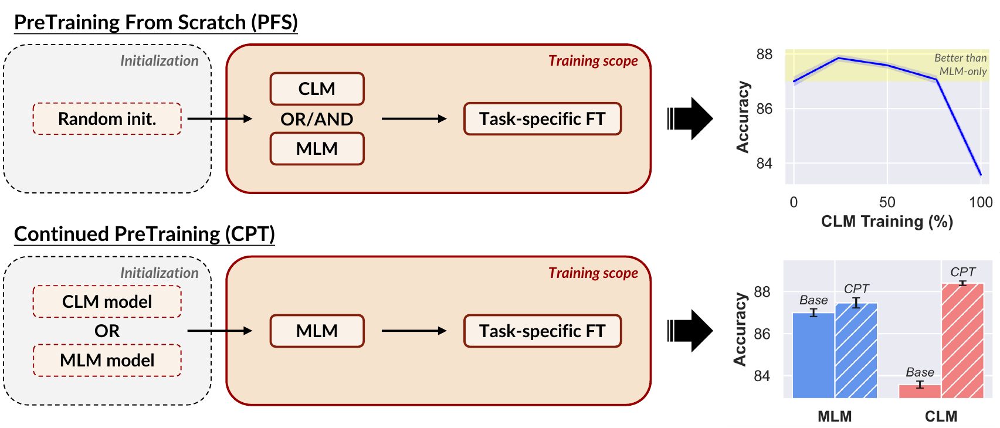
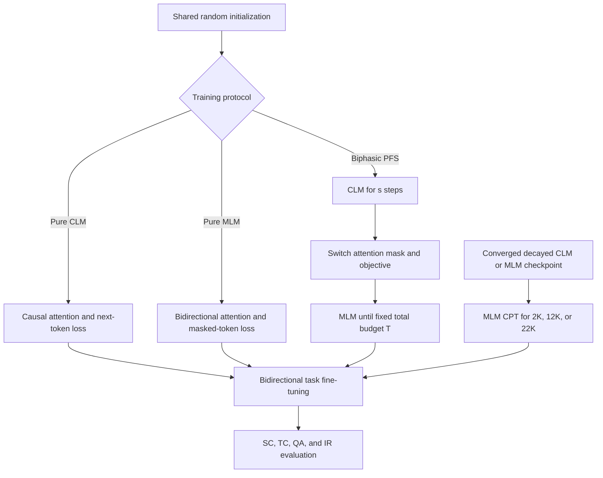
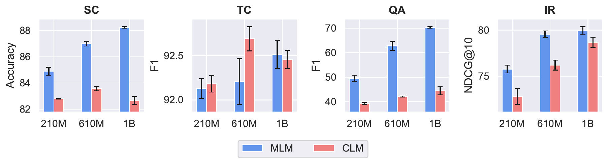
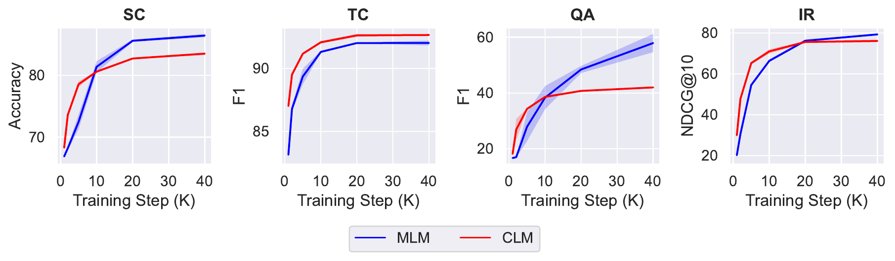
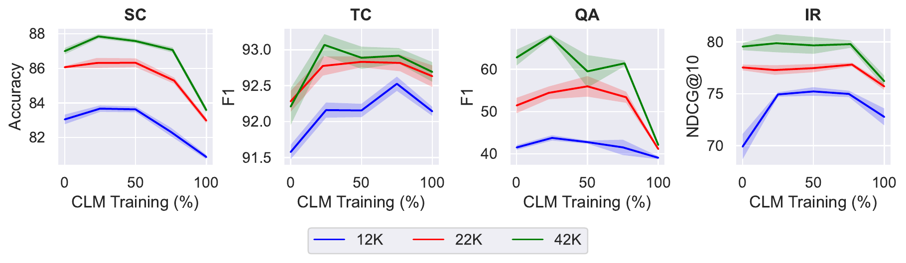

# Should We Still Pretrain Encoders with Masked Language Modeling? - Gisserot-Boukhlef et al., 2025

> **arXiv:** 2507.00994v4 · **Venue:** preprint (2026 revision) · **Affiliations:** Artefact Research Center; Diabolocom; MICS, CentraleSupélec, Université Paris-Saclay; Instituto de Telecomunicações; Instituto Superior Técnico, Universidade de Lisboa; TransPerfect; Cohere

## TL;DR

Under matched architecture, data, token budget, and evaluation, pure masked language modeling (MLM) generally produces stronger final text representations than pure causal language modeling (CLM), especially for sequence classification and extractive QA. CLM is nevertheless much stronger early in training, more stable across fine-tuning learning rates, and competitive or superior for token classification. The best fixed-budget recipe is biphasic: train causally first, then switch the same model to bidirectional MLM; at 610M parameters and 42K steps, 10K CLM plus 32K MLM beats 42K MLM on all four task-category averages. If a converged causal checkpoint already exists, MLM continued pretraining closes the QA and retrieval gaps while retaining CLM's strengths, making decoder-to-encoder conversion attractive in practice.

## Problem & motivation

Encoder pretraining traditionally couples a bidirectional attention mask with MLM. Recent embedding systems instead begin with large causal decoders, remove the causal attention restriction, and adapt them for representation learning. Their strong benchmark scores do not isolate the reason: these decoders are often much larger than standard encoders, trained on more data, and post-trained with proprietary mixtures.

This paper asks a controlled question: if architecture, parameter count, tokenizer, data order, token budget, and downstream protocol are held fixed, which pretraining objective produces the best representations?

The comparison is subtle because MLM and CLM expose different supervision and context:

- **CLM** predicts nearly every token from its left prefix, producing dense labels but never seeing right context while pretraining.
- **MLM** predicts only selected tokens, but each prediction uses bidirectional context.
- **Downstream encoders** use bidirectional attention regardless of their pretraining objective, so a CLM-pretrained model experiences an attention-mask change at fine-tuning time.

The study therefore tests more than final pure-objective quality. It asks how quickly each objective learns, how stable its checkpoints are under downstream fine-tuning, whether sequential CLM→MLM improves a randomly initialized model under fixed compute, and whether scarce additional MLM compute is better spent on an existing CLM or MLM checkpoint.

The experimental scale is unusually large for an encoder ablation: 38 final models from 210M to 1B parameters, 12 downstream datasets in four task families, 50 evaluated checkpoints, six fine-tuning learning rates, five seeds, and 15,120 fine-tuning runs. The total reported cost is 110K MI250X GPU-hours (§2).

## Key idea

Use one Transformer family and alter only the attention pattern and prediction objective. For tokens $\mathbf{x}=(x_1,\ldots,x_T)$, CLM minimizes

$$
\mathcal{L}_{\mathrm{CLM}}(\mathbf{x})
=-\sum_{t=1}^{T}\log p_{\theta}^{\rightarrow}
\left(x_t\mid x_1,\ldots,x_{t-1}\right),
$$

where $p_{\theta}^{\rightarrow}$ is computed with causal attention. MLM samples a set $\mathcal{M}\subseteq\{1,\ldots,T\}$, replaces those positions with placeholders, and minimizes

$$
\mathcal{L}_{\mathrm{MLM}}(\mathbf{x})
=-\sum_{i\in\mathcal{M}}\log p_{\theta}^{\leftrightarrow}
\left(x_i\mid \mathbf{x}_{\mathcal{M}}\right),
$$

where $p_{\theta}^{\leftrightarrow}$ uses bidirectional attention and $\mathbf{x}_{\mathcal{M}}$ is the corrupted input. Positions are independently selected with masking probability $p_{\mathrm{mask}}\in\{0.2,0.3,0.4,0.5\}$.

The biphasic objective switches once at step $s$ in a run of $T$ steps:

$$
\mathcal{L}_t=
\begin{cases}
\mathcal{L}_{\mathrm{CLM}}, & t < s,\\
\mathcal{L}_{\mathrm{MLM}}, & t \ge s.
\end{cases}
$$

Nothing is blended within a batch. At the switch, the same parameters continue training, attention becomes bidirectional, masked placeholders are introduced, and loss moves from next-token positions to masked positions.

The working interpretation is that CLM's dense targets rapidly build useful local and token-level features, while the later MLM phase aligns the representation with bidirectional downstream use and learns relationships that require both left and right context. The evidence is empirical; the paper does not identify a unique mechanistic cause.

## How it works

### Unified model family

All models follow EuroBERT's modern Transformer design and differ only in width and depth:

| Size | Layers | Hidden | FFN | Attention heads | KV heads |
|---|---:|---:|---:|---:|---:|
| 210M | 12 | 768 | 3,072 | 12 | 12 |
| 610M | 26 | 1,152 | 4,096 | 18 | 6 |
| 1B | 28 | 1,728 | 5,120 | 18 | 6 |

Every size uses RMSNorm, SwiGLU, RoPE with $\theta=10{,}000$, context length 2,048, and the 128,256-token Llama 3 tokenizer (Appendix Table 1). A CLM run is therefore not a separately engineered GPT architecture; it is the same backbone operated with causal attention and next-token loss.

### Three training protocols

1. **Pure pretraining from scratch (PFS):** initialize randomly and train for 42K steps with either CLM or MLM. MLM sweeps four masking ratios at all three model sizes.
2. **Biphasic PFS:** initialize randomly, train with CLM, then switch once to MLM without completing learning-rate decay at the intermediate checkpoint. Total budgets are fixed at 12K, 22K, or 42K steps; CLM receives 0%, 25%, 50%, 75%, or 100% of the budget. Main sweeps use the 610M model and 40% masking.
3. **Continued pretraining (CPT):** start from a fully pretrained and learning-rate-decayed 610M CLM or MLM checkpoint, then run another 2K, 12K, or 22K MLM steps at 40% masking. This models reuse of an existing public checkpoint rather than one uninterrupted training run.

*Paper Figure 1. PFS compares pure and sequential objectives from random initialization; CPT applies the same MLM adaptation to already-converged CLM and MLM checkpoints. The right panels preview why the distinction matters: a modest causal prefix improves fixed-budget training, while a causal base benefits more from later MLM adaptation.*

### Pure-objective comparison

Each model sees the same ordered FineWeb-Edu samples. Pure MLM and CLM runs use the same 42K-step Warmup-Stable-Decay schedule and approximately 100B tokens. At downstream time, every model uses bidirectional attention:

- **Sequence classification (SC):** mean-pool tokens and train a cross-entropy classifier on SST-2, QQP, and MNLI.
- **Token classification (TC):** token-level cross-entropy on English CoNLL, OntoNotes, and UNER.
- **Question answering (QA):** token-level cross-entropy on SQuAD, SQuAD-v2, and ReCoRD.
- **Information retrieval (IR):** mean-pooled embeddings with InfoNCE and in-batch negatives on MS MARCO; NQ and English MLDR transfer from the MS MARCO-trained model.

*Paper Figure 2. MLM at 40% masking dominates SC and QA at every size and usually leads IR; CLM is competitive on TC and is clearly best at 610M. Bars average three datasets with different category-specific metrics, so comparisons are meaningful within panels, not across them.*

### Data efficiency and fine-tuning stability

The authors fine-tune intermediate 610M checkpoints at 1K, 2K, 5K, 10K, 20K, and 40K steps. CLM generally leads early: through 10K steps for SC and QA, through 20K for IR, and through the full run for TC. MLM catches up later and finishes much stronger on QA.

*Paper Figure 4. CLM's red curves rise faster, while MLM's blue curves continue improving later. The appendix reproduces the conclusion against estimated training FLOPs, not only steps (Appendix Figure 10).*

Fine-tuning stability is measured by sweeping six learning rates from $10^{-5}$ to $5\times10^{-4}$. Figure 5 shows lower sensitivity for CLM-pretrained checkpoints over the central $10^{-5}$ to $10^{-4}$ range. This is a downstream optimization result, not evidence that CLM pretraining itself has lower run-to-run variance.

### Biphasic pretraining from scratch

At each fixed budget, CLM runs first and MLM second. The 25%-CLM / 75%-MLM split is the most reliable overall choice and beats pure MLM across all four categories at 42K steps. Longer causal phases can still help TC and IR, but hurt SC and especially QA if too little MLM remains.

*Paper Figure 6. At 12K, 22K, and 42K total steps, mixed runs usually beat either endpoint. The optimum is task-dependent, but allocating the first quarter to CLM is the consistent compromise; pure CLM remains weakest for QA.*

At 1B parameters, the paper tests only the 25%-75% mix at 42K steps and observes the same broad advantage (Appendix Figure 11). This confirms one larger point, not the complete ratio curve at 1B.

### Continued pretraining

CPT asks a different resource-allocation question. Both starting checkpoints have already consumed 42K steps and completed learning-rate decay. Applying 22K MLM steps to the CLM checkpoint transforms it into a bidirectional encoder and largely erases its deficits. The same additional MLM compute applied to an MLM checkpoint gives smaller gains.

The CLM→MLM route does not dominate every cell: after 22K CPT, MLM→MLM remains slightly higher on average QA (67.66 versus 66.62), while CLM→MLM leads SC (88.40 versus 87.47), TC (92.70 versus 92.11), and IR (80.70 versus 80.45), per Appendix Tables 14-17.

## Training / data

### Pretraining

| Setting | Value | Source |
|---|---:|---|
| Corpus | Unique English tokens from FineWeb-Edu | §2 |
| Context length | 2,048 | Appendix Table 1 |
| GPUs | 192 AMD MI250X (24 nodes × 8) | §2 |
| Per-GPU batch | 12 sequences | Appendix Table 1 |
| Tokens per step | 2,359,296 | Appendix Table 1 |
| Optimizer | AdamW, $\beta_1=0.9$, $\beta_2=0.95$, $\epsilon=10^{-5}$ | Appendix Table 1 |
| Weight decay / gradient clip | 0.1 / 1.0 | Appendix Table 1 |
| Peak learning rate | $5\times10^{-4}$ | Appendix Table 1 |
| Schedule | 2K warmup, stable phase, final 2K linear decay | §2 |
| Full run | 42K steps, approximately 100B tokens | §2 |

The main text states an effective batch of 2,373,120 tokens, while Appendix Table 1 reports 2,359,296. The latter equals $192\times12\times1{,}024$, not the stated maximum context length of 2,048, so exact packing or sequence-length accounting cannot be reconstructed from the paper alone. The recap preserves this discrepancy rather than treating either value as unambiguous.

Base pretraining accounts for 15 models and 81K GPU-hours. Biphasic PFS adds 17 models, 120K aggregate training steps, and 16K GPU-hours. CPT adds six models, 26K non-redundant steps through checkpoint reuse, and 4K GPU-hours. Evaluation consumes about 9K GPU-hours, totaling 110K (§2).

### Fine-tuning

Each model-dataset pair is trained for at most 1,000 steps or one epoch with batch size 32. The study searches learning rates $\{10^{-5},2\times10^{-5},5\times10^{-5},10^{-4},2\times10^{-4},5\times10^{-4}\}$, uses 10% warmup and linear decay, selects the best validation setting, and repeats the entire procedure over five seeds. Reported values are seed means with 95% confidence intervals.

SC uses accuracy, TC and QA use F1, and IR uses NDCG@10. Because each category average combines three datasets under one metric, it is useful for objective comparisons inside that category; it is not a universal aggregate score across all representation tasks.

Retrieval evaluation is deliberately controlled but nonstandard. NQ and MLDR receive no task-specific fine-tuning beyond MS MARCO transfer, and evaluation corpora are restricted to documents labeled positive or negative rather than the full candidate collections (Appendix B). No contrastive post-training for general zero-shot MTEB is performed.

## Results

### Pure MLM versus CLM after 42K steps

The table reports category averages from Appendix Tables 2-5. MLM uses 40% masking to match Figure 2, even where another rate has a higher category average.

| Size | Objective | SC accuracy | TC F1 | QA F1 | IR NDCG@10 | Source |
|---:|---|---:|---:|---:|---:|---|
| 210M | MLM-40% | **84.89** | 92.13 | **49.43** | **75.78** | Tables 2-5 |
| 210M | CLM | 82.80 | **92.18** | 39.26 | 72.83 | Tables 2-5 |
| 610M | MLM-40% | **87.00** | 92.21 | **62.77** | **79.55** | Tables 2-5 |
| 610M | CLM | 83.58 | **92.69** | 42.09 | 76.20 | Tables 2-5 |
| 1B | MLM-40% | **88.23** | **92.51** | **70.28** | **79.95** | Tables 2-5 |
| 1B | CLM | 82.68 | 92.46 | 44.48 | 78.68 | Tables 2-5 |

The largest gap is QA: at 1B, MLM leads by 25.80 F1 points. SC's MLM advantage also grows with size. IR converges more closely, and TC is effectively tied except for CLM's 0.48-point advantage at 610M.

Masking ratio remains task- and scale-dependent (Figure 3). At 1B, 40% is strongest for SC (88.23 category average) and QA (70.28), while 50% is strongest for TC (92.88) and IR (81.97). At 610M, 20% is strongest for SC (87.56), TC (92.79), and QA (65.00), while 50% is strongest for IR (79.62). These values are from Appendix Tables 2-5 and reinforce that 40% is a study-wide compromise, not a universal optimum.

### Early data efficiency

| Category | Step | MLM-40% | CLM | Later winner at 40K | Source |
|---|---:|---:|---:|---|---|
| SC | 5K | 72.49 | **78.56** | MLM, 86.40 vs 83.48 | Table 6 |
| TC | 5K | 89.36 | **91.17** | CLM, 92.65 vs 92.02 | Table 7 |
| QA | 5K | 27.89 | **34.30** | MLM, 57.90 vs 41.99 | Table 8 |
| IR | 5K | 54.50 | **65.22** | MLM, 79.26 vs 76.05 | Table 9 |

CLM's early advantage is large and consistent at 5K. MLM's late superiority is not simply a matter of having more labels per step; MLM predicts fewer positions but benefits from bidirectional context and continues gaining after CLM begins to plateau.

### Fixed-budget CLM→MLM

At 42K total steps and 610M parameters, 10K CLM plus 32K MLM is the paper's recommended 25%-75% compromise:

| Category | Pure MLM: 0K+42K | CLM→MLM: 10K+32K | Pure CLM: 42K+0K | Source |
|---|---:|---:|---:|---|
| SC | 87.00 | **87.85** | 83.58 | Table 10 |
| TC | 92.21 | **93.07** | 92.69 | Table 11 |
| QA | 62.77 | **67.77** | 42.09 | Table 12 |
| IR | 79.55 | **79.88** | 76.20 | Table 13 |

The gain is largest on QA at +5.00 F1. The same 25%-75% split is also strongest or near-strongest at shorter budgets, but no single ratio wins every task: at 22K, the 50%-50% mix has the highest QA average (55.97), while 75%-25% has the highest IR average (77.81). “Optimal” therefore describes the robust overall compromise, not a mathematically universal split.

### MLM continued pretraining after converged checkpoints

| Starting objective | MLM CPT steps | SC | TC | QA | IR | Source |
|---|---:|---:|---:|---:|---:|---|
| MLM | 0 | 87.00 | 92.21 | 62.77 | 79.55 | Tables 14-17 |
| CLM | 0 | 83.58 | **92.69** | 42.09 | 76.20 | Tables 14-17 |
| MLM | 12K | 87.61 | 92.27 | **66.57** | 79.92 | Tables 14-17 |
| CLM | 12K | **87.84** | **92.77** | 63.21 | **80.27** | Tables 14-17 |
| MLM | 22K | 87.47 | 92.11 | **67.66** | 80.45 | Tables 14-17 |
| CLM | 22K | **88.40** | **92.70** | 66.62 | **80.70** | Tables 14-17 |

At 12K extra steps, the adapted CLM already matches or exceeds continued MLM on three categories and trails QA by 3.36 points. At 22K, the QA gap shrinks to 1.04 while the CLM start leads elsewhere. This supports reusing abundant causal checkpoints, but it does not show a compute advantage if both starting checkpoints must first be trained from scratch: each base already consumed the same 100B-token budget.

## Limitations & follow-ups

- **Scale stops at 1B and 100B tokens.** The controlled conclusion need not extrapolate to multi-billion-parameter decoders trained on trillions of tokens. The authors note that 100B is about five times Chinchilla's compute-optimal token budget for a 1B decoder, but modern embedding leaders are often larger.
- **One architecture, tokenizer, language, and corpus.** EuroBERT-style blocks, Llama 3 tokenization, English FineWeb-Edu, and one data order are fixed. This isolation is a strength for causality but limits external validity.
- **Only one switch direction is deeply studied.** PFS tests CLM→MLM, while concurrent Ettin/Seq-vs-Seq work studies different orderings and a 2T-token regime. The apparent disagreement may be budget-dependent; this paper does not directly run MLM→CLM under its own full grid.
- **Objective and attention pattern change together.** CLM uses causal attention plus next-token prediction; MLM uses bidirectional attention plus masked prediction. The experiment identifies a useful training paradigm but cannot attribute gains uniquely to loss density, corruption, or visibility.
- **Masking ratio is not fully controlled across every experiment.** Main biphasic and CPT runs use 40%, though pure-MLM sweeps show that category optima vary substantially. Some hybrid conclusions may shift under task-specific rates.
- **Evaluation is supervised and task-specific.** There is no contrastive post-training or broad zero-shot MTEB evaluation. Retrieval uses labeled-only candidate subsets and MS MARCO transfer, so NDCG@10 is not directly comparable to standard full-corpus leaderboard results.
- **Category averages hide heterogeneity.** ReCoRD has large confidence intervals and can dominate QA variation; masking-rate trends differ by task. The four panels should not be collapsed into one overall number because their metrics differ.
- **PFS and CPT are different optimization regimes.** PFS switches before learning-rate decay while gradients remain active; CPT restarts from a converged, decayed checkpoint. Better CPT from CLM does not prove that an uninterrupted run with the same extra steps behaves identically.
- **Compute accounting contains a batch discrepancy.** Main text and appendix tokens-per-step differ, and the appendix value does not equal the product of stated devices, samples, and maximum length. Exact token reproduction requires consulting released code.
- **Environmental cost is substantial.** The study spends 110K MI250X GPU-hours. Checkpoint reuse reduces redundant runs in the study and may lower practical encoder-development cost, but the evidence itself is compute-intensive.

The most useful follow-ups are factorially separating attention mask from prediction target, matching objectives by total predicted tokens and FLOPs, testing multiple CLM↔MLM alternations, extending beyond English and 1B parameters, reproducing the study at multi-trillion-token scale, and adding controlled contrastive post-training and standard full-corpus retrieval evaluation.

## Links

- **arXiv:** [abs](https://arxiv.org/abs/2507.00994v4) · [html](https://arxiv.org/html/2507.00994v4) · [pdf](https://arxiv.org/pdf/2507.00994v4)
- **Code:** [training / EuroBERT branch](https://github.com/Nicolas-BZRD/EuroBERT/tree/MLM_vs_CLM) · [evaluation / EncodEval branch](https://github.com/hgissbkh/EncodEval/tree/MLM_vs_CLM)
- **Hugging Face:** [MLMvsCLM organization](https://huggingface.co/MLMvsCLM) · [model collection](https://huggingface.co/collections/MLMvsCLM/mlm-vs-clm)
- **Project page:** [artifact hub](https://huggingface.co/MLMvsCLM)
- **Blog posts:** [Encoders Should Not Be Pre-trained with MLM Only](https://huggingface.co/blog/Nicolas-BZRD/encoders-should-not-be-only-pre-trained-with-mlm)
- **Talks / videos:** —
- **OpenReview / venue page:** —
- **Papers-with-Code:** —
- **BibTeX:** [Hugging Face project citation](https://huggingface.co/MLMvsCLM#citation)
- **Related / predecessor papers:** [BERT-family overview](../bert/overview.md#169-mask-schedules-and-the-mlm-versus-clm-question) · [Should You Mask 15%?](bert-masking_2022_mask-15-percent.md) · [Dynamic Masking Rate Schedules](bert-masking_2024_dynamic-mask-schedules.md) · [EuroBERT](bert-modern-encoder_2025_eurobert.md) · [Ettin / Seq vs Seq](bert-modern-encoder_2025_ettin-seq-vs-seq.md) · [LLM2Vec](https://openreview.net/forum?id=IW1PR7vEBf)