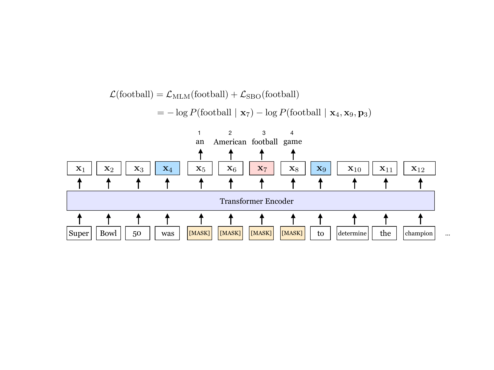
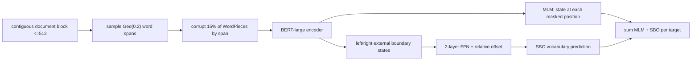
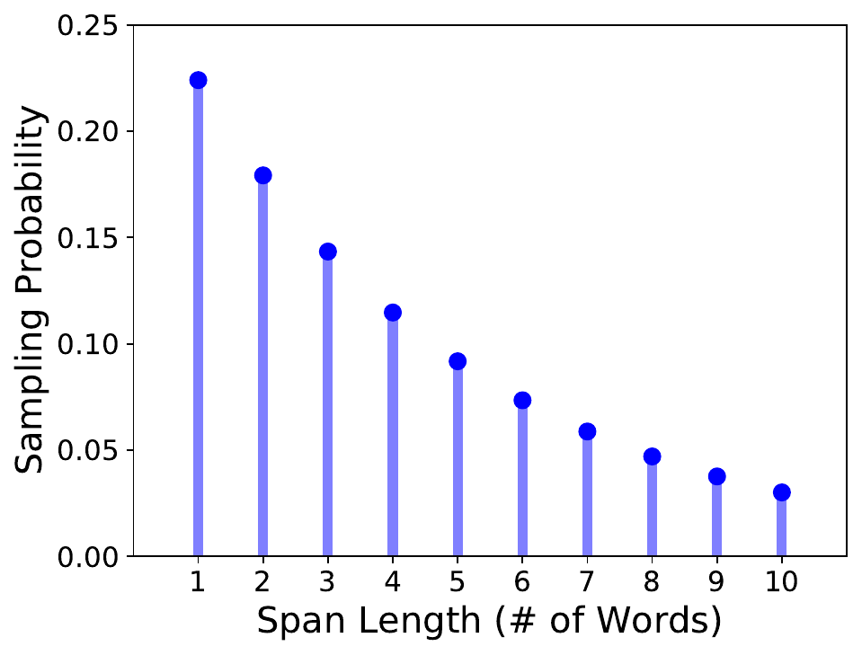

# SpanBERT — Joshi et al., 2019

> **arXiv:** 1907.10529v3 · **Venue:** Transactions of the Association for Computational Linguistics, 2020 · **Affiliation:** Facebook AI Research, University of Washington, Princeton University, and Allen Institute for AI

## TL;DR
SpanBERT aligns encoder pretraining with tasks whose outputs and relations are spans rather than isolated tokens. It masks contiguous complete-word spans, asks ordinary MLM to reconstruct their tokens, and adds a span-boundary objective that reconstructs each hidden token using only the contextual states immediately outside the span plus its relative position. Combined with full-length single-sequence training and removal of NSP, it produced large gains in extractive QA and coreference while retaining broad GLUE performance.

## Problem & motivation
BERT samples masked WordPieces independently. That often leaves enough local evidence to make a prediction trivial—for example, seeing “Broncos” makes a hidden “Denver” easier to recover—and it does not explicitly require a compact span representation. Yet extractive question answering, coreference resolution, semantic role labeling, and relation extraction reason about contiguous mentions and their boundaries.

Span-oriented downstream systems commonly represent a candidate using its endpoint states. Standard MLM provides no direct pressure for those endpoints to summarize interior content. SpanBERT changes both the corruption distribution and the source representation used for an auxiliary reconstruction loss.

The authors also construct a stronger BERT baseline. They dynamically resample masks, always use contexts up to 512 tokens, train longer with AdamW, and discover that one contiguous sequence without NSP usually beats BERT's two-segment pipeline. This distinction is necessary when assigning gains to span masking itself.

## Key idea

For input tokens $X=(x_1,\ldots,x_n)$, repeatedly sample complete-word spans until approximately 15% of WordPieces are covered. Span length obeys a clipped geometric distribution

$$
\ell\sim\operatorname{Geo}(p=0.2),\qquad \ell\le 10,
$$

which yields a reported mean of 3.8 words. For a masked span $(x_s,\ldots,x_e)$ and target $x_i$ inside it, construct

$$
y_i=f\!\left(x^{\mathrm{enc}}_{s-1},x^{\mathrm{enc}}_{e+1},p_{i-s+1}\right),
$$

where $x^{\mathrm{enc}}_{s-1}$ and $x^{\mathrm{enc}}_{e+1}$ are contextual states of the visible external boundaries and $p_{i-s+1}$ is a learned relative-position embedding. The token receives two reconstruction losses:

$$
\mathcal{L}(x_i)
=-\log P(x_i\mid x_i^{\mathrm{enc}})
-\log P(x_i\mid y_i)
=\mathcal{L}_{\mathrm{MLM}}(x_i)+\mathcal{L}_{\mathrm{SBO}}(x_i).
$$

MLM may read the contextual state at the corrupted position, whereas SBO can read only the two outer boundaries and relative offset. SBO therefore forces boundary states to carry information useful for reconstructing the whole interior.

## How it works

### Span sampling and replacement

A start position is sampled uniformly at a word boundary, and the selected region contains full words even when those words split into multiple WordPieces. Sampling continues until the 15% token budget is consumed. The geometric law favors short phrases while retaining examples up to ten words.

Replacement follows BERT's 80/10/10 proportions, but the choice is applied at span level rather than independently per token: a sampled span is masked, replaced, or retained as a unit. Random replacements are sampled from the unigram distribution.

### Span-boundary network

For hidden width $H$ and relative-position width $d_p=200$, concatenate

$$
h_0=[x^{\mathrm{enc}}_{s-1};x^{\mathrm{enc}}_{e+1};p_{i-s+1}]
\in\mathbb{R}^{2H+d_p}.
$$

Then compute

$$
h_1=\operatorname{LayerNorm}(\operatorname{GELU}(W_1h_0)),
$$

$$
y_i=\operatorname{LayerNorm}(\operatorname{GELU}(W_2h_1)).
$$

For the large configuration, each boundary is 1,024-dimensional and the concatenation is 2,248-dimensional. The resulting $y_i$ is projected to vocabulary logits using the same tied input-embedding weights as the MLM head. The target offset differentiates predictions made from identical boundary pairs.

### Single-sequence pipeline

SpanBERT removes NSP and its two-segment sampler. It divides documents into contiguous blocks up to 512 tokens, stopping at document boundaries. A batch samples blocks uniformly, generates fresh spans, and sums MLM and SBO over all selected tokens. The longer coherent context helps even before span-specific objectives are introduced, which is why the paper reports both an improved BERT baseline and `BERT-1seq`.

### Encoder and downstream use

The released large model has BERT-large's 24 Transformer layers, hidden size 1,024, 16 attention heads, cased WordPiece vocabulary, and approximately 340M parameters. The SBO network is needed only during pretraining; downstream models consume the ordinary Transformer states, so SpanBERT can replace BERT in existing fine-tuning code.

- **QA:** pack passage and question, then independently classify start and end positions. `[CLS]` denotes no answer in SQuAD 2.0.
- **Coreference:** represent mentions using endpoint states plus attention-pooled interior states, then score antecedent pairs.
- **TACRED:** replace subject and object mentions with entity-type markers and classify the `[CLS]` state.
- **GLUE:** place a linear classifier over `[CLS]`, keeping the evaluation deliberately single-task.

## Training / data

SpanBERT uses the same BooksCorpus and English Wikipedia sources as BERT and cased WordPiece tokenization. Unlike original BERT, it generates new masks each epoch, removes random short sequences and the initial 128-token phase, and always takes blocks up to 512 tokens.

| Setting | Value | Source |
|---|---:|---|
| Backbone | BERT-large: 24 layers, $H=1024$, 16 heads | §4.2 |
| Batch | 256 sequences × up to 512 tokens | §4.2 |
| Updates | 2.4M | §4.2 |
| Optimizer | AdamW | §4.2 |
| Peak learning rate | $10^{-4}$ | §4.2 |
| Warmup | 10,000 steps | §4.2 |
| Adam | $\beta_1=0.9$, $\beta_2=0.999$, $\epsilon=10^{-8}$ | §4.2 |
| Decoupled weight decay | 0.1 | §4.2 |
| Dropout | 0.1 | §4.2 |
| Hardware | 32 V100 GPUs for 15 days | §4.2 |

Fine-tuning searches QA learning rates $\{5\times10^{-6},10^{-5},2\times10^{-5},3\times10^{-5},5\times10^{-5}\}$ and batches 16 or 32 for four epochs, with length 512 and a 128-token sliding window. Coreference searches lengths 128–512, encoder rates $10^{-5}$ or $2\times10^{-5}$, and task-head rates $\{1,2,3\}\times10^{-4}$ for 20 epochs at one document per batch. TACRED and GLUE use length 128, the same learning-rate and batch sweep, and ten epochs except four for CoLA.

## Results

### Extractive QA

| Model | SQuAD 1.1 EM/F1 | SQuAD 2.0 EM/F1 | Notes |
|---|---:|---:|---|
| Google BERT | 84.3 / 91.3 | 80.0 / 83.3 | released BERT-large |
| Improved BERT replica | 86.5 / 92.6 | 82.8 / 85.9 | stronger pipeline |
| BERT-1seq | 87.5 / 93.3 | 83.8 / 86.6 | no NSP, full sequence |
| **SpanBERT** | **88.8 / 94.6** | **85.7 / 88.7** | Table 1 test results |

SpanBERT gains 2.0 SQuAD 1.1 F1 and 2.8 SQuAD 2.0 F1 over the authors' tuned BERT, not merely the weaker public checkpoint. Across five MRQA development tasks, it averages 81.5 F1 versus 78.6 for tuned BERT and 79.7 for BERT-1seq (Table 2).

### Coreference and relation extraction

| Benchmark | SpanBERT | BERT-1seq | Tuned BERT | Prior/reference | Source |
|---|---:|---:|---:|---:|---|
| OntoNotes coreference avg F1 | **79.6** | 78.8 | 78.3 | previous SOTA 73.0 | Table 3 |
| TACRED F1 | **70.8** | 70.1 | 67.5 | BERT-EM+MTB 71.5* | Table 4 |

The coreference gain is especially aligned with SBO because mention models directly use boundary states. The TACRED comparison marked with an asterisk is not controlled: MTB uses additional entity-linked pretraining data.

### GLUE and ablations

SpanBERT reports an 82.8 GLUE average versus 81.7 for BERT-1seq, 81.1 for tuned BERT, and 80.4 for Google BERT (Table 5). The largest gains are not uniform—RTE rises to 79.0 while SST-2 remains 0.4 below Google BERT—so the method's clearest advantage is span selection rather than every sequence-classification task.

In the controlled masking comparison, geometric spans give the strongest or tied result on most selected development tasks, despite requiring no parser or entity recognizer (Table 6). With span masking fixed, replacing two-segment NSP training by one sequence improves most tasks; adding SBO further lifts HotpotQA from 76.3 to 79.0 F1 and coreference from 87.3 to 87.6 in Table 7. The paper's prose says +2.7 coreference for SBO, but the rendered Table 7 values show +0.3; the table is reproduced here without silently resolving that internal inconsistency.

## Limitations & follow-ups

- The final SpanBERT differs from original BERT in span corruption, SBO, sequence packing, NSP removal, dynamic masking, optimizer details, full-length training, and 2.4× as many updates. The `BERT-1seq` and masking ablations help, but no full factorial analysis separates every interaction.
- SBO adds pretraining compute and an auxiliary network that is discarded at inference; the paper does not report its isolated wall-clock overhead.
- Random spans are not guaranteed to align with semantic constituents. Their advantage is robustness and cheap preprocessing, not linguistic precision.
- Gains are strongest for span-heavy tasks and smaller or inconsistent for generic classification.
- Inputs remain limited to 512 tokens, and the coreference system encodes long documents as independent chunks.
- The corpus and evaluation are English-centric, and the archived official model repository uses a noncommercial license for pretrained models.
- Later span-denoising encoder–decoders such as T5 reconstruct spans autoregressively, while [ELECTRA](https://arxiv.org/abs/2003.10555) pursues dense token-level discrimination; these optimize different transfer interfaces.

## Links

- **arXiv:** [abs](https://arxiv.org/abs/1907.10529v3) · [html](https://arxiv.org/html/1907.10529v3) · [pdf](https://arxiv.org/pdf/1907.10529v3)
- **Code:** [facebookresearch/SpanBERT](https://github.com/facebookresearch/SpanBERT)
- **Hugging Face:** [SpanBERT organization](https://huggingface.co/SpanBERT)
- **Project page:** —
- **Blog posts:** —
- **Talks / videos:** —
- **OpenReview / venue page:** [TACL article](https://aclanthology.org/2020.tacl-1.5/)
- **Papers-with-Code:** [SpanBERT](https://paperswithcode.com/method/spanbert)
- **BibTeX:** [ACL Anthology export](https://aclanthology.org/2020.tacl-1.5.bib)
- **Related / successor papers:** [BERT](bert-encoder_2018_bert-pretraining.md) · [RoBERTa](bert-training_2019_roberta.md) · [ALBERT](bert-efficient_2019_albert.md)
