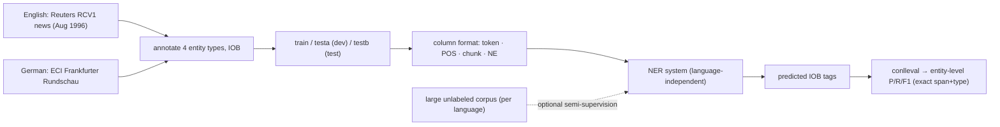

# Introduction to the CoNLL-2003 Shared Task: Language-Independent Named Entity Recognition — Tjong Kim Sang & De Meulder, 2003

> **Venue:** CoNLL 2003 (shared task) · **Affiliation:** Univ. of Antwerp (CNTS) · **ACL Anthology:** W03-0419

## TL;DR
CoNLL-2003 defined the **canonical named-entity recognition (NER) benchmark**: label every token in news
text with one of **four entity types** — **PER** (person), **ORG** (organization), **LOC** (location),
**MISC** (miscellaneous) — plus **O** (outside). It ships **English** (Reuters news) and **German**
(Frankfurter Rundschau) data in a simple **column format** (token, POS, chunk, NE tag) using **IOB**
chunking, and is scored by **entity-level F1** (an entity is correct only if its **exact span and type**
match) via the standard `conlleval` script. It became — and remains — the default sentence-level NER
evaluation; the 2003 winning system reached **~88.8 F1** on English, and modern LMs exceed **93 F1**.

## Problem & motivation
Pre-2003 NER work used incompatible tag sets, corpora, and scoring, making systems hard to compare. The
shared task fixed a **common label set, data format, and metric**, and emphasized **language
independence** (same system on English *and* German) plus the use of **unlabeled data** to encourage
semi-supervised methods. The goal was a clean, reproducible target so progress in sequence labeling could
be measured objectively.

## Key idea
Frame NER as **token-level sequence labeling** with **IOB tagging**: a token is `B-TYPE` if it begins an
entity, `I-TYPE` if inside one, and `O` if outside — so multi-word entities like *European Commission* →
`B-ORG I-ORG`. Each data line is a token annotated with four columns:

```
word    POS    chunk    NE-tag
EU      NNP    B-NP     B-ORG
rejects VBZ    B-VP     O
German  JJ     B-NP     B-MISC
call    NN     I-NP     O
```

Four entity types (PER, ORG, LOC, **MISC** = named entities that aren't the other three, e.g.
nationalities, events, works). Scoring is **phrase/entity-level F1**, not token accuracy:

$$
\text{precision}=\frac{\#\text{correct entities}}{\#\text{predicted}},\quad
\text{recall}=\frac{\#\text{correct entities}}{\#\text{gold}},\quad
\text{F1}=\frac{2PR}{P+R},
$$

where a predicted entity counts as correct **only if both its boundaries and its type exactly match** gold
— a strict criterion that penalizes partial spans.

## How it works


Systems may use the provided **POS** and **chunk** columns as features and an accompanying **large
unlabeled** corpus for gazetteers/word clusters — the task explicitly rewards exploiting unlabeled text.

## Training / data
- **English:** Reuters RCV1 newswire (August 1996). Splits ≈ **train** 14,987 sentences / ~203k tokens,
  **testa** (dev) 3,466 sentences, **testb** (test) 3,684 sentences.
- **German:** ECI Frankfurter Rundschau, similar three-way split.
- Format: one token per line, blank line between sentences; columns token/POS/chunk/NE. Evaluation is the
  official **`conlleval`** Perl script (entity-level F1).

## Results
- **English test (testb) F1 ≈ 88.76** for the best 2003 system (Florian et al., a combination of four
  classifiers with rich features + gazetteers); most participating systems clustered in the low-to-mid 80s.
- **German** was substantially harder (richer morphology, capitalized common nouns) — best F1 in the low
  70s.
- **Lasting impact:** the strict entity-F1 metric and 4-type scheme became the standard NER target; the
  benchmark tracked two decades of progress — CRFs → BiLSTM-CRF (~91 F1) → contextual embeddings
  (ELMo/Flair/BERT, **93+ F1**), by which point English CoNLL-2003 is nearly saturated.

## Limitations & follow-ups
- **Only four coarse types** and **news domain** — narrow relative to real-world entity inventories;
  motivated the finer **18-type**, multi-genre [OntoNotes / CoNLL-2012](dataset_2013_ontonotes.md) NER.
- **Flat, non-nested** entities only; no overlapping/nested spans.
- Near-saturated for English, so it now serves mainly as a **sanity-check / comparability** benchmark; the
  IOB + entity-F1 methodology carries over to downstream extraction tasks such as slot filling
  ([TACRED](dataset_2017_tacred.md)) and document-level extraction.

## Links
- **ACL Anthology:** [W03-0419](https://aclanthology.org/W03-0419/) · [pdf](https://aclanthology.org/W03-0419.pdf)
- **Data / eval:** CoNLL-2003 task page & `conlleval` — <https://www.clips.uantwerpen.be/conll2003/ner/>
- **BibTeX:**
  ```bibtex
  @inproceedings{tjongkimsang2003conll,
    title     = {Introduction to the {CoNLL}-2003 Shared Task: Language-Independent Named Entity Recognition},
    author    = {Tjong Kim Sang, Erik F. and De Meulder, Fien},
    booktitle = {Proceedings of the Seventh Conference on Natural Language Learning (CoNLL) at HLT-NAACL 2003},
    pages     = {142--147},
    year      = {2003},
    url       = {https://aclanthology.org/W03-0419/}
  }
  ```
- **Related papers:** [OntoNotes / CoNLL-2012](dataset_2013_ontonotes.md) ·
  [TACRED](dataset_2017_tacred.md) · [SQuAD 2.0](dataset_2018_squad2.md)
- **In-repo:** [§6.8 in mixed_decoder](../mixed_decoder/mixed_decoder.md)
