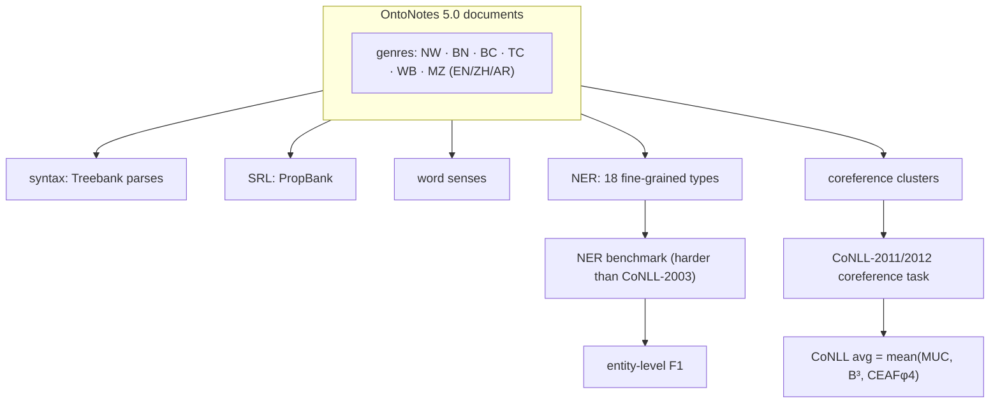

# Towards Robust Linguistic Analysis using OntoNotes (CoNLL-2012) — Pradhan et al., 2013

> **Venue:** CoNLL 2013 · **Affiliation:** Raytheon BBN / Brandeis / Penn / Colorado · **ACL Anthology:** W13-3516

## TL;DR
OntoNotes is a **large, multi-genre, multilingual corpus with layered annotation** — syntax (Treebank
parses), predicate-argument structure (PropBank SRL), **word senses**, **named entities (18 fine-grained
types)**, and **coreference** — over **English, Chinese, and Arabic**. This paper studies **robust
linguistic analysis** across genres on **OntoNotes 5.0**, the release underpinning the **CoNLL-2011/2012
shared tasks** on unrestricted coreference. In practice OntoNotes is the field's **harder NER benchmark**
(18 types vs CoNLL-2003's 4, across newswire/broadcast/telephone/web/magazine), and the standard
**coreference-resolution** benchmark; its value is testing whether analyzers **generalize across text
genres**, not just newswire.

## Problem & motivation
Most NLP annotation (and the NER/parse models trained on it) came from a **single genre** (newswire), so
systems were **brittle** on conversational, web, or broadcast text and on **rarer entity types**.
OntoNotes was built to (a) provide **many layers** of annotation on the **same documents** (so tasks can be
studied jointly), (b) span **diverse genres** and **three languages**, and (c) support **coreference** at
scale. The 2013 paper evaluates how robustly core analyses (parsing, NER, SRL, coref) hold up across these
genres.

## Key idea
Annotate the **same** documents with **stacked layers**, enabling both single-task benchmarks and joint
modeling:

- **Syntax** — Penn-Treebank-style constituency parses.
- **Propositions** — PropBank semantic-role labels over predicates.
- **Word senses** — coarse-grained sense inventory linked to the ontology.
- **Named entities** — **18 types**: `PERSON, NORP, FAC, ORG, GPE, LOC, PRODUCT, EVENT, WORK_OF_ART, LAW,
  LANGUAGE, DATE, TIME, PERCENT, MONEY, QUANTITY, ORDINAL, CARDINAL`.
- **Coreference** — full entity/event mention clusters (the CoNLL-2012 shared-task target).

**Genres** (English): newswire (NW), broadcast news (BN), broadcast conversation (BC), telephone
conversation (TC), web text (WB), magazine (MZ) — so a model's **cross-genre generalization** can be
measured directly. Coreference is scored by the **CoNLL average** of three metrics:

$$
\text{CoNLL-F1} = \tfrac{1}{3}\big(\text{MUC} + \text{B}^3 + \text{CEAF}_{\phi_4}\big),
$$

each an F1 over predicted vs gold mention clusters; NER uses entity-level F1 as in CoNLL-2003.

## How it works


Because all layers sit on the **same tokens**, OntoNotes supports studying interactions (e.g. does better
parsing help coref?) and building **robust, genre-general** analyzers rather than newswire-only ones.

## Training / data
- **Scale:** ~**1.7M+ words** of English (plus Chinese and Arabic portions), spanning the six genres above.
- **Splits:** the CoNLL-2012 shared task defines official **train / dev / test** splits used for both the
  standard **OntoNotes NER** benchmark and **coreference** evaluation.
- **Formats:** column-based `*.conll` files carrying all annotation layers; official scorers for NER
  (entity F1) and coreference (MUC / B³ / CEAF).

## Results
- **Robustness finding:** analyzers trained on one genre **degrade** on others; jointly using OntoNotes'
  multi-genre data yields **more robust** parsing/NER/SRL/coref, the paper's central message.
- **As a benchmark:**
  - **OntoNotes NER (18 types)** is markedly harder than CoNLL-2003; strong contextual models
    (BERT/ELMo-era) reach roughly **89–91 F1**, below their CoNLL-2003 scores — the finer types and
    conversational genres are the difficulty.
  - **CoNLL-2012 coreference** became the standard coref benchmark; neural end-to-end coref models report
    CoNLL-avg F1 climbing from the ~60s (2016) into the **~79–80** range (SpanBERT-era).

## Limitations & follow-ups
- **Licensing (LDC)** restricts free redistribution, unlike CoNLL-2003.
- **Coarse word senses** and **flat NER** (no nested entities); coref annotation excludes singletons in the
  shared-task setup.
- The multi-genre, fine-type design set the template for **robust, general-purpose** extraction evaluation;
  complements sentence NER ([CoNLL-2003](dataset_2003_conll2003-ner.md)), relation extraction
  ([TACRED](dataset_2017_tacred.md)), and reading comprehension ([SQuAD 2.0](dataset_2018_squad2.md)).

## Links
- **ACL Anthology:** [W13-3516](https://aclanthology.org/W13-3516/) · [pdf](https://aclanthology.org/W13-3516.pdf)
- **Data:** OntoNotes 5.0 (LDC2013T19) · CoNLL-2012 task — <https://conll.cemantix.org/2012/>
- **BibTeX:**
  ```bibtex
  @inproceedings{pradhan2013ontonotes,
    title     = {Towards Robust Linguistic Analysis using {O}nto{N}otes},
    author    = {Pradhan, Sameer and Moschitti, Alessandro and Xue, Nianwen and Ng, Hwee Tou and Bj{\"o}rkelund, Anders and Uryupina, Olga and Zhang, Yuchen and Zhong, Zhi},
    booktitle = {Proceedings of the Seventeenth Conference on Computational Natural Language Learning (CoNLL)},
    pages     = {143--152},
    year      = {2013},
    url       = {https://aclanthology.org/W13-3516/}
  }
  ```
- **Related papers:** [CoNLL-2003 NER](dataset_2003_conll2003-ner.md) ·
  [TACRED](dataset_2017_tacred.md) · [SQuAD 2.0](dataset_2018_squad2.md)
- **In-repo:** [§6.8 in mixed_decoder](../mixed_decoder/mixed_decoder.md)
