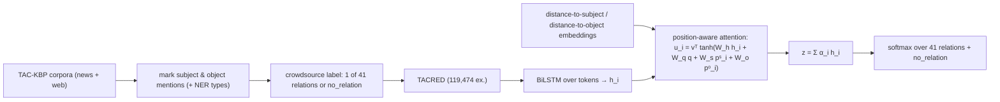

# Position-aware Attention and Supervised Data Improve Slot Filling (TACRED) — Zhang et al., 2017

> **Venue:** EMNLP 2017 · **Affiliation:** Stanford University · **ACL Anthology:** D17-1004

## TL;DR
This paper delivers two things at once: (1) **TACRED**, a large **sentence-level relation-extraction**
dataset — **119,474 examples** crowd-labeled over **41 TAC-KBP relation types plus `no_relation`** — and
(2) a **position-aware attention** LSTM that conditions attention on **where the subject and object
entities sit** in the sentence. Together, better *data* + a better-suited *model* markedly improve relation
extraction: dropped into the best TAC-KBP 2015 slot-filling pipeline, the model raises end-to-end **F1 from
22.2% to 26.7%**. TACRED became the standard supervised RE benchmark (later refined by TACRED-Revisited and
Re-TACRED).

## Problem & motivation
Populating knowledge bases by **extracting relations** ("slot filling" — e.g. *per:title*, *org:founded_by*)
had progressed slowly. Two bottlenecks: (a) **weak/distant-supervision** training data is noisy, and
gold-labeled RE datasets were small; (b) generic sentence encoders (CNN/LSTM) **don't exploit entity
positions** well, yet in RE the relation is defined **between two specific spans** (subject, object), so
where they occur and how far apart they are is crucial signal. The paper tackles both.

## Key idea
**TACRED (data).** Sentences drawn from the yearly **TAC-KBP** evaluation corpora; each example marks a
**subject** and **object** mention (with NER types) and is labeled with one of **41 relations** (person- and
organization-centric, e.g. `per:cities_of_residence`, `org:subsidiaries`) or **`no_relation`**. The class
distribution is deliberately **realistic**: the overwhelming majority are `no_relation` (~80%), so the task
rewards **precision under heavy negatives**, unlike balanced toy RE sets.

**Position-aware attention (model).** Encode tokens with a BiLSTM into hidden states $h_1,\dots,h_n$.
Augment each position with **position embeddings** giving its distance to the **subject** and **object**
spans, $p^s_i, p^o_i$. Compute attention weights that depend on the LSTM summary $q$ (final state) **and**
those positions:

$$
u_i = v^\top \tanh\!\big(W_h h_i + W_q q + W_s p^{s}_i + W_o p^{o}_i\big),\qquad
\alpha_i = \frac{\exp(u_i)}{\sum_j \exp(u_j)} .
$$

The sentence representation $z=\sum_i \alpha_i h_i$ is fed to a softmax over the 42 classes. The position
terms let attention **focus on tokens near or between the two entities** — exactly where relation cues live
— instead of attending uniformly.

## How it works


Entity mentions are often **masked/typed** (replaced by their NER type, e.g. `SUBJ-PERSON`) to prevent the
model from memorizing specific names and to encourage learning the **relational pattern**.

## Training / data
- **Size:** **119,474** examples; **41** relation types + `no_relation` (**42-way** classification).
- **Splits:** standard **train / dev / test** (chronological by TAC-KBP year), test ~15k.
- **Labels:** each candidate (sentence, subject, object) crowd-annotated; heavy `no_relation` majority.
- **Metric:** **micro-averaged F1** over the 41 positive relations (negatives excluded from the positive
  F1), the standard RE score.

## Results
- **Model vs baselines (TACRED test F1):** position-aware attention LSTM ≈ **65.4 F1**, beating a CNN
  (~59), a plain LSTM/SDP-LSTM, and a feature-based logistic-regression baseline — position information is
  the key differentiator.
- **End-to-end slot filling:** replacing the RE component of the **best TAC-KBP 2015** system with this
  model lifts overall slot-filling **F1 from 22.2% → 26.7%**, showing the gains transfer to the full KB
  population pipeline.
- **Data matters as much as model:** training the *same* architectures on TACRED (vs older, smaller RE
  data) is a large part of the improvement — the paper's "supervised data improve slot filling" thesis.

## Limitations & follow-ups
- **Label noise / ambiguity:** later audits (**TACRED-Revisited**, **Re-TACRED**) found a meaningful
  fraction of dev/test labels wrong, inflating/deflating scores — corrected versions raise ceilings by
  several F1.
- **Sentence-level, single relation per pair** — no document-level or multi-hop relations (addressed by
  DocRED), and heavy `no_relation` skew makes precision/threshold tuning delicate.
- **Fixed 41-relation schema**; few-shot / unseen relations motivated **FewRel**.
- Established position-aware encoding and realistic negative-heavy RE evaluation; complements NER
  ([CoNLL-2003](dataset_2003_conll2003-ner.md), [OntoNotes](dataset_2013_ontonotes.md)) and extractive QA
  ([SQuAD 2.0](dataset_2018_squad2.md)) in the extraction cluster.

## Links
- **ACL Anthology:** [D17-1004](https://aclanthology.org/D17-1004/) · [pdf](https://aclanthology.org/D17-1004.pdf)
- **Data:** TACRED (LDC2018T24) · project page — <https://nlp.stanford.edu/projects/tacred/>
- **BibTeX:**
  ```bibtex
  @inproceedings{zhang2017tacred,
    title     = {Position-aware Attention and Supervised Data Improve Slot Filling},
    author    = {Zhang, Yuhao and Zhong, Victor and Chen, Danqi and Angeli, Gabor and Manning, Christopher D.},
    booktitle = {Proceedings of the 2017 Conference on Empirical Methods in Natural Language Processing (EMNLP)},
    pages     = {35--45},
    year      = {2017},
    url       = {https://aclanthology.org/D17-1004/}
  }
  ```
- **Related papers:** [CoNLL-2003 NER](dataset_2003_conll2003-ner.md) ·
  [OntoNotes / CoNLL-2012](dataset_2013_ontonotes.md) · [SQuAD 2.0](dataset_2018_squad2.md)
- **In-repo:** [§6.8 in mixed_decoder](../mixed_decoder/mixed_decoder.md)
