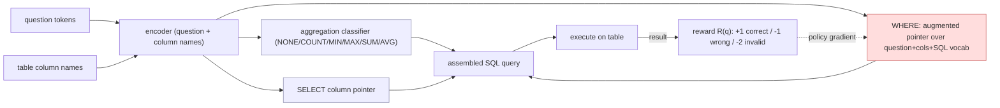

# Seq2SQL / WikiSQL: Generating Structured Queries from Natural Language using Reinforcement Learning — Zhong, Xiong & Socher, 2017

> **arXiv:** 1709.00103v7 · **Affiliation:** Salesforce Research

## TL;DR
This paper introduces **WikiSQL** — **80,654** hand-annotated (natural-language question, SQL query, table)
triples over **24,241 Wikipedia tables**, an order of magnitude larger than prior text-to-SQL sets — and
**Seq2SQL**, a model that maps a question to SQL by **exploiting SQL's structure** (predict the aggregation
op, the SELECT column, and the WHERE clauses separately) rather than decoding free-form tokens. Its key
trick: train the **unordered WHERE conditions** with **reinforcement learning** using **query-execution
reward**, since cross-entropy wrongly penalizes valid reorderings. Seq2SQL lifts **execution accuracy
35.9%→59.4%** and **logical-form accuracy 23.4%→48.3%** over an attentional seq2seq baseline, and WikiSQL
became the standard single-table text-to-SQL benchmark.

## Problem & motivation
Most of the world's structured knowledge lives in relational databases, but querying it requires knowing
**SQL**. Natural-language-to-SQL ("semantic parsing to executable queries") promises to democratize access,
but (a) prior datasets were **tiny** and domain-specific, and (b) generic **seq2seq** decoders waste
capacity on the huge token output space and are **mis-trained** by cross-entropy on the parts of a query
that are **order-invariant** (the set of WHERE conditions). WikiSQL supplies scale; Seq2SQL supplies a
structure-aware, execution-guided model.

## Key idea
Constrain generation to WikiSQL's **single-table SQL sketch**:

```
SELECT  AGG(sel_col)  FROM table  WHERE col op val  (AND col op val)*
```

Seq2SQL predicts the query in **three structured parts**, shrinking the output space:

1. **Aggregation** $\in\{\text{NONE, COUNT, MIN, MAX, SUM, AVG}\}$ — a classifier over the question.
2. **SELECT column** — a **pointer** over the table's column names.
3. **WHERE clause** — a sequence of (column, operator, value) conditions, generated with an **augmented
   pointer network** that copies from the concatenation of **question tokens + column names + SQL
   vocabulary**.

**Execution-guided RL for WHERE.** The WHERE conditions form an **unordered set**: `WHERE a AND b` ≡
`WHERE b AND a`, yet token-level cross-entropy punishes the "wrong" order. So the WHERE decoder is trained
with **policy gradient**, rewarding a generated query $q$ by whether it **executes to the correct answer**:

$$
R(q)=
\begin{cases}
+1 & q \text{ is valid and executes to the gold result}\\
-1 & q \text{ is valid but returns the wrong result}\\
-2 & q \text{ fails to execute}
\end{cases},\qquad
\nabla_\theta J \approx -\big(R(q)-b\big)\,\nabla_\theta \log p_\theta(q).
$$

SELECT/aggregation (which are order-*determinate*) are trained by cross-entropy; only the order-invariant
WHERE part uses RL — a **mixed objective**.

## How it works


Two metrics: **logical-form accuracy** (exact string match to the gold SQL — strict, penalizes valid
reorderings) and **execution accuracy** (does the generated query return the **correct answer** — the
metric RL optimizes).

## Training / data
- **WikiSQL:** **80,654** examples across **24,241** HTML tables from Wikipedia; each example = (question,
  SQL query, table). Crowd workers paraphrase auto-generated queries into fluent questions; standard
  **train/dev/test** split with **disjoint tables** across splits (tests generalization to unseen schemas).
- **Scope:** **single table, no joins**; queries have one aggregation, one SELECT column, and ≥0 WHERE
  conditions — simpler than multi-table SQL but at large scale.
- Seq2SQL uses GloVe embeddings, pointer decoders, and policy-gradient RL with an in-the-loop SQL executor.

## Results
| Model | Logical-form Acc | Execution Acc | Source |
|---|---:|---:|---|
| Attentional seq2seq baseline | 23.4 | 35.9 | Abstract |
| **Seq2SQL** (structure + RL) | **48.3** | **59.4** | Abstract |

- **Structure + execution reward help a lot:** +24.9 logical-form and +23.5 execution accuracy over
  seq2seq.
- **RL specifically fixes the WHERE-order problem:** rewarding execution outcome (not token order) is what
  closes the gap on the unordered conditions — ablating RL hurts.
- **Legacy:** WikiSQL launched a wave of single-table text-to-SQL models (**SQLNet**, **TypeSQL**,
  **SQLova**, **X-SQL**) that pushed execution accuracy above 90% by predicting the SQL **sketch slots**
  directly — validating the structure-decomposition idea. The single-table limitation motivated the
  multi-table, cross-domain [Spider](../mixed_decoder/mixed_decoder.md) benchmark.

## Limitations & follow-ups
- **Single-table, no joins / nesting / GROUP BY** — real databases need multi-table reasoning, addressed by
  **Spider**.
- **Logical-form accuracy understates** performance (semantically-equivalent queries mismatch), which is
  why execution accuracy is the headline metric.
- Sketch-based decoding can **overfit the fixed template**; models that predict slots don't generalize to
  richer SQL grammar.
- Part of the **structured-output** cluster with the table-to-text task
  [ToTTo](../mixed_decoder/mixed_decoder.md); complements extraction datasets
  ([TACRED](dataset_2017_tacred.md), [DocRED](dataset_2019_docred.md)) and QA
  ([SQuAD 2.0](dataset_2018_squad2.md)).

## Links
- **arXiv:** [abs](https://arxiv.org/abs/1709.00103) · [html](https://arxiv.org/html/1709.00103v7) · [pdf](https://arxiv.org/pdf/1709.00103)
- **Code / data:** <https://github.com/salesforce/WikiSQL>
- **BibTeX:**
  ```bibtex
  @article{zhong2017seq2sql,
    title   = {Seq2SQL: Generating Structured Queries from Natural Language using Reinforcement Learning},
    author  = {Zhong, Victor and Xiong, Caiming and Socher, Richard},
    journal = {arXiv preprint arXiv:1709.00103},
    year    = {2017},
    url     = {https://arxiv.org/abs/1709.00103}
  }
  ```
- **Related papers:** [SQuAD 2.0](dataset_2018_squad2.md) · [TACRED](dataset_2017_tacred.md) ·
  [DocRED](dataset_2019_docred.md)
- **In-repo:** [§6.8 in mixed_decoder](../mixed_decoder/mixed_decoder.md)
