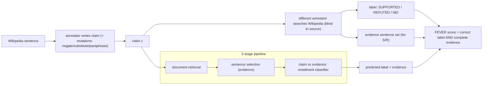

# FEVER: a Large-Scale Dataset for Fact Extraction and VERification — Thorne et al., 2018

> **arXiv:** 1803.05355v3 · **Venue:** NAACL 2018 · **Affiliation:** Univ. of Sheffield / Amazon

## TL;DR
FEVER is the benchmark that turned **fact-checking into a concrete NLP task**: given a **claim**, a system
must (1) **retrieve evidence sentences from Wikipedia** and (2) label the claim **SUPPORTED**, **REFUTED**,
or **NOT ENOUGH INFO (NEI)** — and, for the first two, **cite the exact evidence sentences** used. It
contains **185,445 claims** generated by **altering Wikipedia sentences** and then verified **blind** to the
source, with inter-annotator agreement **Fleiss κ = 0.6841**. The headline difficulty: the best pipeline
labels a claim **with correct evidence** only **31.87%** of the time (vs **50.91%** if evidence is ignored),
showing that **joint retrieval + verification** — the **FEVER score** — is the real challenge.

## Problem & motivation
Automated fact verification needs a large dataset that pairs **claims** with the **textual evidence** that
supports or refutes them — but writing such claims naturally risks **leaking the source** (annotators
paraphrase what they read). FEVER's construction deliberately **decouples claim generation from
verification**: claims are created by mutating Wikipedia facts, then labeled by **different** annotators who
**search Wikipedia afresh**, so the label reflects **retrievable evidence**, not the generator's memory. It
also introduces the crucial third class — **NEI** — forcing systems to admit when evidence is insufficient.

## Key idea
Two-stage annotation and a **retrieval + classification** task.

**Claim generation.** Annotators take a sentence from a Wikipedia page and write claims about the entity —
including **mutations** (negation, substitution, generalization/specialization, paraphrase) — producing both
true and false variants without seeing the eventual label.

**Verification (blind).** Independent annotators **search Wikipedia** and assign one of:

$$
\text{label}(c) \in \{\textbf{SUPPORTED},\ \textbf{REFUTED},\ \textbf{NOT ENOUGH INFO}\},
$$

and for SUPPORTED/REFUTED they **record the evidence sentence(s)** (possibly requiring **multiple sentences**
combined). Evidence can span **more than one page/sentence**, so the task is not single-sentence matching.

**FEVER score (the metric).** A claim is correct **only if** the predicted label is right **and** the
predicted evidence set **contains a complete gold evidence group** (for S/R; NEI needs only the right
label):

$$
\text{FEVER score} = \frac{1}{N}\sum_i \mathbb{1}\big[\hat y_i = y_i \ \wedge\ (\,y_i=\text{NEI}\ \vee\ \exists\,g \in E_i:\ g \subseteq \hat E_i\,)\big].
$$

This **couples retrieval and labeling** — you can't get credit for the right verdict with the wrong
evidence.

## How it works


The standard system is a **three-stage pipeline**: document retrieval → sentence-level evidence selection →
**textual-entailment (NLI)** classification of claim against selected evidence.

## Training / data
- **185,445 claims** derived from ~50k popular Wikipedia pages; class balance across SUPPORTED / REFUTED /
  NEI.
- Each S/R claim carries **gold evidence sentence sets** (some requiring **multi-sentence** composition).
- Splits: **train / dev / test** (test labels hidden for the **FEVER Shared Task**).
- Agreement: **Fleiss κ = 0.6841**. Evaluation: **label accuracy** and the stricter **FEVER score**
  (label + evidence).

## Results
- **Evidence makes it hard.** The paper's best pipeline scores **31.87%** on the full task (label + correct
  evidence) but **50.91%** if evidence is ignored — a ~19-point gap quantifying the cost of **grounding**.
- **NEI and multi-sentence evidence** are the failure modes: retrieving the *complete* evidence group (not
  just one supporting sentence) is where systems lose points.
- **Launched a subfield.** FEVER seeded the annual **FEVER Shared Task**; strong pipelines (UNC, UCL,
  Athene) and later BERT-based retrieval+NLI systems pushed FEVER score into the ~60s–70s, and the
  format generalized to **FEVEROUS** (tables+text) and scientific claim verification.

## Limitations & follow-ups
- **Synthetic claims** (mutated Wikipedia sentences) can encode **annotation artifacts** — models may
  exploit surface cues rather than reason about evidence; motivated the **contrastive**
  [VitaminC](dataset_2021_vitaminc.md).
- **Wikipedia-only** evidence; real-world claims need open-web, multi-source, and temporally-changing
  evidence.
- **Static evidence** — doesn't test sensitivity to **evidence that changes over time**, precisely
  VitaminC's focus.
- Anchors the verification cluster with [VitaminC](dataset_2021_vitaminc.md); shares the "abstain when
  under-supported" idea with [SQuAD 2.0](dataset_2018_squad2.md)'s no-answer class, and the
  grounding/faithfulness concern with [ToTTo](dataset_2020_totto.md).

## Links
- **arXiv:** [abs](https://arxiv.org/abs/1803.05355) · [html](https://arxiv.org/html/1803.05355v3) · [pdf](https://arxiv.org/pdf/1803.05355)
- **Data / shared task:** <https://fever.ai/>
- **BibTeX:**
  ```bibtex
  @inproceedings{thorne2018fever,
    title     = {{FEVER}: a Large-scale Dataset for Fact Extraction and VERification},
    author    = {Thorne, James and Vlachos, Andreas and Christodoulopoulos, Christos and Mittal, Arpit},
    booktitle = {Proceedings of the 2018 Conference of the North American Chapter of the Association for Computational Linguistics (NAACL)},
    year      = {2018},
    url       = {https://arxiv.org/abs/1803.05355}
  }
  ```
- **Related papers:** [VitaminC](dataset_2021_vitaminc.md) · [SQuAD 2.0](dataset_2018_squad2.md) ·
  [ToTTo](dataset_2020_totto.md)
- **In-repo:** [§6.8 in mixed_decoder](../mixed_decoder/mixed_decoder.md)
