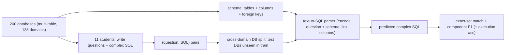

# Spider: A Large-Scale Human-Labeled Dataset for Complex and Cross-Domain Text-to-SQL — Yu et al., 2018

> **arXiv:** 1809.08887v5 · **Venue:** EMNLP 2018 · **Affiliation:** Yale University (LILY Lab)

## TL;DR
Spider is the text-to-SQL benchmark that made the task genuinely hard: **10,181 questions** paired with
**5,693 unique, complex SQL queries** over **200 multi-table databases** spanning **138 domains**,
hand-labeled by 11 students. Its two defining choices — **complex SQL** (JOINs, nesting, `GROUP BY`,
`HAVING`, `ORDER BY`, set operations) and a **cross-domain** split where **train and test use different
databases** — force models to generalize to **unseen schemas and unseen query structures**, unlike
[WikiSQL](dataset_2017_wikisql.md) (single table, one schema style). At release the best model reached only
**12.4% exact-match** on the database split, establishing Spider as the standard, still-challenging
semantic-parsing benchmark.

## Problem & motivation
Prior text-to-SQL datasets had one of two flaws: they used a **single database** with the **same queries**
in train and test (so models memorize schema-specific patterns), or (WikiSQL) they were **single-table with
trivial SQL** (no joins/nesting). Neither tests the real capability: **map a question to executable SQL on a
database the model has never seen**, with queries complex enough to reflect actual analytics. Spider fixes
both — schema generalization **and** SQL complexity.

## Key idea
Build a benchmark where **generalization is unavoidable**:

- **Cross-domain, database split.** The 200 databases are partitioned so that **test databases (and their
  schemas) never appear in training**. A model must read the **schema** (tables, columns, foreign keys) at
  inference and ground the question to it — no memorizing a fixed schema.
- **Complex SQL.** Queries include multi-table **JOINs**, **nested subqueries**, aggregation with
  `GROUP BY`/`HAVING`, `ORDER BY`/`LIMIT`, and `INTERSECT/UNION/EXCEPT` — graded into **easy / medium /
  hard / extra-hard** by SQL-component counts.

**Evaluation** is execution-independent structural matching (queries may have unknown DB values):
- **Exact-set match** — decompose predicted and gold SQL into clauses (SELECT, WHERE, GROUP BY, …) and
  require **set equality per clause** (order-invariant, so `WHERE a AND b` ≡ `WHERE b AND a`).
- **Component matching F1** — per-clause F1, giving partial credit and diagnosing *where* a parser fails.
- (Later added) **execution accuracy** on the test databases.

Because gold values are often abstracted, exact-set/component matching evaluate **query structure** rather
than literal string equality.

## How it works


The parser must perform **schema linking** (align question phrases to the right tables/columns via foreign
keys) and produce **structurally valid** multi-clause SQL — the core difficulties Spider isolates.

## Training / data
- **10,181** questions, **5,693** unique SQL queries, **200** databases (each with multiple tables),
  **138** domains.
- Splits: **train / dev / test** by **database** (test schemas withheld; the **test set is hidden**,
  leaderboard-evaluated).
- Difficulty buckets easy/medium/hard/extra-hard let papers report accuracy by SQL complexity.

## Results
- **Very hard at release:** the best of the tested models (seq2seq + attention/copying, SQLNet-style)
  achieved only **~12.4% exact-match** on the database (cross-domain) split — versus high-90s on WikiSQL —
  quantifying the jump from single-table to complex cross-domain SQL.
- **Difficulty scales with SQL structure:** accuracy collapses on **hard/extra-hard** (nesting, multiple
  joins, set ops), pinpointing compositional SQL generation and schema linking as the bottlenecks.
- **Legacy:** Spider became the field's primary text-to-SQL leaderboard, driving grammar/AST-based decoders
  and schema-aware encoders — **IRNet, RAT-SQL, PICARD, T5+PICARD** — which pushed exact-match into the
  ~70s–80s, and later prompted robustness spin-offs (**Spider-Syn, Spider-DK, Dr.Spider**).

## Limitations & follow-ups
- **Static schemas, no DB values at eval** — exact-set match can't see execution results (addressed by later
  **execution-accuracy** evaluation and **Spider 2.0** for enterprise-scale SQL).
- **Single-turn** questions — conversational text-to-SQL is a separate task (**SParC, CoSQL** by the same
  group).
- Structural matching can **under-credit** semantically-equivalent queries with different structure.
- Direct successor to [WikiSQL](dataset_2017_wikisql.md) and part of the structured-output cluster with the
  table-to-text task [ToTTo](dataset_2020_totto.md).

## Links
- **arXiv:** [abs](https://arxiv.org/abs/1809.08887) · [html](https://arxiv.org/html/1809.08887v5) · [pdf](https://arxiv.org/pdf/1809.08887)
- **Data / leaderboard:** <https://yale-lily.github.io/spider>
- **BibTeX:**
  ```bibtex
  @inproceedings{yu2018spider,
    title     = {Spider: A Large-Scale Human-Labeled Dataset for Complex and Cross-Domain Semantic Parsing and Text-to-SQL Task},
    author    = {Yu, Tao and Zhang, Rui and Yang, Kai and Yasunaga, Michihiro and Wang, Dongxu and Li, Zifan and Ma, James and Li, Irene and Yao, Qingning and Roman, Shanelle and Zhang, Zilin and Radev, Dragomir},
    booktitle = {Proceedings of the 2018 Conference on Empirical Methods in Natural Language Processing (EMNLP)},
    year      = {2018},
    url       = {https://arxiv.org/abs/1809.08887}
  }
  ```
- **Related papers:** [WikiSQL / Seq2SQL](dataset_2017_wikisql.md) · [ToTTo](dataset_2020_totto.md) ·
  [SQuAD 2.0](dataset_2018_squad2.md)
- **In-repo:** [§6.8 in mixed_decoder](../mixed_decoder/mixed_decoder.md)
