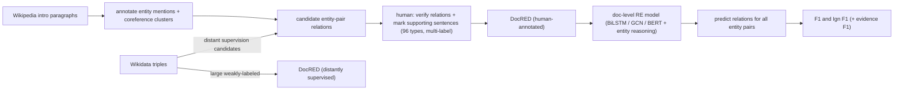

# DocRED: A Large-Scale Document-Level Relation Extraction Dataset — Yao et al., 2019

> **arXiv:** 1906.06127v3 · **Venue:** ACL 2019 · **Affiliation:** Tsinghua NLP / WeChat AI (Tencent)

## TL;DR
DocRED is the **largest human-annotated dataset for document-level relation extraction**: given a whole
Wikipedia paragraph (not a single sentence), find all **named entities** and label the **relations between
every entity pair**, drawn from **96 Wikidata relation types**. Its defining feature is that a large share
of relations can only be found by **reading and combining multiple sentences** — coreference, multi-hop,
and cross-sentence reasoning — which sentence-level RE datasets ([TACRED](dataset_2017_tacred.md),
[FewRel](dataset_2018_fewrel.md)) cannot test. It ships **~5k human-annotated documents** plus a
**large distantly-supervised** set (for weak supervision), and shows that strong RE models still lag
**far below humans**, establishing document-level RE as an open problem.

## Problem & motivation
Real knowledge is expressed **across sentences**: a document introduces entities, refers back to them with
pronouns/aliases, and states facts whose subject and object never co-occur in one sentence. Sentence-level
RE — extract one relation for one entity pair in one sentence — **misses** these inter-sentence facts.
Prior document-level resources were either **small** (hand-labeled) or **noisy** (distant supervision
only). DocRED provides **both**: a clean human-annotated benchmark and a large weakly-supervised corpus, on
the **same schema**, so supervised and semi-supervised methods can be compared.

## Key idea
Annotate, per document, three things jointly:

1. **Entities** — all named-entity mentions, grouped into **entity clusters** (coreference), each with a
   type.
2. **Relations** — for every ordered **entity pair**, the set of Wikidata relations that hold
   (multi-label; a pair may have several or none), out of **96 relation types**.
3. **Supporting evidence** — the **set of sentences** required to infer each relation, making the reasoning
   explicit and enabling evidence-based evaluation.

Because a fact links **entity clusters** (not single mentions), the model must resolve coreference and then
**synthesize information scattered across the document**. Roughly **40%+** of relation instances require
reading **more than one** sentence, and many need **logical/multi-hop** inference (e.g. *A born in city C*,
*C located in country D* ⇒ *A's country D*).

The metric is entity-pair **F1**, plus **Ign F1** — F1 computed after **removing relation facts that also
appear in the training set** — which isolates a model's ability to generalize to *unseen* facts rather than
memorize KB triples seen during training.

## How it works


Models must encode the full document, build **entity representations** by pooling mentions across sentences,
and reason over **all pairs** — the paper benchmarks CNN/LSTM/BiLSTM and context-aware encoders (and, in
follow-ups, GCN- and BERT-based reasoners over entity graphs).

## Training / data
- **Human-annotated:** ~**5,053 documents**, ~**132k entities**, ~**56k relation instances**, **96**
  relation types; split into train/dev/test.
- **Distantly-supervised:** ~**101k documents** auto-labeled by aligning Wikipedia text to Wikidata (noisy,
  for pretraining/weak supervision).
- Source: Wikipedia introductory sections + Wikidata; every relation carries **supporting-sentence**
  annotations.
- Metrics: **F1**, **Ign F1** (train-fact-excluded), and **evidence F1**.

## Results
- **Hard for existing RE methods.** Strong sentence-RE encoders adapted to documents reach only modest F1
  (context-aware BiLSTM ≈ **50–51 F1** at release), while **human performance is ~96 F1** — a large gap
  confirming document-level RE is unsolved.
- **Multi-sentence reasoning is the bottleneck.** Accuracy drops sharply on relations whose supporting
  evidence spans several sentences or needs multi-hop inference, exactly the cases DocRED was built to
  surface.
- **Weak supervision helps.** Pretraining on the distantly-supervised split then fine-tuning on human data
  improves F1, validating the dual supervised/semi-supervised design.
- Became the standard **document-level RE** benchmark; later BERT/graph reasoning models (e.g. GAIN, ATLOP,
  SSAN) pushed F1 into the low-60s, still well below human.

## Limitations & follow-ups
- **Distant-supervision recall bias:** the human annotation started from Wikidata/DS candidates, so some
  true relations absent from the KB may be **under-annotated** (false negatives) — addressed by later
  re-annotations (Re-DocRED).
- **Intro-paragraph domain** and **96 fixed relations**; no open-schema or temporal relations.
- All-pairs multi-label prediction is computationally heavy and **label-sparse** (most pairs have no
  relation), stressing precision/threshold calibration like [TACRED](dataset_2017_tacred.md).
- Complements sentence RE ([TACRED](dataset_2017_tacred.md), [FewRel](dataset_2018_fewrel.md)), NER
  ([CoNLL-2003](dataset_2003_conll2003-ner.md), [OntoNotes](dataset_2013_ontonotes.md)), and extractive QA
  ([SQuAD 2.0](dataset_2018_squad2.md)).

## Links
- **arXiv:** [abs](https://arxiv.org/abs/1906.06127) · [html](https://arxiv.org/html/1906.06127v3) · [pdf](https://arxiv.org/pdf/1906.06127)
- **Code / data:** <https://github.com/thunlp/DocRED>
- **BibTeX:**
  ```bibtex
  @inproceedings{yao2019docred,
    title     = {{DocRED}: A Large-Scale Document-Level Relation Extraction Dataset},
    author    = {Yao, Yuan and Ye, Deming and Li, Peng and Han, Xu and Lin, Yankai and Liu, Zhenghao and Liu, Zhiyuan and Huang, Lixin and Zhou, Jie and Sun, Maosong},
    booktitle = {Proceedings of the 57th Annual Meeting of the Association for Computational Linguistics (ACL)},
    year      = {2019},
    url       = {https://arxiv.org/abs/1906.06127}
  }
  ```
- **Related papers:** [TACRED](dataset_2017_tacred.md) · [FewRel](dataset_2018_fewrel.md) ·
  [CoNLL-2003 NER](dataset_2003_conll2003-ner.md) · [OntoNotes](dataset_2013_ontonotes.md)
- **In-repo:** [§6.8 in mixed_decoder](../mixed_decoder/mixed_decoder.md)
