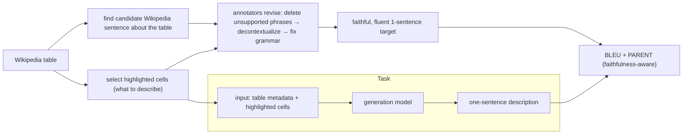

# ToTTo: A Controlled Table-To-Text Generation Dataset — Parikh et al., 2020

> **arXiv:** 2004.14373v3 · **Venue:** EMNLP 2020 · **Affiliation:** Google Research

## TL;DR
ToTTo is an open-domain **table-to-text** dataset (**120,000+** examples) with a **controlled** generation
task: given a **Wikipedia table** and a set of **highlighted cells**, produce a **one-sentence** description
of exactly those cells. Its key contribution is a **revision-based annotation** process — annotators
**edit an existing Wikipedia sentence** down to something **faithful to the highlighted cells** — yielding
targets that are both **natural** and **grounded** (no hallucinated facts). Baseline models are fluent but
routinely **hallucinate phrases unsupported by the table**, so ToTTo (scored by **BLEU** + the faithfulness-
aware **PARENT** metric) became a standard benchmark for **high-precision, faithful conditional
generation**.

## Problem & motivation
Data-to-text datasets force a bad trade-off. **Fully natural** targets (scraped human sentences) contain
facts **not present in the table** (background knowledge), which teaches models to **hallucinate**.
**Fully faithful** targets (templated from the table) are grounded but **unnatural and repetitive**, and
don't test real generation. ToTTo wants **both**: sentences that read naturally yet state **only what the
highlighted cells support** — and a task where the **input is precisely controlled** (which cells to
describe), so faithfulness can actually be measured.

## Key idea
Two design decisions:

1. **Controlled input via highlighted cells.** The model receives the full table (for context: page title,
   section title, column/row headers) **plus a set of highlighted cells** that specify *what to say*. This
   removes the ambiguity of "describe this table" and makes **content selection** part of the supervision,
   not a guess.
2. **Revision-based targets.** Rather than write from scratch (unnatural) or scrape (unfaithful), annotators
   start from a **real candidate Wikipedia sentence** related to the table and **iteratively delete/revise**
   phrases **not supported** by the highlighted cells, and fix references, until the sentence is faithful
   **and** fluent. This multi-stage "deletion → decontextualization → grammar" revision yields high-quality,
   grounded, single-sentence targets.

**Metrics.** Report **BLEU** (fluency/overlap) and **PARENT** — a metric that measures $n$-gram overlap
with **both the reference and the table**, rewarding tokens **entailed by the source** and penalizing
hallucinations:

$$
\text{PARENT} = \text{F-measure of } (\text{precision vs. reference}\ \&\ \text{table},\ \text{recall vs. reference}\ \&\ \text{table}),
$$

so a fluent-but-unfaithful sentence scores worse than a faithful one — the property BLEU alone misses.
Multiple references (from the revision variants) are used, and a hidden test set is leaderboard-scored.

## How it works


Because targets are grounded in the **highlighted** cells, the benchmark can flag **hallucination**
directly: any content not entailed by those cells is a faithfulness error.

## Training / data
- **120,000+** examples over open-domain Wikipedia tables; each = (table + metadata, highlighted cell set,
  faithful one-sentence description).
- Splits: **train / dev / test**, with the test set **hidden** (leaderboard). The dev/test include
  **multiple references** and are further partitioned into **overlap** vs **non-overlap** subsets (whether
  the test table's domain/columns overlap training) to measure **generalization to unseen table structures**.
- Annotation is the multi-stage **revision** pipeline (deletion, decontextualization, grammar), with quality
  controls.

## Results
- **Fluent but hallucinating.** State-of-the-art seq2seq / pretrained baselines (pointer-generator, BERT-/
  T5-style) produce **grammatical** sentences that **add facts not in the table** — high BLEU can mask low
  **PARENT** (faithfulness), which is the paper's central diagnostic.
- **Non-overlap is harder.** Accuracy/faithfulness drop on the **non-overlap** test split (unseen table
  domains), showing models lean on memorized table-type patterns.
- **PARENT tracks faithfulness** where BLEU doesn't, motivating faithfulness-first evaluation; ToTTo became
  a reference benchmark for **controlled, high-precision** data-to-text and for studying **hallucination**
  in generation.

## Limitations & follow-ups
- **Single-sentence, extractive-ish** descriptions — no multi-sentence or reasoning-heavy generation.
- **English / Wikipedia** domain; faithfulness judged against highlighted cells, so **selection errors**
  upstream propagate.
- Automatic metrics (**PARENT**) approximate but don't fully capture faithfulness; human eval remains
  needed.
- Structured-output sibling of the text-to-SQL tasks ([WikiSQL](dataset_2017_wikisql.md),
  [Spider](dataset_2018_spider.md)); the faithfulness/grounding concern connects to fact-verification
  datasets ([FEVER](dataset_2018_fever.md), [VitaminC](dataset_2021_vitaminc.md)).

## Links
- **arXiv:** [abs](https://arxiv.org/abs/2004.14373) · [html](https://arxiv.org/html/2004.14373v3) · [pdf](https://arxiv.org/pdf/2004.14373)
- **Data / leaderboard:** <https://github.com/google-research-datasets/ToTTo>
- **BibTeX:**
  ```bibtex
  @inproceedings{parikh2020totto,
    title     = {{ToTTo}: A Controlled Table-To-Text Generation Dataset},
    author    = {Parikh, Ankur P. and Wang, Xuezhi and Gehrmann, Sebastian and Faruqui, Manaal and Dhingra, Bhuwan and Yang, Diyi and Das, Dipanjan},
    booktitle = {Proceedings of the 2020 Conference on Empirical Methods in Natural Language Processing (EMNLP)},
    year      = {2020},
    url       = {https://arxiv.org/abs/2004.14373}
  }
  ```
- **Related papers:** [WikiSQL / Seq2SQL](dataset_2017_wikisql.md) · [Spider](dataset_2018_spider.md) ·
  [FEVER](dataset_2018_fever.md)
- **In-repo:** [§6.8 in mixed_decoder](../mixed_decoder/mixed_decoder.md)
