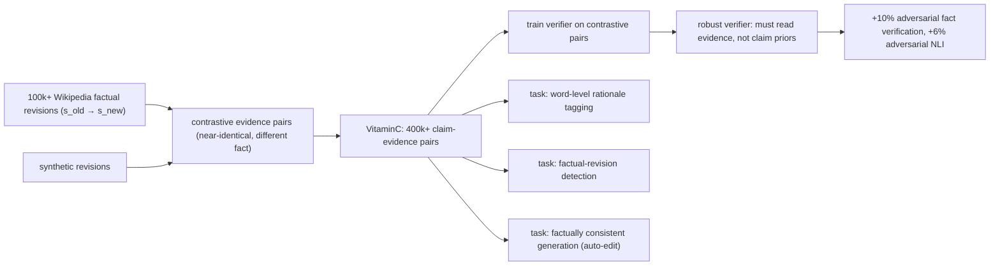

# Get Your Vitamin C! Robust Fact Verification with Contrastive Evidence (VitaminC) — Schuster, Fisch & Barzilay, 2021

> **arXiv:** 2103.08541v1 · **Venue:** NAACL 2021 · **Affiliation:** MIT CSAIL

## TL;DR
VitaminC makes fact verification **robust to evidence that changes**. It mines **100,000+ real Wikipedia
revisions that alter an underlying fact** and, with synthetic additions, builds **400,000+ claim–evidence
pairs** that are **contrastive**: for a given claim, two pieces of evidence are **near-identical in wording**
but one **SUPPORTS** it and the other **REFUTES** (or no longer supports) it. Because the two evidences
differ only in the **factual detail**, a model can't rely on surface cues — it must actually read the
evidence. Training on VitaminC **improves adversarial fact-verification accuracy by ~10%** and adversarial
NLI by ~6%, and its revision structure defines new tasks: **word-level rationale tagging**, **factual-
revision detection**, and **factually consistent text generation**.

## Problem & motivation
Real-world evidence is **not static** — Wikipedia (and the world) is edited as facts update, get corrected,
or are contested. A verification model must be **sensitive to subtle factual changes**: the *same claim* can
flip from supported to refuted when a single number or entity in the evidence changes. But datasets like
[FEVER](dataset_2018_fever.md) contain **synthetic, static** claims prone to **artifacts** — models learn
claim-only shortcuts and are **brittle** when evidence is perturbed. VitaminC's goal: force models to
**condition on the evidence** by pairing claims with **minimally-different** supporting vs. non-supporting
evidence.

## Key idea
Use **Wikipedia revision history** as a natural source of **contrastive** (before/after) evidence.

- **Factual revisions.** Collect **100k+** edits where a sentence's **fact changed** (e.g. a date, count,
  outcome, or entity was updated). Each revision gives a **pair** $(s_{\text{old}}, s_{\text{new}})$ that are
  lexically close but factually different.
- **Contrastive claim–evidence pairs.** For a claim $c$, construct pairs where evidence $s^+$ **supports**
  $c$ and a **nearly identical** $s^-$ **does not** (refutes or becomes NEI). Formally the dataset
  emphasizes examples with **high lexical overlap** but **opposite labels**:
  $$ \text{sim}(s^+, s^-)\ \text{high},\qquad \text{label}(c\mid s^+)\ \neq\ \text{label}(c\mid s^-). $$
  A model that ignores the evidence's factual content **cannot** separate them — so training rewards genuine
  evidence conditioning. Synthetic revisions augment the real ones to reach **400k+** pairs.

- **New tasks from the revision structure:**
  1. **Word-level tagging** — mark the evidence tokens that determine the verdict (rationales).
  2. **Factual-revision flagging** — detect whether an edit changed a fact (vs. cosmetic).
  3. **Factually consistent generation** — automatically **rewrite** a claim/sentence to match updated
     evidence.

## How it works


The contrastive design is the crux: because $s^+$ and $s^-$ differ **only in the fact**, the model's
decision **must** hinge on that fact, breaking claim-only artifacts.

## Training / data
- **>100,000** real fact-changing Wikipedia revisions + synthetic ones → **>400,000** claim–evidence pairs,
  each labeled **SUPPORTS / REFUTES / NOT ENOUGH INFO** (FEVER-style, but **contrastive**).
- Annotations include **evidence rationales** (which words matter) enabling the auxiliary tagging/generation
  tasks.
- Used both as a **standalone** benchmark and as **augmentation** for existing verification/NLI training.

## Results
- **Robustness gains from contrastive training:** adding VitaminC lifts accuracy on **adversarial fact
  verification by ~10%** and on **adversarial NLI by ~6%** — models learn to track factual detail rather
  than claim/evidence artifacts.
- **Sensitivity to change:** VitaminC-trained models correctly **flip their verdict** when evidence is
  minimally edited to change the fact, where FEVER-trained models often don't.
- **Auxiliary tasks work:** the revision structure supports accurate **rationale tagging** and **factually
  consistent rewriting**, extending fact-checking resources beyond a single classification label.

## Limitations & follow-ups
- **Wikipedia revision domain** — factual edits there may not cover all real-world claim types or
  adversarial phrasings.
- **Synthetic augmentation** to reach 400k pairs can reintroduce mild artifacts.
- Rationale/edit tasks add annotation complexity and are less standardized than the core 3-way label.
- Directly hardens [FEVER](dataset_2018_fever.md)-style verification; the "condition on evidence, adapt to
  change" theme connects to grounded generation ([ToTTo](dataset_2020_totto.md)) and evidence-grounded
  abstention ([SQuAD 2.0](dataset_2018_squad2.md)); relevant to retrieval-augmented LMs that must stay
  faithful to (possibly updated) sources.

## Links
- **arXiv:** [abs](https://arxiv.org/abs/2103.08541) · [html](https://arxiv.org/html/2103.08541v1) · [pdf](https://arxiv.org/pdf/2103.08541)
- **Code / data:** <https://github.com/TalSchuster/VitaminC>
- **BibTeX:**
  ```bibtex
  @inproceedings{schuster2021vitaminc,
    title     = {Get Your Vitamin C! Robust Fact Verification with Contrastive Evidence},
    author    = {Schuster, Tal and Fisch, Adam and Barzilay, Regina},
    booktitle = {Proceedings of the 2021 Conference of the North American Chapter of the Association for Computational Linguistics (NAACL)},
    year      = {2021},
    url       = {https://arxiv.org/abs/2103.08541}
  }
  ```
- **Related papers:** [FEVER](dataset_2018_fever.md) · [SQuAD 2.0](dataset_2018_squad2.md) ·
  [ToTTo](dataset_2020_totto.md)
- **In-repo:** [§6.8 in mixed_decoder](../mixed_decoder/mixed_decoder.md)
