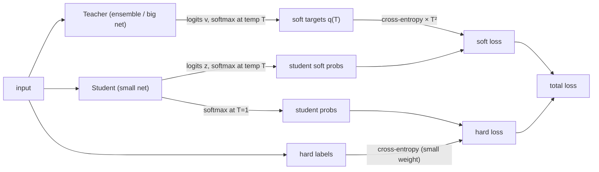

# Distilling the Knowledge in a Neural Network — Hinton, Vinyals & Dean, 2015

> **arXiv:** 1503.02531v1 · **Venue:** NIPS 2014 Deep Learning Workshop · **Affiliation:** Google

## TL;DR
The paper that named **knowledge distillation**: transfer the "dark knowledge" of a cumbersome model
(an ensemble or one huge net) into a small deployable model by training the small model to match the
big model's **soft probability targets**, produced by a **temperature-raised softmax**. The soft
targets' relative probabilities over *wrong* classes encode how the teacher generalizes, giving far
more signal per example than one-hot labels. It also shows **matching logits is a special case** of
distillation, and introduces **specialist ensembles** for datasets with huge class counts.

## Problem & motivation
Ensembles (or very large regularized nets) generalize best but are too slow/expensive to deploy to many
users. Caruana et al. had shown a big ensemble's knowledge can be compressed into one small net. The
conceptual block: we identify "knowledge" with weight values, making it hard to see how to keep the
knowledge while changing the model form. Hinton et al. reframe knowledge as the **learned
input→output mapping**, and observe that a trained model's *tiny probabilities on wrong classes* (a BMW
is far likelier mistaken for a garbage truck than a carrot) carry a rich similarity structure. The goal:
transfer that structure to a small model so it generalizes like the big one.

## Key idea
Raise the **temperature** $T$ of the teacher's softmax to soften the class distribution:

$$
q_i=\frac{\exp(z_i/T)}{\sum_j \exp(z_j/T)},
$$

where $z_i$ are logits and $T=1$ is the normal softmax. Higher $T$ produces a softer distribution that
exposes the small "dark knowledge" probabilities. Train the **student** at the *same* high $T$ to match
these soft targets, then reset $T=1$ at inference. When true labels are available, use a **weighted sum**
of two cross-entropies: (1) soft-target CE at temperature $T$, and (2) hard-label CE at $T=1$, with a
smaller weight on the latter. Because soft-target gradients scale as $1/T^2$, multiply that term by
$T^2$ so the two contributions stay balanced.

**Matching logits is a special case.** The per-logit gradient is
$$
\frac{\partial C}{\partial z_i}=\frac{1}{T}(q_i-p_i)\;\xrightarrow[\;T\to\infty,\ \text{zero-mean logits}\;]{}\;\frac{1}{NT^2}(z_i-v_i),
$$
so at high temperature distillation reduces to minimizing $\tfrac12(z_i-v_i)^2$ between student logits
$z_i$ and teacher logits $v_i$. At lower $T$, distillation ignores very negative (noisy) teacher logits —
an empirically useful bias when the student is much smaller than the teacher.

## How it works



- **Transfer set:** the original training data (optionally unlabeled data) run through the teacher.
- **Specialist ensembles (large-class datasets):** one generalist + many **specialist** nets, each
  trained on a confusable class cluster (found by clustering the generalist's prediction covariance)
  plus a single **dustbin** class; specialists are **initialized from the generalist**, train fast and
  in parallel, and their overfitting is curbed by soft targets.

## Training / data
No new architecture — a training recipe over any teacher/student. Demonstrated on MNIST (2×1200 vs
2×800 MLPs), a production **Android voice-search** DNN (8×2560, ~85M params, 14k HMM states), and the
internal **JFT** image set (100M images, 15k labels).

## Results
From the paper (§3–§6).

| Experiment | Metric | Teacher/Ensemble | Distilled student | Baseline student | Source |
|---|---|---|---|---|---|
| MNIST | test errors | 67 (big net) | **74** (soft targets, T=20) | 146 (hard only) | §3 |
| MNIST, digit 3 omitted from transfer set | 3s correct | — | **98.6%** (with bias fix) | — | §3 |
| Speech (Android VS) | frame acc / WER | 61.1% / 10.7% (10× ens.) | **60.8% / 10.7%** | 58.9% / 10.9% | §4, Table 1 |
| Speech, 3% of data | frame acc | 58.9% (full data) | **57.0%** (soft) | 44.5% (hard, overfits) | §6, Table 5 |
| JFT specialists | top-1 (relative) | — | **+4.4%** (61 specialists) | baseline | §5, Table 3 |

The speech result is the headline: **>80%** of the ensemble's accuracy gain transfers into a single net
of the *same* size as the baseline. Soft targets also act as a powerful regularizer, letting a model
recover most of the full-data accuracy from **3%** of the data without early stopping.

## Limitations & follow-ups
- **Teacher required.** Distillation presupposes a trained cumbersome model.
- **Temperature is a tuned knob** (intermediate $T$ best when the student is much smaller).
- **Legacy.** Every later distillation method descends from this: sequence-level
  ([Kim & Rush](distill_2016_seq-level-kd.md)), and BERT compressors
  ([DistilBERT](distill_2019_distilbert.md), [TinyBERT](distill_2019_tinybert.md)). Cross-encoder→
  bi-encoder distillation powers modern retrievers ([ColBERTv2](retrieval_2021_colbertv2.md),
  [E5](retrieval_2022_e5.md)); the [LCLM](../context/ctx_compression.md) recipe's *relabel completions
  with a bigger model* is distillation in spirit.

## Links
- **arXiv:** [abs](https://arxiv.org/abs/1503.02531) · [html](https://arxiv.org/html/1503.02531v1) · [pdf](https://arxiv.org/pdf/1503.02531)
- **BibTeX:**
  ```bibtex
  @article{hinton2015distilling,
    title   = {Distilling the Knowledge in a Neural Network},
    author  = {Hinton, Geoffrey and Vinyals, Oriol and Dean, Jeff},
    journal = {arXiv preprint arXiv:1503.02531},
    note    = {NIPS 2014 Deep Learning Workshop},
    year    = {2015}
  }
  ```
- **Related papers:** [Sequence-Level KD](distill_2016_seq-level-kd.md) · [DistilBERT](distill_2019_distilbert.md) · [TinyBERT](distill_2019_tinybert.md)
- **In-repo:** [MixedDecoder](../mixed_decoder/mixed_decoder.md) · [Backbone components thread](../context/backbone/backbone.md) · [LCLM context-compression survey](../context/ctx_compression.md)
