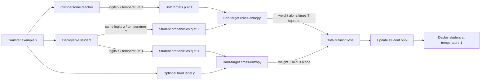
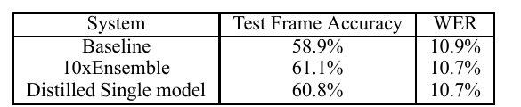
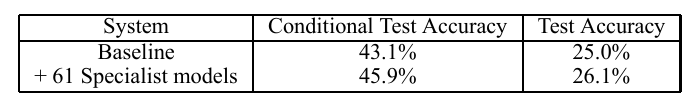
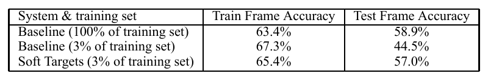

# Distilling the Knowledge in a Neural Network — Hinton, Vinyals & Dean, 2015

> **arXiv:** 1503.02531v1 · **Venue:** NIPS 2014 Deep Learning Workshop · **Affiliation:** Google; University of Toronto; Canadian Institute for Advanced Research

## TL;DR

Knowledge distillation trains a deployable **student** to reproduce the softened output distribution of a cumbersome **teacher**, such as an ensemble or a large regularized network. Raising the softmax temperature reveals relative probabilities among incorrect classes: information about class similarity and teacher generalization that a one-hot label discards. The paper transfers most of a ten-model speech ensemble's gain into one same-size model, demonstrates strong regularization from soft targets, and separately develops generalist-plus-specialist ensembles for very large label spaces.

## Problem & motivation

Large models and ensembles are convenient during training, where replicas can run in parallel, but expensive at inference, where every prediction may need all members. The paper asks how to retain their predictive behavior in a smaller model whose architecture can differ from the teacher's.

The key conceptual shift is to identify knowledge with the learned input-output function rather than with a particular parameterization. A hard label says only which class won. A trained classifier's full distribution also says which alternatives it considers plausible. Those ratios expose structure learned from the data and provide a denser target than a single bit of class membership.

This supports three related but distinct uses:

1. **Compression:** transfer an ensemble or large network into one smaller student.
2. **Regularization:** use a teacher's soft targets to constrain another model, even when its parameter count is unchanged.
3. **Specialization:** improve a huge classifier with independently trained experts for confusable class groups. The JFT experiment evaluates the specialist ensemble directly; it does **not** distill those specialists back into one network.

The last distinction matters. Distillation solves deployment cost in the speech experiment, whereas the specialist system still performs conditional multi-model inference and per-example probability fusion.

## Key idea

Let $v_i$ be the teacher logit for class $i$, $z_i$ the student logit, and $T>0$ the temperature. Define the teacher and student distributions over $N$ classes as

$$
p_i^{(T)}=\frac{\exp(v_i/T)}{\sum_{j=1}^{N}\exp(v_j/T)},
\qquad
q_i^{(T)}=\frac{\exp(z_i/T)}{\sum_{j=1}^{N}\exp(z_j/T)}.
$$

At $T=1$ these are ordinary softmax probabilities. Increasing $T$ flattens the distributions, making low-probability alternatives large enough to influence learning. The student is trained against teacher targets generated at a high temperature using the **same** temperature on the student side, but uses $T=1$ after training.

When labels are available, the paper combines soft-target and hard-target cross-entropies. A convenient explicit form of its weighted objective is

$$
\mathcal L
=\alpha T^2 H\!\left(\mathbf p^{(T)},\mathbf q^{(T)}\right)
+(1-\alpha)H\!\left(\mathbf y,\mathbf q^{(1)}\right),
$$

where $H(\mathbf a,\mathbf b)=-\sum_i a_i\log b_i$, $\mathbf y$ is the one-hot label, and $\alpha$ controls the soft-target contribution. The paper does not prescribe one universal $\alpha$; it reports that the hard-label objective generally works best at considerably lower weight. The factor $T^2$ compensates for the approximate $1/T^2$ shrinkage of soft-loss gradients, keeping the hard/soft balance roughly stable while tuning $T$ (§2).

### Why matching logits is a limiting case

For soft-target cross-entropy $C$, differentiation with respect to student logit $z_i$ gives

$$
\frac{\partial C}{\partial z_i}
=\frac{1}{T}\left(q_i^{(T)}-p_i^{(T)}\right)
=\frac{1}{T}\left(
\frac{e^{z_i/T}}{\sum_j e^{z_j/T}}
-\frac{e^{v_i/T}}{\sum_j e^{v_j/T}}
\right).
$$

If $T$ is large relative to the logits, use $e^{x/T}\approx1+x/T$. If teacher and student logits are separately centered for each example, so that $\sum_j z_j=\sum_j v_j=0$, then

$$
\frac{\partial C}{\partial z_i}
\approx \frac{1}{NT^2}(z_i-v_i).
$$

Thus, in the high-temperature limit, distillation is equivalent up to scale to minimizing squared error between centered logits,

$$
\mathcal L_{\text{logit}}
=\frac12\sum_i(z_i-v_i)^2.
$$

At finite temperature, very negative teacher logits receive less emphasis. The paper argues this can help because those logits are weakly constrained and potentially noisy, while noting that they may still contain useful information; student capacity and validation performance determine the useful temperature (§2.1).

## How it works

### Standard distillation


```mermaid
flowchart LR
    X[Transfer example x] --> Teacher[Cumbersome teacher]
    X --> Student[Deployable student]
    Teacher -->|logits v / temperature T| P[Soft targets p at T]
    Student -->|same logits z / temperature T| Q[Student probabilities q at T]
    P --> Soft[Soft-target cross-entropy]
    Q --> Soft
    Soft -->|weight alpha times T squared| Total[Total training loss]
    X --> Label[Optional hard label y]
    Student -->|logits z / temperature 1| Q1[Student probabilities q at 1]
    Label --> Hard[Hard-target cross-entropy]
    Q1 --> Hard
    Hard -->|weight 1 minus alpha| Total
    Total --> Update[Update student only]
    Update --> Deploy[Deploy student at temperature 1]
```

1. **Train or obtain the teacher.** It may be an ensemble, a single large model, or a strongly regularized model whose deployment cost is unacceptable.
2. **Choose a transfer set.** The original labeled training set is sufficient; labels are optional for the soft-target term, so additional unlabeled examples can also be passed through the teacher.
3. **Select a temperature.** Run the teacher softmax at $T>1$ and store or stream $\mathbf p^{(T)}$. Raising $T$ preserves the teacher's class ranking while exposing probability mass among alternatives.
4. **Train the student at the same $T$.** Minimize $H(\mathbf p^{(T)},\mathbf q^{(T)})$. If labels exist, add hard-label cross-entropy computed from the same student logits at $T=1$ and scale the soft term by $T^2$.
5. **Deploy only the student.** Discard the teacher and evaluate the student's ordinary $T=1$ softmax. Temperature is a training device, not a required inference component.

The teacher and student need only agree on output classes. Their internal architecture, hidden width, and regularization can differ.

### Generalist and specialist ensembles

The paper also proposes a scalable alternative to training several full models on a 15,000-class dataset (§5). This is a separate construction from the single-student recipe:

1. Train one **generalist** over all classes.
2. Compute the covariance matrix of its predicted class probabilities. Cluster covariance-matrix columns with online k-means; classes often predicted together become a confusable subset $S^m$ for specialist $m$. This does not require ground-truth labels to define clusters (§5.3).
3. Initialize each specialist from the generalist. Retain explicit outputs for the classes in $S^m$ and collapse every other class into one **dustbin** output.
4. Fine-tune each specialist independently with half of its examples from $S^m$ and half sampled from the remainder. If special classes are oversampled by a factor $r_m$, correct the sampling bias after training by adding $\log r_m$ to the dustbin logit (§5.2).
5. At inference, take the generalist's top $n$ classes, denoted $k$; the experiments use $n=1$. Activate every specialist whose subset intersects $k$:

   $$
   A_k=\{m:S^m\cap k\ne\varnothing\}.
   $$

6. Find a full-class distribution $\mathbf q$ that minimizes

   $$
   \mathbf q^*
   =\arg\min_{\mathbf q}
   \left[
   KL(\mathbf p^g\Vert\mathbf q)
   +\sum_{m\in A_k}KL(\mathbf p^m\Vert\mathbf q)
   \right],
   $$

   where $\mathbf p^g$ is the generalist distribution and $\mathbf p^m$ is specialist $m$'s distribution. For a specialist KL term, the probabilities that full distribution $\mathbf q$ assigns to all non-special classes are summed before comparison with the specialist's dustbin probability. The paper parameterizes $\mathbf q=\operatorname{softmax}(\mathbf s)$ at $T=1$ and optimizes fusion logits $\mathbf s$ by gradient descent for each image because the stated objective has no general closed form (§5.4, Eq. 5).

This inference procedure conditionally routes examples, but unlike a mixture of experts, specialist assignment is fixed after clustering and specialists train independently rather than jointly with a learned gate (§7).

## Training / data

### MNIST (§3)

- **Teacher:** two hidden layers of 1,200 ReLU units, trained on all 60,000 examples with dropout, weight constraints, and image translations of up to two pixels in each direction.
- **Baseline/student:** two hidden layers of 800 ReLU units and no other regularization. The distilled model matches the teacher's soft targets at $T=20$; this auxiliary task alone regularizes it.
- **Capacity/temperature check:** with at least 300 units in each of two student layers, temperatures above 8 perform similarly. With only 30 units per layer, the best range is 2.5–4, supporting the claim that finite temperature can suppress unhelpful very negative logits.
- **Missing-class probes:** one transfer set removes all digit 3 examples; a more extreme transfer set contains only 7s and 8s. Post-hoc class-bias corrections isolate learned relative evidence from transfer-set prior mismatch. These corrections are optimized on the test set and are diagnostic, not a valid deployment recipe.

### Speech recognition (§4)

- **Task/model:** frame-level prediction of 14,000 clustered triphone HMM states. Each network has eight hidden layers of 2,560 ReLU units and about 85 million parameters.
- **Input:** 26 frames of 40 Mel filterbank coefficients at 10 ms spacing; predict the HMM state at frame 21.
- **Data:** about 2,000 hours of English speech, yielding about 700 million training examples. Models use distributed stochastic gradient descent.
- **Teacher:** average the predictions of ten independently initialized models with the same architecture and training procedure. Varying each model's data did not materially improve ensemble diversity.
- **Student:** one model of the same size as the baseline. The search tests $T\in\{1,2,5,10\}$ and selects $T=2$; hard-label cross-entropy receives relative weight 0.5 (§4.1).
- **Evaluation:** frame accuracy and word error rate (WER) on a 23,000-word test set. The paper notes that frame-level training and WER evaluation are mismatched objectives.

### JFT specialists (§5)

- **Data:** internal JFT with 100 million labeled images and 15,000 labels. The generalist convolutional network had taken roughly six months to train with asynchronous distributed SGD (§5.1).
- **Specialists:** 61 independently trained models, each covering 300 classes plus one dustbin class. Subsets overlap, allowing multiple specialists to cover one class (§5.5).
- **Initialization/sampling:** clone generalist weights, then train on a 50/50 mixture of specialist-subset and random remainder examples. Each specialist trains in a few days rather than the many weeks required for a full JFT model (§5.2, §5.5).
- **Inference:** use the generalist top-1 class to select specialists, then solve the KL fusion objective separately for every image. The reported JFT result is the live ensemble, not a distilled student.

### Soft targets as regularizers (§6)

To isolate regularization from compression, the paper retrains the same 85M-parameter speech architecture on only 3% of the speech data, about 20 million examples. Hard-label training requires early stopping as test accuracy falls, while soft-target training converges without early stopping. The targets come from a model trained on the full dataset.

## Results

### Compression and transfer

| Experiment | Baseline | Teacher / ensemble | Distilled result | Interpretation |
|---|---:|---:|---:|---|
| MNIST test errors | 146, 2×800 hard-target model | 67, 2×1200 model | **74**, 2×800 at $T=20$ | Most of the large model's advantage transfers (§3). |
| MNIST with no 3s in transfer set | n/a | n/a | 206 errors before correction; **109** after +3.5 class-3 bias, including 14/1,010 errors on 3s | Corrected model recognizes **98.6%** of an unseen transfer class (§3); correction uses the test set. |
| MNIST transfer set containing only 7s and 8s | n/a | n/a | 47.3% error before bias correction; **13.2%** after reducing 7/8 biases by 7.6 | Soft targets transfer behavior beyond observed transfer classes, but priors require calibration (§3). |
| Speech frame accuracy | 58.9% | 61.1%, ten-model ensemble | **60.8%** | Student captures more than 80% of the ensemble's absolute frame-accuracy gain (Table 1). |
| Speech WER | 10.9% | 10.7%, ten-model ensemble | **10.7%** | Student matches the ensemble's reported WER (Table 1). |



*Official paper evidence: Table 1 (§4.1), cropped from the arXiv v1 PDF.*

### Specialists at JFT scale

| System | Conditional top-1 accuracy | Overall top-1 accuracy | Source |
|---|---:|---:|---|
| Generalist baseline | 43.1% | 25.0% | Table 3 |
| Generalist + 61 specialists | **45.9%** | **26.1%** | Table 3 |

The overall change is +1.1 percentage points, or **4.4% relative** to the 25.0% baseline. Table 4 further reports that relative accuracy gains generally increase with the number of specialists covering the correct class: from +3.4% with one covering specialist to +16.6% with nine, although the bins are uneven and the 10-or-more bin falls to +14.1% (Table 4).



*Official paper evidence: Table 3 (§5.5), cropped from the arXiv v1 PDF.*

### Regularization with scarce data

| Speech training setup | Train frame accuracy | Test frame accuracy | Source |
|---|---:|---:|---|
| Hard targets, 100% data | 63.4% | 58.9% | Table 5 |
| Hard targets, 3% data | **67.3%** | 44.5% | Table 5 |
| Soft targets, 3% data | 65.4% | **57.0%** | Table 5 |

The 3%-data hard-target model fits its training subset best but generalizes poorly; soft targets recover all but 1.9 percentage points of the full-data model's test frame accuracy without early stopping (§6, Table 5). This is evidence for teacher-induced regularization, not model-size compression, because the student architecture remains the same.



*Official paper evidence: Table 5 (§6), cropped from the arXiv v1 PDF.*

## Limitations & follow-ups

- **A strong teacher is a prerequisite.** Distillation reduces serving cost only after paying to train and run the cumbersome model over a transfer set. Teacher inference and target storage can still be substantial.
- **Transfer-set coverage and class priors matter.** The missing-class MNIST probes show that relative teacher evidence can transfer surprisingly far, but their large test-tuned bias corrections also expose severe calibration errors when transfer-set priors differ from deployment priors (§3).
- **Temperature and loss weights require validation.** The useful $T$ changes with student capacity: high temperatures are broadly adequate for larger MNIST students, while a 30-unit-per-layer student prefers 2.5–4 (§3). The paper gives no universal setting.
- **The output vocabulary must align.** The basic method transfers class distributions, not intermediate representations, and therefore assumes compatible output classes. It does not explain how to align different tokenizations, feature spaces, or hidden dimensions.
- **The speech objective is indirect.** Distillation optimizes frame-level cross-entropy, while the deployment metric is WER; the paper explicitly attributes the ensemble's smaller WER gain to this mismatch (§4.1).
- **Specialist inference remains expensive.** JFT inference may invoke several networks and numerically optimize fusion logits per image. The paper states that distilling specialist knowledge into one large network had **not yet been demonstrated** (§8).
- **Reproducibility is limited.** The speech and JFT data are private, no implementation is released, and optimizer schedules or many lower-level training settings are absent.

Later work adapts the idea to structured outputs in [Sequence-Level Knowledge Distillation](distill_2016_seq-level-kd.md), to language-model pretraining in [DistilBERT](distill_2019_distilbert.md), and to intermediate embeddings, hidden states, and attention in [TinyBERT](distill_2019_tinybert.md). These successors expand the transferred object beyond final class probabilities while retaining the teacher-student principle introduced here.

## Links

- **arXiv:** [abs](https://arxiv.org/abs/1503.02531) · [html](https://arxiv.org/html/1503.02531v1) · [pdf](https://arxiv.org/pdf/1503.02531)
- **Venue:** [NIPS 2014 Deep Learning Workshop program](https://nips.cc/Conferences/2014/Schedule?showEvent=4351)
- **Code:** not released by the authors
- **Hugging Face:** not applicable
- **Project page:** not provided
- **Papers with Code:** [Knowledge Distillation method entry](https://paperswithcode.com/method/knowledge-distillation)
- **Related / successor papers:** [Sequence-Level KD](distill_2016_seq-level-kd.md) · [DistilBERT](distill_2019_distilbert.md) · [TinyBERT](distill_2019_tinybert.md)
- **BibTeX:**

  ```bibtex
  @article{hinton2015distilling,
    title   = {Distilling the Knowledge in a Neural Network},
    author  = {Hinton, Geoffrey and Vinyals, Oriol and Dean, Jeff},
    journal = {arXiv preprint arXiv:1503.02531},
    note    = {NIPS 2014 Deep Learning Workshop},
    year    = {2015}
  }
  ```
