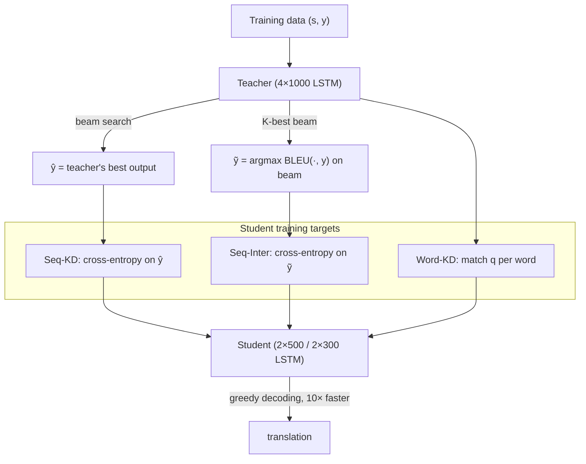

# Sequence-Level Knowledge Distillation — Kim & Rush, 2016

> **arXiv:** 1606.07947v4 · **Venue:** EMNLP 2016 · **Affiliation:** Harvard University (SEAS)

## TL;DR
Kim & Rush bring [knowledge distillation](distill_2015_hinton-kd.md) to **neural machine translation**
and show that matching the teacher at the **word level** helps, but matching it at the **sequence
level** helps more. Their key trick — **Seq-KD** — is remarkably simple: run **beam search with the
teacher** over the training set and train the student with plain cross-entropy on the teacher's outputs.
This lets a small student **match a much larger teacher**, and — surprisingly — makes **beam search
unnecessary at test time** (greedy decoding suffices), giving a 2×500 LSTM that runs **10× faster** than
its 4×1000 teacher with comparable BLEU.

## Problem & motivation
NMT needs very large models (e.g. 4-layer, 1000-unit LSTMs) to be competitive, which is costly to deploy.
Standard distillation was developed for **multi-class** (word-level) prediction, but NMT produces
**sequences**, where errors compound autoregressively. Matching the teacher's *per-word* distribution
(Word-KD) transfers only local knowledge; ideally the student should mimic the teacher's behavior over
**whole sequences**. Kim & Rush ask how to approximate the intractable sequence-level distillation
objective in a way that is both effective and trivial to implement.

## Key idea
**Word-level KD** replaces the one-hot target with the teacher distribution at each position:
$$
\mathcal{L}_{\text{WORD-KD}}=-\sum_{j=1}^{J}\sum_{k=1}^{|\mathcal{V}|} q(t_j=k\mid \mathbf{s},\mathbf{t}_{<j})\,\log p(t_j=k\mid \mathbf{s},\mathbf{t}_{<j}),
$$
usually mixed with the NLL loss as $(1-\alpha)\mathcal{L}_{\text{NLL}}+\alpha\mathcal{L}_{\text{KD}}$.

**Sequence-level KD** instead matches the teacher's distribution over *entire sequences*
$q(\mathbf{t}\mid\mathbf{s})$:
$$
\mathcal{L}_{\text{SEQ-KD}}=-\sum_{\mathbf{t}\in\mathcal{T}} q(\mathbf{t}\mid\mathbf{s})\,\log p(\mathbf{t}\mid\mathbf{s}).
$$
This sum is over exponentially many sequences, so approximate $q$ by its **mode**, found via beam
search $\hat{\mathbf{y}}$:
$$
\mathcal{L}_{\text{SEQ-KD}}\approx-\log p(\mathbf{t}=\hat{\mathbf{y}}\mid\mathbf{s}).
$$
So Seq-KD = **(1)** train teacher, **(2)** beam-search the teacher over the training set, **(3)** train
the student with cross-entropy on that teacher-generated data — mechanically identical to normal
training, just on new targets.

**Sequence-level interpolation (Seq-Inter)** blends teacher and gold: train on the beam hypothesis
closest to the reference,
$$
\tilde{\mathbf{y}}=\arg\max_{\mathbf{t}\in\mathcal{T}_K}\ \mathrm{sim}(\mathbf{t},\mathbf{y}),
$$
with $\mathrm{sim}$ = sentence-BLEU over the $K$-best list — a single high-probability, high-BLEU target.

## How it works



- **Why greedy works after Seq-KD:** training on the teacher's mode makes the student's distribution
  **peaked** — the argmax accounts for ~16.9% of the mass (vs 0.9% for a baseline), so greedy ≈ beam.
- The three methods are **complementary and stackable** (Seq-KD + Word-KD, or fine-tune to Seq-Inter).

## Training / data
- **High-resource:** English→German (WMT 2014, 4M sentences); teacher 4×1000 LSTM, students 2×500 /
  2×300. **Low-resource:** Thai→English (IWSLT 2015, 90k); teacher 2×500, student 2×100.
- Word-KD $\alpha=0.5$; Seq-KD beam $K=5$; Seq-Inter beam $K=35$, fine-tune at small LR.
- Optional **weight pruning** on top of the distilled student.

## Results
From the paper (§5, abstract). BLEU on newstest2014 (En→De).

| Method | Metric | Value | Source |
|---|---|---|---|
| Seq-KD vs baseline, greedy ($K{=}1$) | ΔBLEU | **+4.2** | abstract / §5 |
| Seq-KD vs baseline, beam ($K{=}5$) | ΔBLEU | **+1.7** | abstract / §5 |
| Best student decoding speed | vs teacher beam | **10×** faster (1051 vs 102 words/s, GPU) | §5.1 |
| Seq-KD peakedness | $p(\mathbf{t}{=}\hat{\mathbf{y}})$ | 16.9% vs 0.9% baseline | §5 |
| + weight pruning (80%) | params vs teacher | **13×** fewer, −0.4 BLEU | §5.2, abstract |
| + weight pruning (90%) | params vs teacher | 26× fewer, −1.0 BLEU | §5.2 |

Seq-KD beats Word-KD on En→De; combining them adds further gains for the smallest models, confirming
they transfer *global* vs *local* knowledge. Notably a Seq-KD model can have **higher perplexity** (22.7
vs 8.2) yet **higher BLEU** — perplexity and BLEU decouple because the student models only the teacher's
mode.

## Limitations & follow-ups
- **Teacher decoding cost** up front (beam search over the whole training set).
- **Mode approximation** discards most of the teacher's sequence distribution (works because NMT mass
  concentrates on the mode).
- **Legacy.** Seq-KD's "generate teacher outputs, then train on them" is the template for modern
  **sequence-level / on-policy distillation** and for **synthetic-data relabeling** — e.g. the
  [LCLM](../context/ctx_compression.md) recipe relabels stale completions with a larger Qwen model, and
  cross-encoder→retriever distillation ([ColBERTv2](retrieval_2021_colbertv2.md),
  [E5](retrieval_2022_e5.md)) generalizes the same idea. Builds directly on
  [Hinton et al.](distill_2015_hinton-kd.md).

## Links
- **arXiv:** [abs](https://arxiv.org/abs/1606.07947) · [html](https://arxiv.org/html/1606.07947v4) · [pdf](https://arxiv.org/pdf/1606.07947)
- **Code:** [github.com/harvardnlp/seq2seq-attn](https://github.com/harvardnlp/seq2seq-attn)
- **BibTeX:**
  ```bibtex
  @inproceedings{kim2016sequence,
    title     = {Sequence-Level Knowledge Distillation},
    author    = {Kim, Yoon and Rush, Alexander M.},
    booktitle = {Proceedings of the 2016 Conference on Empirical Methods in Natural Language Processing (EMNLP)},
    year      = {2016}
  }
  ```
- **Related papers:** [Hinton KD](distill_2015_hinton-kd.md) · [DistilBERT](distill_2019_distilbert.md) · [TinyBERT](distill_2019_tinybert.md)
- **In-repo:** [MixedDecoder](../mixed_decoder/mixed_decoder.md) · [LCLM context-compression survey](../context/ctx_compression.md) · [Backbone components thread](../context/backbone/backbone.md)
