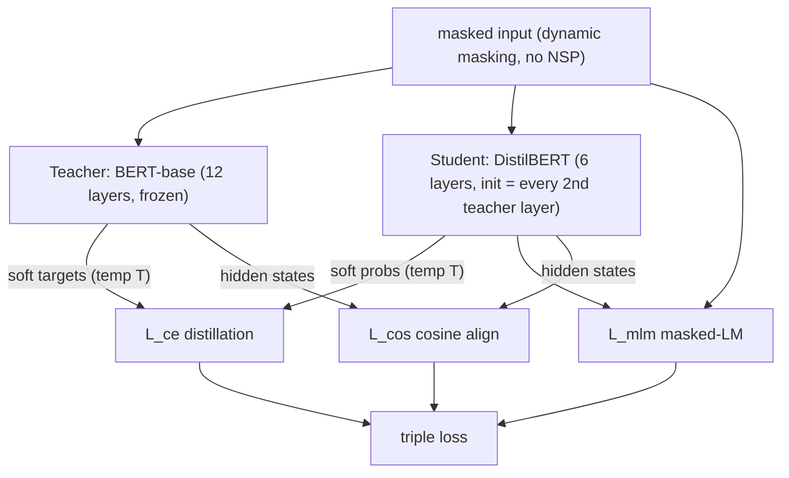

# DistilBERT: a distilled version of BERT — Sanh et al., 2019

> **arXiv:** 1910.01108v4 · **Venue:** NeurIPS 2019 EMC² Workshop · **Affiliation:** Hugging Face

## TL;DR
DistilBERT applies [knowledge distillation](distill_2015_hinton-kd.md) **during pre-training** to
produce a general-purpose BERT that is **40% smaller and 60% faster** while retaining **97%** of BERT's
GLUE performance. It halves BERT's layers, initializes the student from the teacher's weights, and trains
with a **triple loss**: distillation (soft-target) + masked-language-modeling + a **cosine-embedding**
term that aligns student and teacher hidden-state directions. The result is a drop-in, fine-tunable
encoder small enough for on-device use.

## Problem & motivation
Pre-trained Transformers keep growing (hundreds of millions of parameters), raising environmental and
deployment costs and blocking on-device/real-time use. Most prior BERT distillation was **task-specific**
(distill a fine-tuned model per task). DistilBERT's thesis: distill **once, during pre-training**, to get
a smaller *general-purpose* model that can then be fine-tuned normally on any task — keeping the
flexibility of large models at a fraction of the cost.

## Key idea
A **triple loss** combining three objectives.

**Distillation loss** — soft-target cross-entropy against the teacher, using
[Hinton's softmax-temperature](distill_2015_hinton-kd.md):
$$
L_{ce}=\sum_i t_i\log s_i,\qquad p_i=\frac{\exp(z_i/T)}{\sum_j \exp(z_j/T)},
$$
where $t_i,s_i$ are teacher/student probabilities; the same $T$ is used for both at training, $T=1$ at
inference.

**Masked-LM loss** $L_{mlm}$ — the standard BERT supervised objective, keeping the student grounded in
real data.

**Cosine-embedding loss** $L_{cos}$ — aligns the *directions* of the student's and teacher's hidden-state
vectors, transferring geometric structure beyond the output distribution.

The total objective is a linear combination $L_{ce}+L_{mlm}+L_{cos}$.

## How it works



- **Architecture:** same as BERT but **remove token-type embeddings and the pooler**, and **halve the
  layer count** (6 vs 12); hidden size unchanged (variations in depth matter more for speed than width).
- **Initialization:** copy **one of every two** teacher layers into the student — critical for
  convergence (random init costs ~3.7 GLUE points).
- **Distillation setup:** very large batches (~4K via gradient accumulation), **dynamic masking**, **no
  next-sentence-prediction**; trained on Wikipedia + Toronto Book Corpus on 8×16GB V100 for ~90 h.

## Training / data
Same corpus as BERT (English Wikipedia + Toronto Book Corpus). 66M-parameter student vs 110M teacher.
Evaluated on **GLUE** (9 tasks), **IMDb**, and **SQuAD v1.1**.

## Results
From the paper (Tables 1–4).

| Benchmark | Metric | DistilBERT | BERT-base | Source |
|---|---|---|---|---|
| GLUE (macro avg, dev) | score | **77.0** | 79.5 | Table 1 |
| — retains | % of BERT | **97%** | 100% | abstract |
| IMDb | test acc | 92.82 | 93.46 | Table 2 |
| SQuAD 1.1 | EM/F1 | 77.7/85.8 (79.1/86.9 w/ 2nd distill) | 81.2/88.5 | Table 2 |
| Size | params | **66M (−40%)** | 110M | Table 3 |
| Speed (STS-B, CPU) | inference | **410 s (−60%)** | 668 s | Table 3 |
| On device (iPhone 7+) | vs BERT | **71% faster**, 207 MB | — | §4.1 |

Ablation (Table 4, macro-GLUE deltas vs full triple loss): removing the **distillation loss** costs
**−2.96**, removing **cosine** **−1.46**, removing **MLM** only **−0.31**; **random init** **−3.69** —
so the soft-target distillation and teacher-weight initialization matter most.

## Limitations & follow-ups
- **Fixed 2× compression** (6 layers); deeper compression needs different recipes.
- **Layer-only distillation** — unlike [TinyBERT](distill_2019_tinybert.md), it does not explicitly match
  attention matrices or intermediate hidden states via learned projections.
- **Relation to neighbors.** DistilBERT is the **general, pre-training-stage** point of BERT
  distillation, contrasted with [TinyBERT](distill_2019_tinybert.md)'s deeper *Transformer-layer* +
  *two-stage* distillation. Both descend from [Hinton et al.](distill_2015_hinton-kd.md); the
  cross-encoder distillation used by retrievers ([ColBERTv2](retrieval_2021_colbertv2.md),
  [E5](retrieval_2022_e5.md)) is the same soft-target idea applied to ranking.

## Links
- **arXiv:** [abs](https://arxiv.org/abs/1910.01108) · [html](https://arxiv.org/html/1910.01108v4) · [pdf](https://arxiv.org/pdf/1910.01108)
- **Code / models:** [huggingface.co/distilbert-base-uncased](https://huggingface.co/distilbert-base-uncased) · [transformers](https://github.com/huggingface/transformers)
- **BibTeX:**
  ```bibtex
  @article{sanh2019distilbert,
    title   = {DistilBERT, a distilled version of BERT: smaller, faster, cheaper and lighter},
    author  = {Sanh, Victor and Debut, Lysandre and Chaumond, Julien and Wolf, Thomas},
    journal = {arXiv preprint arXiv:1910.01108},
    note    = {NeurIPS 2019 EMC{\texttwosuperior} Workshop},
    year    = {2019}
  }
  ```
- **Related papers:** [Hinton KD](distill_2015_hinton-kd.md) · [Sequence-Level KD](distill_2016_seq-level-kd.md) · [TinyBERT](distill_2019_tinybert.md)
- **In-repo:** [MixedDecoder](../mixed_decoder/mixed_decoder.md) · [Backbone components thread](../context/backbone/backbone.md) · [Systems / HF Transformers](systems_2019_hf-transformers.md)
