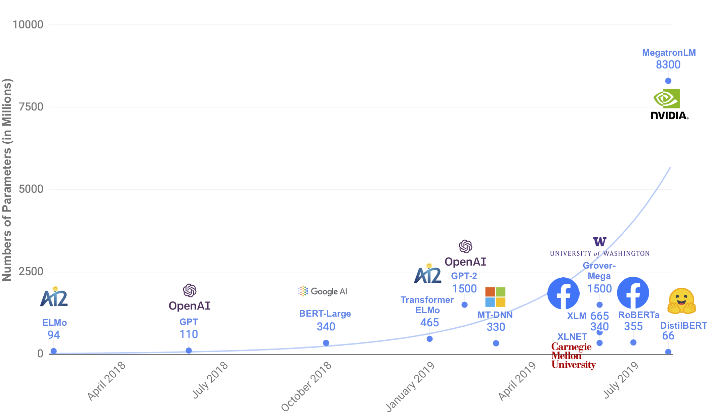
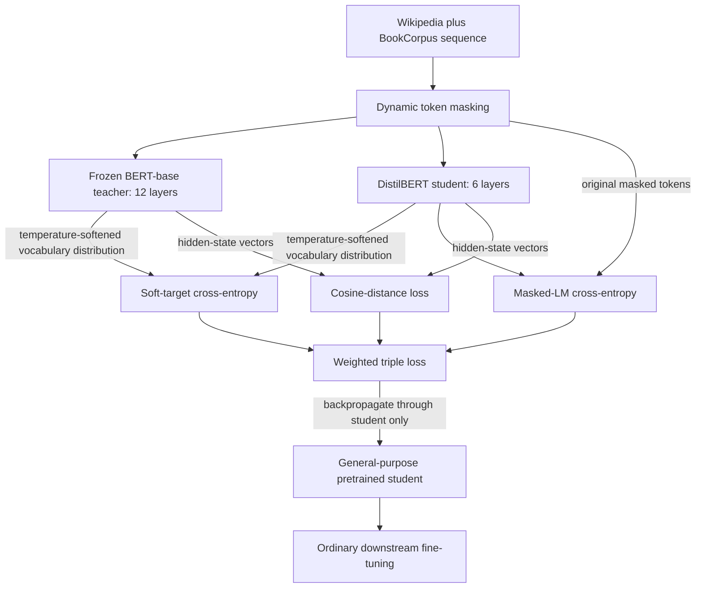
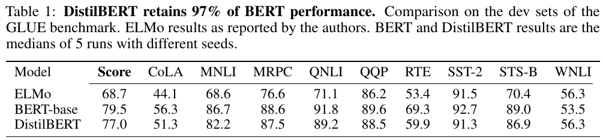
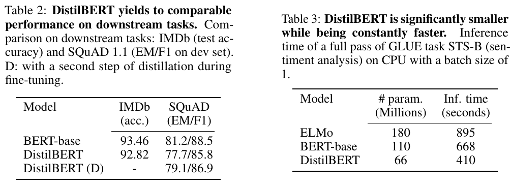
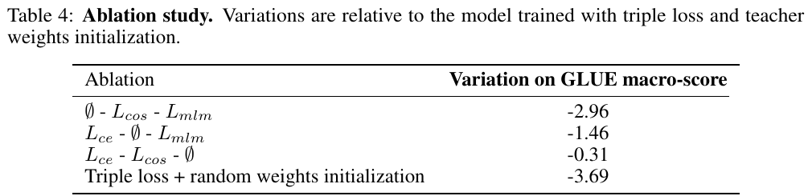

# DistilBERT: a distilled version of BERT — Sanh et al., 2019

> **arXiv:** 1910.01108v4 · **Venue:** NeurIPS 2019 EMC² Workshop · **Affiliation:** Hugging Face

## TL;DR

DistilBERT moves [knowledge distillation](distill_2015_hinton-kd.md) from task-specific fine-tuning into **language-model pre-training**, producing one general-purpose student that can later be adapted to many tasks. It halves BERT-base from 12 Transformer layers to 6, initializes each student layer from alternating teacher layers, and optimizes masked-language modeling, soft-target cross-entropy, and hidden-state cosine alignment together. The resulting 66M-parameter encoder retains 97% of BERT-base's reported GLUE macro-score while the paper reports 40% fewer parameters and 60% faster inference.

## Problem & motivation

By 2019, pretrained language models were rapidly growing from tens of millions to billions of parameters. Their accuracy gains came with larger training footprints, greater serving latency and memory, and practical barriers to real-time or on-device use. The paper's Figure 1 places the 66M-parameter DistilBERT against that growth trend; the chart is motivation, not an accuracy comparison.



*Official Figure 1 from arXiv v4. It motivates compression by charting model size over time; vertical position is parameter count, not quality.*

Earlier BERT compression commonly distilled a teacher already fine-tuned for one task, requiring a separate student for each task. DistilBERT instead asks whether teacher supervision can be injected once during pre-training. If successful, the student preserves the transfer-learning workflow: pretrain one reusable encoder, then fine-tune it independently on classification, similarity, inference, or question-answering tasks.

This is not exact BERT API equivalence. DistilBERT removes token-type embeddings and the pooler, so applications that depend on segment IDs or BERT's pooled output need adaptation. The claim is functional reuse as a general-purpose encoder, not a byte-for-byte architectural replacement.

## Key idea

For a masked input sequence, run a frozen BERT-base teacher and the 6-layer student on the same tokens. If $z_i^t$ and $z_i^s$ are their vocabulary logits for token $i$, temperature $T$ produces

$$
p_i^t(T)=\frac{\exp(z_i^t/T)}{\sum_j\exp(z_j^t/T)},
\qquad
p_i^s(T)=\frac{\exp(z_i^s/T)}{\sum_j\exp(z_j^s/T)}.
$$

The soft-target cross-entropy is

$$
\mathcal L_{ce}
=-\sum_{i\in\mathcal V}p_i^t(T)\log p_i^s(T),
$$

where $\mathcal V$ is the shared WordPiece vocabulary. The paper prints the log-likelihood form $\sum_i t_i\log s_i$; the negative sign above makes explicit the cross-entropy being minimized. As in Hinton et al., teacher and student use the same $T$ during training and ordinary $T=1$ softmax at inference.

The ordinary masked-language-modeling term preserves direct supervision from the original token $y_m$ at each masked position $m$:

$$
\mathcal L_{mlm}
=-\sum_{m\in\mathcal M}\log p^s(y_m\mid\tilde{\mathbf x}),
$$

where $\tilde{\mathbf x}$ is the dynamically masked sequence and $\mathcal M$ is its set of prediction positions.

Finally, for aligned teacher and student hidden vectors $\mathbf h^t$ and $\mathbf h^s$, the cosine-distance term is

$$
\mathcal L_{cos}
=1-\frac{\mathbf h^s\cdot\mathbf h^t}
{\lVert\mathbf h^s\rVert_2\lVert\mathbf h^t\rVert_2}.
$$

The paper describes this term as aligning hidden-state directions but does not specify in its five pages which token positions or layer pairs are aggregated. Because teacher and student keep the same hidden width, no learned projection is required for the compared vectors.

The complete objective is a linear combination

$$
\mathcal L
=\lambda_{ce}\mathcal L_{ce}
+\lambda_{mlm}\mathcal L_{mlm}
+\lambda_{cos}\mathcal L_{cos}.
$$

The paper does not publish $T$ or the three coefficients, so a faithful reimplementation must recover them from the released training code or tune them rather than assuming equal weights.

## How it works


```mermaid
flowchart TB
    Raw[Wikipedia plus BookCorpus sequence] --> Mask[Dynamic token masking]
    Mask --> Teacher[Frozen BERT-base teacher: 12 layers]
    Mask --> Student[DistilBERT student: 6 layers]
    Teacher -->|temperature-softened vocabulary distribution| CE[Soft-target cross-entropy]
    Student -->|temperature-softened vocabulary distribution| CE
    Mask -->|original masked tokens| MLM[Masked-LM cross-entropy]
    Student --> MLM
    Teacher -->|hidden-state vectors| COS[Cosine-distance loss]
    Student -->|hidden-state vectors| COS
    CE --> Total[Weighted triple loss]
    MLM --> Total
    COS --> Total
    Total -->|backpropagate through student only| Reusable[General-purpose pretrained student]
    Reusable --> FineTune[Ordinary downstream fine-tuning]
```

1. **Build a depth-compressed student.** Start from BERT's encoder design but reduce the Transformer stack from 12 blocks to 6. Keep the teacher-compatible hidden dimensionality, vocabulary, attention structure, and positional embeddings; remove token-type embeddings and BERT's pooler. The authors prioritize depth reduction because their tests found changing the last tensor dimension less computationally efficient at a fixed parameter budget (§3).
2. **Initialize from the teacher.** Copy one layer out of every two from BERT-base into the student, yielding the natural mapping from six student blocks to alternating teacher blocks. Shared dimensionality makes the copied weights shape-compatible. Table 4 shows that replacing this with random initialization reduces GLUE macro-score by 3.69 points.
3. **Create each pretraining batch.** Dynamically resample masked positions rather than fixing one corrupted copy of the corpus. The input tensor has shape $B\times L$; student and teacher vocabulary logits have shape $B\times L\times|\mathcal V|$, and hidden states have shape $B\times L\times768$ for BERT-base dimensionality.
4. **Run the frozen teacher.** Teacher outputs are supervision only. Do not update its parameters or include a next-sentence-prediction loss.
5. **Run the student and combine losses.** Compute temperature-softened vocabulary cross-entropy, ordinary MLM loss at masked positions, and cosine distance between aligned hidden vectors. Backpropagate their weighted sum through the student.
6. **Fine-tune normally.** After pretraining, discard the teacher and attach task heads to DistilBERT. The main GLUE experiment uses no ensemble or multi-task fine-tuning. A separate SQuAD experiment adds a second, task-specific distillation stage from a BERT teacher already fine-tuned on SQuAD (§4.1).

| Component | BERT-base teacher | DistilBERT student | Consequence |
|---|---:|---:|---|
| Transformer layers | 12 | 6 | Main compute reduction; alternating teacher layers initialize the student. |
| Hidden width | 768 | 768 | Enables direct weight copying and hidden-vector comparison. |
| Attention heads | 12 | 12 | The paper changes depth rather than attention width. |
| Token-type embeddings | Present | Removed | No `token_type_ids`; paired sequences still use separator tokens. |
| Pooler | Present | Removed | Downstream heads cannot assume BERT's pretrained pooler is available. |
| Parameters | 110M | 66M | 40% reduction as reported in Table 3. |

## Training / data

- **Corpus:** the same concatenation used for the original BERT pretraining: English Wikipedia and Toronto BookCorpus (§3). The paper gives no token count, sequence-length schedule, or corpus preprocessing details beyond this identification.
- **Objective:** dynamic masked-token corruption with $\mathcal L_{ce}+\mathcal L_{mlm}+\mathcal L_{cos}$ as a weighted combination; no next-sentence prediction. The paper does not report the temperature, loss weights, optimizer, learning rate, masking ratio, number of updates, or checkpoint-selection procedure.
- **Batching:** gradient accumulation enables batches of up to 4,000 examples (§3).
- **Compute:** 8 V100 GPUs with 16 GB each for approximately 90 hours, or about 720 V100-GPU-hours if all devices were occupied throughout (§3). The paper compares this with RoBERTa's reported one day on 1,024 32GB V100 GPUs, but the setups are not controlled for direct efficiency comparison.
- **Evaluation:** GLUE development sets across nine tasks, reporting medians over five fine-tuning seeds for BERT-base and DistilBERT; IMDb test accuracy; SQuAD v1.1 development EM/F1; CPU inference time on STS-B; and an iPhone 7 Plus question-answering proof of concept (§4).
- **Released artifact:** the 66M-parameter pretrained student and training implementation were released through Hugging Face Transformers, making the model reusable even though the short paper omits important optimization hyperparameters.

## Results

### General language understanding

| Model | GLUE macro | CoLA | MNLI | MRPC | QNLI | QQP | RTE | SST-2 | STS-B | WNLI |
|---|---:|---:|---:|---:|---:|---:|---:|---:|---:|---:|
| ELMo | 68.7 | 44.1 | 68.6 | 76.6 | 71.1 | 86.2 | 53.4 | 91.5 | 70.4 | 56.3 |
| BERT-base | **79.5** | **56.3** | **86.7** | **88.6** | **91.8** | **89.6** | **69.3** | **92.7** | **89.0** | 53.5 |
| DistilBERT | 77.0 | 51.3 | 82.2 | 87.5 | 89.2 | 88.5 | 59.9 | 91.3 | 86.9 | **56.3** |

*Source: Table 1, GLUE development sets. BERT-base and DistilBERT values are medians of five runs; metric types differ by task, and the macro-score averages the reported task scores.*

DistilBERT's 77.0 macro-score is $77.0/79.5\approx96.9\%$ of BERT-base's 79.5, the basis of the paper's rounded **97% retained** claim. The retention ratio is an aggregate score ratio, not a claim that every task loses only 3%; RTE has the largest displayed gap at 9.4 points (Table 1).



*Official paper evidence: Table 1 from arXiv v4.*

### Downstream adaptation, size, and speed

| Evaluation | BERT-base | DistilBERT | DistilBERT with task distillation | Source |
|---|---:|---:|---:|---|
| IMDb test accuracy | 93.46 | 92.82 | not reported | Table 2 |
| SQuAD v1.1 dev EM/F1 | 81.2 / 88.5 | 77.7 / 85.8 | **79.1 / 86.9** | Table 2 |
| Parameters | 110M | **66M** | same student | Table 3 |
| STS-B full-pass CPU time, batch 1 | 668 s | **410 s** | not reported | Table 3 |

The second SQuAD stage uses a BERT model fine-tuned on SQuAD as teacher during DistilBERT adaptation. The authoritative v4 **Table 2** reports 79.1 EM / 86.9 F1. Nearby v4 prose instead says 70.4 EM / 79.8 F1, values inconsistent with the table and its “within 3 points” statement; this recap uses the table and records the conflict rather than combining them.

Table 3's raw elapsed times mean DistilBERT takes 38.6% less wall time and provides about $668/410\approx1.63\times$ the throughput under that setup. The paper describes this as “60% faster.” The measurement is one full STS-B development pass on an Intel Xeon E5-2690 v3 at 2.9 GHz with batch size 1, so it is not a hardware-independent latency guarantee (§4.1).



*Official paper evidence: Tables 2–3 from arXiv v4.*

For the iPhone 7 Plus question-answering demonstration, the paper reports DistilBERT as 71% faster than its BERT-base model when tokenization is excluded, with a 207 MB model footprint (§4.1). It does not provide raw mobile latency, variance, precision, or deployment-format details.

### Ablation

| Change from triple loss + teacher initialization | GLUE macro-score delta | Source |
|---|---:|---|
| Remove soft-target cross-entropy $\mathcal L_{ce}$ | **−2.96** | Table 4 |
| Remove cosine loss $\mathcal L_{cos}$ | **−1.46** | Table 4 |
| Remove MLM loss $\mathcal L_{mlm}$ | **−0.31** | Table 4 |
| Keep triple loss, use random initialization | **−3.69** | Table 4 |

Soft-target supervision is the most important individual loss in this ablation, while alternating-layer teacher initialization has an even larger measured effect than removing any single objective. The small MLM delta does not establish that MLM is unnecessary in other settings; it is conditional on teacher initialization and the other two losses.



*Official paper evidence: Table 4 from arXiv v4.*

## Limitations & follow-ups

- **One compression point:** the paper studies a 6-layer, 66M-parameter student rather than a depth/width/quality frontier. Its recipe does not show how far compression can be pushed.
- **Incomplete training disclosure:** temperature, loss weights, optimizer, learning rate, mask rate, update count, sequence-length schedule, and the precise hidden vectors used by $\mathcal L_{cos}$ are absent from the paper. Reproducing from the PDF alone is therefore impossible.
- **Limited controlled efficiency evidence:** CPU timing covers one STS-B pass at batch size 1 on one processor. Mobile claims omit raw latency and deployment details; no GPU latency, energy, memory-at-runtime, or training-cost comparison against BERT-base is reported.
- **Compatibility differences:** removing token-type embeddings and the pooler reduces parameters but changes BERT's interface and behavior for paired sequences or pooler-dependent heads.
- **Benchmark scope:** results are English-only and use GLUE development sets, IMDb, and SQuAD v1.1. Robustness, multilingual transfer, calibration, bias, and long-context behavior are not evaluated.
- **Revision inconsistency:** v4 fixed an evaluation-metrics bug, yet its SQuAD task-distillation prose still conflicts with Table 2. The table is internally consistent with the claimed gap and is used here.
- **No explicit attention matching:** the student receives output-distribution and hidden-direction supervision, but not the layer-wise attention-map and intermediate representation losses later developed by [TinyBERT](distill_2019_tinybert.md). MiniLM subsequently focuses on self-attention relations across students and teachers with different hidden sizes.

DistilBERT's durable contribution is the stage at which distillation occurs: it shows that one teacher-guided pretraining run can yield a reusable compressed encoder. [TinyBERT](distill_2019_tinybert.md) broadens what is matched and uses general plus task-specific distillation; both inherit softened output supervision from [Hinton et al.](distill_2015_hinton-kd.md).

## Links

- **arXiv:** [abs](https://arxiv.org/abs/1910.01108) · [html](https://arxiv.org/html/1910.01108v4) · [pdf](https://arxiv.org/pdf/1910.01108)
- **Venue:** [NeurIPS 2019 EMC² Workshop proceedings](https://www.emc2-ai.org/neurips-19)
- **Original training code:** [Transformers v2.5.1 distillation directory](https://github.com/huggingface/transformers/tree/v2.5.1/examples/distillation)
- **Model:** [DistilBERT base uncased](https://huggingface.co/distilbert/distilbert-base-uncased)
- **Documentation:** [Hugging Face Transformers: DistilBERT](https://huggingface.co/docs/transformers/model_doc/distilbert)
- **Mobile demo:** [Swift/Core ML BERT and DistilBERT archive](https://github.com/huggingface/swift-coreml-transformers)
- **Blog:** [Smaller, faster, cheaper, lighter: Introducing DistilBERT](https://medium.com/huggingface/distilbert-8cf3380435b5)
- **Related / successor papers:** [Hinton KD](distill_2015_hinton-kd.md) · [Sequence-Level KD](distill_2016_seq-level-kd.md) · [TinyBERT](distill_2019_tinybert.md)
- **BibTeX:**

  ```bibtex
  @inproceedings{sanh2019distilbert,
    title     = {DistilBERT, a distilled version of BERT: smaller, faster, cheaper and lighter},
    author    = {Sanh, Victor and Debut, Lysandre and Chaumond, Julien and Wolf, Thomas},
    booktitle = {NeurIPS EMC2 Workshop},
    year      = {2019}
  }
  ```
