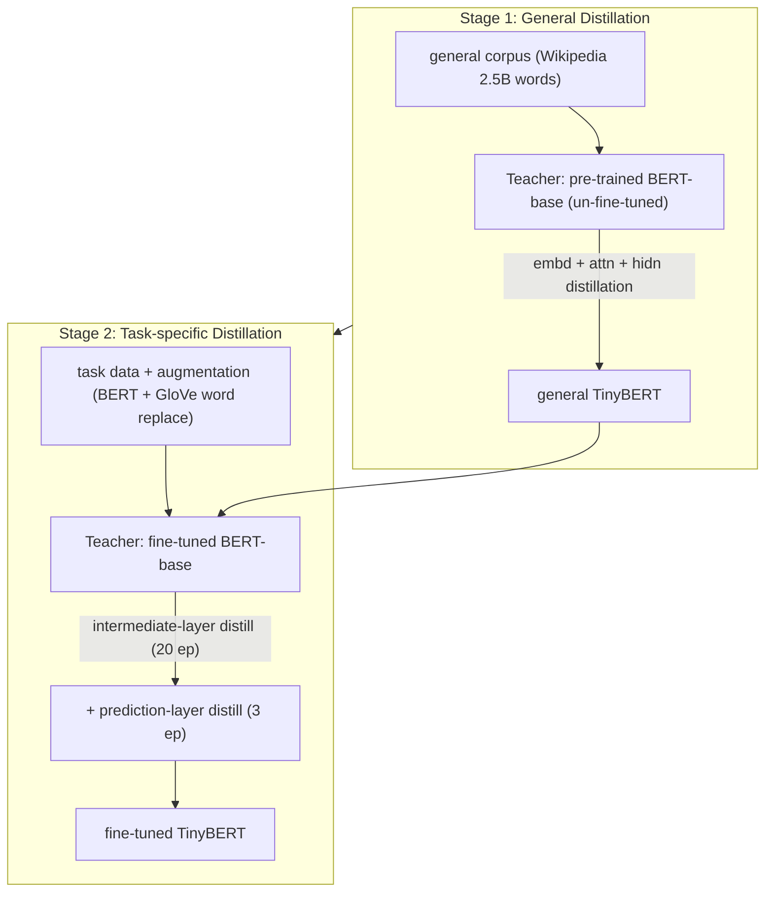

# TinyBERT: Distilling BERT for Natural Language Understanding — Jiao et al., 2019

> **arXiv:** 1909.10351v5 · **Venue:** Findings of EMNLP 2020 · **Affiliation:** Huazhong University of Science and Technology · Huawei Noah's Ark Lab

## TL;DR
TinyBERT introduces a **Transformer-specific distillation** that matches not just the teacher's output
logits but its **embedding layer, attention matrices, and hidden states**, plus a **two-stage learning
framework** — *general distillation* on unlabeled text, then *task-specific distillation* on augmented
task data. A 4-layer **TinyBERT₄** reaches **>96.8%** of BERT-base's GLUE score while being **7.5×
smaller and 9.4× faster**, and a 6-layer **TinyBERT₆** essentially matches the teacher.

## Problem & motivation
BERT is over-parameterized and slow for edge deployment. Prior BERT distillation
([DistilBERT](distill_2019_distilbert.md), BERT-PKD) mostly matched **output logits** and/or hidden
states, and often distilled at only one stage. But BERT's **attention matrices** encode substantial
linguistic (syntax/coreference) knowledge, and BERT's power comes from *both* general pre-training *and*
task fine-tuning. TinyBERT's thesis: to shrink BERT aggressively (to 4 layers) you must transfer the
knowledge in its **internal representations** and do so at **both** training stages.

## Key idea
**Transformer distillation** with a student→teacher **layer mapping** $n=g(m)$ (the student's $m$-th
layer imitates the teacher's $g(m)$-th), distilling three representation types:

**Embedding-layer:** $\mathcal{L}_{embd}=\mathrm{MSE}(E^{S}W_e,\,E^{T})$.

**Transformer-layer** = attention + hidden states:
$$
\mathcal{L}_{attn}=\frac{1}{h}\sum_{i=1}^{h}\mathrm{MSE}(A_i^{S},A_i^{T}),\qquad
\mathcal{L}_{hidn}=\mathrm{MSE}(H^{S}W_h,\,H^{T}),
$$
where $A_i$ are the **unnormalized** attention matrices of head $i$ (fitting the pre-softmax scores
converges faster than fitting softmax outputs), and $W_e,W_h$ are **learned projections** mapping the
student's smaller dimension into the teacher's space.

**Prediction-layer:** $\mathcal{L}_{pred}=\mathrm{CE}(z^{T}/t,\,z^{S}/t)$ (soft logits, temperature
$t=1$ works well).

These combine per layer:
$$
\mathcal{L}_{layer}=\begin{cases}\mathcal{L}_{embd}, & m=0\\ \mathcal{L}_{hidn}+\mathcal{L}_{attn}, & 0<m\le M\\ \mathcal{L}_{pred}, & m=M+1\end{cases}
\qquad \mathcal{L}_{model}=\sum_{x}\sum_{m=0}^{M+1}\lambda_m\,\mathcal{L}_{layer}.
$$

## How it works



- **Layer mapping:** uniform $g(m)=3m$ (TinyBERT₄ learns from every 3rd BERT layer); uniform beats
  top-only/bottom-only.
- **Data augmentation:** replace single-piece words with BERT-`[MASK]` predictions and multi-piece words
  with GloVe nearest neighbors ($p_t=0.4$, $N_a=20$, $K=15$) — expands the small task sets that make
  distillation data-starved.
- **TinyBERT₄:** $M{=}4$, $d'{=}312$, $d_i'{=}1200$, $h{=}12$ → **14.5M** params vs teacher 109M.
  **TinyBERT₆:** $M{=}6$, $d'{=}768$.

## Training / data
General distillation on English Wikipedia (2.5B words), 3 epochs; task-specific distillation on augmented
GLUE data (20 epochs intermediate + 3 epochs prediction). Evaluated on **GLUE** and **SQuAD v1.1/v2.0**.

## Results
From the paper (Table 1, GLUE test).

| Model | Params | Speedup | GLUE avg | Source |
|---|---|---|---|---|
| BERT-base (teacher) | 109M | 1.0× | 79.5 | Table 1 |
| BERT-Tiny (pretrain only) | 14.5M | 9.4× | 70.2 | Table 1 |
| DistilBERT₄ | 52.2M | 3.0× | 71.9 | Table 1 |
| BERT₄-PKD | 52.2M | 3.0× | 72.6 | Table 1 |
| **TinyBERT₄** | **14.5M** | **9.4×** | **77.0** (>96.8% of teacher) | Table 1 |
| DistilBERT₆ | 67M | 2.0× | 76.8 | Table 1 |
| **TinyBERT₆** | 67M | 2.0× | **79.4** (≈ teacher) | Table 1 |

TinyBERT₄ beats 4-layer SOTA (BERT₄-PKD, DistilBERT₄) by **≥4.4%** using ~28% of their parameters, and
**+6.8%** over BERT-Tiny. Ablations: **all three stages** (GD/TD/DA) matter — TD & DA help more than GD;
removing Transformer-layer distillation collapses the average (75.6→56.3); **attention** distillation
matters more than hidden-state distillation; the unlabeled-corpus general distillation is what makes the
tiny student's internal distributions match BERT's before task tuning.

## Limitations & follow-ups
- **Pipeline complexity** — two distillation stages + data augmentation + per-layer losses is heavier
  than [DistilBERT](distill_2019_distilbert.md)'s single-stage recipe.
- **Fixed layer mapping** (uniform) is not task-adaptive.
- **Relation to neighbors.** TinyBERT is the **deep, representation-matching, two-stage** end of BERT
  distillation, contrasted with [DistilBERT](distill_2019_distilbert.md)'s lighter output/cosine recipe;
  both build on [Hinton et al.](distill_2015_hinton-kd.md). Its attention-matrix matching is the same
  "internal geometry" idea that KV-cache and [MixedDecoder](../mixed_decoder/mixed_decoder.md)-style
  compressors exploit.

## Links
- **arXiv:** [abs](https://arxiv.org/abs/1909.10351) · [html](https://arxiv.org/html/1909.10351v5) · [pdf](https://arxiv.org/pdf/1909.10351)
- **Code / models:** [github.com/huawei-noah/Pretrained-Language-Model/tree/master/TinyBERT](https://github.com/huawei-noah/Pretrained-Language-Model/tree/master/TinyBERT)
- **BibTeX:**
  ```bibtex
  @inproceedings{jiao2020tinybert,
    title     = {TinyBERT: Distilling BERT for Natural Language Understanding},
    author    = {Jiao, Xiaoqi and Yin, Yichun and Shang, Lifeng and Jiang, Xin and Chen, Xiao and Li, Linlin and Wang, Fang and Liu, Qun},
    booktitle = {Findings of the Association for Computational Linguistics: EMNLP 2020},
    year      = {2020}
  }
  ```
- **Related papers:** [Hinton KD](distill_2015_hinton-kd.md) · [Sequence-Level KD](distill_2016_seq-level-kd.md) · [DistilBERT](distill_2019_distilbert.md)
- **In-repo:** [MixedDecoder](../mixed_decoder/mixed_decoder.md) · [Backbone components thread](../context/backbone/backbone.md) · [KV-cache compression thread](../context/kv_cache/kv_cache.md)
