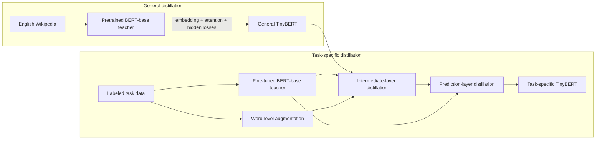
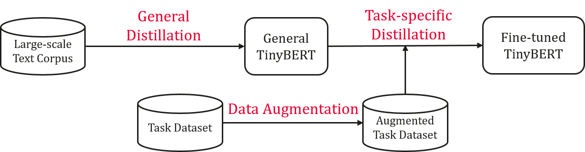
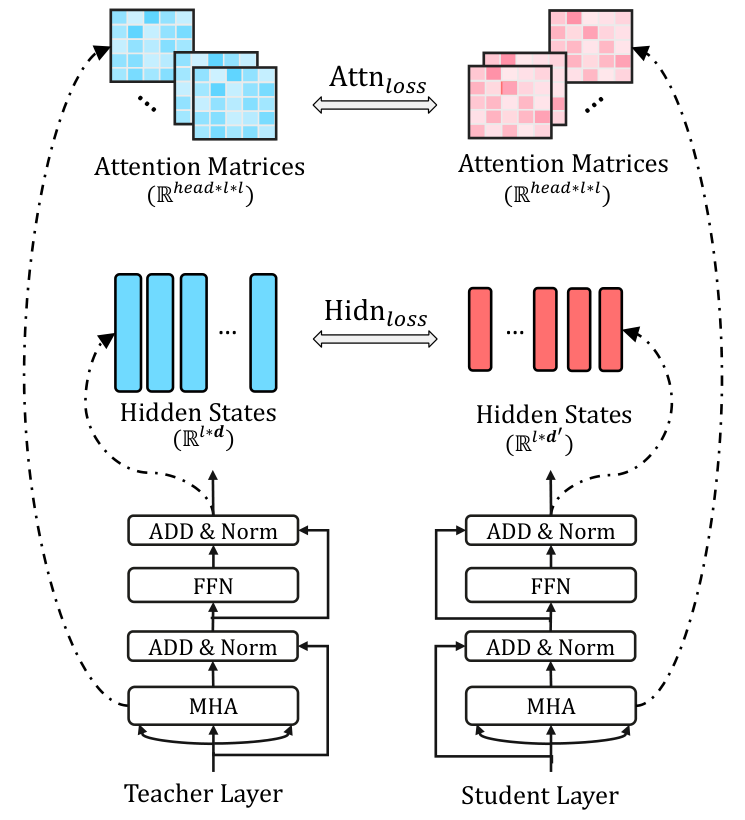
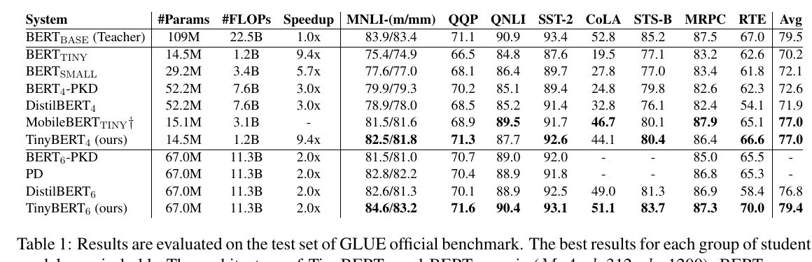
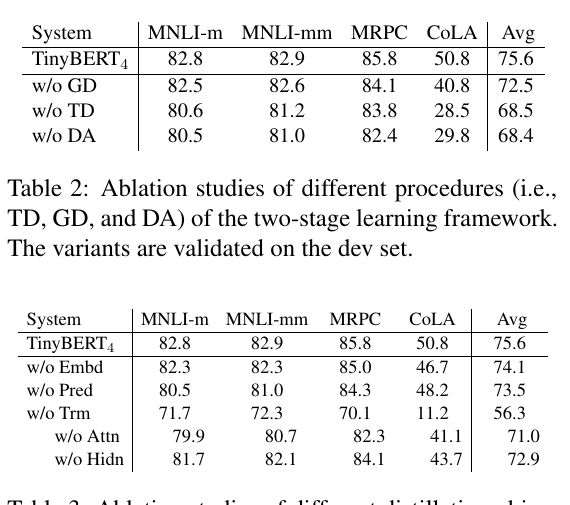

# TinyBERT: Distilling BERT for Natural Language Understanding — Jiao et al., 2019

> **arXiv:** 1909.10351v5 · **Venue:** Findings of EMNLP 2020 · **Affiliation:** Huazhong University of Science and Technology · Huawei Noah's Ark Lab

## TL;DR

TinyBERT distills a Transformer at multiple interfaces: embeddings, pre-softmax attention-score matrices, Transformer hidden states, and final predictions. It performs that transfer twice—first from pretrained BERT on general-domain text, then from a task-fine-tuned BERT on augmented task data—so the student acquires both reusable and task-specific behavior. A narrow 4-layer TinyBERT reaches 77.0 versus BERT-base's 79.5 GLUE test average with 14.5M versus 109M parameters and 9.4× measured K80 inference speedup; a 6-layer, full-width student reaches 79.4.

## Problem & motivation

BERT-base has 12 layers, 109M parameters, and 22.5B FLOPs under the paper's evaluation setting. Directly pretraining a 4-layer, width-312 BERT reduces this to 14.5M parameters and 1.2B FLOPs, but its GLUE test average falls from 79.5 to 70.2 (Table 1). The central problem is therefore not merely removing capacity; it is deciding **what behavior must cross the teacher–student capacity gap**.

Earlier approaches exposed only part of BERT's learned function. Output-logit distillation transfers the teacher's final class distribution. Patient KD adds intermediate hidden states. [DistilBERT](distill_2019_distilbert.md) distills during pretraining with output, MLM, and cosine losses. TinyBERT argues that three omissions still matter for an aggressively narrow student:

1. Multi-head attention score matrices carry structural patterns such as syntax and coreference.
2. A student narrower than its teacher cannot simply copy alternating teacher blocks; it needs learned projections between representation spaces.
3. BERT learns in two phases—general pretraining and task adaptation—so transferring at only one phase leaves either general or task-specific knowledge behind.

TinyBERT answers with Transformer-specific representation matching at both phases. This is a more expensive training pipeline than ordinary fine-tuning, but the teacher and all projection-only supervision are discarded at inference.

## Key idea

Let the student have $M$ Transformer layers and the teacher $N$. A mapping $g(m)$ assigns student layer $m$ to teacher layer $g(m)$, with embedding layers indexed by 0 and prediction layers by $M+1$ and $N+1$:

$$
g(0)=0,\qquad g(M+1)=N+1.
$$

For an input of length $\ell$, the generic model-level objective is

$$
\mathcal L_{model}
=\sum_{\mathbf x\in\mathcal X}\sum_{m=0}^{M+1}
\lambda_m\,
\mathcal L_{layer}\!\left(f_m^S(\mathbf x),f_{g(m)}^T(\mathbf x)\right),
$$

where $f_m^S$ and $f_{g(m)}^T$ expose corresponding student and teacher behaviors, $\lambda_m$ weights each interface, and all experiments set $\lambda_m=1$ (§3.1, §4.2).

### Transformer-layer distillation

For head $i$, TinyBERT matches the **unnormalized** scaled dot-product attention scores

$$
\mathbf A_i=\frac{\mathbf Q_i\mathbf K_i^\top}{\sqrt{d_k}}
\in\mathbb R^{\ell\times\ell},
$$

rather than $\operatorname{softmax}(\mathbf A_i)$. The paper reports faster convergence and better performance for pre-softmax scores (§3.1):

$$
\mathcal L_{attn}
=\frac1h\sum_{i=1}^{h}\operatorname{MSE}(\mathbf A_i^S,\mathbf A_i^T).
$$

Both models use $h=12$ heads, so heads can be paired directly. Hidden outputs have shapes $\mathbf H^S\in\mathbb R^{\ell\times d'}$ and $\mathbf H^T\in\mathbb R^{\ell\times d}$. A learned matrix $\mathbf W_h\in\mathbb R^{d'\times d}$ projects the narrower student into teacher space:

$$
\mathcal L_{hidn}
=\operatorname{MSE}(\mathbf H^S\mathbf W_h,\mathbf H^T),
\qquad
\mathcal L_{trm}=\mathcal L_{attn}+\mathcal L_{hidn}.
$$

### Embedding and prediction distillation

The embedding matrices use the analogous learned projection $\mathbf W_e$:

$$
\mathcal L_{embd}
=\operatorname{MSE}(\mathbf E^S\mathbf W_e,\mathbf E^T).
$$

For task logits $\mathbf z^S$ and $\mathbf z^T$, prediction distillation uses soft cross-entropy at temperature $t$:

$$
\mathcal L_{pred}
=\operatorname{CE}\!\left(\mathbf z^T/t,\mathbf z^S/t\right),
$$

where the paper's notation means cross-entropy between temperature-softened teacher and student predictions; $t=1$ works well in its experiments (§3.1).

These combine per layer:

$$
\mathcal L_{layer}=
\begin{cases}
\mathcal L_{embd}, & m=0,\\
\mathcal L_{hidn}+\mathcal L_{attn}, & 0<m\le M,\\
\mathcal L_{pred}, & m=M+1.
\end{cases}
$$

The stages do not blindly sum every term. General distillation uses embedding- and Transformer-layer losses; the authors found prediction-layer distillation during pretraining added no downstream gain. Task-specific training first optimizes intermediate interfaces, then runs prediction-layer distillation as a separate phase (footnote 2, §4.2).

## How it works


```mermaid
flowchart LR
  subgraph GD["General distillation"]
    W["English Wikipedia"] --> PT["Pretrained BERT-base teacher"]
    PT -->|"embedding + attention + hidden losses"| G["General TinyBERT"]
  end
  subgraph TD["Task-specific distillation"]
    D["Labeled task data"] --> FT["Fine-tuned BERT-base teacher"]
    D --> A["Word-level augmentation"]
    G --> I["Intermediate-layer distillation"]
    FT --> I
    A --> I
    I --> P["Prediction-layer distillation"]
    FT --> P
    P --> S["Task-specific TinyBERT"]
  end
```

The authored diagram separates three optimization phases: general intermediate matching, task-specific intermediate matching, then task-specific prediction matching. Figure 1 from the paper gives the authors' data-flow view:



*Official Figure 1 / repository overview. General distillation creates a reusable initialization; each downstream task then produces a separately fine-tuned TinyBERT from an augmented task dataset.*

### Layer correspondence

For TinyBERT4, $N=12$, $M=4$, and uniform mapping uses $g(m)=3m$: student Transformer layers 1–4 imitate teacher layers 3, 6, 9, and 12. Table 4 compares this with **top** mapping (the final four teacher layers) and **bottom** mapping (the first four); uniform wins every reported task, with four-task dev averages 75.6, 70.9, and 71.3 respectively. This makes the mapping a fixed design choice rather than a learned alignment.



*Official Figure 2. Corresponding blocks expose both per-head attention-score matrices and final hidden states; a projection resolves different hidden widths.*

### Data augmentation algorithm

For each labeled sequence $\mathbf x$, Algorithm 1 creates $N_a$ variants. For every original word in every variant:

1. If the word is one WordPiece, temporarily replace it with `[MASK]`, run BERT, and take its top-$K$ predictions at that position as candidates.
2. If it spans multiple WordPieces, take the $K$ nearest GloVe words instead.
3. Draw $p\sim\operatorname{Uniform}(0,1)$. When $p\le p_t$, uniformly sample a candidate and replace the word; otherwise retain it.
4. Append the completed sequence to the augmented dataset and repeat until $N_a$ variants exist.

The global settings are $p_t=0.4$, $N_a=20$, and $K=15$. CoLA is the exception: it uses 50 augmented variants because its training set is small (footnote 4). Labels are inherited from the original example, so semantic drift is possible and is not filtered by a label-preservation model.

## Training / data

### Architectures

| Model | Layers | Hidden size | FFN size | Heads | Parameters | FLOPs |
|---|---:|---:|---:|---:|---:|---:|
| BERT-base teacher | 12 | 768 | 3,072 | 12 | 109M | 22.5B |
| TinyBERT4 | 4 | 312 | 1,200 | 12 | 14.5M | 1.2B |
| TinyBERT6 | 6 | 768 | 3,072 | 12 | 67.0M | 11.3B |

TinyBERT4 is deliberately narrower as well as shallower; learned embedding/hidden projections make that width mismatch possible. TinyBERT6 keeps BERT-base's width and FFN size while halving depth. The paper does not prescribe copying teacher block weights: general distillation supplies the student initialization.

### Stage 1: general distillation

- **Teacher:** original pretrained, task-agnostic BERT-base.
- **Corpus:** English Wikipedia, reported as 2.5B words.
- **Objective:** embedding plus Transformer-layer attention and hidden-state losses; no prediction loss.
- **Schedule:** 3 epochs, maximum sequence length 128. Other hyperparameters follow BERT pretraining (§4.2), so the paper does not fully enumerate optimizer, masking, warmup, or effective batch details needed for bitwise reproduction.
- **Output:** one general TinyBERT initialization reused for downstream distillation.

### Stage 2: task-specific distillation

1. Fine-tune BERT-base on one downstream task; this frozen task model becomes the teacher.
2. Generate augmented task data with Algorithm 1.
3. Run intermediate-layer distillation on augmented data with batch size 32 and learning rate $5\times10^{-5}$. The default is 20 epochs, but MNLI, QQP, and QNLI use 10; CoLA uses 50 (footnote 4).
4. Run prediction-layer distillation for 3 epochs. Select batch size from $\{16,32\}$ and learning rate from $\{10^{-5},2\times10^{-5},3\times10^{-5}\}$ on the dev set.

Maximum sequence length is 64 for single-sentence tasks and 128 for sentence-pair tasks. Prediction distillation uses augmented data except STS-B, where the original training set performs better (footnote 5). GLUE systems are learned single-task rather than as one multitask student.

For SQuAD 1.1/2.0, the model predicts start and end positions as sequence labels. Appendix B says prediction-layer distillation uses the original QA training set rather than augmented data because it works better. These task-specific exceptions are important when translating the headline recipe into code.

## Results

### GLUE test set



*Official Table 1. Speedup is measured on a single NVIDIA K80 GPU; it is not a hardware-independent latency claim.*

| Model | Params | FLOPs | Speedup | MNLI m/mm | QQP | QNLI | SST-2 | CoLA | STS-B | MRPC | RTE | Avg |
|---|---:|---:|---:|---:|---:|---:|---:|---:|---:|---:|---:|---:|
| BERT-base | 109M | 22.5B | 1.0× | 83.9/83.4 | 71.1 | 90.9 | 93.4 | 52.8 | 85.2 | 87.5 | 67.0 | 79.5 |
| BERT-Tiny | 14.5M | 1.2B | 9.4× | 75.4/74.9 | 66.5 | 84.8 | 87.6 | 19.5 | 77.1 | 83.2 | 62.6 | 70.2 |
| DistilBERT4 | 52.2M | 7.6B | 3.0× | 78.9/78.0 | 68.5 | 85.2 | 91.4 | 32.8 | 76.1 | 82.4 | 54.1 | 71.9 |
| BERT4-PKD | 52.2M | 7.6B | 3.0× | 79.9/79.3 | 70.2 | 85.1 | 89.4 | 24.8 | 79.8 | 82.6 | 62.3 | 72.6 |
| **TinyBERT4** | **14.5M** | **1.2B** | **9.4×** | **82.5/81.8** | **71.3** | **87.7** | **92.6** | **44.1** | **80.4** | **86.4** | **66.6** | **77.0** |
| DistilBERT6 | 67.0M | 11.3B | 2.0× | 82.6/81.3 | 70.1 | 88.9 | 92.5 | 49.0 | 81.3 | 86.9 | 58.4 | 76.8 |
| **TinyBERT6** | **67.0M** | **11.3B** | **2.0×** | **84.6/83.2** | **71.6** | **90.4** | **93.1** | **51.1** | **83.7** | **87.3** | **70.0** | **79.4** |

TinyBERT4 retains $77.0/79.5=96.9\%$ of the teacher's reported average (the abstract rounds this as more than 96.8%). Parameter count falls by $109/14.5\approx7.5\times$; the distinct 9.4× figure is K80 inference speedup. Against the same-depth, width-768 BERT4-PKD and DistilBERT4 baselines, it uses about 28% as many parameters and about 31% of their measured inference time while improving average score by 4.4–5.1 points. TinyBERT6 is nearly level with the teacher at 79.4 versus 79.5.

### What the ablations establish



*Official Tables 2–3. These are development-set results on MNLI-m, MNLI-mm, MRPC, and CoLA, not the GLUE test average above.*

- **Procedures (Table 2):** full TinyBERT4 scores 75.6. Removing general distillation gives 72.5; removing task-specific distillation gives 68.5; removing data augmentation gives 68.4. All three help, with task-specific transfer and augmented coverage contributing most to this four-task average.
- **Interfaces (Table 3):** removing embedding, prediction, or all Transformer-layer matching gives 74.1, 73.5, and 56.3. Within Transformer matching, removing attention gives 71.0 and removing hidden states gives 72.9. Both matter, but attention-score matching contributes more in this experiment.
- **Mapping (Table 4):** uniform, top, and bottom mappings average 75.6, 70.9, and 71.3. Uniformly sampling teacher depth wins all four reported tasks.

### Question answering

Appendix Table 6 reports SQuAD development results:

| Model | SQuAD 1.1 EM | SQuAD 1.1 F1 | SQuAD 2.0 EM | SQuAD 2.0 F1 |
|---|---:|---:|---:|---:|
| BERT-base | 80.7 | 88.4 | 74.5 | 77.7 |
| TinyBERT4 | 72.7 | 82.1 | 68.2 | 71.8 |
| TinyBERT6 | 79.7 | 87.5 | 74.7 | 77.7 |

The narrow 4-layer model loses more on span extraction than on the aggregate GLUE result. TinyBERT6 closes most of that gap and matches the teacher's SQuAD 2.0 F1 while exceeding its EM by 0.2, showing that the capacity tradeoff depends on architecture and task.

## Limitations & follow-ups

- **Training cost moves offline rather than disappearing.** General distillation, one fine-tuned teacher per task, augmented-data generation with BERT/GloVe, and two task-specific optimization phases are substantially more involved than ordinary fine-tuning or [DistilBERT](distill_2019_distilbert.md)'s pretraining-stage recipe.
- **The final model is task-specific.** Table 1 explicitly evaluates single-task students. The method does not produce one compact model that simultaneously retains all GLUE capabilities.
- **Fixed correspondence is brittle.** Uniform mapping beats top and bottom alternatives, but the paper does not learn task-adaptive layer alignment. Adaptive mappings are named as future work.
- **Augmentation can alter labels.** Random lexical substitutions inherit the original target without a semantic-consistency check. The official repository later recorded an augmentation bug fix and cased-model support, so reproductions should pin code revisions and compare them with Algorithm 1 rather than assuming the current script exactly represents the paper run.
- **Reported speed is platform-specific.** The 9.4× result comes from one NVIDIA K80 and combines depth/width/FLOP reductions with that hardware's execution characteristics. It does not establish modern CPU, mobile, memory, energy, or batch-dependent latency.
- **Evidence is English and benchmark-limited.** General distillation uses English Wikipedia; downstream evidence covers GLUE and SQuAD. Multilingual transfer, generation, long contexts, calibration, and robustness are not evaluated.
- **Some recipe details remain underspecified.** General-distillation hyperparameters are delegated to BERT pretraining, and task hyperparameters contain dataset exceptions. The paper reports aggregate outcomes rather than variance across seeds.
- **Compression methods are not combined.** Pruning and quantization are left as complementary future directions, along with distilling from deeper/wider teachers.

## Links

- **Paper:** [arXiv abstract](https://arxiv.org/abs/1909.10351) · [v5 HTML](https://arxiv.org/html/1909.10351v5) · [v5 PDF](https://arxiv.org/pdf/1909.10351v5)
- **Venue:** [Findings of EMNLP 2020, pages 4163–4174](https://aclanthology.org/2020.findings-emnlp.372/) · [DOI](https://doi.org/10.18653/v1/2020.findings-emnlp.372)
- **Code and models:** [official Huawei Noah repository](https://github.com/huawei-noah/Pretrained-Language-Model/tree/master/TinyBERT)
- **Source map:** method and objectives (§3, Equations 1–11); augmentation (Algorithm 1); architecture and schedule (§4.2); GLUE test results and K80 setup (Table 1); procedure/objective/mapping ablations (Tables 2–4); SQuAD dev results (Appendix B, Table 6).
- **BibTeX:**
  ```bibtex
  @inproceedings{jiao2020tinybert,
    title     = {TinyBERT: Distilling BERT for Natural Language Understanding},
    author    = {Jiao, Xiaoqi and Yin, Yichun and Shang, Lifeng and Jiang, Xin and Chen, Xiao and Li, Linlin and Wang, Fang and Liu, Qun},
    booktitle = {Findings of the Association for Computational Linguistics: EMNLP 2020},
    year      = {2020}
  }
  ```
- **Related papers:** [Hinton KD](distill_2015_hinton-kd.md) · [Sequence-Level KD](distill_2016_seq-level-kd.md) · [DistilBERT](distill_2019_distilbert.md)
