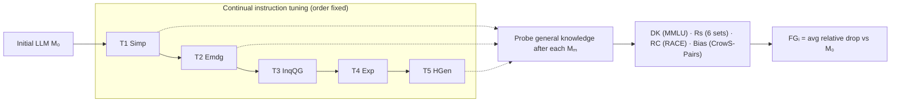

# An Empirical Study of Catastrophic Forgetting in LLMs During Continual Fine-tuning — Luo et al., 2023

> **arXiv:** 2308.08747v5 · **Venue:** preprint (v1 Aug 2023; last revised Jan 2025) · **Affiliation:** Westlake University · WeChat AI, Tencent

## TL;DR
A systematic measurement study showing that **catastrophic forgetting (CF) is pervasive** when
LLMs are continually instruction-tuned on a sequence of new tasks: general **domain knowledge,
reasoning, and reading comprehension all degrade**, and — counter-intuitively — **the larger the
model, the worse the forgetting** (1B→7B). Decoder-only **BLOOMZ** forgets *less* than the
encoder–decoder **mT0**; prior **general instruction tuning** (ALPACA vs. LLAMA) and **mixing in
general instruction data** both mitigate it; and, as a side effect, social **bias is reduced**
during tuning. This is the empirical backbone for why fully fine-tuning a big decoder (as
[LCLM](../context/ctx_compression.md) does) needs forgetting guards.

## Problem & motivation
Deployed LLMs are routinely fine-tuned on task-specific data to sharpen a particular skill, but the
original pretraining/instruction data is inaccessible, so **updating for a new task may silently
erase general knowledge**. Prior CF studies looked at encoder-only classifiers or at downstream
task-to-task forgetting; the **evolution of the *general* knowledge stored in a generative LLM**
during continual instruction tuning was unexplored. The paper asks three questions:

1. Is general knowledge forgotten during continual instruction tuning?
2. Which *types* of general knowledge are most saliently forgotten?
3. How do **model scale**, **architecture**, and **prior general instruction tuning** affect CF?

## Key idea
This is an **empirical study, not a new method**: define a controlled continual-tuning protocol,
then quantify how much general capability is lost with a single **forgetting metric**.

A model $M_0$ is trained sequentially on tasks $\mathcal{T}=\{T_m\},\, m=1,\dots,N$; during task
$T_m$ only its data $D_m=\{(x_i^m,y_i^m)\}$ is available (no access to earlier tasks), producing
$M_m$. After each step the model's *general* knowledge is re-evaluated. Forgetting on an evaluation
set $E_i$ is the **average relative drop** from the initial model:

$$
FG_i \;=\; \frac{1}{|E_i|}\sum_{e\in E_i}\frac{1}{N}\sum_{m=1}^{N}\frac{R_o^{\,e}-R_m^{\,e}}{R_o^{\,e}}\times 100\%,
$$

where $E_i$ is one evaluation category (e.g. MMLU), $e$ is a dataset/split within it, $R_o^{\,e}$ is
the score of the **initial** LLM on $e$, $R_m^{\,e}$ is the score after $m$ continual tasks, and $N$
is the number of tuning steps. $FG_i>0$ means net forgetting; larger $FG_i$ = more forgetting.
Interestingly, for the **bias** set a positive value means bias is *reduced* (the metric is the same
relative drop, and dropping stereotype preference is desirable).

## How it works


### Continual tasks (§3.1)
Five generation tasks from Scialom et al. (2022), chosen to be dissimilar from the models'
pretraining/eval tasks, trained in the fixed order **Simp → Emdg → InqQG → Exp → HGen**:
Text **Simp**lification, **Em**pathetic **d**ialogue **g**eneration, **Inq**uisitive **Q**uestion
**G**eneration, **Exp**lanation generation, and constrained **H**eadline **Gen**eration. Each uses a
shared instruction template plus a task-specific prompt; **100,000** samples per task.

### Evaluation sets (§3.2)
- **Domain Knowledge (DK):** MMLU (STEM / Human / Social / Other), **5-shot**.
- **Reasoning (Rs):** BoolQ, PIQA, Winogrande, Hellaswag, MathQA, Mutual — **zero-shot** accuracy.
- **Reading Comprehension (RC):** RACE-high, RACE-middle.
- **Bias:** CrowS-Pairs (perplexity preference for stereotypical vs. anti-stereotypical sentences).

Scores are computed with **lm-evaluation-harness**.



### Models & implementation (§4)
- **BLOOMZ** (decoder-only) at **1.1B / 1.7B / 3B / 7.1B** — the scale sweep.
- **mT0** (encoder–decoder, T5-based) at **1.2B / 3.7B** — the architecture comparison.
- **LLAMA-7B** vs. **ALPACA-7B** (LLAMA + 52K instruction tuning) — the general-instruction-tuning
  comparison; likewise **BLOOM** vs. **BLOOMZ**.
- Adam, **LR 2e-5**, constant schedule, batch 4/device on 8×A100-40G, max length 512, **3 epochs**.

## Training / data
No model is released or newly proposed; the contribution is the protocol + measurements. The
continual tasks total 100K samples each; the mitigation experiment mixes **10,000** general ALPACA
instruction samples into LLAMA-7B's continual tuning.

## Results
From the paper (Tables 3–5, Figures 2 & 4). $FG$ values are % relative drop; higher = more forgetting.

| Finding | Evidence | Source |
|---|---|---|
| Forgetting is general (all axes $FG>0$) | BLOOMZ-7.1B: RC **26.75**, DK **18.37**, Rs **13.62** | §5.1, Table 3 |
| Reading comprehension forgets most, then domain knowledge | RC > DK > Rs ordering across models | §5.1, Table 3 |
| **Forgetting worsens with scale** | DK $FG$ = **9.54 / 10.72 / 14.63 / 18.37** for BLOOMZ 1.1B/1.7B/3B/7.1B | §5.2, Fig. 4 |
| Decoder-only forgets less than enc–dec | BLOOMZ-3B DK $FG$ 11.09 vs. mT0-3.7B 16.73 (−5.64) | §5.3, Fig. 5 |
| Prior general instruction tuning helps | ALPACA-7B retains more than LLAMA-7B; RC $FG$ 10.31 vs. 31.72 | §5.4, Table 5 |
| Mixing general data mitigates CF | MMLU-human: 34.72→26.8 (task-only) vs. →30.0 (mixed) | §5.4, Fig. 6 |
| Bias is *reduced* during tuning | Physical-appearance stereotype preference 75.0%→63.88% (BLOOMZ-7.1B) | §5.1, Table 4 |


The scale effect is explained by initial performance: bigger models start much stronger but all
converge to a **similar post-tuning floor**, so the *relative* drop $FG$ is larger for them.

## Limitations & follow-ups
- **Single task order.** CF is measured for one fixed order (Simp→…→HGen); order effects are not
  swept.
- **≤7B scale, limited benchmarks.** Compute limits cap the study at 7B and a handful of eval sets.
- **Diagnostic, not prescriptive.** It quantifies CF and points to mitigations (general-data mixing)
  but proposes no optimizer-level fix — that gap is filled by
  [Revisiting CF (SAM)](forgetting_2024_revisiting-cf.md).
- **Why it matters here.** These measurements are the empirical justification for
  [LCLM](../context/ctx_compression.md)'s **staged, small-LR unfreeze** (§3.2): because *scale
  amplifies forgetting*, a 4B decoder must be tuned gently, and the **continual-pretraining data
  mix** acts as the general-data replay this paper shows to help. See the repo's
  [continual-training thread](../context/forgetting/forgetting.md).

## Links
- **arXiv:** [abs](https://arxiv.org/abs/2308.08747) · [html](https://arxiv.org/html/2308.08747v5) · [pdf](https://arxiv.org/pdf/2308.08747)
- **Code:** —
- **BibTeX:**
  ```bibtex
  @article{luo2023empirical,
    title   = {An Empirical Study of Catastrophic Forgetting in Large Language Models During Continual Fine-tuning},
    author  = {Luo, Yun and Yang, Zhen and Meng, Fandong and Li, Yafu and Zhou, Jie and Zhang, Yue},
    journal = {arXiv preprint arXiv:2308.08747},
    year    = {2023}
  }
  ```
- **Related papers:** [Revisiting CF in LLM Tuning (SAM)](forgetting_2024_revisiting-cf.md) · [LoRA](https://arxiv.org/abs/2106.09685) · [RULER](benchmark_2024_ruler.md)
- **In-repo:** [Continual training & forgetting thread](../context/forgetting/forgetting.md) · [LCLM context-compression survey](../context/ctx_compression.md) · [Multimodal / VLM alignment thread](../context/multimodal/multimodal.md)
