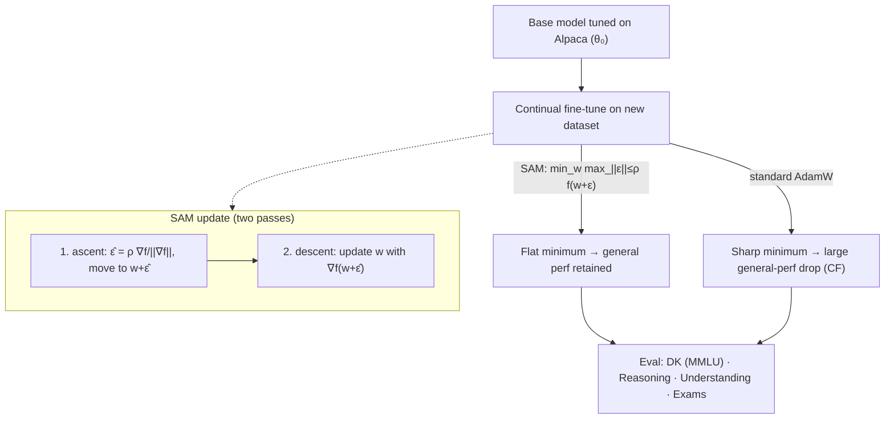

# Revisiting Catastrophic Forgetting in Large Language Model Tuning — Li et al., 2024

> **arXiv:** 2406.04836v1 · **Venue:** Findings of EMNLP 2024 · **Affiliation:** Wuhan University · University of Sydney · University of Liverpool · Nanyang Technological University

## TL;DR
This paper reveals a **direct link between the flatness of an LLM's loss landscape and how much it
catastrophically forgets** during fine-tuning: sharper minima = more forgetting. It then turns that
diagnosis into a cure — apply **Sharpness-Aware Minimization (SAM)** to flatten the landscape, which
markedly reduces forgetting, helps **more as the model grows** (TinyLlama-1.1B → Llama2-13B), and is
**orthogonal** to existing anti-forgetting tricks (rehearsal, Wise-FT), stacking with them for extra
gains. It is the optimizer-level answer to *why* small-LR / gentle updates preserve general ability.

## Problem & motivation
Fine-tuning an LLM on new data erodes previously acquired general knowledge — catastrophic
forgetting (CF). Existing remedies attack CF from the **data** side (rehearsal/replay) or the
**model** side (weight averaging like Wise-FT), but both are costly or impractical: pretraining data
cards are often unavailable (so replay is infeasible) and anti-forgetting training is unstable and
expensive. The authors seek a **cheap, stable, orthogonal, optimization-level** solution — and first
ask *what property of the tuned model actually predicts CF*. Their answer: the **geometry of the loss
landscape (LLS)**.

## Key idea
**Diagnosis — flatness predicts forgetting.** Visualize the 2-D loss surface around trained weights
$\theta_0$:

$$
f(\alpha,\beta)=\mathcal{L}\big(\theta_0+\alpha\,\delta_1+\beta\,\delta_2\big),
$$

where $\mathcal{L}$ is the loss, $\alpha,\beta$ are scalar coordinates, and $\delta_1,\delta_2$ are
two Gaussian random direction vectors. As the **gap between the continually-learned tasks grows**,
the landscape becomes visibly **sharper** and CF worsens — a high positive correlation quantified by
three flatness metrics: **Surface Curvature (SC)**, **Average Gradient (AG)**, and **Mean Absolute
Gradient (MAG)** — lower = flatter = less forgetting.

**Cure — flatten the landscape with SAM.** Sharpness-Aware Minimization minimizes the *worst-case*
loss in a neighborhood ball of radius $\rho$ around the weights $w\in\mathbb{R}^d$:

$$
\min_{w}\ \max_{\lVert\epsilon\rVert_2\le\rho}\ f(w+\epsilon).
$$

A first-order Taylor expansion gives the maximizing perturbation
$\hat\epsilon=\rho\,\dfrac{\nabla_w f(w)}{\lVert\nabla_w f(w)\rVert_2}$, reducing the objective to

$$
\min_{w}\ f\!\left(w+\rho\,\frac{\nabla_w f(w)}{\lVert\nabla_w f(w)\rVert_2}\right),
$$

solved by a **two-step gradient descent**: (1) compute $\hat\epsilon$ from the gradient at $w$ and
perturb to $w+\hat\epsilon$ (the "ascent" step); (2) take the actual descent step using the gradient
evaluated at $w+\hat\epsilon$. Because each SAM update needs **two forward/backward passes**, the
paper compares fairly at **equal compute** (SAM: 1 epoch; non-SAM: 2 epochs). Suggested $\rho=2$.

## How it works




### Setup (§4)
- **Baseline:** Llama2 tuned on **Alpaca** (Taori et al.), reproduced to match the public Alpaca
  model, then continually fine-tuned on a second dataset.
- **Continual datasets (increasing gap):** ShareGPT52K, **Open-Platypus** (24.9K), **MetaMathQA**
  (395K), **Auto-Wiki**.
- **Models:** TinyLlama-1.1B, Llama2-7B, Llama2-13B.
- **Eval categories:** Domain Knowledge (MMLU), Reasoning (SuperGLUE AX-b/AX-g/RTE/COPA, Hellaswag,
  BoolQ, SIQA), Understanding (RACE, OpenBookQA, CSL), Exams (ARC-c, TruthfulQA).
- **Optimizer:** AdamW baseline; fair-compute comparison uses **w/o SAM: 2 epochs, lr 5e-6**;
  **w/ SAM: 1 epoch, lr 5e-6**, batch 128, on 16×A800; $\rho=2$.

## Training / data
No new pretrained model; SAM is a drop-in optimizer wrapper over standard instruction tuning.
Flatness metrics SC/AG/MAG are defined in Appendix A.3 over the 2-D loss grid. Code is released.

## Results
From the paper (Table 2). Values are average general-task performance (%); **Δ** is the change
relative to the Alpaca baseline (negative = forgetting). "w/o" = standard tuning, "w/" = with SAM.

| Experiment | Setting | Δ w/o SAM | Δ w/ SAM | Source |
|---|---|---:|---:|---|
| Different datasets (Llama2-7B) | ShareGPT52K | −6.08 | **+5.71** | §5, Table 2a |
| | Open-Platypus | −6.70 | **+7.01** | §5, Table 2a |
| | MetaMathQA | −6.80 | **+3.79** | §5, Table 2a |
| Model size (Open-Platypus) | TinyLlama-1.1B | +0.18 | −0.22 | §5, Table 2b |
| | Llama2-7B | −6.70 | **+7.01** | §5, Table 2b |
| | Llama2-13B | −9.33 | **+9.78** | §5, Table 2b |
| Vs. other methods (Llama2-7B) | SAM | — | **+7.01** | §5, Table 2c |
| | Wise-FT | −0.88 | +0.97 | §5, Table 2c |
| | Rehearsal | −3.83 | +3.02 | §5, Table 2c |

Three takeaways: (1) **SAM converts forgetting into net gains** across datasets and turns a −6/−7
drop into a +4/+7 improvement; (2) **CF worsens with model size** (Llama2-13B loses the most without
SAM, −9.33) and **SAM helps most at scale** (+9.78); (3) SAM **beats** standalone Wise-FT and
rehearsal *and* **combines** with them for incremental benefit (Wise-FT+SAM +0.97, Rehearsal+SAM
+3.02), confirming orthogonality.

## Limitations & follow-ups
- **Scope = flatness only.** The study isolates the loss-landscape/CF link; other CF factors are not
  comprehensively explored.
- **Fine-tuning stage only.** It does not address CF from post-deployment updates or pretraining.
- **2× cost per step.** SAM's double forward/backward is amortized here by halving epochs, but is an
  intrinsic overhead.
- **Why it matters here.** This is the optimizer-level *mechanism* behind
  [LCLM](../context/ctx_compression.md)'s gentle staged tuning: keeping the decoder in a **flat
  region** (small LR, staged unfreeze) preserves general ability, and SAM-style flattening is
  orthogonal to LCLM's **data-mix replay** — exactly the "combine with rehearsal" result here. It
  complements the scale-amplifies-forgetting finding of
  [Luo et al.](forgetting_2023_continual-ft.md). See the repo's
  [continual-training thread](../context/forgetting/forgetting.md).

## Links
- **arXiv:** [abs](https://arxiv.org/abs/2406.04836) · [html](https://arxiv.org/html/2406.04836v1) · [pdf](https://arxiv.org/pdf/2406.04836)
- **Code:** [github.com/Li-Hyn/LLM_CatastrophicForgetting](https://github.com/Li-Hyn/LLM_CatastrophicForgetting)
- **BibTeX:**
  ```bibtex
  @inproceedings{li2024revisiting,
    title     = {Revisiting Catastrophic Forgetting in Large Language Model Tuning},
    author    = {Li, Hongyu and Ding, Liang and Fang, Meng and Tao, Dacheng},
    booktitle = {Findings of the Association for Computational Linguistics: EMNLP 2024},
    year      = {2024}
  }
  ```
- **Related papers:** [Empirical Study of CF in Continual FT](forgetting_2023_continual-ft.md) · [LoRA](https://arxiv.org/abs/2106.09685)
- **In-repo:** [Continual training & forgetting thread](../context/forgetting/forgetting.md) · [LCLM context-compression survey](../context/ctx_compression.md) · [Multimodal / VLM alignment thread](../context/multimodal/multimodal.md)
