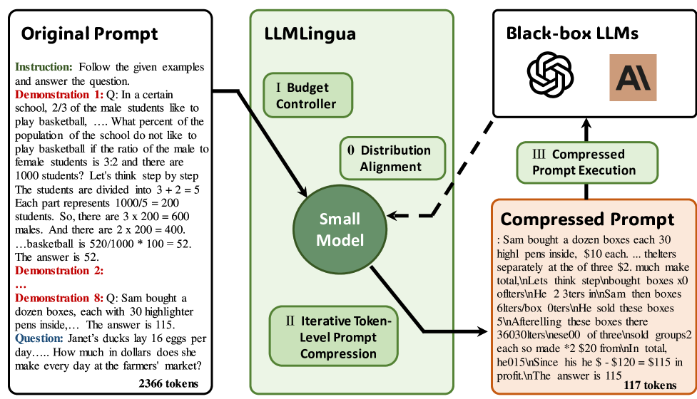
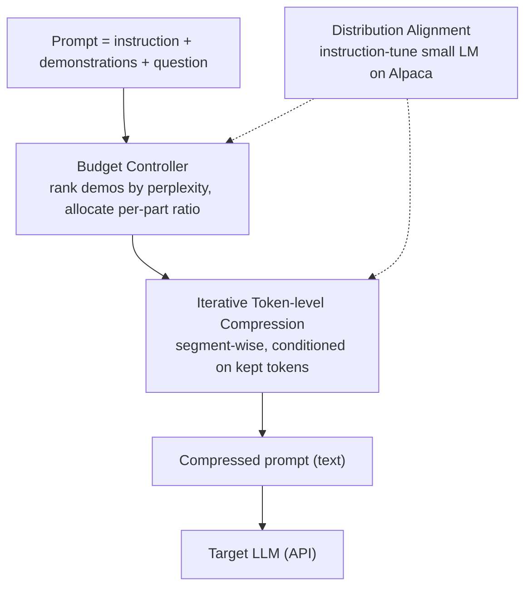
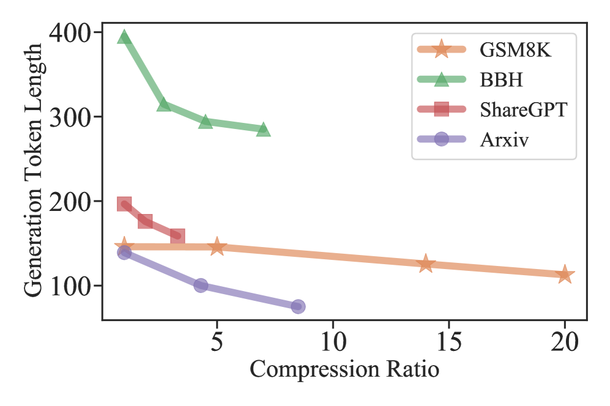

# LLMLingua: Coarse-to-Fine Prompt Compression — Jiang et al., 2023

> **arXiv:** 2310.05736 · **Title:** *LLMLingua: Compressing Prompts for Accelerated Inference of
> Large Language Models* · **Authors:** Huiqiang Jiang, Qianhui Wu, Chin-Yew Lin, Yuqing Yang,
> Lili Qiu (Microsoft) · **Venue:** EMNLP 2023 · **Code:** github.com/microsoft/LLMLingua

## TL;DR
LLMLingua compresses prompts up to **20×** with almost no accuracy loss by combining three parts:
(1) a **budget controller** that hands out *different* compression ratios to the instruction,
demonstrations, and question; (2) **iterative token-level prompt compression (ITPC)** that prunes
tokens by perplexity while conditioning on already-kept tokens, so it doesn't break reasoning
chains; and (3) **distribution alignment** that instruction-tunes the small compressor LM to match
the target black-box LLM. On GSM8K it holds **77.3 EM at 20×** (vs. 48.8 zero-shot) and cuts API
cost up to **90 %**.

## Problem & motivation
Chain-of-thought and in-context learning make prompts long → high latency, high API cost, and
context-window pressure — and many target LLMs are **API-only**, so you cannot touch their weights.
Prior work ([Selective Context](hardtoken_2023_selective-context.md)) scored phrases by self-
information but treated tokens **independently** and ignored the mismatch between the *small
scoring LM* and the *target LLM*. Naive perplexity pruning at high ratios shreds multi-step
reasoning. LLMLingua argues you need **coarse structure first, fine pruning second**, plus an
alignment step so the small LM's perplexities are actually relevant to the target.

## Key idea
A **coarse-to-fine** pipeline driven by a small LM:
- **Coarse (demonstration-level):** rank demonstrations by perplexity and greedily keep the most
  informative ones until the budget is hit — instructions/questions get a *low* compression ratio
  (they carry task logic), demonstrations a *high* one (they're redundant).
- **Fine (token-level, iterative):** segment the surviving prompt and prune tokens segment-by-
  segment, each token's keep/drop decision **conditioned on previously compressed tokens** — this
  preserves inter-token dependencies a single global pass would destroy.
- **Alignment:** instruction-tune the small LM on Alpaca so its output distribution tracks the
  target LLM, making its perplexity estimates trustworthy.

*Figure 1 — The three-stage pipeline: the **budget controller** allocates per-component ratios and
selects high-perplexity demonstrations; **ITPC** prunes tokens segment-by-segment under a dynamic
threshold; and **distribution alignment** keeps the small compressor LM in sync with the target
LLM. Output is a shorter plain-text prompt.*

## How it works (reimplementation-grade walkthrough)
Split the prompt into $\mathbf{x}=(\mathbf{x}_{\text{ins}},\mathbf{x}_{\text{dems}},\mathbf{x}_{\text{que}})$
with target overall ratio $\tau$.

1. **Budget allocation.** Derive the demonstrations' ratio from the global budget minus what the
   instruction/question consume:
   $$\tau_{\text{dems}} = \frac{\tau L - (\tau_{\text{ins}} L_{\text{ins}} + \tau_{\text{que}} L_{\text{que}})}{L_{\text{dems}}}.$$
   Score each demonstration's perplexity with the small LM, rank descending, greedily keep until
   $L_{\widetilde{\mathcal D}} > k\,\tau_{\text{dems}}L_{\text{dems}}$ ($k$ = granularity coeff.,
   ≈2), then **return the unused budget** to instruction+question:
   $$\Delta\tau = \frac{k\,\tau_{\text{dems}}L_{\text{dems}} - L_{\widetilde{\mathcal D}}}{L_{\text{ins}}+L_{\text{que}}}.$$
2. **Iterative token compression (ITPC).** Cut the prompt into segments (~100 tokens). For segment
   $\mathbf s_j$, evaluate token likelihood **conditioned on already-compressed prefixes**:
   $$p(\mathbf s_j) \approx \prod_i p\big(s_{j,i}\mid s_{j,<i},\, \mathbf s_{\widetilde{<j}}\big),$$
   pick a per-segment perplexity threshold $\gamma_j$ from the target ratio for that component
   (Eq. 6), and **keep** the informative tokens:
   $$\mathbf s_{\widetilde j} = \{\, s_{j,i} \mid p(s_{j,i}) > \gamma_j \,\}.$$
3. **Concatenate** surviving tokens into the final compressed prompt and send it to the target LLM.

The whole thing minimizes the divergence between the target LLM's outputs on compressed vs.
original prompts:
$$\min_{\widetilde{\mathbf x},\,\tau}\ \mathrm{KL}\!\big(P(\widetilde{\mathbf x}^{G}\mid \widetilde{\mathbf x})\,\big\|\,P(\mathbf x^{G}\mid \mathbf x)\big),$$
and the alignment step trains the small LM's parameters $\boldsymbol\theta_s$:
$$\min_{\boldsymbol\theta_s}\ \mathbb E\Big[\tfrac1N\sum_{i}\mathcal L\big(\mathbf x_i,\mathbf y_i^{\text{LLM}};\boldsymbol\theta_s\big)\Big].$$

## Training / data
- **Small compressor LM:** Alpaca-7B (primary) or GPT2-Alpaca (weaker but works), instruction-
  tuned on the 52K-pair Alpaca set (8 epochs, LR 1e-4, AdamW, ~150 min on one V100-32G).
- **Target LLMs:** GPT-3.5-Turbo-0301 (primary), Claude-v1.3 (generalization); greedy, temp 0.
- **Evaluation:** GSM8K (math CoT, EM), BBH (23 reasoning subtasks, EM), ShareGPT (conversation),
  Arxiv-March23 (summarization) — all fresh/unseen; BLEU/ROUGE/BERTScore for the generation tasks.

## Results
| Benchmark | Constraint | Method | Metric | Ratio |
|---|---|---|---:|---:|
| GSM8K | 1-shot | Selective Context | 53.98 EM | 5× |
| GSM8K | 1-shot | **LLMLingua** | **79.08 EM** | 5× |
| GSM8K | ¼-shot | **LLMLingua** | **77.33 EM** | **20×** |
| GSM8K | zero-shot | (instruction only) | 48.75 EM | 215× |
| BBH | 1-shot | **LLMLingua** | **70.11 EM** | 3× |
| Arxiv | — | **LLMLingua** | 90.33 BERTScore | 4× |

- **In-context learning survives extreme compression:** 77.3 EM at **20×** vs. 48.8 zero-shot
  (+28.6) — the demonstrations' *signal* is preserved even when their *tokens* are mostly gone.
- **Speedup & cost:** end-to-end 8.6 s → 1.3 s at 10× (5.7×); GSM8K API cost −90.4 %, Arxiv −84.6 %.
- **Ablations (GSM8K 1-shot, 5×):** removing ITPC −6.15 EM, removing budget controller −5.46 EM,
  random demo selection −6.30 EM, uniform ratio −1.82 EM, no alignment −0.56 EM → **ITPC and the
  budget controller are the load-bearing parts**; alignment is a small extra.
- **Recoverable structure:** GPT-4 can reconstruct a **9-step** chain-of-thought from a 17×
  compressed prompt — the fragments still encode the reasoning skeleton.

*Figure 2 — As the compression ratio rises, GPT-3.5-Turbo's **generation length** trends downward
across GSM8K/BBH/ShareGPT/Arxiv — compression saves compute on the output side too, not just the
input.*

## Limitations & follow-ups
- **Extreme ratios (25–30×)** eventually degrade all methods; LLMLingua just pushes the cliff
  farther out.
- **Tokenizer mismatch** between the small LM and the target LLM can misestimate the true target
  length.
- **Query-agnostic:** it doesn't condition on the question — great for **reuse** across queries,
  but leaves relevance signal on the table. [LongLLMLingua](hardtoken_2024_longllmlingua.md) adds
  exactly that (question-aware coarse+fine scoring, document reordering) for long-context RAG.
- **Relation to the thread.** LLMLingua is the **budgeted, iterative** successor to
  [Selective Context](hardtoken_2023_selective-context.md): same small-LM signal, but structured
  and dependency-aware. It stays extractive; [NL-Prompt](hardtoken_2024_nlprompt.md) and
  [CompAct](hardtoken_2024_compact.md) go abstractive. See the
  [hard-token thread](../context/hard_token/hard_token.md) and the
  [context-compression review](../context/ctx_compression.md).

## Links
- **arXiv:** [abs](https://arxiv.org/abs/2310.05736) · [html](https://arxiv.org/html/2310.05736v2) · [pdf](https://arxiv.org/pdf/2310.05736)
- **Code:** https://github.com/microsoft/LLMLingua (aka.ms/LLMLingua)
- **Venue:** EMNLP 2023
- **Related papers:** [Selective Context](hardtoken_2023_selective-context.md) · [LongLLMLingua](hardtoken_2024_longllmlingua.md) · [NL-Prompt](hardtoken_2024_nlprompt.md) · [CompAct](hardtoken_2024_compact.md) · [hard-token thread](../context/hard_token/hard_token.md)
