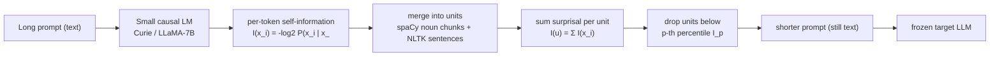

# Selective Context: Pruning Prompts by Self-Information — Li et al., 2023

> **arXiv:** 2310.06201 · **Title:** *Compressing Context to Enhance Inference Efficiency of
> Large Language Models* · **Authors:** Yucheng Li, Bo Dong, Chenghua Lin, Frank Guerin
> (Surrey / Manchester) · **Venue:** EMNLP 2023 · **Code:** github.com/liyucheng09/Selective_Context

## TL;DR
Selective Context is the **first clean "prune by information content"** prompt compressor. It
scores every lexical unit (token → noun phrase → sentence) by its **self-information**
$-\log_2 P(x_i\mid x_{<i})$ under a *small* causal LM, then **drops the least-informative units**
below a percentile threshold, concatenating the survivors back into readable plain text. At a
**50 % reduction** it cuts inference **memory 36 %** and **latency 32 %** while losing only
**0.023 BERTScore-F1** (0.887 vs. 0.909) across summarization, QA, reconstruction, and
conversation — and it beats random deletion by a wide margin. The compressed prompt is still text,
so any frozen LM reads it unchanged.

## Problem & motivation
Transformer self-attention is $O(n^2)$ in memory and compute, context windows are fixed (long
inputs get truncated), and API/latency cost grows with prompt length. Yet natural language is
**redundant** in two ways: (1) inherent linguistic redundancy useful for *human* comprehension
but unnecessary for an LM, and (2) content the LM already **memorized during pretraining**. The
core claim: units an LM finds *highly predictable* (low self-information) carry little new signal
and can be deleted with minimal impact on the LM's output.

## Key idea
Measure informativeness with **self-information** (surprisal) from a compact base LM, aggregate it
to readable units so the pruned prompt stays grammatical, and filter with an **adaptive percentile
threshold** so the same knob works across inputs of any length. The method is **query-agnostic**,
**model-agnostic**, and **training-free** — a pure text→shorter-text transform, complementary to
architectural tricks (sparse attention, distillation).

## How it works (reimplementation-grade walkthrough)
1. **Per-token self-information.** Run a small causal LM $M$ (GPT-3 *Curie* for OpenAI targets;
   LLaMA-7B for Meta targets) over the context and read off, for each token,
   $$I(x_i) = -\log_2 P(x_i \mid x_0, x_1, \dots, x_{i-1}).$$
   Process **sentence-by-sentence** to avoid the positional bias where later tokens systematically
   receive lower surprisal.
2. **Merge tokens into lexical units.** Use spaCy `merge_noun_chunks()` for noun phrases and the
   NLTK sentence tokenizer for sentences (verb phrases are excluded — no mature tokenizer). By the
   **additivity of self-information**, a unit $u=[x_t,\dots,x_{t+\alpha}]$ scores
   $$I(u) = \sum_{i=t}^{t+\alpha} I(x_i).$$
3. **Percentile filtering.** Rank all units by $I(u)$ and compute the $p$-th percentile threshold
   $$I_p = \operatorname{percentile}\big([\,I(u_0),\dots,I(u_k)\,],\, p\big),$$
   then **keep only** the units at or above it:
   $$C' = \{\,U_i \mid I(U_i) \ge I_p\,\}.$$
   E.g. $p=50$ removes the bottom half of *units*, yielding ~57 % of tokens retained (~43 % saved).
4. **Reconstruct.** Concatenate the retained units in original order — no post-processing; phrase/
   sentence boundaries keep the result readable and feedable to any frozen LM.

The additivity used above follows directly from the chain rule of surprisal:
$$I(x_0,x_1) = -\log_2 P(x_0) - \log_2 P(x_1\mid x_0) = I(x_0) + I(x_1).$$
For reference, mean self-information is entropy and its exponential is perplexity:
$$H(S)=\tfrac{1}{N}\sum_t I(x_t), \qquad PP(S)=2^{H(S)}.$$



Self-information heat-map intuition (Figure 2 in the paper): darker = higher surprisal = kept.

```
The  ██transformer██  ██architecture██  has  ██revolutionized██  ██NLP██ ,  and  it  is
▁low  ██████high██████  ██████high██████  ▁low ██████high██████  █high█  ▁    ▁low  ▁   ▁
                      └──────── kept (informative) ────────┘        └── dropped (predictable) ──┘
```

## Training / data
- **Scorer LMs (frozen, no training):** GPT-3 Curie for OpenAI targets; LLaMA-7B for all Meta/
  Vicuna targets (held fixed across model sizes).
- **Datasets:** BBC News (full articles), arXiv papers (first two sections only, to stay ≤2048
  tokens), and ShareGPT conversations. All test samples created **after March 2023** to avoid
  train-set contamination; max context 2048 tokens.
- **Target LLMs:** GPT-3.5, GPT-4, LLaMA-7B/13B/30B, Vicuna-7B/13B.
- **Tasks / metrics:** summarization, QA, original-context reconstruction, conversation; scored
  with BLEU, METEOR, ROUGE-1/L, BERTScore-F1.

## Results
| Reduction ratio | BERTScore-F1 drop | ROUGE-L drop | Notes |
|---|---:|---:|---|
| 0.20 | 0.007 | 0.03 | negligible |
| 0.35 | 0.013 | 0.08 | good balance |
| **0.50** | **0.023** | 0.12 | sweet spot |
| 0.65 | 0.032 | 0.20 | degrading |
| 0.80 | 0.044 | 0.27 | not recommended |

- **Efficiency @ 0.5:** CUDA memory 77 695 → 61 885 MB (**−36 %**); latency 110.8 → 76.3 ms/token
  (**−32 %**, 1.32×); self-information preprocessing only ~46 ms.
- **Beats random deletion:** at 0.5, Selective Context 0.900 vs. random 0.873 BERTScore-F1 —
  informed pruning at 50 % beats random pruning at 20 %.
- **Faithfulness (GPT-3.5 QA):** unfaithful tuples rise gently 2.7 % → 3.8 % → 5.1 % across
  ratios 0.2 / 0.5 / 0.65.
- **Best unit is the phrase:** phrase-level > token-level > sentence-level (sentences too coarse
  and unstable).
- **Instruction-tuning helps robustness:** base LLaMA "goes wild" under compression; instruct-
  tuned Vicuna follows the compressed prompt far more reliably — model *size* alone does not
  determine robustness.

## Limitations & follow-ups
- **Phrase boundaries** rely on spaCy noun-chunking and ignore verb phrases; dependency-tree
  filtering could sharpen unit boundaries.
- **The percentile $p$ is task-dependent** (summarization vs. reconstruction differ) and hand-
  tuned — no adaptive threshold selection.
- **Generalization** tested only on post-March-2023 data; behavior on well-known older corpora is
  unclear.
- **Relation to the thread.** Selective Context is the **origin point** of the hard-token family:
  query-agnostic, extractive, small-LM-scored. [LLMLingua](hardtoken_2023_llmlingua.md) keeps the
  small-LM-surprisal signal but adds a **budget controller** and **iterative** pruning to fix the
  independence assumption here; [LongLLMLingua](hardtoken_2024_longllmlingua.md) makes it
  **question-aware**; [NL-Prompt](hardtoken_2024_nlprompt.md) and
  [CompAct](hardtoken_2024_compact.md) move from *deleting* to *rewriting* tokens. See the
  [hard-token thread](../context/hard_token/hard_token.md) and the
  [context-compression review](../context/ctx_compression.md).

## Links
- **arXiv:** [abs](https://arxiv.org/abs/2310.06201) · [html](https://arxiv.org/html/2310.06201v1) · [pdf](https://arxiv.org/pdf/2310.06201)
- **Code:** https://github.com/liyucheng09/Selective_Context
- **Venue:** EMNLP 2023
- **Related papers:** [LLMLingua](hardtoken_2023_llmlingua.md) · [LongLLMLingua](hardtoken_2024_longllmlingua.md) · [NL-Prompt](hardtoken_2024_nlprompt.md) · [CompAct](hardtoken_2024_compact.md) · [hard-token thread](../context/hard_token/hard_token.md)
