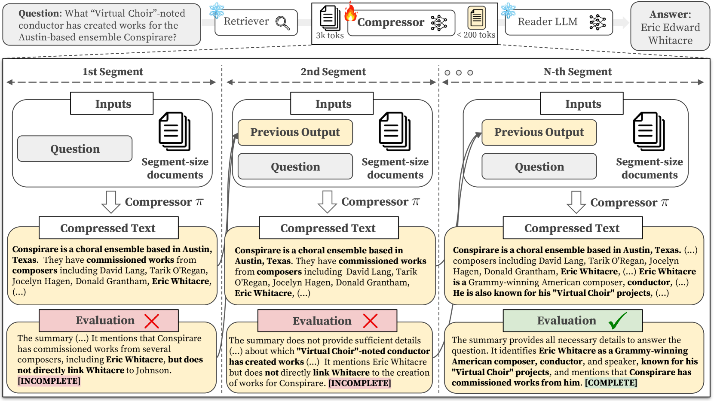
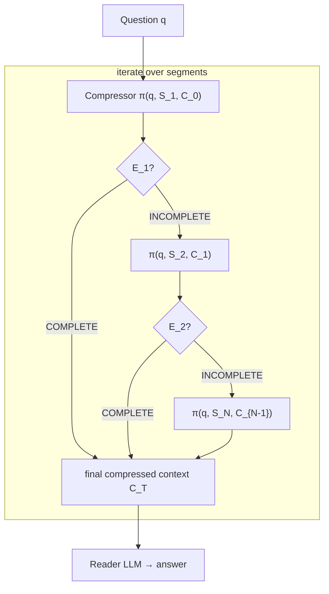
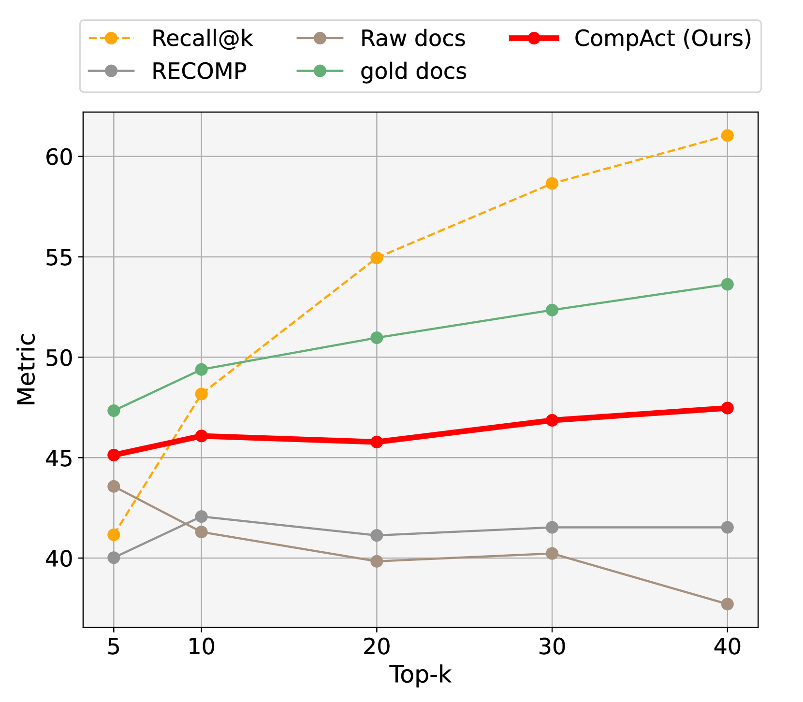

# CompAct: Actively Compressing Retrieved Documents for QA — Yoon et al., 2024

> **arXiv:** 2407.09014 · **Title:** *CompAct: Compressing Retrieved Documents Actively for
> Question Answering* · **Authors:** Chanwoong Yoon, Taewhoo Lee, Hyeon Hwang, Minbyul Jeong,
> Jaewoo Kang (Korea University / AIGEN Sciences) · **Venue:** EMNLP 2024

## TL;DR
CompAct is an **iterative, query-aware, abstractive** document compressor for retrieval-augmented
QA. It processes retrieved documents **segment-by-segment**, maintaining an evolving compressed
context and, at each step, emitting a rationale plus a **[COMPLETE]/[INCOMPLETE]** signal that
**early-terminates** once enough information is gathered. Fine-tuned on Mistral-7B, it reaches
**~47× compression** while *beating* [RECOMP] and [LongLLMLingua](hardtoken_2024_longllmlingua.md)
on multi-hop QA — because it can **integrate evidence across document boundaries**, which single-
shot compressors can't. It's a drop-in module between any retriever and any reader.

## Problem & motivation
RAG improves factuality but readers **fail to locate key facts** in long, noisy retrieved context
(lost-in-the-middle), and — crucially — **multi-hop** questions need evidence *scattered across
several documents* stitched together. Single-step compressors (RECOMP one-shot extraction, or
[LongLLMLingua](hardtoken_2024_longllmlingua.md) token pruning) can't consolidate cross-document
information, and hard filtering risks dropping a needed hop. Also, 77.5 % of popular HuggingFace
models accept ≤512 tokens, so aggressive compression is practically necessary.

## Key idea
**Active compression + early termination.** Given question $q$ and $k$ documents, split them into
segments of $j$ documents (default $j{=}5$) and iterate: the compressor jointly reads the
*previous compressed context* $C_{t-1}$ and the *new segment* $S_t$, producing an updated context
$C_t$ **and** an evaluation $E_t$ (rationale + condition token). The loop **stops** the moment
$E_t$ is `[COMPLETE]`, so easy questions finish in one step and hard ones accumulate evidence
across segments — no wasted iterations, no distracting context compressed in.



*Figure 2 — CompAct sits between retriever and reader. Segment 1 yields a compressed summary but
the evaluation is `[INCOMPLETE]` (missing the "Virtual Choir" link); segment 2 still
`[INCOMPLETE]`; by the N-th segment the accumulated context is `[COMPLETE]` and the reader answers.
Each step **jointly analyzes the previous output with the new segment**, preserving query-relevant
facts across document boundaries.*

## How it works (reimplementation-grade walkthrough)
Objective — pick the compressor $\pi$ that maximizes the reader $M$'s answer likelihood under a
tiny token budget:
$$\arg\max_{\pi}\ P_M\big(y \mid C_\pi, x\big),\qquad C_\pi = \pi(q, D_k),\quad l(C_\pi)\ll l(D_k).$$

The iterative update at step $t$ (segment $S_t$, prior context $C_{t-1}$):
$$C_t,\, E_t = \pi\big(q,\, S_t,\, C_{t-1}\big),\qquad S_t = \{\,d_{(t-1)j+1},\dots,d_{(t-1)j+j}\,\}.$$

```
Input: question q, top-k docs D_k, segment size j (=5)
C_0 ← ""                              # empty compressed context
for t = 1 .. ceil(k/j):
    S_t ← next j documents
    (C_t, E_t) ← Compressor(q, S_t, C_{t-1})   # summary <200 words, no pronouns, "summarize only"
    if E_t.token == [COMPLETE]:
        return C_t                     # early termination
return C_t
```

- **First iteration** prompt: summarize the segment to answer $q$ (<200 words, no pronouns, "do
  not assume or answer — summarize only"), then print `[COMPLETE]`/`[INCOMPLETE]` + rationale.
- **Later iterations** also receive the previous summary $C_{t-1}$ and previous evaluation
  $E_{t-1}$ (which flags what was missing), so the model *grows* the compressed context.
- **Output** $C_T$ goes to a frozen reader LLM exactly as if it were the full retrieved context.



## Training / data
- **Compressor:** Mistral-7B-Instruct-v0.2, **supervised fine-tuning** on a **GPT-4o-built
  dataset** from HotpotQA (Contriever over 2018 Wikipedia): GPT-4o (1) selects clue sentences,
  (2) summarizes them <200 words ("do not answer, summarize only"), (3) emits the completeness
  token + rationale. 28.8K balanced instances (realistic + distractor incl. gold docs).
- **Setup:** 4× A100-80G, LR 2e-6, batch 64, 7 epochs, 700-token generation cap.
- **Eval:** multi-hop HotpotQA / MuSiQue / 2WikiMultiHopQA; single-hop NQ / TriviaQA (zero-shot);
  top-$k{=}30$ (≤6 iterations at $j{=}5$); readers incl. LLaMA3-8B, GPT-3.5/4o, Claude-3.5, Gemini.

## Results
| Dataset | Metric | Raw docs | RECOMP | LongLLMLingua | **CompAct** |
|---|---|---:|---:|---:|---:|
| HotpotQA | F1 / comp. | 40.3 / 1× | 39.9 / 34× | 35.3 / 3.4× | **46.9 / 47.6×** |
| MuSiQue | F1 | 15.6 | 15.7 | 13.5 | **18.1** |
| 2WikiMQA | F1 / comp. | 31.2 / 1× | 34.9 / 36× | 32.9 / 3.6× | **37.1 / 51.2×** |
| NQ (single-hop) | F1 | 51.3 | 45.1 | 40.6 | **50.0** |
| TriviaQA | F1 | 77.1 | 74.1 | 70.8 | 74.9 |

- **Multi-hop is the win:** +7.0 F1 over RECOMP on HotpotQA at a *higher* compression rate, because
  CompAct integrates evidence across segments rather than filtering each in isolation.
- **~47–51× compression** consistently (vs. RECOMP 32–39×, LongLLMLingua 3–4×); single-hop stays
  competitive with raw documents (NQ 38.4 vs. 39.0 EM).
- **Cost:** on GPT-4o reader, $10.75→$0.28 (HotpotQA 500-sample) while *improving* F1 55.8→56.0.
- **Cost of the win = latency:** compression dominates runtime (147.9 ms/example at 5 docs/segment)
  — doubling the segment to 10 docs halves it (77.2 ms) for a small F1 dip (47.3→45.4).
- **Leverages lower-ranked docs:** its F1-vs-top-$k$ curve parallels the *oracle* (gold docs),
  unlike baselines that plateau as noise grows.



*Figure 1 — HotpotQA F1 as top-$k$ grows (LLaMA3-8B reader): CompAct tracks the **gold-document**
oracle, showing it extracts signal even from lower-ranked, noisier retrievals — where other
compressors stall.*

## Limitations & follow-ups
- **Latency:** the iterative compressor is ~2–150× slower than one-shot RECOMP; a stronger
  retriever (relevant docs early → earlier `[COMPLETE]`) would help.
- **Single base model** (Mistral-7B-Instruct) tested; smaller/larger compressors unexplored.
- **Synthetic-data quality:** even GPT-4o can misjudge completeness; possible label noise.
- **Relation to the thread.** CompAct is the **iterative, query-aware, abstractive** endpoint of
  this thread: it shares [NL-Prompt](hardtoken_2024_nlprompt.md)'s *rewrite-not-delete* stance and
  [LongLLMLingua](hardtoken_2024_longllmlingua.md)'s *question conditioning*, but uses a **full LM
  as the compressor** with an explicit stop signal — closer to the "summarize old context" memory
  primitive of agentic frameworks. Like the other query-aware methods, its compressed context is
  **not reusable** across queries. See the [hard-token thread](../context/hard_token/hard_token.md)
  and the [context-compression review](../context/ctx_compression.md).

## Links
- **arXiv:** [abs](https://arxiv.org/abs/2407.09014) · [html](https://arxiv.org/html/2407.09014v3) · [pdf](https://arxiv.org/pdf/2407.09014)
- **Venue:** EMNLP 2024
- **Related papers:** [Selective Context](hardtoken_2023_selective-context.md) · [LLMLingua](hardtoken_2023_llmlingua.md) · [LongLLMLingua](hardtoken_2024_longllmlingua.md) · [NL-Prompt](hardtoken_2024_nlprompt.md) · [hard-token thread](../context/hard_token/hard_token.md)

[RECOMP]: https://arxiv.org/abs/2310.04408 "RECOMP (Xu et al. 2023)"
