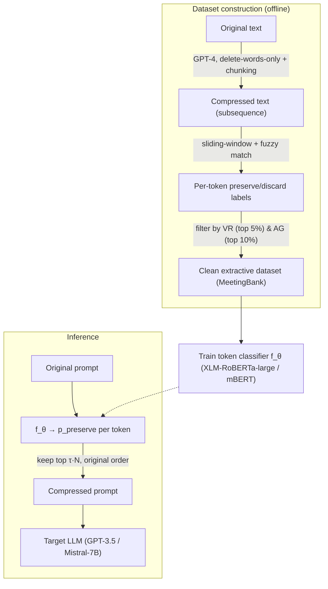

# LLMLingua-2: Data Distillation for Efficient and Faithful Task-Agnostic Prompt Compression — Pan et al., 2024

> **arXiv:** 2403.12968v2 · **Venue:** Findings of ACL 2024 · **Affiliation:** Tsinghua University · Microsoft Corporation

## TL;DR
LLMLingua-2 recasts **task-agnostic prompt compression** as **binary token classification**
(*preserve* vs *discard*) learned by a small **bidirectional** Transformer encoder (XLM-RoBERTa-large
or mBERT). Its training data is **distilled from GPT-4**: GPT-4 is instructed to compress text by
*deleting words only*, and an alignment algorithm turns each (original, compressed) pair into
per-token labels. Unlike its entropy-based predecessors [LLMLingua](hardtoken_2023_llmlingua.md) /
[Selective-Context](hardtoken_2023_selective-context.md), it **explicitly optimizes the compression
objective** with full bidirectional context, running **3–6× faster** than those methods (BERT-size vs
LLaMA-7B) while matching or beating them, and giving **1.6–2.9× end-to-end** speedups at 2–5×
compression.

## Problem & motivation
Long prompts (CoT, ICL, RAG) are expensive and can even *degrade* an LLM's perception. Task-agnostic
compressors delete low-information tokens so the result generalizes across tasks and black-box LLMs.
But the dominant approach — drop tokens by **information entropy** from a **causal** SLM (LLaMA-7B) —
has two flaws:

1. **Entropy is a proxy, not the objective.** Token perplexity is not aligned with "what can be
   removed without hurting the downstream LLM."
2. **Causal = unidirectional.** A left-to-right SLM cannot see the full context around a token, so it
   may misjudge importance.

LLMLingua-2 fixes both: **learn** the preserve/discard decision directly, from **bidirectional**
features, using data that encodes what a strong LLM (GPT-4) actually considers removable.

## Key idea
Two halves: **(A)** build a faithful extractive-compression dataset by distilling GPT-4, and **(B)**
train a token classifier that scores each word's *keep* probability.

**A. Data distillation (§3).** GPT-4 is prompted to compress under five strict rules — *only remove
unimportant words; don't reorder; don't change words; no abbreviations/emojis; no new words* — so the
output is a **subsequence** of the input (extractive, hence faithful). Long inputs are **chunked**
(≤512 tokens, ending on a sentence) to stop GPT-4 over-compressing. An **annotation** algorithm then
labels every original word *preserve/discard* by matching it to the compressed text via a **sliding
window** (handling reordering) and **fuzzy/lemmatized matching** (handling tense/plural changes). Two
**quality-control** filters clean the noisy GPT-4 output:

$$
\mathrm{VR}=\frac{1}{|\mathbb{S}_{comp}|}\sum_{w\in\mathbb{S}_{comp}}\mathbb{I}(w\notin\mathbb{S}_{ori}),
\qquad
\mathrm{AG}=\mathrm{HR}-\mathrm{MR},
$$

where the **Variation Rate** $\mathrm{VR}$ is the fraction of compressed words *absent* from the
original (a hallucination signal — drop the top 5%), and the **Alignment Gap** $\mathrm{AG}$ is the
difference between hitting rate $\mathrm{MR}=\frac{1}{|\mathbb{S}_{ori}|}\sum_{w\in\mathbb{S}_{ori}}\mathbb{I}(l(w)=\text{True})$
and matching rate (drop the top 10% — a perfect annotation has $\mathrm{AG}=0$).

**B. Token classifier (§4).** A Transformer encoder $f_\theta$ plus a linear head gives each word a
keep/drop distribution:
$$
\mathbf{h}=f_\theta(\mathbf{x}),\qquad p(x_i,\Theta)=\mathrm{softmax}(W h_i + b)\in\mathbb{R}^2,
$$
trained with cross-entropy against the distilled labels $\mathbf{y}$:
$$
\mathcal{L}(\Theta)=\frac{1}{N}\sum_{i=1}^{N}\mathrm{CrossEntropy}\big(y_i,\,p(x_i,\Theta)\big).
$$

**Compression strategy.** For a target ratio $1/\tau$ over $N$ words, keep $\tilde N=\tau N$ tokens:
predict each word's *preserve* probability $p_i$, keep the **top-$\tilde N$** by $p_i$, and **restore
their original order**. This is a drop-in replacement for LLMLingua's perplexity module inside its
coarse-to-fine budget controller (enabling ~15× on multi-doc prompts).

## How it works

![Figure 1 (LLMLingua-2): the pipeline. Step 1 Data Distillation — GPT-4 compresses the Original Text into Compressed Text by dropping words. Step 2 Data Annotation — each original word is labeled preserve (highlighted) or discard. Steps 3–4 Quality Control & Filtering then Train Compressor — a bidirectional token classifier learns per-token preserve probabilities. Step 5 Prompt Compression — at inference, tokens with the highest p_preserve are kept (in original order) to form the Compressed Prompt fed to the target LLM.](_assets/hardtoken_2024_llmlingua-2/framework.png)



## Training / data
- **Dataset:** distilled from **MeetingBank** meeting transcripts via GPT-4-32k (temperature 0.3,
  chunks ≤512 tokens, max 4096 output). Publicly released.
- **Compressor:** **XLM-RoBERTa-large** (355M → *LLMLingua-2*) or **multilingual-BERT** (110M →
  *LLMLingua-2-small*); 10 epochs, Adam, LR 1e-5, batch 10.
- **Target LLMs (frozen, black-box):** GPT-3.5-Turbo (default) and Mistral-7B.
- **Eval:** in-domain MeetingBank (QA + summary); out-of-domain LongBench, ZeroSCROLLS, GSM8K, BBH.

## Results
From the paper (Tables 1–5). Higher is better unless noted.

| Benchmark | Metric | LLMLingua-2 | LLMLingua | Original | Source |
|---|---|---|---|---|---|
| MeetingBank (in-domain) | QA F1 @ ~3× | **86.92** | 67.52 | 87.75 | §5, Table 1 |
| LongBench (out-of-domain, 2000-tok) | avg | **39.1** | 34.6 | 44.0 | §5, Table 2 |
| ZeroSCROLLS (2000-tok) | avg | **33.4** | 27.2 | 34.7 | §5, Table 2 |
| GSM8K (½-shot) | EM | **77.79** | 77.41 | 78.85 | §5, Table 3 |
| End-to-end latency @ 3× | speedup | **2.1×** | — | 1× | §5, Table 5 |
| Compressor GPU memory | peak | **2.1 GB** | 16.6 GB | — | §Appendix I |

Despite being a fraction of LLaMA-7B's size, LLMLingua-2 **beats the task-agnostic baselines** and
nears the original prompt; on Mistral-7B it even **exceeds** the original (shorter, denser prompts help
a weaker long-context model). It's **3–6× faster** than entropy-based compressors and uses **8× less
GPU memory**, and — thanks to its multilingual encoder — transfers from English training to **Chinese**
benchmarks. It trails **task-aware** [LongLLMLingua](hardtoken_2024_longllmlingua.md) on LongBench
(which exploits the question), but stays question-agnostic and reusable.

## Limitations & follow-ups
- **Single-domain training data.** Built only from MeetingBank; adding 50K TriviaQA-wiki examples
  helps only marginally — redundancy patterns seem to transfer across domains, so more data yields
  diminishing returns.
- **Task-agnostic ceiling.** Without the question, it can't match task-aware compressors on
  retrieval-heavy multi-doc QA (though it can be *combined* with LongLLMLingua's coarse stage).
- **Relation to neighbors.** LLMLingua-2 is the **learned, bidirectional** successor to entropy-based
  [LLMLingua](hardtoken_2023_llmlingua.md), [LongLLMLingua](hardtoken_2024_longllmlingua.md), and
  [Selective-Context](hardtoken_2023_selective-context.md) — still **hard-token** (it outputs real
  words, deployable on black-box LLMs), unlike the soft-token embedding compressors
  ([COCOM](softtoken_2024_cocom.md), [500xCompressor](softtoken_2024_500xcompressor.md)). See the
  repo's [hard-token compression thread](../context/hard_token/hard_token.md).

## Links
- **arXiv:** [abs](https://arxiv.org/abs/2403.12968) · [html](https://arxiv.org/html/2403.12968v2) · [pdf](https://arxiv.org/pdf/2403.12968)
- **Code:** [aka.ms/LLMLingua-2](https://aka.ms/LLMLingua-2) (part of [LLMLingua](https://github.com/microsoft/LLMLingua))
- **BibTeX:**
  ```bibtex
  @inproceedings{pan2024llmlingua2,
    title     = {{LLMLingua-2}: Data Distillation for Efficient and Faithful Task-Agnostic Prompt Compression},
    author    = {Pan, Zhuoshi and Wu, Qianhui and Jiang, Huiqiang and Xia, Menglin and Luo, Xufang and Zhang, Jue and Lin, Qingwei and R{\"u}hle, Victor and Yang, Yuqing and Lin, Chin-Yew and Zhao, H. Vivian and Qiu, Lili and Zhang, Dongmei},
    booktitle = {Findings of the Association for Computational Linguistics: ACL 2024},
    year      = {2024}
  }
  ```
- **Related papers:** [LLMLingua](hardtoken_2023_llmlingua.md) · [LongLLMLingua](hardtoken_2024_longllmlingua.md) · [Selective Context](hardtoken_2023_selective-context.md) · [COCOM](softtoken_2024_cocom.md) · [500xCompressor](softtoken_2024_500xcompressor.md)
- **In-repo:** [Hard-token compression thread](../context/hard_token/hard_token.md) · [MixedDecoder](../mixed_decoder/mixed_decoder.md) · [LCLM context-compression survey](../context/ctx_compression.md)
