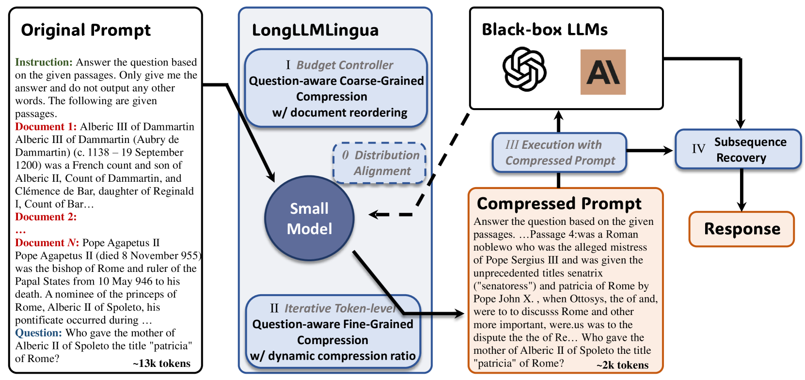
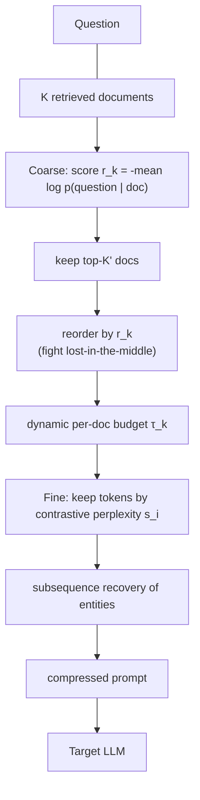
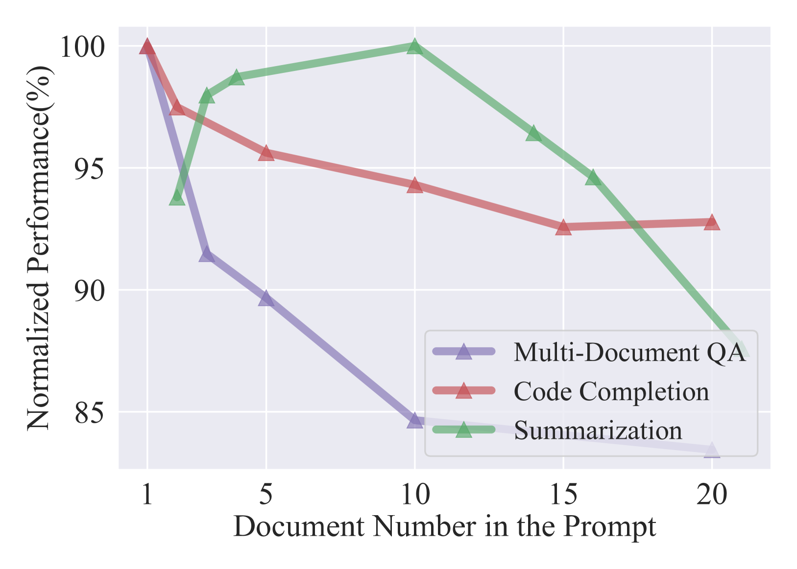
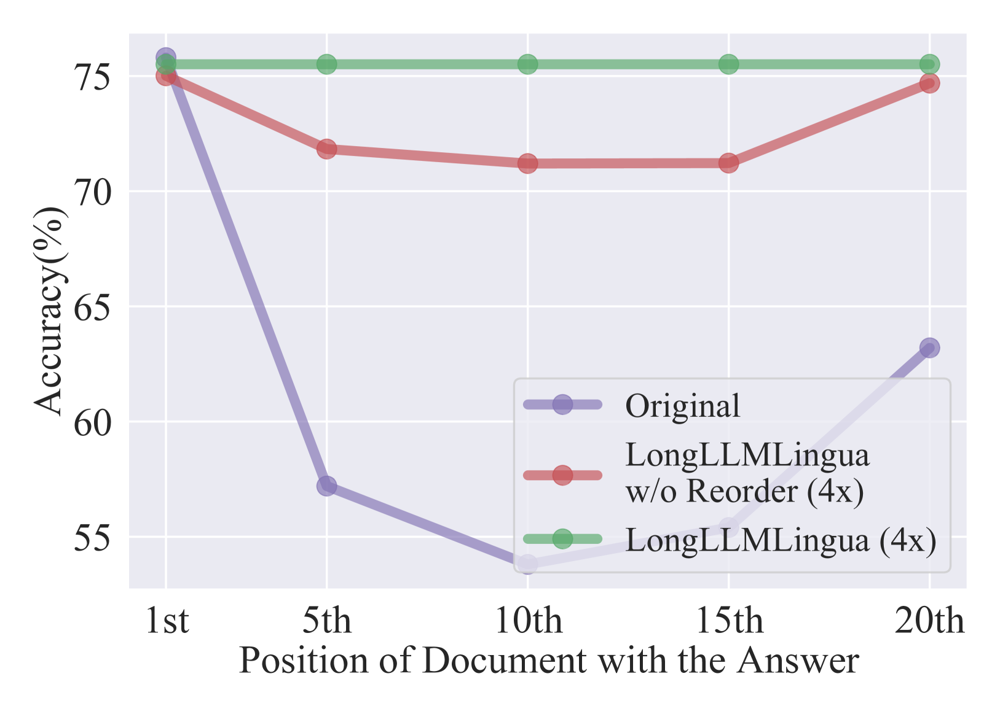

# LongLLMLingua: Question-Aware Prompt Compression for Long Context — Jiang et al., 2024

> **arXiv:** 2310.06839 · **Title:** *LongLLMLingua: Accelerating and Enhancing LLMs in Long
> Context Scenarios via Prompt Compression* · **Authors:** Huiqiang Jiang, Qianhui Wu, Xufang Luo,
> Dongsheng Li, Chin-Yew Lin, Yuqing Yang, Lili Qiu (Microsoft) · **Venue:** ACL 2024 ·
> **Code:** aka.ms/LongLLMLingua (github.com/microsoft/LLMLingua)

## TL;DR
LongLLMLingua makes [LLMLingua](hardtoken_2023_llmlingua.md) **question-aware** for long-context
RAG. It (1) scores each document by how well it *lets the small LM predict the question*
(contrastive/reversed conditioning), (2) prunes tokens by **contrastive perplexity** that spikes
on question-relevant content, (3) **reorders documents** by importance to defeat the
[lost-in-the-middle][lim] effect, (4) allocates a **dynamic per-document budget**, and (5) runs a
**subsequence-recovery** post-step to restore corrupted entities. Result: up to **+21.4 %**
accuracy on NaturalQuestions multi-doc QA at ~4× compression and up to **94 % API-cost** savings.

## Problem & motivation
Long prompts (RAG, multi-doc QA, agents) bring three problems at once: (1) higher cost/latency,
(2) **degraded accuracy** because irrelevant text dilutes key-information density, and (3) strong
**position bias** — LLMs read the beginning and end well but lose the middle. Pure information-
entropy compressors ([LLMLingua](hardtoken_2023_llmlingua.md),
[Selective Context](hardtoken_2023_selective-context.md)) are **query-agnostic**, so in a long
context with sparse, scattered relevant spans they keep the wrong tokens. Simply pasting the
question at the front doesn't fix which tokens get retained.

## Key idea
Put the **question in the loop** at every stage:
- **Question-aware coarse scoring** — instead of a document's own perplexity, score it by the
  perplexity of the *question* conditioned on that document (plus a restrictive statement), so
  documents that *answer* the question rank high.
- **Question-aware fine scoring (contrastive perplexity)** — keep tokens whose surprisal *drops*
  when the question is provided — those are the question-relevant ones.
- **Document reordering** — place the most important documents first, exploiting the LLM's
  beginning-of-sequence preference to counter lost-in-the-middle.
- **Dynamic budget** — give important documents more token budget (lower compression).
- **Subsequence recovery** — repair entities the token pruning fragmented.

*Figure 2 — Full pipeline: coarse-grained question-aware document scoring $r_k$ → reordering →
dynamic budget allocation → question-aware token-level compression via contrastive perplexity →
subsequence recovery. Gray italic boxes are components inherited from
[LLMLingua](hardtoken_2023_llmlingua.md) (budget controller, iterative compression, alignment).*

## How it works (reimplementation-grade walkthrough)
Small LM: **LLaMA-2-7B-Chat** (aligned to the target LLM).

1. **Coarse: document importance.** For each document $\mathbf x_k^{\text{doc}}$, compute the mean
   surprisal of the question (with a restrictive statement
   $\mathbf x_{\text{restrict}}$ = "We can get the answer to this question in the given
   documents") conditioned on the document:
   $$r_k = -\frac{1}{N_c}\sum_{i=1}^{N_c}\log p\big(x_i^{\text{que,restrict}}\mid \mathbf x_k^{\text{doc}}\big).$$
   Keep the top-$K'$ documents by $r_k$.
2. **Reorder** the kept documents by descending $r_k$:
   $$(\mathbf x_{\text{ins}},\mathbf x_1^{\text{doc}},\dots,\mathbf x_{K'}^{\text{doc}},\mathbf x_{\text{que}})\ \longrightarrow\ (\mathbf x_{\text{ins}},\mathbf x_{r_1}^{\text{doc}},\dots,\mathbf x_{r_{K'}}^{\text{doc}},\mathbf x_{\text{que}}).$$
3. **Dynamic budget.** Assign each document a compression ratio that eases with rank:
   $$\tau_k^{\text{doc}} = \max\!\Big(\min\!\big((1 - \tfrac{2\,I(r_k)}{K'})\,\delta\tau + \tau^{\text{doc}},\,1\big),\,0\Big),$$
   where $I(r_k)$ is the rank index and $\delta\tau$ controls budget spread.
4. **Fine: contrastive perplexity.** Within kept documents, score each token by how much the
   question *reduces* its surprisal:
   $$s_i = \operatorname{perplexity}(x_i\mid x_{<i}) - \operatorname{perplexity}(x_i\mid x_{\text{que}}, x_{<i}),$$
   which is (up to sign) conditional pointwise mutual information $s_i \propto p(x_{\text{que}}\mid x_i, x_{<i})$.
   Iterative segment-wise pruning (segment ≈200) drops the lowest-$s_i$ tokens to meet the budget;
   instruction/question use fixed ratios ($\tau_{\text{ins}}{=}0.85,\ \tau_{\text{que}}{=}0.9$).
5. **Subsequence recovery.** For each response span, find its longest match in the compressed
   prompt, map it to the shortest common subsequence in the *original* prompt, and substitute the
   original entity — restoring names/places corrupted by token pruning.

## Training / data
- **Small LM:** LLaMA-2-7B-Chat (13B / GPT-2-small in ablations), aligned to GPT-3.5-Turbo.
- **Target LLMs:** GPT-3.5-Turbo-0613 (primary), LongChat-13B-16k; greedy, temp 0.
- **Benchmarks:** NaturalQuestions multi-doc QA (2 946 avg tok), LongBench (10 289), ZeroSCROLLS
  (9 788), MuSiQue (2 477), LooGLE (24 005) — spanning single/multi-doc QA, summarization,
  few-shot, synthetic, and code.

## Results
| Benchmark | Setting | LongLLMLingua | LLMLingua | Baseline |
|---|---|---:|---:|---:|
| NaturalQuestions (gt @1) | 2× | **77.2 %** | 39.7 % | 73.9 % (retrieval) |
| NaturalQuestions (gt @10) | 2× | **70.8 %** | 40.4 % | 63.1 % (orig.) |
| LongBench multi-doc QA | 3k tok | **46.2 %** | 37.5 % | 42.9 % |
| LongBench average | 3k tok | **48.8 %** | 37.4 % | 46.5 % |
| LooGLE long-dependency | 10× | **32.1 %** | 17.3 % | 22.6 % |

- **Position robustness:** the biggest gain is at the *middle* position (+21.4 % over the original
  prompt at gt-position 10) — reordering + question-aware scoring directly attack lost-in-the-
  middle.
- **Cost & speed:** ~4× fewer tokens, 1.4–2.6× end-to-end speedup, cost −71.7 % (NQ), **−94.0 %
  (LooGLE)**, −90.5 % (LongBench).
- **Ablations (NQ, gt@10):** removing question-aware coarse scoring collapses accuracy 70.8 →
  39.7 (the single most important component); dropping dynamic ratio, reordering, or recovery each
  costs a few points.

*Figure 1a — Accuracy falls as more (mostly irrelevant) documents are added; motivates question-
aware document selection.*

*Figure 1b — The classic U-shape: accuracy peaks when the key document is first, drops sharply in
the middle, partially recovers at the end — which document **reordering** exploits.*

## Limitations & follow-ups
- **Per-query recompute:** the compression is question-specific, so the compressed prompt **can't
  be cached/reused** across queries, and it costs ~2× LLMLingua (perplexities are computed with
  and without the question). This is the query-aware-vs-reusable tension the thread flags.
- **Implicit multi-hop** relationships between context and question can still be missed.
- **Hallucination sensitivity** in the restrictive statement / small-LM perplexities.
- **Relation to the thread.** LongLLMLingua is the **question-aware** branch of the LLMLingua
  line and the direct RAG counterpart to [CompAct](hardtoken_2024_compact.md) (which is also
  query-aware but *abstractive* and *iterative*). It stays extractive like
  [Selective Context](hardtoken_2023_selective-context.md) /
  [LLMLingua](hardtoken_2023_llmlingua.md). See the
  [hard-token thread](../context/hard_token/hard_token.md) and the
  [context-compression review](../context/ctx_compression.md).

## Links
- **arXiv:** [abs](https://arxiv.org/abs/2310.06839) · [html](https://arxiv.org/html/2310.06839v2) · [pdf](https://arxiv.org/pdf/2310.06839)
- **Code:** https://github.com/microsoft/LLMLingua (aka.ms/LongLLMLingua)
- **Venue:** ACL 2024
- **Related papers:** [Selective Context](hardtoken_2023_selective-context.md) · [LLMLingua](hardtoken_2023_llmlingua.md) · [NL-Prompt](hardtoken_2024_nlprompt.md) · [CompAct](hardtoken_2024_compact.md) · [hard-token thread](../context/hard_token/hard_token.md)

[lim]: benchmark_2023_lost-in-the-middle.md "Lost in the Middle (Liu et al. 2024)"
