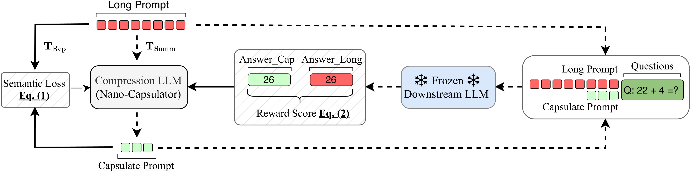
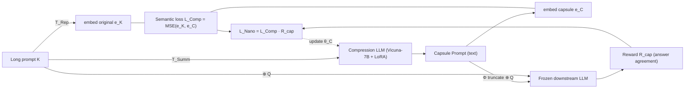

# NL-Prompt (Nano-Capsulator): Compressing Prompts into Natural Language — Chuang et al., 2024

> **arXiv:** 2402.18700 · **Title:** *Learning to Compress Prompt in Natural Language Formats* ·
> **Authors:** Yu-Neng Chuang, Tianwei Xing, Chia-Yuan Chang, Zirui Liu, Xun Chen, Xia Hu
> (Rice / Samsung Research America / Texas A&M) · **Venue:** NAACL 2024

## TL;DR
Nano-Capsulator learns to compress a long prompt into a **shorter natural-language "Capsule
Prompt"** — plain readable text, not soft embeddings — so the compressed prompt is **transferable
across different LLMs** (Vicuna, PaLM, Claude2) with no retraining. It trains a compressor
(Vicuna-7B + LoRA) with a **semantic-preservation loss** plus a **reward** measuring downstream
task utility under a hard length cutoff. At up to **81.4 % length reduction** it keeps task
accuracy, cuts latency **2.1–4.5×** and API cost up to **80.1 %**.

## Problem & motivation
Soft-prompt compression (Gisting, [ICAE](softtoken_2023_icae.md), AutoCompressor) learns
*continuous* vectors that are **model-specific** — switch the target LLM and you must retrain, and
you can't use them on API-only models at all, and they're not human-readable. The authors ask:
can we compress into **natural language** so the result is portable, interpretable, and API-
agnostic? Two technical hurdles: NL prompts are **discrete** (no gradient path through them) and
have **no built-in length control** during generation.

## Key idea
Train a **Compression LLM** to *summarize* the long prompt into a length-bounded capsule, and
supervise it with two coupled signals:
1. **Semantic preservation** — force the compressor's hidden embedding of the *summary* to match
   its embedding of the *original* (obtained via a "repeat" instruction $T_{Rep}$ vs. a
   "summarize" instruction $T_{Summ}$).
2. **Utility reward** — feed both the original and the capsule (each concatenated with sampled
   questions) through a **frozen downstream LLM** and reward the capsule for producing the same
   answer, with a **hard truncation** $\Phi(\cdot)$ that zeroes the reward if the capsule exceeds
   the length budget. Because a discrete NL prompt blocks back-prop, the reward *modulates* the
   semantic loss so bad-utility capsules get penalized during the compressor's LoRA update.

*Figure 2 — Training loop: the **Compression LLM (Nano-Capsulator)** turns the long prompt into a
Capsulate Prompt under $T_{Summ}$; a **semantic loss** (Eq. 1) aligns its embedding with the
"repeat"-encoded original ($T_{Rep}$); and a **reward score** (Eq. 2) compares a **frozen
downstream LLM**'s answers on the capsule vs. the original (`Answer_Cap` vs `Answer_Long`),
gating the update.*

## How it works (reimplementation-grade walkthrough)
1. **Generate a capsule.** The compressor $F(\cdot\mid\theta_C)$ reads the long prompt $K$ under a
   summarize instruction $T_{Summ}$ ("summarize … within {word count} words, don't repeat the
   input") and emits $C=\{c_1,\dots,c_m\}$, $m\ll n$.
2. **Semantic-preservation loss.** Encode the original under a *repeat* instruction $T_{Rep}$ to
   get $\mathbf e_K$ and the capsule to get $\mathbf e_C$; minimize their distance:
   $$\mathcal L_{Comp} = \mathbb E_C\big[\, D_{dist}(\mathbf e_K \,\Vert\, \mathbf e_C)\,\big] = \mathbb E_C\big[\operatorname{MSE}(\mathbf e_K,\mathbf e_C)\big].$$
3. **Utility reward with length cutoff.** Sample questions $Q$; run the frozen target LLM $G$ on
   the truncated capsule and on the original, and reward output agreement:
   $$\mathcal R_{cap} = \mathbb E_{Q}\big[\, \mathcal I\{\, G(\Phi(C)\oplus Q)\ \Vert\ G(K\oplus Q)\,\}\,\big],\qquad \Phi(C)=\operatorname{truncate}(C,\ \text{length threshold}).$$
   Exceeding the budget → near-zero reward → sharp penalty.
4. **Combined objective.** The reward modulates the semantic loss so the compressor's LoRA params
   $\theta_C$ are pushed toward capsules that are *both* semantically faithful and useful:
   $$\mathcal L_{Nano} = \mathcal L_{Comp}(\cdot\mid\theta_C)\cdot \mathcal R_{cap}(\cdot\mid\theta_*),$$
   with the downstream LLM $\theta_*$ frozen.
5. **Inference.** One forward pass $C=F(K\mid T_{Summ},\theta_C^\star)$ produces the capsule; then
   `[C, Q]` is fed to **any** LLM by plain string concatenation — no per-model retraining.

## Training / data
- **Compressor:** Vicuna-7B + LoRA; Adam LR 5e-6, grad clip 0.8, 2× A40 (48 GB).
- **Frozen targets:** Vicuna-7B (train), Vicuna-13B / PaLM / Claude2 (transfer eval).
- **Tasks:** few-shot CoT (CommonsenseQA, GSM8K), reading comprehension (MultiRC, TriviaQA-Long).
  Length budgets 150 tok (CSQA/MultiRC), 350 (GSM8K), 500 (TriviaQA-Long); ~1–2K training samples
  per task; ~4–8 h training.

## Results
| Task | LLM | Original acc. | Capsule acc. | Compression |
|---|---|---:|---:|---:|
| CSQA | Vicuna-13B | 60.4 % | 58.8 % | **81.4 %** (831→154 tok) |
| CSQA | PaLM | 73.7 % | **75.5 %** | — |
| GSM8K | Claude2 | 85.6 % | 84.9 % | 69.3 % (751→231 tok) |
| MultiRC | Vicuna-13B | 57.3 % | 57.1 % | 74.7 % |
| TriviaQA-Long | Vicuna-13B | 86.0 % | **88.8 %** | 53.8 % |

- **Transferable text beats model-specific latents:** vs. the AutoCompressor soft-prompt baseline
  on GSM8K, Nano-Capsulator scores 19.7 % vs. 3.79 % — soft prompts don't carry the math logic
  across models; NL capsules do.
- **Cost & latency:** Claude2 API cost −77.9 % (CSQA) to **−80.1 %** (TriviaQA-Long); inference
  2.0–4.5× faster, and it fits batches that OOM on the original prompt.
- **Reward is essential:** removing it drops CSQA/GSM8K ~6–8 points; zero-shot Vicuna-7B or
  GPT-3.5 summarization (no reward) is markedly worse.
- **Beats extractive pruning at shorter length:** vs.
  [Selective Context](hardtoken_2023_selective-context.md), 58.8 % vs. 58.2 % on CSQA while
  compressing *more*.

## Limitations & follow-ups
- **Task-domain specific:** only few-shot CoT and reading comprehension studied; classification/
  NER/generation untested.
- **No single optimal length** across LLMs; the sweet spot (~150–200 tok) shifts per model.
- **Needs task-specific training data**; cross-task zero-shot compression can struggle.
- **Relation to the thread.** NL-Prompt is the hard-token family's **abstractive, learned** turn:
  where [Selective Context](hardtoken_2023_selective-context.md) /
  [LLMLingua](hardtoken_2023_llmlingua.md) *delete* tokens, it *rewrites* the prompt into denser
  natural language — and deliberately stays **text** (not soft tokens) to keep the cross-model
  portability the [soft-token thread](../context/soft_token/soft_token.md) gives up.
  [CompAct](hardtoken_2024_compact.md) is the query-aware, iterative sibling of this abstractive
  idea. See the [hard-token thread](../context/hard_token/hard_token.md) and the
  [context-compression review](../context/ctx_compression.md).

## Links
- **arXiv:** [abs](https://arxiv.org/abs/2402.18700) · [html](https://arxiv.org/html/2402.18700v2) · [pdf](https://arxiv.org/pdf/2402.18700)
- **Venue:** NAACL 2024
- **Related papers:** [Selective Context](hardtoken_2023_selective-context.md) · [LLMLingua](hardtoken_2023_llmlingua.md) · [LongLLMLingua](hardtoken_2024_longllmlingua.md) · [CompAct](hardtoken_2024_compact.md) · [hard-token thread](../context/hard_token/hard_token.md)
