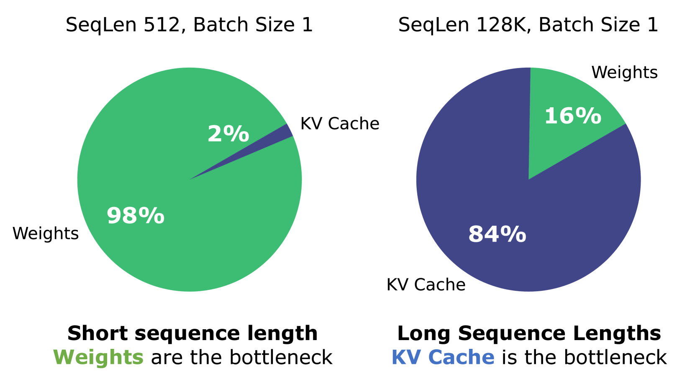
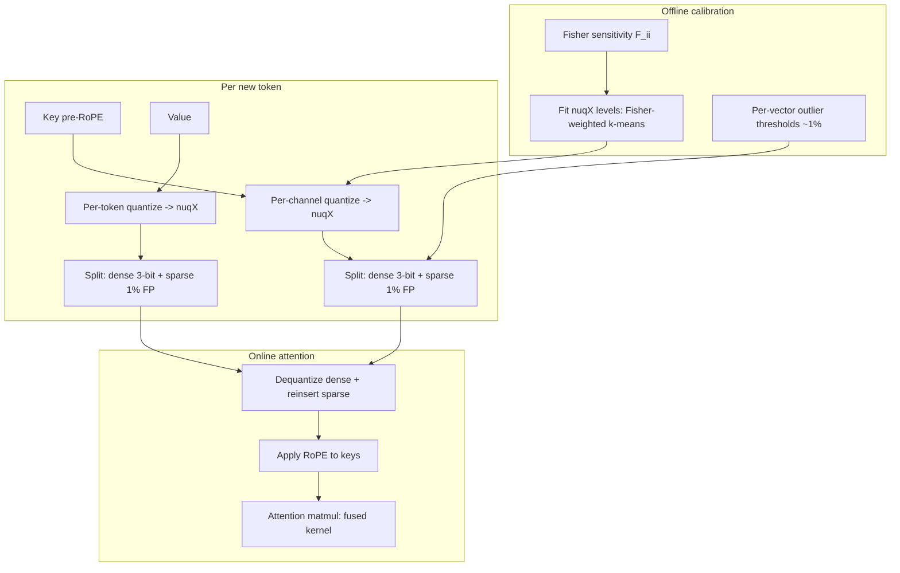
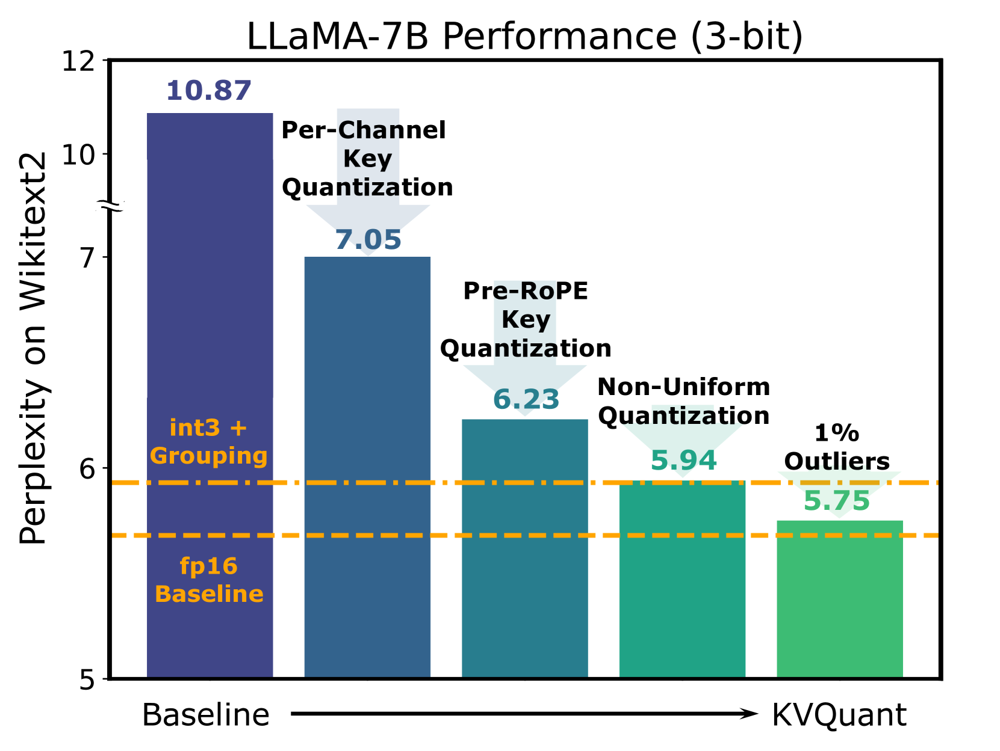
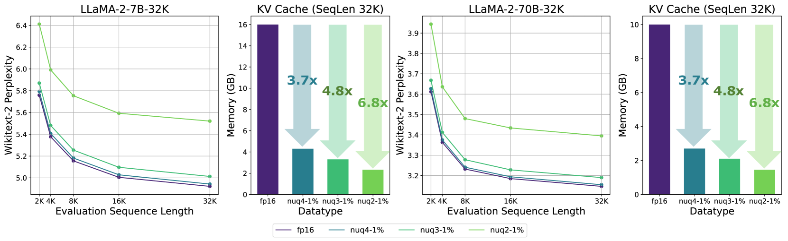

# KVQuant — Hooper et al., 2024

> **arXiv:** 2401.18079v6 · **Venue:** NeurIPS 2024 · **Affiliation:** UC Berkeley

## TL;DR
KVQuant makes the KV cache tiny by **quantizing** keys and values to ~3 bits **without retraining**
and with **< 0.1** perplexity degradation. It gets there with four complementary tricks tailored to
the actual statistics of KV tensors: per-**channel** key quantization, **pre-RoPE** key
quantization, a sensitivity-weighted **non-uniform** datatype (nuqX), and **per-vector
dense-and-sparse** quantization that isolates the ~1% numerical outliers. Together these enable
serving **1M-token** context on a single A100 (and **10M** on an 8-GPU node) with ~**1.7×** attention
kernel speedups from the reduced memory traffic.

## Problem & motivation
For long context the KV cache dwarfs the model weights in memory. Naively quantizing K and V to low
bit-width destroys accuracy because KV tensors have **structured outliers**:
- **Keys** have large, persistent **per-channel** magnitudes (a few feature channels are huge across
  all tokens). Quantizing keys **per-token** therefore wastes range on the outlier channels and
  crushes the rest.
- **RoPE** rotates adjacent key channels by position-dependent angles, *mixing* channels and
  smearing the otherwise-stable per-channel structure — so quantizing **after** RoPE is much harder
  than **before**.
- A tiny fraction of entries (< 1%) are extreme outliers that dominate the quantization range.

## Key idea — four techniques
1. **Per-Channel Key Quantization.** Choose the quantization axis to match the outlier structure:
   keys are quantized **along the channel dimension** (each channel gets its own scale/zero-point),
   whereas values are quantized **per-token**. This isolates the persistent key-channel outliers.
2. **Pre-RoPE Key Quantization.** Quantize keys **before** rotary position embedding is applied,
   where the per-channel distribution is stable, then apply RoPE on-the-fly during attention. This
   avoids the position-dependent channel mixing that wrecks post-RoPE quantization.
3. **nuqX — non-uniform, sensitivity-weighted datatype.** Instead of uniform levels, learn the
   quantization levels offline by a **Fisher-weighted k-means** on calibration data, so levels
   concentrate where perturbations hurt the loss most:
   $$
   Q(A)^{*} \;\simeq\; \arg\min_{Q}\; \sum_{i} \mathcal{F}_{ii}\,\big(A_i - Q(A_i)\big)^2 ,
   $$
   where $A_i$ is an activation entry, $Q(A_i)$ its quantized value, and $\mathcal{F}_{ii}$ the
   diagonal of the Fisher information (sensitivity) for that entry. Weighting the reconstruction
   error by $\mathcal{F}_{ii}$ places code points to minimize the *impact on the model*, not just raw
   MSE.
4. **Per-Vector Dense-and-Sparse Quantization.** Split each vector into a **dense** low-bit part plus
   a **sparse** set of ~1% outliers stored in full precision. Detecting outlier thresholds
   **per-vector** (rather than one global threshold) removes the extremes from the dense range, so
   the remaining values quantize cleanly. An **attention-sink-aware** variant keeps the first
   token(s) — which absorb disproportionate attention — at higher fidelity.

## How it works (reimplementation-grade walkthrough)
Offline calibration + online (de)quantization:

1. **Calibrate (offline).** Run a small calibration set; collect key/value activation statistics.
   - Estimate the **Fisher diagonal** $\mathcal{F}_{ii}$ per entry (sensitivity).
   - Fit the **nuqX** levels with Fisher-weighted k-means (per group: per-channel for keys,
     per-token for values).
   - Determine **per-vector outlier thresholds** (top ~1% by magnitude → sparse).
2. **Store the compressed cache.** For each new token:
   - **Keys:** take **pre-RoPE** key vectors; per-channel scale; map to nuqX levels; peel off the
     ~1% outliers to a sparse (index, value) list.
   - **Values:** per-token scale; map to nuqX levels; peel off outliers.
   - Dense part is ~3 bits/element; the sparse part is small but full precision.
3. **Attend (online).** During decoding, **dequantize** dense keys, **re-insert** sparse outliers,
   apply **RoPE** to the reconstructed keys, then run attention. Custom CUDA kernels fuse
   dequantization with the matmul so the reduced memory traffic yields real speedups.

### Why the axis and RoPE choices matter
The distribution plots below show the per-channel key outliers (a handful of channels with large,
consistent magnitude) and how RoPE mixes channels. Per-channel + pre-RoPE quantization keeps each
channel's dynamic range narrow, which is what lets 3 bits suffice.

## Training / data
**No weight training.** KVQuant needs only a small **calibration** pass to estimate Fisher
sensitivities and fit the nuqX levels / outlier thresholds; the base model is frozen. Custom kernels
handle dense+sparse dequantization at inference.

## Results
| Metric | Result | Notes |
|---|---|---|
| Perplexity degradation | **< 0.1** | 3-bit KV, LLaMA/Llama-2/Mistral |
| Max context (1×A100-80GB) | **1M** tokens | with compression |
| Max context (8-GPU) | **10M** tokens | multi-GPU |
| Attention kernel speedup | ~**1.7×** | from reduced memory traffic |
| Ablation | each of the 4 tricks helps | per-channel, pre-RoPE, nuqX, dense-sparse |

- **Perplexity vs baselines (Tables 1–6):** at 3-bit and even lower effective bit-widths, KVQuant
  beats uniform and prior KV-quantization baselines, staying within a fraction of a perplexity point
  of fp16.
- **Long-context stability:** perplexity stays flat as sequence length grows into the hundreds of
  thousands of tokens, unlike naive low-bit quantization which diverges.

## Relationship to other methods
- **Orthogonal to eviction/selection.** KVQuant shrinks the *precision* of every retained KV, while
  [SnapKV](kvcache_2024_snapkv.md) / [KVzip](kvcache_2025_kvzip.md) shrink the *number* of KVs; they
  compose (quantize the surviving tokens).
- **Different axis from latent compaction** ([Attention Matching](kvcache_2026_attention-matching.md)),
  which replaces many KVs with a few synthetic ones rather than compressing bits.

## Links
- Paper: https://arxiv.org/abs/2401.18079
- HTML: https://arxiv.org/html/2401.18079v6
- Code: https://github.com/SqueezeAILab/KVQuant
