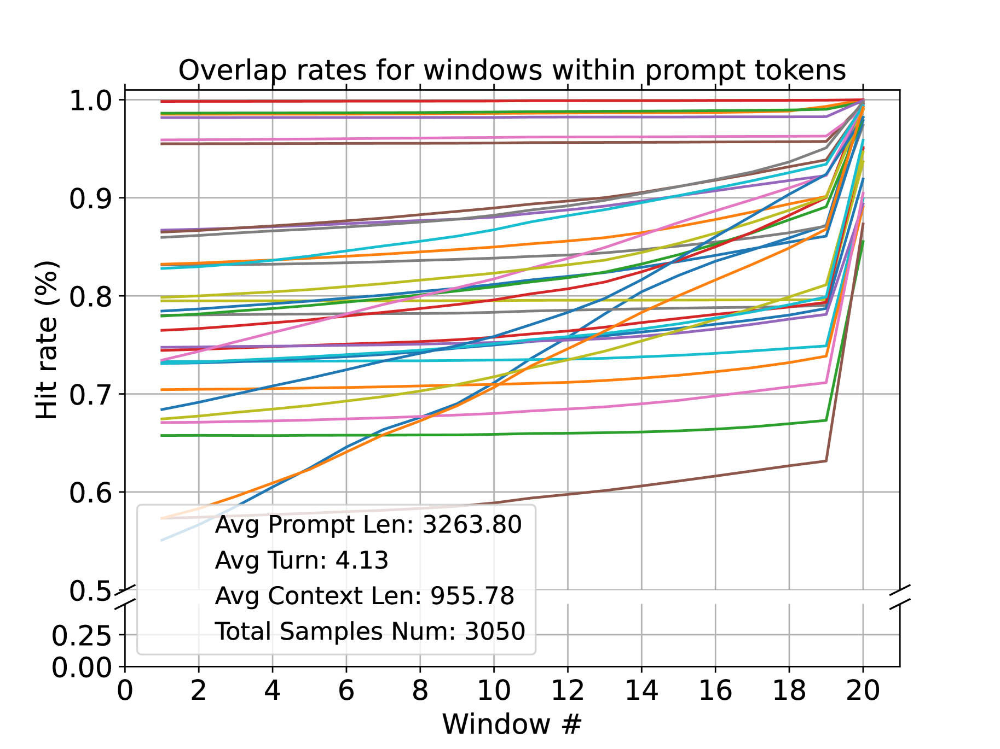
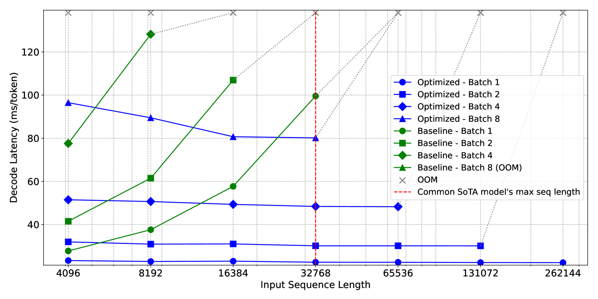

# SnapKV — Li et al., 2024

> **arXiv:** 2404.14469v2 · **Venue:** preprint (widely adopted in serving stacks) · **Affiliation:** UIUC · Cohere · Princeton · Meta AI · CMU

## TL;DR
SnapKV is a **fine-tuning-free** KV-cache compression method for long prompts. For each attention
head it looks at the attention that the **last few prompt tokens** (an "observation window") pay to
the rest of the prompt, votes on which prefix positions matter, clusters the winners so it keeps
contiguous spans, and **evicts everything else before generation begins**. The compressed prompt
cache is a drop-in replacement that cuts memory and decoding latency with almost no accuracy loss —
the paper reports **3.6× faster generation** and **8.2× smaller memory footprint** at 16K input,
and processing of a **380K-token** prompt on a single A100-80GB.

## Problem & motivation
During autoregressive decoding a transformer caches one key and one value vector per layer per head
for **every** input token. Memory therefore grows **linearly** with prompt length and, for long
prompts, the KV cache — not the model weights — dominates both GPU memory and attention latency.
Prior eviction schemes either require training or throw away tokens that later turn out to matter.

SnapKV starts from an empirical observation (their Figure on attention overlap): **each head
consistently attends to the same, small set of prompt positions throughout generation**, and that
"attention allocation" pattern is **already visible from the final tokens of the prompt**. So the
important prefix positions can be identified *before* the first token is generated, using only the
prompt itself — no future tokens, no training.


## Key idea
Let the prompt have length $L$. Split it into a **prefix** of length $L_{\text{prefix}}$ and an
**observation window** of the last $L_{\text{obs}}$ tokens (default 16–64). Using only the queries
inside the observation window, compute a per-head importance score over prefix positions, keep the
**top-$k$** after spatial pooling, and always keep the observation-window KVs verbatim:

$$
\mathbf{C} \;=\; \sum_{i=0}^{L_{\text{obs}}-1} \mathbf{W}_{\text{obs}}[:,\,i,\,:]\,,
\qquad
I \;=\; \operatorname{Top}_k\!\big(\operatorname{pool}(\mathbf{C}),\, k\big)\,,
\qquad
k = \big\lfloor p \cdot L_{\text{prefix}} \big\rfloor .
$$

Symbols:
- $\mathbf{W}_{\text{obs}} \in \mathbb{R}^{H \times L_{\text{obs}} \times L_{\text{prefix}}}$ — the
  softmax attention weights from each of the $L_{\text{obs}}$ observation queries to every prefix
  key, for each of the $H$ heads.
- $\mathbf{C} \in \mathbb{R}^{H \times L_{\text{prefix}}}$ — the **vote**: how much total attention
  the observation window pays to each prefix position, aggregated per head.
- $\operatorname{pool}(\cdot)$ — 1-D max/avg pooling (kernel 5–13) applied along the position axis so
  a high-scoring token pulls in its neighbors, yielding **contiguous, information-complete** spans.
- $p$ — the retention ratio (e.g. keep 1024–4096 prefix tokens); $I$ is the retained index set.

## How it works (reimplementation-grade walkthrough)
Given a decoder layer with grouped-query attention, heads $H$, head dim $d$:

1. **Prefill** the whole prompt normally; obtain per-layer keys $K \in \mathbb{R}^{L\times H\times d}$
   and values $V \in \mathbb{R}^{L\times H\times d}$.
2. **Slice the observation window:** take the last $L_{\text{obs}}$ query rows
   $Q_{\text{obs}} \in \mathbb{R}^{L_{\text{obs}}\times H\times d}$ and the prefix keys
   $K_{\text{prefix}} \in \mathbb{R}^{L_{\text{prefix}}\times H\times d}$.
3. **Attention voting:** compute
   $\mathbf{W}_{\text{obs}} = \operatorname{softmax}\!\big(Q_{\text{obs}} K_{\text{prefix}}^\top /
   \sqrt{d}\big)$ (causal mask restricted to the prefix), then sum over the $L_{\text{obs}}$ query
   rows to get the per-head vote $\mathbf{C}$.
4. **Cluster via pooling:** apply 1-D pooling to $\mathbf{C}$ along positions. This is the crucial
   step — without it the top-$k$ set is a scatter of isolated tokens and the model loses local
   context (e.g. it keeps one token of a name/number but not its neighbors). Ablations show pooling
   materially improves retrieval-style tasks.
5. **Select & gather:** take $I=\operatorname{Top}_k(\operatorname{pool}(\mathbf{C}))$ **per head**;
   gather $K[I], V[I]$.
6. **Assemble the compressed cache:** concatenate the retained prefix KVs with the **full**
   observation-window KVs: $\hat K = [\,K[I];\,K_{\text{obs}}\,]$, likewise $\hat V$. Total retained
   length is $k + L_{\text{obs}} \ll L$.
7. **Decode** with $\hat K,\hat V$. New tokens append to the cache as usual; the eviction happens
   once, at the prompt→generation boundary.

Because different heads vote differently, SnapKV keeps **head-specific** token sets — the retained
positions vary across heads and layers, matching each head's own attention allocation.

```mermaid
flowchart LR
  P[Prompt L tokens] --> PF[Prefill -> per-head K,V]
  PF --> OW[Observation window: last L_obs queries]
  PF --> PX[Prefix keys K_prefix]
  OW --> AV[Attention voting W_obs = softmax(Qobs Kprefix^T)]
  PX --> AV
  AV --> SUM[Sum over obs queries -> vote C]
  SUM --> POOL[1-D pooling: cluster neighbors]
  POOL --> TOPK[Top-k per head -> index set I]
  TOPK --> CAT["Concat K[I],V[I] with full obs-window KV"]
  CAT --> DEC[Decode over compressed cache]
```

### The observation-window insight, quantified
SnapKV measures a **hit rate** $H$ — the fraction of the positions actually attended during
generation that were already among the top positions predicted from the observation window. Across
layers/heads the overlap is high, which is *why* pre-generation selection works. The attention-overlap
figure below visualizes how the prompt-time pattern and the generation-time pattern coincide for the
important positions.



## Training / data
**None.** SnapKV is inference-time only — no parameter updates, no auxiliary network. It is
implemented as a small wrapper around a standard HuggingFace decoder's attention/cache. The only
knobs are the observation-window length $L_{\text{obs}}$, the pooling kernel size, and the retained
budget $k$ (or ratio $p$).

## Results
| Metric | Result | Notes |
|---|---|---|
| Decoding speed | **3.6×** faster | 16K input, vs full cache |
| Memory footprint | **8.2×** smaller | 16K input |
| Max prompt on 1×A100-80GB | **380K** tokens | with compression |
| Long-context accuracy | ≈ full-cache | LongBench, Needle-in-a-Haystack |
| Needle-in-a-Haystack | near-perfect retrieval | even at aggressive budgets |

- **LongBench (Table 1):** SnapKV matches or nearly matches the full-KV baseline across 16
  datasets at large compression, and is competitive-to-better than eviction baselines such as H2O,
  especially on retrieval/QA subtasks where pooling preserves contiguous evidence spans.
- **Latency/throughput:** the decoding-speed and memory gains grow with input length; the
  generation-latency figure shows the widening gap between full-cache and SnapKV as context scales.



### Practical defaults
- Observation window $L_{\text{obs}} \in [16, 64]$.
- Pooling kernel $\in [5, 13]$ (max or average pool).
- Retained prefix budget $k \in [1024, 4096]$ tokens.

## Relationship to other methods
- **Query-aware:** the retained set is tuned to the *current* prompt/query. This is exactly why a
  SnapKV cache degrades when reused for *different* later queries — motivating query-agnostic methods
  like [KVzip](kvcache_2025_kvzip.md).
- **Token-space eviction:** SnapKV keeps a subset of the original tokens (unlike latent-space
  compaction in [Attention Matching](kvcache_2026_attention-matching.md) or quantization in
  [KVQuant](kvcache_2024_kvquant.md)); it is orthogonal to and composable with quantization.

## Links
- Paper: https://arxiv.org/abs/2404.14469
- HTML: https://arxiv.org/html/2404.14469v2
- Code: https://github.com/FasterDecoding/SnapKV
