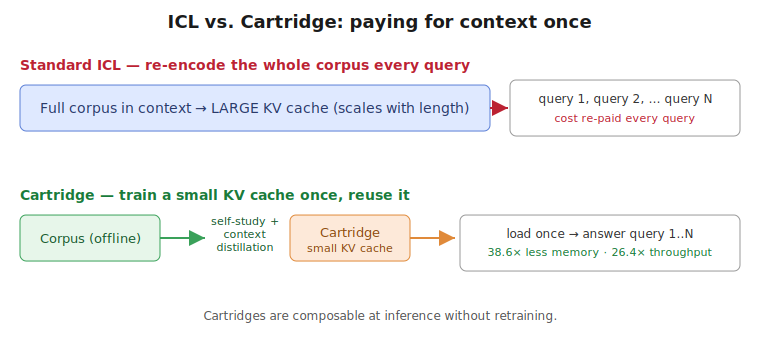
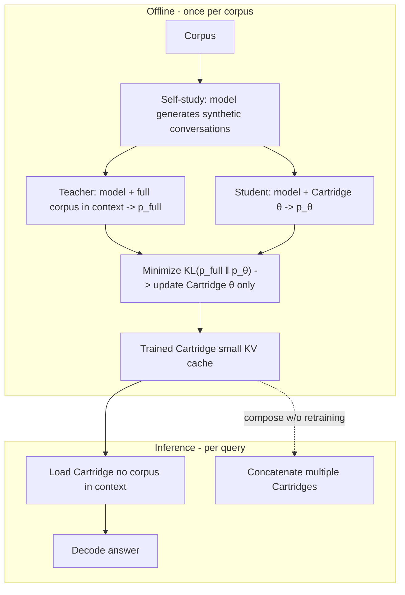

# Cartridges — Eyuboglu et al., 2025

> **arXiv:** 2506.06266v3 · **Venue:** preprint · **Affiliation:** Stanford University · University at Buffalo
>
> *No arXiv HTML build is available for this paper, so the figures below are original diagrams
> authored from the paper's description rather than downloaded reproductions.*

## TL;DR
A **Cartridge** is a small, **trainable KV cache** produced offline for a fixed corpus (a codebase,
legal bundle, chat history). At inference you *load* the Cartridge instead of stuffing the corpus
into context, and decode — amortizing prefill across every query about that corpus. Training the
Cartridge with naive next-token prediction underperforms in-context learning (ICL); the paper's
**self-study** recipe — generating **synthetic conversations** about the corpus and training with a
**context-distillation** objective — closes the gap, matching ICL quality while using **38.6× less
memory** and delivering **26.4× higher throughput**. Self-study also **extends effective context**
(128K → 484K tokens on MTOB) and yields Cartridges that are **composable** at inference without
retraining.

## Problem & motivation
The standard way to ground a model in a big corpus is to place the whole corpus in the context window
and rely on ICL. It is accurate but expensive: the **KV cache memory scales linearly with input
length**, and that cost is **re-paid on every query** because the corpus is re-encoded each time. For
a corpus queried thousands of times, this is enormous waste.

Alternative: pay **once**, offline, to distill the corpus into a **compact reusable cache**. The
catch the paper identifies: the obvious training signal — **next-token prediction on the raw corpus**
— produces a Cartridge that is **not competitive with ICL** (it memorizes surface statistics, not the
query-answering behavior ICL provides).

## Key idea — self-study
Train the Cartridge to **imitate the full-context model** rather than to predict corpus tokens. Two
ingredients:

1. **Synthetic conversations (self-study).** Use the model itself to generate diverse Q/A-style
   conversations *grounded in the corpus* — questions, quizzes, summaries about corpus chunks — so the
   training data resembles how the corpus will actually be *used*, not just its raw text.
2. **Context-distillation objective.** Train the Cartridge so a model conditioned on the *small
   Cartridge* reproduces the next-token distribution of a model conditioned on the *full corpus in
   context*:
   $$
   \min_{\text{Cartridge}\,\theta}\;\;
   \mathbb{E}_{x \sim \text{self-study}}\;
   \operatorname{KL}\!\big(\, p_{\text{full-context}}(\cdot \mid x)\;\big\|\;p_{\theta}(\cdot \mid x)\,\big).
   $$

Here $\theta$ are the **trainable KV vectors** of the Cartridge (a set of learned key/value entries
prepended to attention, in the spirit of prefix/prompt tuning but living in KV space), $x$ ranges
over the self-study conversations, $p_{\text{full-context}}$ is the frozen model **with the whole
corpus in context** (the teacher), and $p_\theta$ is the same frozen model **with only the
Cartridge** (the student). Only $\theta$ is optimized.

## How it works (reimplementation-grade walkthrough)
**Offline, once per corpus:**
1. **Chunk the corpus** and, for each region, prompt the model to **generate synthetic
   conversations** about it (self-study data) — a mix of questions, answers, summaries, and
   cross-references so the Cartridge learns to *use* the material.
2. **Initialize** the Cartridge: a set of trainable KV vectors of a chosen size (the size sets the
   memory/quality trade-off — far smaller than the corpus's natural KV cache).
3. **Distill.** For each self-study example $x$:
   - Teacher forward pass: full corpus in context → target distribution $p_{\text{full-context}}$.
   - Student forward pass: Cartridge only → $p_\theta$.
   - Backprop the **KL** into the Cartridge KV vectors $\theta$ (model weights frozen).
4. **Save** the trained Cartridge.

**At inference:**
5. **Load** the Cartridge (no corpus in context) and decode the user query. Cost per query is now
   set by the Cartridge size, not the corpus length.
6. **Compose** multiple Cartridges by concatenating them in KV space — combine corpora *without
   retraining*, an emergent property the paper highlights.

### Why self-study beats naive training
Next-token prediction optimizes the Cartridge to *reproduce corpus text*, which is not the behavior
that matters at query time. Context distillation optimizes it to *behave like the full-context
model*, i.e. to answer questions as if the corpus were present — directly transferring ICL's
query-answering competence into a compact cache. Grounding the distillation data in **self-generated
conversations** (rather than raw text) matches the train and use distributions.

## Training / data
**Offline, per-corpus training** of the Cartridge KV vectors (base model frozen). Data is
**synthetic self-study conversations** generated from the corpus. Objective is **context
distillation** (KL to the full-context teacher).

## Results
| Metric | Result | Notes |
|---|---|---|
| Memory vs ICL | **38.6×** less | matches ICL quality |
| Throughput vs ICL | **26.4×** higher | serving-time |
| Effective context (MTOB) | **128K → 484K** tokens | context extension |
| Composition | works **without retraining** | concatenate Cartridges |
| Quality | ≈ ICL on long-context benchmarks | vs naive next-token: large gap |

- **Self-study vs naive next-token:** naive training is not competitive with ICL; self-study closes
  the gap — the paper's central ablation.
- **Amortization:** because the Cartridge is trained once and reused, its offline training cost is
  paid back across all queries referencing the corpus.

## Relationship to other methods
- **vs eviction/quantization** ([SnapKV](kvcache_2024_snapkv.md),
  [KVQuant](kvcache_2024_kvquant.md)): those compress an *existing* cache at inference; Cartridges
  *train* a new compact cache offline, achieving far higher compression at the cost of per-corpus
  training.
- **vs [Attention Matching](kvcache_2026_attention-matching.md):** same latent-compaction goal;
  Attention Matching reaches comparable compression **in seconds** via closed-form matching instead
  of Cartridges' end-to-end distillation, and directly cites Cartridges as the fidelity target to
  beat on speed.

## Links
- Paper: https://arxiv.org/abs/2506.06266
- Project: https://github.com/HazyResearch/cartridges
