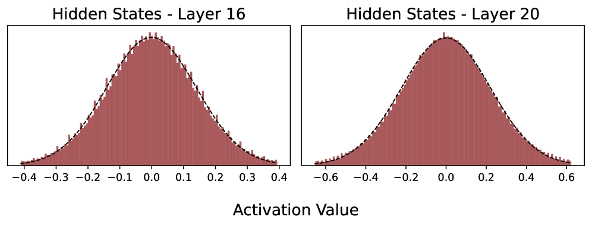
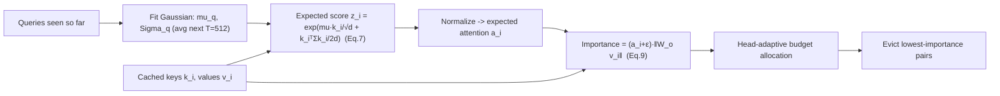
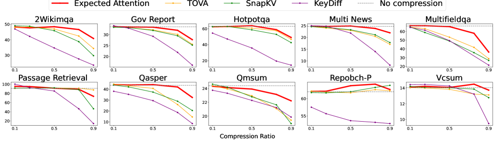

# Expected Attention — Devoto et al., 2025

> **arXiv:** 2510.00636v1 · **Venue:** preprint (ships the **KVPress** library) · **Affiliation:** Sapienza University of Rome · NVIDIA

## TL;DR
Expected Attention scores each cached KV pair by the attention it is **expected** to receive from
**future** queries, estimated in closed form from a Gaussian model of the query distribution — so it
needs no future tokens and no training. Because it predicts future importance rather than measuring
past attention, it works during **both prefill and decoding**, prunes **head-adaptively**, and
reaches up to **~60% compression** with negligible quality loss. It is released as a general
compression method inside the open-source **KVPress** framework.

## Problem & motivation
Most eviction methods (e.g. [SnapKV](kvcache_2024_snapkv.md)) score a KV pair by the attention it has
*already received* from a window of recent queries. That works at the prompt→generation boundary but
is awkward **during decoding**, where the "recent window" is short and biased, and it can't be
applied cleanly to compress the *generated* cache on the fly. The right quantity is the attention a
KV pair will receive from **future** queries — which we don't have yet.

Expected Attention's insight: the hidden states that produce future queries are, empirically,
well-approximated by a **Gaussian**. If we model $q \sim \mathcal{N}(\mu_q, \Sigma_q)$, we can
compute the **expected** attention score to each key analytically, without sampling any future
tokens.

## Key idea
Model the future query as Gaussian and take the **expected unnormalized attention score** to key
$k_i$. Using the Gaussian moment-generating function, the expectation of $\exp(q^\top k_i/\sqrt d)$
has a closed form:

$$
\hat z_i \;=\; \exp\!\Big( \tfrac{\bar\mu_q^{\top} k_i}{\sqrt d} \;+\; \tfrac{k_i^{\top}\,\bar\Sigma_q\, k_i}{2 d} \Big),
\qquad
\hat a_i \;=\; \frac{\hat z_i}{\sum_j \hat z_j}. \tag{Eq. 7}
$$

Then weight each key's expected attention by the **magnitude of the value it would contribute** to
the residual stream, to get the KV pair's expected impact on the output:

$$
\big\|\Delta \hat h_i\big\| \;=\; (\hat a_i + \epsilon)\,\big\| W_o\, v_i \big\|,
\qquad \epsilon = 0.02. \tag{Eq. 9}
$$

Symbols:
- $q \sim \mathcal{N}(\mu_q, \Sigma_q)$ — a future query modeled as Gaussian; $\bar\mu_q,\bar\Sigma_q$
  are **position-averaged** over the next $T = 512$ predicted query positions.
- $k_i, v_i$ — the key/value of cached pair $i$; $d$ — head dimension; $W_o$ — the output projection.
- $\hat z_i$ — expected *unnormalized* score (Eq. 7 is exactly the Gaussian MGF of the score).
- $\hat a_i$ — expected *normalized* attention weight to pair $i$.
- $\|W_o v_i\|$ — how large a contribution pair $i$ makes to the block output if attended;
  $\epsilon$ keeps a small floor so high-value tokens aren't fully zeroed by a tiny $\hat a_i$.
- $\|\Delta\hat h_i\|$ — the final **importance**: expected change in the residual hidden state if
  pair $i$ is kept. Evict the pairs with the smallest $\|\Delta\hat h_i\|$.

## How it works (reimplementation-grade walkthrough)
Per layer, per KV-head:

1. **Estimate the query distribution.** From the queries seen so far (prompt, or the running
   decode), compute a running mean $\bar\mu_q$ and covariance $\bar\Sigma_q$ of the query vectors,
   **averaged over the next $T=512$ positions** to represent "typical future queries." A diagonal or
   low-rank $\bar\Sigma_q$ keeps it cheap.
2. **Expected score per key (Eq. 7).** For every cached key $k_i$, compute $\hat z_i$ in closed form
   — a dot product plus a quadratic form $k_i^\top \bar\Sigma_q k_i$. Normalize to $\hat a_i$.
3. **Value-weighted importance (Eq. 9).** Multiply the (floored) expected attention by
   $\|W_o v_i\|$, the output-space norm of the value. This is what makes it a true
   *output-contribution* estimate rather than a pure attention estimate.
4. **Head-adaptive budgeting.** Allocate the retention budget per head/layer according to the
   distribution of importances — heads whose importance mass is concentrated keep fewer pairs; heads
   with diffuse attention keep more.
5. **Evict** the lowest-importance pairs down to the budget. Repeat as the cache grows (during
   decoding) — because the score is *predictive*, it stays valid as new queries arrive.

### Why closed form matters
Because Eq. 7 is exact under the Gaussian assumption, there is **no sampling** and **no forward pass
over future tokens** — the score is a couple of small linear-algebra ops per key. That is what lets
Expected Attention run cheaply *inside decoding*, unlike window-voting methods designed only for the
prompt boundary.

## Training / data
**Training-free.** Only running estimates of $\bar\mu_q,\bar\Sigma_q$ are needed; the base model is
frozen. Shipped as a pluggable "press" in the **KVPress** library, which also provides a common
harness/benchmark for many KV-compression methods.

## Results
| Metric | Result | Notes |
|---|---|---|
| Compression | up to **~60%** | negligible quality loss |
| Applicability | **prefill + decoding** | predictive score stays valid online |
| RULER | ≈ full-cache | Table 1 across compression ratios |
| MATH-500 | preserves reasoning | Table 2 (long CoT decoding) |
| Needle-in-a-Haystack | near-perfect | Figures x5–x12 |

- **LongBench / RULER (Table 1):** matches or beats prior training-free eviction at equal budget,
  with a bigger advantage in the **decoding-time** compression regime where window-voting methods
  struggle.
- **Reasoning (MATH-500, Table 2):** because it compresses the generated cache without hurting the
  attention the model needs for long chains of thought, accuracy on math reasoning is preserved.

## Relationship to other methods
- **vs [SnapKV](kvcache_2024_snapkv.md):** SnapKV scores by *past* attention from an observation
  window (prompt boundary only); Expected Attention scores by *predicted future* attention (works in
  decoding too).
- **Composable** with quantization ([KVQuant](kvcache_2024_kvquant.md)) and orthogonal to
  latent-space compaction ([Attention Matching](kvcache_2026_attention-matching.md)).

## Links
- Paper: https://arxiv.org/abs/2510.00636
- HTML: https://arxiv.org/html/2510.00636v1
- KVPress: https://github.com/NVIDIA/kvpress
