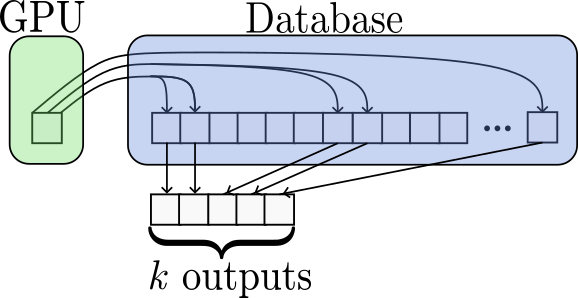
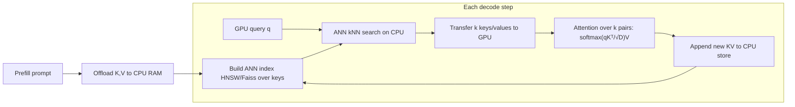
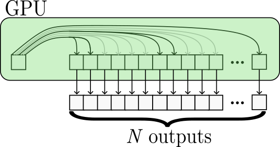

# Exploiting Sparsity for Long-Context Inference — Synk et al., 2025

> **arXiv:** 2502.06766v2 · **Venue:** preprint · **Affiliation:** University of Maryland (Tom Goldstein's group)

## TL;DR
Attention over long contexts is **extremely sparse** — for each query only a tiny fraction of keys
matter — so this work keeps the full KV cache in **CPU memory** as a **vector database** and, at each
decoding step, retrieves just the **top-$k$** most relevant keys/values with an approximate
nearest-neighbor (ANN) search (Faiss/HNSW). Attention is then computed over only those retrieved
pairs on the GPU. Using **< 2%** of tokens preserves **> 95%** of full-attention quality, enabling
**1M-token** inference with only ~**16 GB** of GPU memory.

## Problem & motivation
Softmax attention is dominated by a handful of large logits: the attention distribution is peaky, so
most keys receive near-zero weight. Yet standard decoding still (a) stores **every** KV pair in
scarce GPU memory and (b) computes attention against **all** of them each step. Both scale with
context length and become the bottleneck at 100K–1M tokens.

The idea: if only the top-$k$ keys matter, treat KV retrieval as a **similarity-search** problem.
Offload the cache to plentiful CPU RAM, index it, and fetch only what each query needs.

## Key idea
Standard attention for a query $q$ over keys $K$, values $V$:

$$
\operatorname{Attention}(q, K, V) \;=\; \operatorname{Softmax}\!\Big( \frac{q K^\top}{\sqrt{D}} \Big) V . \tag{Eq. 1}
$$

Replace the full key set $K$ with the **top-$k$ neighbors** of $q$ found by ANN search over a CPU
index:

$$
\mathcal{N}_k(q) = \operatorname{kNN}(q, K),\qquad
\widehat{\operatorname{Attention}}(q) = \operatorname{Softmax}\!\Big(\frac{q K_{\mathcal{N}_k}^\top}{\sqrt D}\Big) V_{\mathcal{N}_k}.
$$

Symbols: $D$ — head dim; $\mathcal{N}_k(q)$ — indices of the $k$ keys most similar to $q$; the
softmax is taken over only those $k$ logits. How peaked a head is can be read off its attention
**entropy**

$$
E \;=\; -\sum_i a_i \log a_i ,
$$

where $a_i$ are the (full) attention weights: low $E$ ⇒ few keys dominate ⇒ small $k$ suffices; high
$E$ ⇒ diffuse attention ⇒ larger $k$ needed. This motivates **per-task / per-head** choice of $k$.

## How it works (reimplementation-grade walkthrough)
This is **Algorithm 1 (Top-k KV Cache Decoding)**:

1. **Prefill & offload.** Run the prompt; move the resulting keys and values to **CPU memory**.
   Build an ANN index over the keys (Faiss with an **HNSW** graph), optionally per layer/head.
2. **Per decoding step, per head:**
   a. Take the current query $q$ (on GPU); send it to the CPU index.
   b. **ANN search:** retrieve the $k$ nearest keys $\mathcal{N}_k(q)$ and their values.
   c. Copy those $k$ keys/values back to the GPU.
   d. Compute attention (Eq. 1) over just the $k$ retrieved pairs.
3. **Append** the new token's KV to the CPU store / index and continue.
4. **Recent-window shortcut:** keep the last few tokens (and any sink tokens) always-resident so the
   local context and attention sink are never missed by ANN.

Only $O(k)$ KV vectors ever touch the GPU per step, so **GPU memory is decoupled from context
length** — the full million-token cache sits in host RAM.

### Accuracy/latency trade-off
- **How small can $k$ be?** Because attention entropy is low, keeping **< 2%** of tokens retains
  **> 95%** of full-attention performance on long-context benchmarks; different tasks need different
  $k$ (retrieval-heavy tasks tolerate tiny $k$; aggregation tasks need more).
- **Cost:** the ANN search runs on CPU in parallel with GPU work; the transferred payload is only $k$
  vectors per head, so PCIe traffic stays small.

## Training / data
**Training-free.** No model changes — a standard decoder with a retrieval layer wrapped around the KV
cache. The only components are an ANN index (Faiss/HNSW) and the per-head/per-task choice of $k$.

## Results
| Metric | Result | Notes |
|---|---|---|
| Tokens attended | **< 2%** | to keep **> 95%** quality |
| Context length | up to **1M** tokens | on ~**16 GB** GPU |
| GPU memory | decoupled from context | full cache in CPU RAM |
| RULER | ≈ full-attention | Table 1 across tasks |
| Per-task $k$ | varies by entropy | Table 2 |

- **RULER (Table 1):** top-$k$ attention matches dense attention across retrieval, multi-hop, and
  aggregation tasks once $k$ is set per the task's attention entropy.
- **Per-task $k$ (Table 2):** low-entropy retrieval tasks work at very small $k$; high-entropy tasks
  need a larger budget — the paper reports the sweet spots.

## Relationship to other methods
- **vs eviction** ([SnapKV](kvcache_2024_snapkv.md), [KVzip](kvcache_2025_kvzip.md)): those
  **permanently discard** KV pairs; this method **keeps everything** in CPU RAM and dynamically
  retrieves per query — nothing is lost, so it is inherently query-adaptive.
- **Composable** with quantization ([KVQuant](kvcache_2024_kvquant.md)) to further shrink the
  CPU-resident store.

## Links
- Paper: https://arxiv.org/abs/2502.06766
- HTML: https://arxiv.org/html/2502.06766v2
