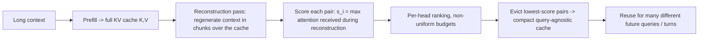

# KVzip — Kim et al., 2025

> **arXiv:** 2505.23416v2 · **Venue:** NeurIPS 2025 (Oral) · **Affiliation:** Seoul National University · NAVER AI Lab
>
> *No arXiv HTML build is available for this paper, so the figures below are original diagrams
> authored from the paper's description rather than downloaded reproductions.*

## TL;DR
KVzip is a **query-agnostic** KV-cache eviction method: it scores each cached KV pair by how much it
contributes to the LLM's ability to **reconstruct the original context** from the cache, then evicts
the least-important pairs. Because the score depends on the *context*, not on any particular future
query, **one** compressed cache is **reusable across many later queries** — where query-aware methods
like [SnapKV](kvcache_2024_snapkv.md) collapse. It reduces cache size **3–4×** and FlashAttention
decoding latency by ~**2×** with negligible loss on QA, retrieval, reasoning and code, on LLaMA-3.1,
Qwen2.5 and Gemma-3 at contexts up to **170K** tokens.

## Problem & motivation
Query-aware eviction tunes the retained cache to the *current* query. That is fine for a single
question but breaks in **multi-turn / agentic** settings where the same long context must serve many
*different* follow-up queries: the paper shows query-aware methods degrade **even at a 90% cache
budget** under multi-query evaluation, because tokens irrelevant to query #1 (and thus evicted) are
exactly what query #2 needs.

KVzip asks a query-independent question instead: *which KV pairs does the model need to reconstruct
the context itself?* Anything needed to regenerate the context is information-bearing and should be
kept; anything the model can reproduce without is redundant.

## Key idea
Define a KV pair's importance by its contribution to **context reconstruction**. Run the frozen LLM
to reconstruct the original context from the cache; a pair whose removal least harms reconstruction
is redundant:

$$
\operatorname{importance}(k,v)\;\propto\;\Delta\,\mathcal{L}_{\text{reconstruct}}
\big(\text{context}\mid \text{cache}\setminus\{(k,v)\}\big).
$$

In practice KVzip approximates this with a single, cheap signal: the **attention each KV pair
receives while the model regenerates the context**. Concretely, it feeds the context back through the
model as a reconstruction task and records, for every cached pair, the **maximum attention weight**
it gets across all reconstruction queries. High max-attention ⇒ some part of the context needs this
pair ⇒ keep it. The max (rather than a sum/mean) is what makes the score **query-agnostic**: a pair
is retained if *any* portion of the context depends on it.

## How it works (reimplementation-grade walkthrough)
1. **Prefill** the context once → full KV cache $K,V$ per layer per head.
2. **Reconstruction pass.** Have the model **re-read / regenerate** the context while attending to
   the cached KV. To bound cost, process the context in **chunks**: for each chunk, the model
   reconstructs that chunk conditioned on the cache, so every region of the context gets a chance to
   "call on" the KV pairs it depends on.
3. **Score by max attention.** For each cached pair $(k_i,v_i)$ accumulate
   $s_i = \max_{q \in \text{recon queries}} a_{q,i}$, the largest attention weight it receives during
   reconstruction. This is a **per-head** score.
4. **Head-level, non-uniform eviction.** Rank pairs by $s_i$ within each head and evict the lowest
   down to the target budget. Because different heads carry different amounts of information, the
   retained counts vary across heads (non-uniform allocation).
5. **Reuse.** The surviving cache is **query-agnostic** — store it once and answer arbitrarily many
   future queries/turns from it. Compression is a **one-time** cost amortized over all queries; it is
   compatible with **FlashAttention** decoding.

### Why "reconstruction" gives query-agnostic importance
A query-aware method scores a pair by how much *this* query attends to it — so it discards anything
this query ignores. Reconstruction instead asks the model to reproduce the *whole* context; a pair is
important if **any** span of the context relies on it. That makes the retained set a faithful,
query-independent summary of the context's information content, which is exactly what survives
distribution shift across follow-up queries.

## Training / data
**Training-free.** Importance is measured by the base model's own forward pass (the reconstruction
pass); no weight updates, no auxiliary network. The only knob is the target budget (e.g. 25–33% of
the cache for 3–4× reduction).

## Results
| Metric | Result | Notes |
|---|---|---|
| KV cache size | **3–4×** reduction | negligible quality loss |
| FlashAttention decode latency | ~**2×** lower | from smaller cache |
| Context length | up to **170K** tokens | |
| Models | LLaMA-3.1, Qwen2.5, Gemma-3 | |
| Tasks | QA, retrieval, reasoning, code | |
| Multi-query robustness | **beats query-aware even at 90% budget** | key differentiator |

- Against query-aware eviction (e.g. [SnapKV](kvcache_2024_snapkv.md)) under **multi-query**
  evaluation, KVzip retains quality where the baselines degrade sharply — the central experimental
  claim.
- The reconstruction-based score generalizes across task types (retrieval, reasoning, code) because
  it never sees the eventual query.

## Relationship to other methods
- **vs query-aware** ([SnapKV](kvcache_2024_snapkv.md), and the *predictive* score of
  [Expected Attention](kvcache_2025_expected-attention.md)): those optimize for a specific query
  distribution; KVzip optimizes for context fidelity, giving a reusable cache.
- **vs latent compaction** ([Attention Matching](kvcache_2026_attention-matching.md)): KVzip keeps
  *real* tokens (eviction), whereas Attention Matching synthesizes new KVs.
- **Cheaper successor:** [Fast KVzip](kvcache_2026_fast-kvzip.md) replaces the reconstruction pass
  with lightweight gating modules to cut the one-time compression cost.

## Links
- Paper: https://arxiv.org/abs/2505.23416
- Code: https://github.com/snu-mllab/KVzip
