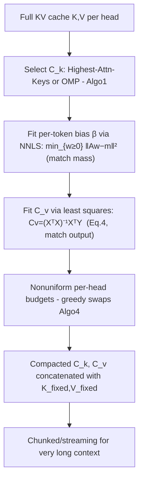
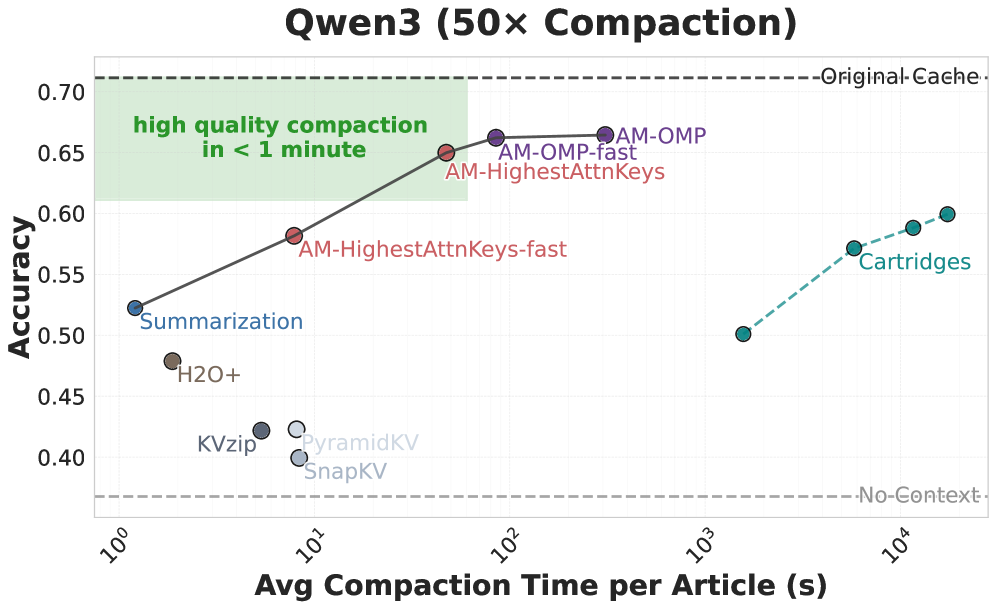

# Fast KV Compaction via Attention Matching — Zweiger et al., 2026

> **arXiv:** 2602.16284v2 · **Venue:** preprint · **Affiliation:** MIT (Adam Zweiger, Xinghong Fu, Han Guo, Yoon Kim)

## TL;DR
Attention Matching **compacts** a KV cache in **latent space**: instead of keeping a subset of real
tokens, it builds a small set of synthetic keys/values $C_k, C_v$ that make attention over the
compressed cache **reproduce the attention output** of the full cache, per KV-head, while preserving
each key's **attention mass**. The matching objective **decomposes into subproblems** — several with
**closed-form** solutions (least squares / non-negative least squares) — so compaction is fast: up to
**50× compaction in seconds**, beating [Cartridges](kvcache_2025_cartridges.md), H2O,
[SnapKV](kvcache_2024_snapkv.md), [KVzip](kvcache_2025_kvzip.md) and KVMerger at equal budget.

## Problem & motivation
Long-context serving systems compact the cache by **summarizing in token space**, which is lossy and
throws away information. [Cartridges](kvcache_2025_cartridges.md) showed that a compact **latent** KV
cache can match full-context quality — but it requires slow, expensive **end-to-end optimization**
(effectively training a cache per corpus). The goal here: get Cartridges-level latent fidelity, but
**fast**, via a closed-form matching problem rather than SGD.

![Attention Matching goal: replace the full KV cache (K,V, blue) with a much smaller compacted set (C_k, C_v, orange) so that attention outputs match — Attn(q; [K;K_fixed], [V;V_fixed]) ≈ Attn(q; [C_k;K_fixed], [C_v;V_fixed]).](_assets/kvcache_2026_attention-matching/method.png)

## Key idea
For a given KV-head, over a set of local (calibration) queries $Q$, find compact $C_k, C_v$ that make
attention match:

$$
\min_{C_k, C_v}\; \big\| \operatorname{Attn}(Q, K, V) - \operatorname{Attn}(Q, C_k, C_v) \big\|
\quad\text{(match output)} \tag{Eq. 1}
$$

subject to preserving the **attention mass** each retained key carries (Eq. 2). The trick is to split
the hard joint problem into three tractable pieces:

- **Select which keys to keep** ($C_k$) — a subset-selection / sparse-approx problem.
- **Fit a per-token bias** $\beta$ so the compressed keys reproduce the right attention *mass*.
- **Fit the values** $C_v$ in closed form so the compressed cache reproduces the right attention
  *output*.

Symbols: $K,V$ full keys/values; $C_k, C_v$ compacted keys/values ($|C| \ll |K|$); $K_{\text{fixed}},
V_{\text{fixed}}$ recent/always-kept KVs concatenated with the compacted part; $Q$ calibration
queries; $\beta \in \mathbb{R}^{t}$ per-token log-bias with weights $w_j = \exp(\beta_j)$.

## How it works (reimplementation-grade walkthrough)

**1. Match attention mass → fit $\beta$ by NNLS.** Give each kept key a positive weight
$w_j = \exp(\beta_j)$ and choose $\beta$ so the compressed keys reproduce the target per-key
attention mass $m$. With design matrix $A$ (softmax contributions), this is a **non-negative least
squares** problem:

$$
\min_{w \ge 0}\; \big\| A w - m \big\|^2 .
$$

**2. Match attention output → fit $C_v$ by least squares.** Given the (weighted) attention pattern
$X$ the queries place on the kept keys, the optimal compacted values solve a plain least-squares
system (closed form):

$$
C_v^{*} \;=\; \big(X^\top X\big)^{-1} X^\top Y , \tag{Eq. 4}
$$

where $Y$ is the target output ($\operatorname{Attn}(Q,K,V)$). This is the key speed win — no SGD, a
single normal-equation solve per head.

**3. Select $C_k$ (which keys).** Two strategies:
- **Highest-Attention-Keys** — keep the keys that receive the most (calibration) attention mass;
  cheap, one pass.
- **Orthogonal Matching Pursuit (OMP)** — greedily add the key that most reduces the residual of the
  attention-output match (**Algorithm 1**); more accurate, slightly slower. A `-fast` variant caps
  the OMP work.

**4. Nonuniform per-head budgets.** Heads differ in how compressible they are, so a greedy
budget-allocation loop (**Algorithm 4**) reallocates the global budget across heads by swapping — give
more slots to sensitive heads, fewer to redundant ones.

**5. Chunked compaction.** For very long contexts, compact in **chunks** (streaming) so the
calibration matrices stay small and memory-bounded.

### Method family
Combining the two selection strategies with the fast caps gives the reported variants:
**AM-OMP**, **AM-OMP-fast**, **AM-HighestAttnKeys**, **AM-HighestAttnKeys-fast** — a spectrum trading
compaction time against fidelity. All avoid end-to-end gradient training of the cache.

## Training / data
**No end-to-end SGD.** Compaction solves closed-form matching subproblems (least squares / NNLS) on a
small set of calibration queries; the base model is frozen. Runtime is seconds, not minutes/hours.

## Results
| Metric | Result | Notes |
|---|---|---|
| Compaction ratio | up to **50×** | little quality loss |
| Compaction time | **seconds** | vs slow Cartridges training |
| Baselines beaten | Cartridges, H2O, SnapKV, KVzip, KVMerger | at equal budget |
| Models | Qwen3-4B, Llama-3.1-8B, Gemma-3-12B | |
| Benchmarks | QuALITY, LongHealth, QASPER, LongBench v2, RULER | |

- **Accuracy vs compaction time (Figure 1):** Attention Matching sits on the Pareto frontier — near
  full-context accuracy at a fraction of the wall-clock of Cartridges, and above token-space
  eviction baselines at the same budget.
- **Head sensitivity:** the nonuniform per-head budget (Algorithm 4) is a measurable win over uniform
  allocation, especially at aggressive ratios.

## Relationship to other methods
- **vs token-space eviction** ([SnapKV](kvcache_2024_snapkv.md), [KVzip](kvcache_2025_kvzip.md)):
  those keep *real* tokens; Attention Matching synthesizes *new* $C_k,C_v$ that summarize many tokens
  — strictly more expressive at equal budget.
- **vs [Cartridges](kvcache_2025_cartridges.md):** same latent-compaction goal, but closed-form
  matching in seconds instead of per-corpus training.

## Links
- Paper: https://arxiv.org/abs/2602.16284
- HTML: https://arxiv.org/html/2602.16284v2
