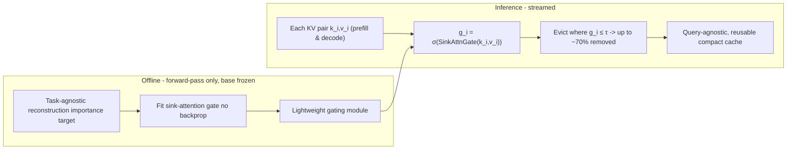

# Fast KVzip — Kim et al., 2026

> **arXiv:** 2601.17668v2 · **Venue:** preprint · **Affiliation:** NAVER AI Lab · Seoul National University
>
> *No arXiv HTML build is available for this paper, so the figures below are original diagrams
> authored from the paper's description rather than downloaded reproductions.*

## TL;DR
Fast KVzip is a **gating-based** KV-cache eviction method for **frozen-weight** LLMs. It attaches
lightweight **sink-attention gating** modules that score each KV pair for retention, keeping the
critical pairs at **negligible compute cost** — replacing the expensive reconstruction pass of
[KVzip](kvcache_2025_kvzip.md) with a cheap, streamable gate. Crucially the gates are trained with
**forward passes only (no backpropagation)** against a **task-agnostic reconstruction** objective, so
they generalize across tasks. The gate runs in **both prefill and decoding** and evicts up to
**~70%** of the cache near-losslessly on Qwen2.5-1M, Qwen3 and Gemma-3.

## Problem & motivation
[KVzip](kvcache_2025_kvzip.md) gives an excellent **query-agnostic** cache by scoring pairs via
context reconstruction — but that scoring requires an extra **reconstruction pass** over the context,
a real one-time compute overhead. The trade-off in KV compression is usually *quality loss vs compute
overhead*: cheap heuristics lose accuracy; accurate reconstruction scoring costs compute.

Fast KVzip keeps KVzip's query-agnostic, reconstruction-driven **quality** while making the eviction
decision **cheap and online** — a gate you can evaluate as tokens stream through prefill and decode,
with no separate scoring pass.

## Key idea
Learn a small **gating module** that outputs a per-KV retention score directly from the cached keys
and values, using a **sink-attention** read-out (attention against a few learned "sink"/query
vectors that summarize what downstream generation will need):

$$
g_i \;=\; \sigma\!\big(\operatorname{SinkAttnGate}(k_i, v_i)\big),
\qquad \text{retain pair } i \iff g_i > \tau .
$$

Symbols: $g_i \in (0,1)$ — retention score for pair $i$; $\sigma$ — sigmoid;
$\operatorname{SinkAttnGate}$ — a lightweight module using a handful of learned sink queries to
attend over $(k_i,v_i)$ and emit a scalar; $\tau$ — the retention threshold set by the target budget.
The base LLM weights are **frozen**; only the tiny gate is learned.

## How it works (reimplementation-grade walkthrough)

**Gate training (offline, forward-pass only):**
1. Pick a **task-agnostic reconstruction** target: the "ground-truth" importance of each pair as
   measured by a reference reconstruction signal (à la KVzip) on calibration contexts.
2. Train the sink-attention gate to **match** that target using **forward passes only** — a
   backprop-free procedure (e.g. gradient-free / closed-form fitting of the gate parameters against
   the reconstruction signal). Avoiding backprop through the frozen LLM is what keeps training cheap
   and stable, and the task-agnostic target is what makes the gate generalize.

**Inference (streamed over prefill + decode):**
3. As each token's KV is produced, evaluate $g_i = \sigma(\operatorname{SinkAttnGate}(k_i,v_i))$ —
   a couple of small ops, negligible next to attention.
4. **Evict online:** drop pairs with $g_i \le \tau$ (or keep the top fraction per head to hit the
   budget). Because the gate is cheap and local, this happens **continuously** — no separate
   compression pass — across both the prompt (prefill) and generation (decode).
5. The surviving cache is **query-agnostic** (the target was reconstruction, not any query) and thus
   **reusable** across queries, like KVzip but at a fraction of the compression cost.

### Why it is fast
KVzip pays a full **reconstruction pass** to score the cache once. Fast KVzip **amortizes** that
into a trained gate: the expensive reconstruction signal is used **only during offline gate
training**, so at inference the retention decision is a tiny per-pair sigmoid — evaluable inline with
attention, in both prefill and decode.

## Training / data
**Gate-only training via forward passes**; base model frozen; **no backpropagation** through the LLM.
Target is a **task-agnostic reconstruction** objective (so the gate transfers across long-context,
code and math tasks without per-task tuning).

## Results
| Metric | Result | Notes |
|---|---|---|
| KV cache evicted | up to **~70%** | near-lossless |
| Compression overhead | **negligible** | vs KVzip's reconstruction pass |
| Applicability | **prefill + decode** | streamed, online |
| Query behavior | **query-agnostic**, reusable | like KVzip |
| Models | Qwen2.5-1M, Qwen3, Gemma-3 | |
| Tasks | long-context, code, math | consistent across tasks |

- **vs [KVzip](kvcache_2025_kvzip.md):** matches the query-agnostic quality while removing the
  reconstruction-pass overhead — the headline trade the paper targets.
- **Generalization:** the task-agnostic gate holds up across task families without retraining.

## Relationship to other methods
- **Direct successor to [KVzip](kvcache_2025_kvzip.md):** same query-agnostic, reconstruction-driven
  philosophy, but the scoring is *distilled into a cheap gate* instead of computed by an explicit
  pass.
- **vs predictive scoring** ([Expected Attention](kvcache_2025_expected-attention.md)): both run in
  prefill and decode, but Expected Attention uses a closed-form Gaussian estimate of *future
  attention* whereas Fast KVzip uses a *learned gate* trained toward a reconstruction target.
- **Composable** with quantization ([KVQuant](kvcache_2024_kvquant.md)).

## Links
- Paper: https://arxiv.org/abs/2601.17668
