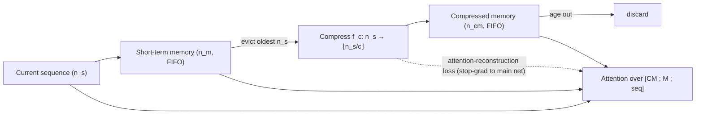

# Compressive Transformers for Long-Range Sequence Modelling — Rae et al., 2019

> **arXiv:** 1911.05507v1 · **Venue:** ICLR 2020 · **Affiliation:** DeepMind

## TL;DR
[Transformer-XL](longseq_2019_transformer-xl.md) extends context with a FIFO memory of past
activations but **throws away** the oldest ones when it fills. The Compressive Transformer instead
**compresses** those evicted activations into a coarser second memory via a learned function (best: a
1D convolution trained with an **attention-reconstruction loss**), roughly doubling the temporal range
at the same attention cost. It sets SOTA on enwik8 (**0.97** bpc) and WikiText-103 (**17.1** ppl),
introduces **PG-19** — a 28,752-book, ~1.97B-word long-range LM benchmark — and generalizes to raw
speech and RL memory tasks.

## Problem & motivation
Transformer-XL keeps a short-term memory of the previous segment's hidden states, but its capacity is
fixed: when new activations arrive, the oldest are **discarded**, permanently losing whatever long-range
information they held. Humans, by contrast, retain a *compressed* gist of the distant past (characters,
events, themes) rather than every word. The paper asks: instead of discarding old memories, can we
**compress and keep** them?

It also introduces **PG-19**, a benchmark built specifically to stress long-range modeling:

| Benchmark | Avg doc length | Size | #Docs | Domain |
|---|---:|---:|---:|---|
| Billion Word | 27 | 4.15 GB | 793K | news sentences |
| Penn Treebank | 355 | 5.1 MB | 10K | news articles |
| WikiText-103 | 3.6K | 515 MB | 267K | Wikipedia |
| **PG-19** | **69K** | **10.9 GB** | **28,752** | **books (pre-1919)** |

PG-19 is **open-vocabulary** (no `<unk>`; the user picks tokenization) and has far longer documents than
prior LM datasets.

## Key idea
Maintain **two** memories per layer: a fine-grained **short-term memory** (like Transformer-XL) and a
**compressed memory** for older content. Parameters: sequence window $n_s$, short-term size $n_m$,
compressed size $n_{cm}$, and **compression rate** $c$.

Every time a new sequence of $n_s$ activations arrives, the oldest $n_s$ short-term memories are evicted;
rather than being dropped, they are compressed by a per-layer function

$$
f_c:\ \mathbb{R}^{n_s\times d}\ \to\ \mathbb{R}^{\lfloor n_s/c\rfloor\times d},
$$

and the $\lfloor n_s/c\rfloor$ outputs are pushed into the compressed memory (also FIFO). Attention at
layer $i$ runs over the concatenation of both memories plus the current sequence:

$$
\text{mem}^{(i)}_t=\big[\,\text{cm}^{(i)}_t\ ;\ \text{m}^{(i)}_t\,\big],\qquad
\text{cm}^{(i)}_t\in\mathbb{R}^{n_{cm}\times d},\ \text{m}^{(i)}_t\in\mathbb{R}^{n_m\times d}.
$$

The data flow is: **current hidden states → short-term memory (FIFO) → compress via $f_c$ → compressed
memory (FIFO) → discard**. Symbols: $d$ hidden size; $c$ how many old states collapse into one; $t$ the
sequence step.


## How it works
### Compression functions (§3.2)
Candidates for $f_c$: max-pooling, mean-pooling, 1D convolution (kernel = stride = $c$), dilated
convolution, and "most-used" (keep the top-$k$ memories by average attention). Pooling is parameter-free;
convolutions are learned and need a training signal.

### Training the compressor
Two auxiliary objectives, both with **gradients stopped from flowing into the main network** (so the LM
task loss is unaffected and no loss-weighting is needed):

- **Auto-encoding loss** (lossless goal): learn a decoder $g$ that reconstructs the original activations,
  $$\mathcal{L}_{ae}=\big\|\,\text{old\_mem}^{(i)}-g(\text{new\_cm}^{(i)})\,\big\|_2^2.$$
- **Attention-reconstruction loss** (lossy, best): preserve the **content-based attention** the network
  would have paid to the original memories,
  $$\mathcal{L}_{ac}=\sum_{\text{layers}}\big\|\,\mathrm{Attn}(\mathbf{h},\ \text{old\_mem}^{(i)})-\mathrm{Attn}(\mathbf{h},\ f_c(\text{old\_mem}^{(i)}))\,\big\|_2^2,$$
  where $\mathbf{h}$ are the current queries. This discards low-attention detail while keeping
  task-relevant structure. Unlike **BPTT** through the compression (which needs unrolling over doubled
  sequence length), $\mathcal{L}_{ac}$ is a cheap **local** objective. Best combo: **1D conv +
  attention-reconstruction** (0.973 bpc on enwik8, beating pooling and BPTT variants).

### Temporal range vs cost
$$
\text{range}=l\times(n_m+c\cdot n_{cm}),\qquad
\text{attention cost/step}=\mathcal{O}\!\big(n_s^2+n_s(n_m+n_{cm})\big),
$$
for $l$ layers. With $n_{cm}=n_m=n/2$ and $c=3$, range $=2l\times n$ (**2× Transformer-XL**) at the same
attention cost as TXL with a length-$n$ memory.



## Training / data
Adam, linear warmup ($10^{-6}\!\to\!3\times10^{-4}$) then cosine decay to $10^{-6}$; **gradient clip 0.1**
(important for stability); optimizer updates applied every 4 steps after 60K iterations (larger effective
batch helps — see analysis). Configs: **PG-19** 36-layer, $n_s{=}n_m{=}512$, $c{=}2$, 256 TPUv3;
**enwik8** 24-layer, $n_s{=}768$, $n_m{=}1152$, $c{=}3$; **WikiText-103** 18-layer, $n_s{=}512$,
$n_m{=}1500$, $c{=}4$; plus a 20-layer waveform model for 24 kHz speech.

## Results
| Benchmark | Compressive Transformer | Transformer-XL | Source |
|---|---:|---:|---|
| PG-19 (test ppl) | **33.6** | 36.3 | §Table 3 |
| enwik8 (bpc) | **0.97** | 0.98 | §Table 4 |
| WikiText-103 (test ppl) | **17.1** | 18.1 | §Table 6 |

- **Rare words drive the gain.** On WikiText-103 the improvement is **~20%** on rare-word buckets
  (10–1K occurrences) vs **~2.6%** on the most frequent words (§Table 7) — the compressed memory helps
  exactly where long context matters.
- **Speech (24 kHz raw waveform):** beats the Transformer-XL baseline and is competitive with WaveNet;
  $c=4$ optimal (Fig. 4).
- **RL (DMLab-30 object matching):** an IMPALA agent with a Compressive Transformer reaches near
  human-level; $c\ge 2$ needed ($c{=}1$, i.e. no compression, fails to learn) (Fig. 5).
- **Attention analysis:** averaged attention *rises* at the memory→compressed-memory boundary — the net
  learns to preserve salient content through compression (Fig. 2).


## Limitations & follow-ups
- Adds architectural + training complexity; only pays off on genuinely long-range tasks.
- Fixed, uniform compression rate $c$; the authors suggest **adaptive per-layer** rates and hybrid
  shallow-long / deep-short memories.
- Conceptually the closest ancestor to input-side latent compression (e.g. LCLM in
  [ctx_compression](../context/ctx_compression.md)), which makes the carried "gist" an **end-to-end
  learned** short latent sequence rather than fixed pooling of activations. Predecessor:
  [Transformer-XL](longseq_2019_transformer-xl.md); orthogonal efficiency axes:
  [Linear Attention](longseq_2020_linear-attention.md), [S4](longseq_2021_s4.md).

## Links
- **arXiv:** [abs](https://arxiv.org/abs/1911.05507) · [html (ar5iv)](https://ar5iv.labs.arxiv.org/html/1911.05507) · [pdf](https://arxiv.org/pdf/1911.05507)
- **Code / data:** PG-19 dataset — <https://github.com/google-deepmind/pg19>
- **BibTeX:**
  ```bibtex
  @inproceedings{rae2019compressive,
    title={Compressive Transformers for Long-Range Sequence Modelling},
    author={Rae, Jack W. and Potapenko, Anna and Jayakumar, Siddhant M. and Hillier, Chloe and Lillicrap, Timothy P.},
    booktitle={International Conference on Learning Representations (ICLR)},
    year={2020}
  }
  ```
- **Related papers:** [Transformer-XL](longseq_2019_transformer-xl.md) · [Linear Attention](longseq_2020_linear-attention.md) · [S4](longseq_2021_s4.md)
