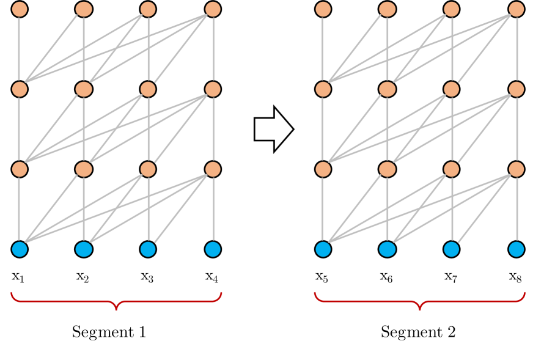
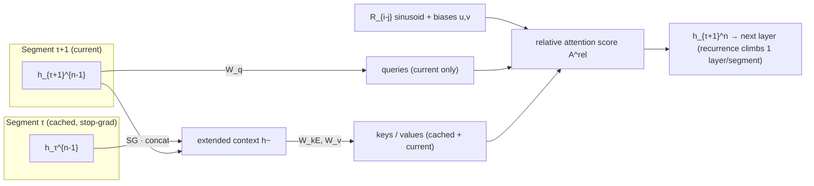

# Transformer-XL: Attentive Language Models Beyond a Fixed-Length Context — Dai et al., 2019

> **arXiv:** 1901.02860v3 · **Venue:** ACL 2019 · **Affiliation:** CMU · Google Brain

## TL;DR
Vanilla Transformer LMs chop text into **independent fixed-length segments**, so they can't model
dependencies longer than one segment and suffer **context fragmentation** at segment boundaries.
Transformer-XL adds two ingredients: **segment-level recurrence** (cache and reuse the previous
segment's hidden states as extra context) and **relative positional encodings** (so cached states
remain positionally coherent). The result models dependencies **~80% longer than RNNs and ~450%
longer than vanilla Transformers**, evaluates **up to 1,874× faster**, and sets SOTA on WikiText-103
(**18.3** ppl), enwik8 (**0.99** bpc), text8 (**1.08** bpc), One Billion Word (**21.8** ppl), and PTB
(**54.5** ppl).

## Problem & motivation
A vanilla Transformer LM is trained on segments of a few hundred tokens processed **in isolation** —
no gradient or information flows across segment boundaries. Two failures follow:

1. **Bounded dependency length.** The longest dependency the model can represent is the segment length;
   self-attention's freedom from vanishing gradients is wasted because context is truncated.
2. **Context fragmentation.** Segments are cut without respecting sentence/paragraph boundaries, so the
   first tokens of each segment have no context — inefficient optimization and worse predictions.

At evaluation, the vanilla model slides the window **one token at a time** and recomputes the entire
segment for every prediction to preserve maximal context — correct but extremely expensive. Measured
**Relative Effective Context Length (RECL)**: vanilla Transformer ≈ **128** tokens, LSTM ≈ **400**,
Transformer-XL ≈ **900**.



## Key idea
### 1. Segment-level recurrence with state reuse
Cache the previous segment's hidden states and **prepend** them (detached from the gradient) to the
current segment when computing keys and values. For consecutive segments
$\mathbf{s}_\tau=[x_{\tau,1},\dots,x_{\tau,L}]$ and $\mathbf{s}_{\tau+1}$, with layer-$n$ hidden states
$\mathbf{h}_\tau^n\in\mathbb{R}^{L\times d}$, the extended context is

$$
\tilde{\mathbf{h}}_{\tau+1}^{n-1} = \big[\,\mathrm{SG}(\mathbf{h}_{\tau}^{n-1}) \circ \mathbf{h}_{\tau+1}^{n-1}\,\big],
$$

$$
\mathbf{q}_{\tau+1}^{n}=\mathbf{h}_{\tau+1}^{n-1}\mathbf{W}_q^\top,\quad
\mathbf{k}_{\tau+1}^{n}=\tilde{\mathbf{h}}_{\tau+1}^{n-1}\mathbf{W}_k^\top,\quad
\mathbf{v}_{\tau+1}^{n}=\tilde{\mathbf{h}}_{\tau+1}^{n-1}\mathbf{W}_v^\top,
$$

where $\mathrm{SG}(\cdot)$ is **stop-gradient**, $\circ$ concatenates along length, $L$ is segment
length, $d$ the hidden size. **Queries come from the current segment only; keys/values come from the
extended (cached + current) context.** Because the reused state feeds one layer up per segment, the
effective dependency length grows as $O(N\times L)$ for an $N$-layer model. At evaluation, the cache can
hold **more than one** past segment ($M\ge L$), extending context further with no recomputation.


### 2. Relative positional encodings
Naïve absolute encodings break under recurrence: tokens $x_{\tau,j}$ and $x_{\tau+1,j}$ would receive the
**same** positional vector $\mathbf{U}_j$, making segments indistinguishable. Transformer-XL instead
encodes the **relative** distance $i-j$ directly in the attention score. Decomposing the absolute-encoding
score and re-parameterizing gives

$$
\mathbf{A}^{\text{rel}}_{i,j}=
\underbrace{\mathbf{E}_{x_i}^\top\mathbf{W}_q^\top\mathbf{W}_{k,E}\mathbf{E}_{x_j}}_{\text{(a) content–content}}
+\underbrace{\mathbf{E}_{x_i}^\top\mathbf{W}_q^\top\mathbf{W}_{k,R}\mathbf{R}_{i-j}}_{\text{(b) content–position}}
+\underbrace{u^\top\mathbf{W}_{k,E}\mathbf{E}_{x_j}}_{\text{(c) global content bias}}
+\underbrace{v^\top\mathbf{W}_{k,R}\mathbf{R}_{i-j}}_{\text{(d) global position bias}},
$$

with symbols: $\mathbf{E}_{x_i}$ the token embedding at position $i$; $\mathbf{W}_q$ the query projection;
$\mathbf{W}_{k,E},\mathbf{W}_{k,R}$ **separate** key projections for content and position; $\mathbf{R}_{i-j}$
a **fixed sinusoidal** encoding of the relative distance $i-j$; and $u,v\in\mathbb{R}^d$ **learned global
bias vectors** replacing the query's positional term (the attentive bias should not depend on the query's
absolute position). This factorization also gives Transformer-XL a useful **length-generalization**
property: a model trained with memory $M$ transfers to $k\times M$ memory at test time.

## How it works
Per layer $n$ (single head), with memory $\mathbf{m}_\tau^{n-1}$ (cached states):

$$
\tilde{\mathbf{h}}_{\tau}^{n-1}=[\mathrm{SG}(\mathbf{m}_\tau^{n-1})\circ\mathbf{h}_\tau^{n-1}],
$$
$$
\mathbf{q}_\tau^n=\mathbf{h}_\tau^{n-1}\mathbf{W}_q^{n\top},\;
\mathbf{k}_\tau^n=\tilde{\mathbf{h}}_\tau^{n-1}\mathbf{W}_{k,E}^{n\top},\;
\mathbf{v}_\tau^n=\tilde{\mathbf{h}}_\tau^{n-1}\mathbf{W}_v^{n\top},
$$
$$
\mathbf{A}^n_{\tau,i,j}=\mathbf{q}^{n\top}_{\tau,i}\mathbf{k}^n_{\tau,j}
+\mathbf{q}^{n\top}_{\tau,i}\mathbf{W}_{k,R}^{n\top}\mathbf{R}_{i-j}
+u^\top\mathbf{k}^n_{\tau,j}+v^\top\mathbf{W}_{k,R}^{n\top}\mathbf{R}_{i-j},
$$

then softmax + weighted sum of $\mathbf{v}$, residual, and position-wise FFN as usual;
$\mathbf{h}_\tau^0=\mathbf{E}\mathbf{s}_\tau$. The term $\mathbf{W}_{k,R}\mathbf{R}_{i-j}$ over all $(i,j)$
is computed in $O(L)$ (not $O(L^2)$) via a shift trick (Appendix B).



**Defaults:** WikiText-103 train segment $L=384$, eval memory $M=1600$; enwik8 $L=784$, eval length
$3800$. Uses adaptive softmax / adaptive input for large word-level vocabularies.

## Training / data
Standard next-token cross-entropy LM. Datasets and headline configs:
- **WikiText-103** (word, 103M tokens): 151M-param standard, 257M-param large.
- **enwik8** / **text8** (char, 100M): 24-layer, 277M params.
- **One Billion Word** (word, shuffled sentences → tests short-range + fragmentation).
- **Penn Treebank** (word, 1M → tests small-data generalization; variational dropout, weight averaging).

Two loss variants studied: **full loss** (CE on all positions) vs **half loss** (CE on the recent half,
used to make absolute encodings generalize). Gradients never cross the segment boundary (stop-gradient).

## Results
| Benchmark | Transformer-XL | Prior SOTA | Source |
|---|---:|---:|---|
| WikiText-103 (ppl) | **18.3** (257M) | 20.5 (Baevski & Auli) | §Table 1 |
| enwik8 (bpc) | **0.99** (24L, 277M) | 1.06 / 1.13 (Al-Rfou 64L) | §Table 2 |
| text8 (bpc) | **1.08** | 1.13 (Al-Rfou 64L) | §Table 3 |
| One Billion Word (ppl) | **21.8** | 23.7 (Baevski & Auli) | §Table 4 |
| Penn Treebank (ppl) | **54.5** | prior best | §Table 5 |

- **RECL:** ~900 tokens vs 128 (vanilla) / 400 (LSTM) → **+80% vs RNN, +450% vs vanilla** (§Table 8).
- **Eval speedup vs vanilla** (per-token, attention length): 363× @800, 773× @1800, 1409× @2800,
  **1874× @3800** (§Table 9).
- **Ablations:** both recurrence *and* relative encodings are needed for best ppl; on One Billion Word,
  recurrence alone gives **~1.9 ppl** improvement even with no long-term dependencies — direct evidence it
  fixes context fragmentation (§Tables 6–7).

## Limitations & follow-ups
- **Stop-gradient recurrence** means no long-range credit assignment across segments; the receptive field
  grows only linearly in depth ($O(N\times L)$).
- The FIFO cache **discards** the oldest states once full — motivating
  [Compressive Transformer](longseq_2019_compressive-transformer.md), which *compresses* rather than
  discards. The relative-encoding + recurrence recipe fed directly into **XLNet** and later long-context
  Transformers. Orthogonal efficiency lines that keep every token but change the mixing:
  [Linear Attention](longseq_2020_linear-attention.md) and [S4](longseq_2021_s4.md).

## Links
- **arXiv:** [abs](https://arxiv.org/abs/1901.02860) · [html (ar5iv)](https://ar5iv.labs.arxiv.org/html/1901.02860) · [pdf](https://arxiv.org/pdf/1901.02860)
- **Code:** <https://github.com/kimiyoung/transformer-xl>
- **BibTeX:**
  ```bibtex
  @inproceedings{dai2019transformer,
    title={Transformer-XL: Attentive Language Models beyond a Fixed-Length Context},
    author={Dai, Zihang and Yang, Zhilin and Yang, Yiming and Carbonell, Jaime and Le, Quoc V. and Salakhutdinov, Ruslan},
    booktitle={Proceedings of the 57th Annual Meeting of the Association for Computational Linguistics (ACL)},
    year={2019}
  }
  ```
- **Related papers:** [Compressive Transformer](longseq_2019_compressive-transformer.md) · [Linear Attention](longseq_2020_linear-attention.md) · [S4](longseq_2021_s4.md)
