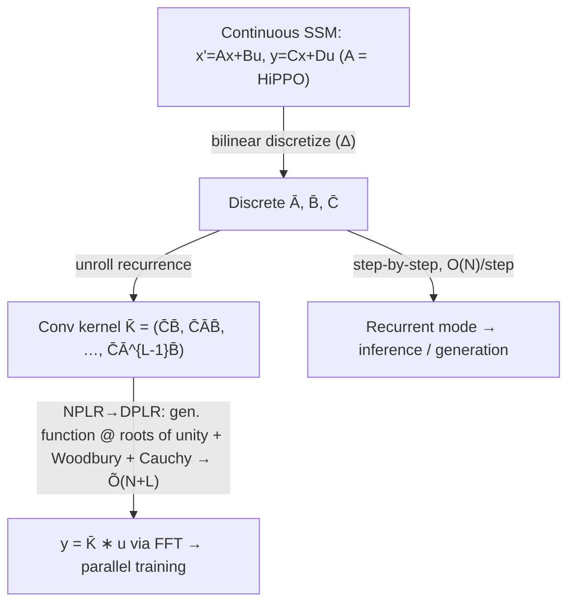

# Efficiently Modeling Long Sequences with Structured State Spaces (S4) — Gu et al., 2021

> **arXiv:** 2111.00396v3 · **Venue:** ICLR 2022 · **Affiliation:** Stanford University

## TL;DR
S4 models a sequence with a **linear state-space model (SSM)** $x'(t)=Ax(t)+Bu(t),\ y(t)=Cx(t)+Du(t)$,
initialized with the **HiPPO** matrix so the hidden state provably memorizes long history. The naive SSM
is too expensive because of repeated powers of $A$; S4's contribution is a **new parameterization**
(condition $A$ as **Normal-Plus-Low-Rank**) that computes the SSM convolution kernel in
$\tilde{O}(N+L)$ instead of $O(N^2L)$. One model runs in three equivalent views — **continuous**,
**recurrent** (O(1)/step inference), **convolutional** (parallel training). S4 is the first model to
solve **Path-X** (length 16,384) and sets records across Long Range Arena, raw Speech Commands, and
long-context autoregressive tasks.

## Problem & motivation
No single architecture handled long-range dependencies well across modalities: RNNs vanish/explode and
are slow; CNNs have bounded receptive fields; Transformers are $O(L^2)$ and, empirically, failed the
hardest **Long Range Arena (LRA)** tasks. In particular **Path-X** — classify whether two dots in a
$128\times128$ image (flattened to length **16,384**) are connected — defeated all prior models (random
50% accuracy). A prior SSM ("LSSL") had the right theory (HiPPO memory) but was **computationally
infeasible** due to naive powers of the state matrix. Goal: a general, efficient long-range model.


## Key idea
### The continuous state-space model
A 1-D input $u(t)$ is mapped to output $y(t)$ through an $N$-dimensional latent state $x(t)$:

$$
x'(t)=A\,x(t)+B\,u(t),\qquad y(t)=C\,x(t)+D\,u(t),
$$

with $A\in\mathbb{R}^{N\times N}$ (state/transition), $B\in\mathbb{R}^{N\times1}$, $C\in\mathbb{R}^{1\times N}$,
$D\in\mathbb{R}^{1\times1}$ (a skip connection, often folded out). Multiple such SSMs run in parallel to
form a feature dimension $H$.

### HiPPO initialization for memory
Random $A$ forgets quickly. Initialize $A$ with the **HiPPO-LegS** matrix, which makes $x(t)$ compress the
history of $u$ onto Legendre polynomial coefficients:

$$
A_{nk}=-\begin{cases}
(2n+1)^{1/2}(2k+1)^{1/2}, & n>k,\\
n+1, & n=k,\\
0, & n<k.
\end{cases}
\tag{Eq. 2}
$$

This single change is what lets the SSM capture dependencies over tens of thousands of steps.

### Discretization
For a step size $\Delta$, the **bilinear (Tustin)** transform gives a discrete recurrence:

$$
\bar A=\Big(I-\tfrac{\Delta}{2}A\Big)^{-1}\Big(I+\tfrac{\Delta}{2}A\Big),\quad
\bar B=\Big(I-\tfrac{\Delta}{2}A\Big)^{-1}\Delta B,\quad
\bar C=C,
$$
$$
x_k=\bar A\,x_{k-1}+\bar B\,u_k,\qquad y_k=\bar C\,x_k.
$$

### The SSM is a convolution
Unrolling the linear recurrence with $x_{-1}=0$ shows $y$ is a convolution of $u$ with a fixed **SSM
convolution kernel**:

$$
\bar K=\big(\bar C\bar B,\ \bar C\bar A\bar B,\ \dots,\ \bar C\bar A^{L-1}\bar B\big)\in\mathbb{R}^{L},
\qquad y=\bar K * u.
\tag{Eq. 5}
$$

Computing $\bar K$ naively needs $L$ powers of the $N\times N$ matrix $\bar A$ — $O(N^2L)$ operations and
$O(NL)$ memory, the bottleneck S4 removes.

## How it works
### The S4 parameterization (the core contribution)
Instead of a dense $A$, condition it as **Normal Plus Low-Rank (NPLR)**:

$$
A=V\,\Lambda\,V^{*}-P\,Q^\top
= V\big(\Lambda-(V^*P)(V^*Q)^{*}\big)V^{*},
$$

so under the unitary change of basis $V$ the effective matrix is **Diagonal Plus Low-Rank (DPLR)**
$\tilde A=\Lambda-PQ^{*}$ ($\Lambda$ diagonal, $P,Q$ low-rank; HiPPO-LegS admits such a decomposition).
Under DPLR the kernel is computed **without** materializing matrix powers:

1. **Work in the frequency domain.** Compute the truncated **generating function**
   $\hat K(\omega)=\sum_{\ell=0}^{L-1}\bar C\bar A^{\ell}\bar B\,\omega^{\ell}$ at the $L$ **roots of unity**;
   $\bar K$ is then recovered by an inverse FFT. This replaces the power sequence with a single evaluation.
2. **Woodbury identity.** The low-rank term $-PQ^{*}$ is removed by the Woodbury matrix-inversion lemma,
   reducing everything to the **diagonal** case.
3. **Cauchy kernel.** The diagonal case is a Cauchy matrix–vector product with entries
   $M_{ij}=\dfrac{1}{\omega_i-\lambda_j}$, computable in $\tilde O(N+L)$ by stable numerical algorithms.

Net complexity: **$\tilde O(N+L)$ time and $O(N+L)$ space** to produce the length-$L$ kernel, versus
$O(N^2L)$ / $O(NL)$ naively — with **no approximation** of the SSM.

### Two computational modes, one model
- **Convolutional (training):** precompute $\bar K$ once, apply $y=\bar K*u$ via FFT — fully parallel over
  the sequence.
- **Recurrent (inference / generation):** step the linear recurrence $x_k=\bar A x_{k-1}+\bar B u_k$ with
  a **constant $O(N)$ state per step**, unbounded context, no KV cache.
- **Continuous:** the underlying ODE, enabling resolution/step-size changes and principled initialization.



Trainable parameters per SSM: $\Lambda,P,Q,B,C$ (complex) and the log step size $\Delta$; $A$ stays
structured. S4 layers are stacked like Transformer blocks with nonlinear mixing between them.

## Training / data
Task-specific losses (classification cross-entropy, per-pixel density, LM perplexity). $\Delta$ is learned
in log-space; $A,B$ (SSM dynamics) optionally trained with a small/zero LR while $C,\Delta$ carry most of
the learning. Benchmarks span pixel-sequence classification, raw 1-D audio, Long Range Arena, time-series
forecasting, and autoregressive language/image modeling.

## Results
| Benchmark | S4 | Prior best | Source |
|---|---:|---:|---|
| **Path-X** (LRA, len 16,384) | **88.10%** | 50% (all prior = random) | §Table 4 |
| LRA average | **86.09%** | 59–60% (Transformer variants) | §Table 4 |
| Speech Commands (raw, 16 kHz) | **98.32%** | 95.3 (specialized CNN) | §Table 5 |
| sMNIST | **99.63%** | 99.5 | §Table 6 |
| pMNIST | **98.70%** | 98.3 | §Table 6 |
| sCIFAR (seq. pixels) | **91.13%** | 89.5 | §Table 6 |
| CIFAR-10 density | **2.85** bits/dim | — | §Table 7 |
| WikiText-103 | **20.95** ppl | Transformer baseline | §Table 8 |

- **First model to solve Path-X** (length-16,384 dependencies) — every prior model scored chance.
- On WikiText-103, S4 generates at **48K tokens/s** — roughly **60× faster** than a Transformer with a KV
  cache, thanks to the $O(N)$ recurrent inference mode (§Table 8).
- **Efficiency:** the DPLR kernel makes S4 as fast/memory-light as the best prior efficient models while
  strictly more accurate — e.g. large speedups over the naive LSSL SSM it derives from.


## Limitations & follow-ups
- The NPLR/DPLR math and complex parameterization are intricate; later work simplifies it: **DSS** and
  **S4D** show a purely **diagonal** SSM suffices, and **Mamba** adds input-dependent (selective) SSM
  dynamics with a hardware-aware scan, becoming a leading attention-free LM backbone.
- SSMs are linear-time-invariant by default (fixed kernel), so content-dependent routing is limited —
  precisely what selective SSMs (Mamba) and gated linear attention address.
- Shares the "constant-state recurrence" philosophy with
  [Linear Attention](longseq_2020_linear-attention.md); an alternative to keeping full attention with
  cached/compressed memory as in [Transformer-XL](longseq_2019_transformer-xl.md) and
  [Compressive Transformer](longseq_2019_compressive-transformer.md).

## Links
- **arXiv:** [abs](https://arxiv.org/abs/2111.00396) · [html (ar5iv)](https://ar5iv.labs.arxiv.org/html/2111.00396) · [pdf](https://arxiv.org/pdf/2111.00396)
- **Code:** <https://github.com/state-spaces/s4>
- **BibTeX:**
  ```bibtex
  @inproceedings{gu2021efficiently,
    title={Efficiently Modeling Long Sequences with Structured State Spaces},
    author={Gu, Albert and Goel, Karan and R{\'e}, Christopher},
    booktitle={International Conference on Learning Representations (ICLR)},
    year={2022}
  }
  ```
- **Related papers:** [Transformer-XL](longseq_2019_transformer-xl.md) · [Compressive Transformer](longseq_2019_compressive-transformer.md) · [Linear Attention](longseq_2020_linear-attention.md)
