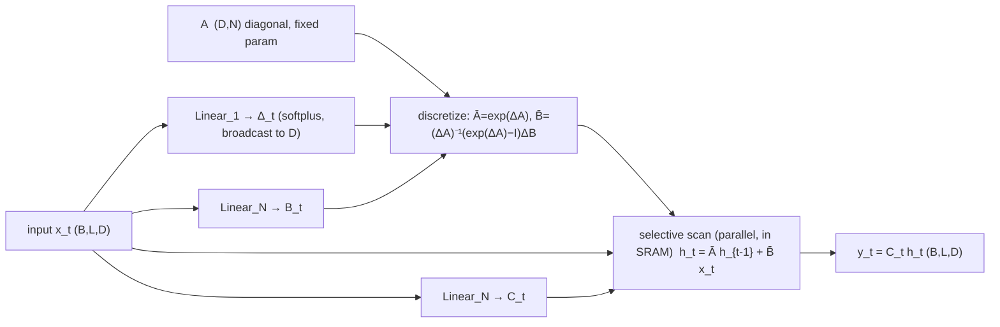

# Mamba: Linear-Time Sequence Modeling with Selective State Spaces — Gu & Dao, 2023

> **arXiv:** 2312.00752v2 · **Venue:** COLM 2024 · **Affiliation:** CMU & Princeton

## TL;DR
Mamba makes a **state-space model (SSM)** *content-aware* by letting its parameters
$(\Delta, B, C)$ be **functions of the input** (the **selection** mechanism, a.k.a. **S6**). This
lets the recurrent state selectively remember or forget each token — fixing the key weakness of
prior linear-time models ([S4](longseq_2021_s4.md), [Linear Attention](longseq_2020_linear-attention.md))
on information-dense modalities like text. Input-dependence breaks the convolution trick, so Mamba
adds a **hardware-aware selective scan** (kernel fusion + parallel scan + recomputation) that keeps
training linear in sequence length. Packaged into a simple attention-free, MLP-free block, **Mamba-3B
matches Transformers twice its size**, runs at **5× generation throughput** (no KV cache), and
extrapolates to **million-length** contexts.

## Problem & motivation
Transformers route information densely via attention but pay **$O(L^2)$** training cost and store the
entire context as a **KV cache** at inference. Sub-quadratic alternatives — linear attention, gated
convolutions, and structured SSMs — are efficient but had **never matched attention on language**. The
authors diagnose the root cause as an inability to perform **content-based reasoning**: prior SSMs are
**Linear Time-Invariant (LTI)**, i.e. the dynamics $(\Delta, A, B, C)$ are *fixed across time*, so the
model cannot select which tokens to keep in its finite state based on their content.

Two synthetic tasks expose this:
- **Selective Copying** — copy specially-marked tokens while ignoring random-spaced filler. Requires
  *content-aware* memory; LTI convolutions cannot solve it because the input→output spacing varies.
- **Induction Heads** — associative recall ("Harry ⇒ Potter"), the mechanism behind in-context learning.


The tension is fundamental: **efficient models need a small state; effective models need a state that
holds everything relevant.** Mamba's thesis is that **selectivity** — the ability to compress context
by filtering — resolves the trade-off.

## Key idea
### From S4 to a selective SSM
A structured SSM maps a 1-D signal $x(t)\in\mathbb{R}$ to $y(t)\in\mathbb{R}$ through an $N$-dimensional
latent state $h(t)$, applied **independently to each of the $D$ channels**:

$$
h'(t)=A\,h(t)+B\,x(t),\qquad y(t)=C\,h(t).\tag{1}
$$

Discretizing with step $\Delta$ (zero-order hold, ZOH) gives a linear recurrence and an equivalent
global convolution:

$$
h_t=\bar A\,h_{t-1}+\bar B\,x_t,\qquad y_t=C\,h_t\tag{2}
$$
$$
\bar K=(C\bar B,\ C\bar A\bar B,\ \dots,\ C\bar A^{k}\bar B,\ \dots),\qquad y=x*\bar K\tag{3}
$$
$$
\bar A=\exp(\Delta A),\qquad \bar B=(\Delta A)^{-1}\big(\exp(\Delta A)-I\big)\cdot\Delta B.\tag{4}
$$

Here $A\in\mathbb{R}^{N\times N}$ is kept **diagonal** (so it is $N$ numbers), $B\in\mathbb{R}^{N\times1}$,
$C\in\mathbb{R}^{1\times N}$; the total hidden state per input is $D\!\cdot\!N$. Prior SSMs use the
**convolutional** view (3) for parallel training and the **recurrent** view (2) for $O(1)$/step inference —
but this duality *requires* the parameters to be constant across time (LTI).

### The selection mechanism (S6)
Mamba's one change: make $\Delta, B, C$ **input-dependent** so the dynamics become **time-varying**:

$$
s_B(x)=\mathrm{Linear}_N(x),\quad s_C(x)=\mathrm{Linear}_N(x),\quad
s_\Delta(x)=\mathrm{Broadcast}_D(\mathrm{Linear}_1(x)),\quad \tau_\Delta=\mathrm{softplus}.
$$

So $B_t=s_B(x_t)$, $C_t=s_C(x_t)$, and $\Delta_t=\tau_\Delta(\text{param}+s_\Delta(x_t))$ now carry a
length dimension. $A$ stays fixed but is modulated through $\bar A=\exp(\Delta_t A)$, so **selectivity in
$\Delta$ suffices** to make $(\bar A,\bar B)$ selective. Intuitively:
- **large $\Delta_t$** → reset the state and focus on the current token $x_t$;
- **small $\Delta_t$** → persist the state and ignore $x_t$.

This is exactly a content-based gate. **Theorem 1** makes the link precise: with $N=1$, $A=-1$, $B=1$,
$s_\Delta=\mathrm{Linear}$, $\tau_\Delta=\mathrm{softplus}$, the recurrence becomes the classic gated RNN

$$
g_t=\sigma(\mathrm{Linear}(x_t)),\qquad h_t=(1-g_t)\,h_{t-1}+g_t\,x_t.\tag{5}
$$

So $\Delta$ **generalizes the RNN forget/input gate**; $B$ and $C$ add finer control over what enters the
state and what the state emits.

## How it works
### Selective SSM computation



Because the parameters vary with $t$, the convolution form (3) no longer applies. A naive recurrence must
materialize a state tensor of shape $(B,L,D,N)$ — a factor $N$ ($\approx 10\text{–}100$) larger than the
input — which is prohibitively memory-bound. The **hardware-aware selective scan** avoids this:

1. **Kernel fusion.** Load $(\Delta, A, B, C)$ from slow **HBM** into fast **SRAM**, perform the
   discretization *and* the recurrence there, and write back only the output $(B,L,D)$ — never
   materializing the expanded $(B,L,D,N)$ state in HBM.
2. **Parallel scan.** The recurrence, though sequential in form, is computed with a work-efficient
   **parallel (associative) scan**, so it parallelizes across the length dimension.
3. **Recomputation.** Intermediate states are **not stored** for the backward pass; they are recomputed
   from inputs reloaded HBM→SRAM, giving the same memory footprint as an optimized FlashAttention layer.

The recurrent path uses $O(BLDN)$ FLOPs (with a low constant) vs. $O(BLD\log L)$ for convolutions — so for
long sequences and modest $N$ it is *fewer* FLOPs. In practice the scan is **20–40× faster** than a naive
PyTorch implementation and **faster than FlashAttention-2 beyond sequence length ~2K**.

### The Mamba block
Prior SSM architectures (e.g. **H3**) interleave an SSM "attention-like" block with a separate MLP. Mamba
**fuses them into one homogeneous block** that is simply stacked (inspired by gated-attention units):


- Expansion factor **$E=2$**; most parameters ($3ED^2$) live in the input/output linear projections, while
  the SSM parameters ($\Delta,B,C,A$ projections) are comparatively tiny.
- Two stacked Mamba blocks match the $12D^2$ parameters of a Transformer's MHA+MLP pair.
- **SiLU/Swish** activation (so the gated branch behaves like SwiGLU); an optional **LayerNorm**
  (RetNet-style). Real-valued diagonal $A$ (init **S4D-Real**, $A_n=-(n+1)$) is the default; complex
  (S4D-Lin) is used only for continuous modalities like audio. $\Delta$ bias is initialized to
  $\tau_\Delta^{-1}(\mathrm{Uniform}([0.001,0.1]))$.


### Why selection is compression
The paper frames the whole design through **"selection as compression"**: attention is effective but
*never compresses* (it keeps the full KV cache → slow); RNNs compress into a finite state (fast) but their
fixed dynamics compress *badly*. A **content-aware** selection lets a finite-state model reset on document
boundaries, skip fillers ("um"), and keep only what matters — so quality can improve monotonically with
context length.

## Training / data
- **Language:** Pile dataset, GPT-3-style model sizes (125M–1.4B for scaling laws, up to 2.8B for
  downstream), trained with the same tokenizer/data/length (300B tokens, GPT-NeoX tokenizer) as Pythia/RWKV
  for a fair comparison. Baseline "Transformer++" is the strong LLaMa recipe (RoPE, SwiGLU, RMSNorm, no
  biases).
- **DNA:** HG38 human genome (~4.5B base-pair tokens), next-token pretraining; scaling in model size and in
  sequence length up to $2^{20}\approx 10^6$.
- **Audio:** YouTubeMix piano (16 kHz) for autoregressive pretraining and **SC09** spoken digits for
  generation, replacing SaShiMi's S4+MLP blocks with Mamba (here using the *complex* parameterization).

## Results
| Task | Metric | Mamba | Baseline | Source |
|---|---|---:|---:|---|
| **Zero-shot avg** (2.8B, 300B tok) | acc ↑ | **63.3** | Pythia-2.8B 59.1 · Pythia-6.9B 61.7 | §Table 1 |
| Mamba-2.8B Pile ppl | ppl ↓ | **6.22** | Pythia-2.8B 6.73 | §Table 1 |
| Mamba-1.4B avg | acc ↑ | **59.7** | Pythia-1.4B 55.2 | §Table 1 |
| **Selective Copying** | acc ↑ | **99.8** (Mamba+S6) | S4 (no gate) 18.3 | §Fig. 4 |
| **Induction Heads** extrapolation | max len | **1,048,576** (trained @256) | others ≤ 2× train len | §Fig. 5 |
| **SC09** speech gen (6.1M) | FID ↓ | **0.94** (Mamba-Mamba) | SaShiMi 1.99 · DiffWave+SaShiMi 1.42 | §Fig. 10 |
| Selective-SSM ablation | ppl ↓ | **8.71** (sel. Δ,B,C) | 10.93 (all non-selective) | §Fig. 13 |

- **Language:** Mamba is the **first attention-free model to match the Transformer++ recipe** in scaling
  laws, and **Mamba-3B outperforms Pythia-3B by ~4 points and exceeds Pythia-7B** on common-sense reasoning.
- **Extrapolation:** trained on induction heads at length 256, Mamba solves it **perfectly out to 1M
  tokens (4000× training length)** — no other method exceeds 2×.
- **Throughput:** **4–5× higher generation throughput** than a same-size Transformer, because with no KV
  cache it runs at much larger batch sizes; an (untrained) Mamba-6.9B beats a 5× smaller Transformer-1.3B.
- **Long context helps:** on DNA and audio, quality **improves monotonically up to 1M-length** sequences,
  whereas LTI baselines (HyenaDNA) degrade.
- **Ablations:** the selective $\Delta$ is the single most important parameter (Theorem 1); increasing the
  state size $N$ yields **>1.0 ppl** improvement for only ~1% more parameters — **but only when $B,C$ are
  also selective**.

## Limitations & follow-ups
- **Scale unproven at the time:** experiments stop at ~2.8B; whether the advantage holds at 7B+ (vs. LLaMa,
  RWKV, RetNet) was left open — later addressed by **Mamba-2** and hybrid models (Jamba, Zamba).
- **No free lunch on continuous data:** selectivity helps discrete modalities (text, DNA) but can *hurt* on
  perceptual signals where LTI SSMs excel; audio needed the complex parameterization.
- **Ecosystem gap:** the rich Transformer tooling (fine-tuning, quantization, in-context learning
  affordances) was untested for SSMs.
- **Lineage:** Mamba is the *selective* successor to [S4](longseq_2021_s4.md); its constant-state
  recurrence philosophy is shared with [Linear Attention](longseq_2020_linear-attention.md), and it is an
  alternative to the cached/compressed-memory route of
  [Transformer-XL](longseq_2019_transformer-xl.md) and
  [Compressive Transformer](longseq_2019_compressive-transformer.md). The **hybrid** direction (mix a few
  global-attention layers with linear/SSM layers) is exactly what [Kimi Linear](longseq_2025_kimi-linear.md)
  later industrializes.

## Links
- **arXiv:** [abs](https://arxiv.org/abs/2312.00752) · [html](https://arxiv.org/html/2312.00752v2) · [pdf](https://arxiv.org/pdf/2312.00752)
- **Code:** <https://github.com/state-spaces/mamba>
- **BibTeX:**
  ```bibtex
  @inproceedings{gu2023mamba,
    title={Mamba: Linear-Time Sequence Modeling with Selective State Spaces},
    author={Gu, Albert and Dao, Tri},
    booktitle={Conference on Language Modeling (COLM)},
    year={2024}
  }
  ```
- **Related papers:** [S4](longseq_2021_s4.md) · [Linear Attention](longseq_2020_linear-attention.md) · [Kimi Linear](longseq_2025_kimi-linear.md) · [MLA / DeepSeek-V2](longseq_2024_deepseek-v2-mla.md) · [Transformer-XL](longseq_2019_transformer-xl.md) · [Compressive Transformer](longseq_2019_compressive-transformer.md)
- **In-repo:** [Efficient long-sequence modeling thread](../context/long_seq/long_seq.md) · [LCLM context compression](../context/ctx_compression.md)
