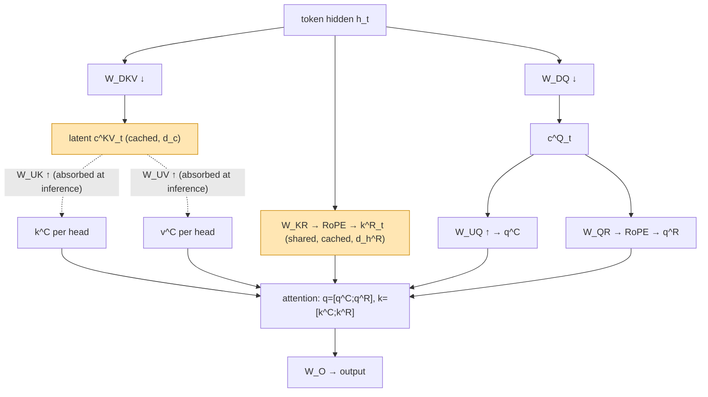
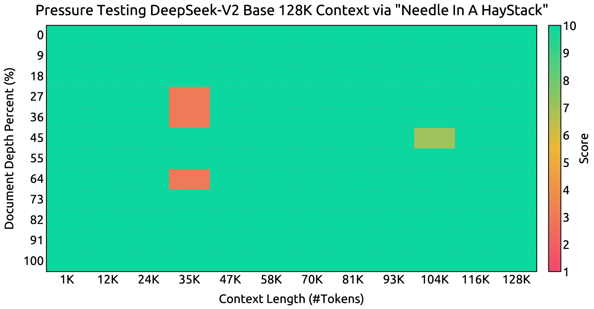

# DeepSeek-V2: A Strong, Economical, and Efficient MoE Language Model (Multi-head Latent Attention) — DeepSeek-AI, 2024

> **arXiv:** 2405.04434v5 · **Affiliation:** DeepSeek-AI · **Model:** 236B total / 21B active MoE, 128K context

## TL;DR
DeepSeek-V2 introduces **Multi-head Latent Attention (MLA)**: instead of caching a full key/value pair
per head per token, it caches a single **low-rank latent vector** $c^{KV}_t$ (plus one small
RoPE-carrying key), and reconstructs the per-head keys/values on the fly. This shrinks the **KV cache by
93.3%** relative to the vanilla MHA of DeepSeek-67B while *improving* quality over MHA. Combined with the
sparse **DeepSeekMoE** feed-forward, DeepSeek-V2 trains at **42.5% lower cost** and serves at **5.76×
higher generation throughput**, while topping open-source benchmarks and handling **128K-token** context.
MLA is the **KV-side** analog of input-side soft-token compression: both shrink what the decoder must hold.

## Problem & motivation
Autoregressive Transformer inference is bottlenecked by the **KV cache**, which grows linearly with
context length and number of heads. The standard mitigations trade quality for memory:
- **Multi-Query Attention (MQA)** and **Grouped-Query Attention (GQA)** share keys/values across heads,
  cutting the cache but degrading quality.
- **Multi-Head Attention (MHA)** keeps full quality but the largest cache.

DeepSeek-V2's goal: **cut the KV cache far below GQA/MQA while matching or beating MHA quality**, so a
strong MoE model can be served cheaply at long context.


## Key idea
### Low-rank joint KV compression
Let $h_t\in\mathbb{R}^{d}$ be the attention input for token $t$, with $n_h$ heads of dimension $d_h$. MLA
projects $h_t$ **down** to a small latent, caches only that, then projects **up** to per-head keys/values:

$$
c^{KV}_t = W^{DKV}\,h_t \in \mathbb{R}^{d_c},\qquad d_c \ll n_h d_h \tag{9}
$$
$$
k^{C}_t = W^{UK}\,c^{KV}_t,\qquad v^{C}_t = W^{UV}\,c^{KV}_t \tag{10,11}
$$

where $W^{DKV}\in\mathbb{R}^{d_c\times d}$ is the **down-projection** and $W^{UK},W^{UV}\in\mathbb{R}^{n_h d_h\times d_c}$
are the **up-projections**. **Only $c^{KV}_t$ is cached** (dimension $d_c$), not the $n_h d_h$-sized keys and
values.

Queries are compressed the same way — not to save cache, but to shrink **activation memory** during
training:

$$
c^{Q}_t = W^{DQ}\,h_t \in \mathbb{R}^{d_c'},\qquad q^{C}_t = W^{UQ}\,c^{Q}_t. \tag{12,13}
$$

### The RoPE incompatibility and the decoupled fix
At inference the up-projections can be **absorbed** to avoid ever materializing keys/values: $W^{UK}$ folds
into $W^{UQ}$ (since $q^\top k = (W^{UQ}c^Q)^\top (W^{UK}c^{KV}) = c^{Q\top}(W^{UQ\top}W^{UK})c^{KV}$), and
$W^{UV}$ folds into the output projection $W^{O}$. But **RoPE breaks this**: a position-dependent rotation
sits between $q$ and $k$, so $W^{UK}$ can no longer be absorbed into $W^{UQ}$.

MLA's fix is a **decoupled RoPE**: add *extra*, small RoPE-carrying dimensions that live outside the
compressed path.

$$
q^{R}_{t} = \mathrm{RoPE}(W^{QR}\,c^{Q}_t),\qquad k^{R}_{t} = \mathrm{RoPE}(W^{KR}\,h_t) \tag{14,15}
$$
$$
q_{t,i} = [\,q^{C}_{t,i}\,;\,q^{R}_{t,i}\,],\qquad k_{t,i} = [\,k^{C}_{t,i}\,;\,k^{R}_{t}\,] \tag{16}
$$

The RoPE key $k^{R}_t\in\mathbb{R}^{d_h^{R}}$ is **shared across all heads**. So the inference cache is just
the latent plus one shared RoPE key: **$(d_c + d_h^{R})\cdot l$** elements for $l$ layers.

### Why the cache is so small
| Method | KV cache per token | Notes |
|---|---|---|
| MHA | $2\,n_h d_h\,l$ | full key+value per head |
| GQA ($n_g$ groups) | $2\,n_g d_h\,l$ | shared within group |
| MQA | $2\,d_h\,l$ | one shared key/value |
| **MLA** | $(d_c + d_h^{R})\,l \approx \tfrac{9}{2}d_h\,l$ | ≈ GQA with 2.25 groups, but **stronger than MHA** |

## How it works



**Only the orange nodes are stored in the KV cache.** DeepSeek-V2 uses $n_h=128$, $d_h=128$,
$d_c=512$ ($=4d_h$), $d_c'=1536$, and $d_h^{R}=64$ ($=d_h/2$), across 60 layers with hidden size 5120.

Attention is paired with **DeepSeekMoE** in the feed-forward: 2 **shared** experts + 160 **routed**
experts, 6 activated per token (expert dim 1536), with **device-limited routing** ($M=3$ devices per
token) and auxiliary **expert / device / communication balance losses** ($\alpha_1=0.003$, $\alpha_2=0.05$,
$\alpha_3=0.02$) plus a token-dropping strategy. Together these give 236B total parameters with only **21B
active** per token.

## Training / data
- **Pretraining:** 8.1T tokens; AdamW ($\beta_1=0.9$, $\beta_2=0.95$, weight decay 0.1), max LR
  $2.4\times10^{-4}$, sequence length 4K.
- **Long context:** extended **4K → 128K** with **YaRN** (scale $s=40$, ~1000 steps at 32K), then verified
  with needle-in-a-haystack.
- **Alignment:** SFT + RL (GRPO) to produce DeepSeek-V2-Chat.
- **Lite variant:** DeepSeek-V2-Lite, 15.7B total / 2.4B active, 27 layers, **no query compression**.

## Results
| Benchmark / metric | DeepSeek-V2 | Comparison | Source |
|---|---:|---|---|
| **Training cost** vs. DeepSeek-67B | **−42.5%** | dense 67B baseline | §Abstract/§5 |
| **KV cache** vs. DeepSeek-67B | **−93.3%** | MHA baseline | §Abstract |
| **Max generation throughput** | **5.76×** | vs. DeepSeek-67B (>50K tok/s on 8×H800) | §Abstract |
| MMLU | **78.5** | top open-source at release | §Table 2 |
| BBH | 78.9 | | §Table 2 |
| GSM8K | 79.2 | | §Table 2 |
| MATH | 43.6 | | §Table 2 |
| Chat: AlpacaEval 2.0 (LC) | 38.9 | MT-Bench 8.97 · AlignBench 7.91 | §Table |
| **MLA vs. MHA** (large MoE ablation) | **BBH 50.7** vs. MHA 46.6 | KV **34.6K** vs. **860.2K** | §App. D.2 |

- **NIAH:** DeepSeek-V2 retrieves reliably across the full **128K** window.



- **MLA is not just cheaper — it's better:** the ablation shows MLA **outperforming MHA** on
  BBH/MMLU/C-Eval/CMMLU while using a **KV cache 4–14%** the size of MHA's, refuting the usual
  memory-vs-quality trade-off.


## Limitations & follow-ups
- **Extra projections and decoupled RoPE** add architectural complexity vs. plain GQA/MQA; the inference
  weight-absorption trick is what recovers the speed.
- **MoE routing** needs balance losses and device-limited routing to stay efficient; still susceptible to
  routing collapse without them.
- **Lineage / relation:** MLA is the **KV-side latent** counterpart to input-side soft-token compression —
  compare [LCLM context compression](../context/ctx_compression.md), which shrinks the *token count*, while
  MLA shrinks the *per-token KV*; the two **compose**. It is also the architectural cousin of post-hoc
  [KV-cache compression](../context/kv_cache/kv_cache.md): MLA builds the low-rank latent cache **into** the
  model instead of pruning after prefill. MLA is later paired with linear attention in
  [Kimi Linear](longseq_2025_kimi-linear.md) (a 3:1 KDA-to-MLA hybrid) and carried forward through the
  DeepSeek-V3 line.

## Links
- **arXiv:** [abs](https://arxiv.org/abs/2405.04434) · [html](https://arxiv.org/html/2405.04434v5) · [pdf](https://arxiv.org/pdf/2405.04434)
- **Code / models:** <https://github.com/deepseek-ai/DeepSeek-V2>
- **BibTeX:**
  ```bibtex
  @article{deepseekv2,
    title={DeepSeek-V2: A Strong, Economical, and Efficient Mixture-of-Experts Language Model},
    author={DeepSeek-AI},
    journal={arXiv preprint arXiv:2405.04434},
    year={2024}
  }
  ```
- **Related papers:** [Kimi Linear](longseq_2025_kimi-linear.md) · [Mamba](longseq_2023_mamba.md) · [Linear Attention](longseq_2020_linear-attention.md) · [S4](longseq_2021_s4.md)
- **In-repo:** [Efficient long-sequence modeling thread](../context/long_seq/long_seq.md) · [KV-cache compression thread](../context/kv_cache/kv_cache.md) · [LCLM context compression](../context/ctx_compression.md)
