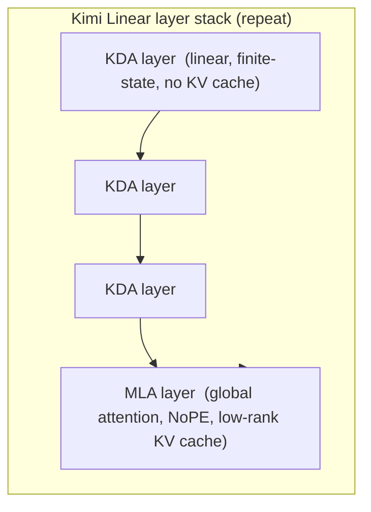

# Kimi Linear: An Expressive, Efficient Attention Architecture — Kimi Team (Moonshot AI), 2025

> **arXiv:** 2510.26692 · **Affiliation:** Moonshot AI (Kimi Team) · **Model:** 48B total / 3B active MoE, 1M context

## TL;DR
Kimi Linear is a **hybrid linear-attention architecture** that, under a fair comparison, **beats full
attention** across short-context, long-context, and RL-scaling regimes. Its core is **Kimi Delta Attention
(KDA)** — a refinement of **Gated DeltaNet** that replaces the scalar decay gate with a **fine-grained,
channel-wise (diagonal) gate**, and computes it with a bespoke **chunkwise** algorithm built on a
specialized **Diagonal-Plus-Low-Rank (DPLR)** transition matrix. The full model interleaves KDA with
periodic global **[MLA](longseq_2024_deepseek-v2-mla.md)** layers at a **3:1 ratio**, reducing the **KV
cache by up to 75%** and delivering **up to 6× decoding throughput at 1M-token context** — while matching
or surpassing full attention quality.

## Problem & motivation
Full softmax attention is expressive but its **KV cache and per-token cost grow with context length**, so
million-token serving is expensive. **Linear attention** and **SSMs** ([Mamba](longseq_2023_mamba.md),
[Linear Attention](longseq_2020_linear-attention.md)) fix the asymptotics with a **finite recurrent
state**, but historically **underperform full attention on quality**, especially on associative recall.
The **delta rule** (DeltaNet) improved recall by making the state update an online least-squares step, and
**Gated DeltaNet** added a data-dependent decay so the state can forget. Kimi Linear's thesis: with a
**more expressive gate** and a **hybrid** that keeps a few global-attention layers, a linear-attention
model can finally be **Pareto-dominant** over full attention — better quality *and* cheaper.


## Key idea
### The delta-rule lineage
A linear-attention layer maintains a **matrix-valued state** $S_t\in\mathbb{R}^{d_k\times d_v}$ and reads
it with the query: $o_t = S_t^\top q_t$. The variants differ in how $S_t$ is updated from key $k_t$, value
$v_t$, and a write strength $\beta_t$:

- **Linear attention** (pure accumulation):
  $$ S_t = S_{t-1} + v_t k_t^\top. $$
- **DeltaNet** (delta rule = one online least-squares step; overwrites the memory *for that key*):
  $$ S_t = S_{t-1}\big(I - \beta_t\,k_t k_t^\top\big) + \beta_t\,v_t k_t^\top. $$
- **Gated DeltaNet** (adds a **scalar** data-dependent decay $\alpha_t\in(0,1)$ so old memory fades):
  $$ S_t = \alpha_t\,S_{t-1}\big(I - \beta_t\,k_t k_t^\top\big) + \beta_t\,v_t k_t^\top. $$

### Kimi Delta Attention (KDA)
KDA generalizes the scalar decay $\alpha_t$ to a **per-channel (diagonal) gate** $\mathrm{Diag}(a_t)$, giving
**finer-grained control** over how each dimension of the finite-state RNN memory forgets:

$$
S_t = \mathrm{Diag}(a_t)\,S_{t-1}\big(I - \beta_t\,k_t k_t^\top\big) + \beta_t\,v_t k_t^\top,
$$

where $a_t\in(0,1)^{d_k}$ is produced by a data-dependent gating network. The transition operator
$\mathrm{Diag}(a_t)(I-\beta_t k_t k_t^\top)$ is a **Diagonal-Plus-Low-Rank (DPLR)** matrix. Rather than pay
the cost of a fully general DPLR recurrence, KDA uses a **specialized DPLR variant** that stays close to the
classical delta rule while admitting an efficient **chunkwise parallel** algorithm — the key to making the
fine-grained gate fast on hardware. The KDA kernel is open-sourced in
[FLA (flash-linear-attention)](https://github.com/fla-org/flash-linear-attention/tree/main/fla/ops/kda).

> Compared with [Mamba](longseq_2023_mamba.md)'s selective SSM (a *diagonal* SSM gated through $\Delta$),
> KDA keeps the delta rule's associative-recall strength but adds the same *content-aware, channel-wise*
> forgetting — two routes to the same "selective finite-state memory" idea.

### The hybrid: 3 KDA : 1 MLA
Pure linear attention still loses some global precision, so Kimi Linear **interleaves** KDA layers with
periodic global attention using **[Multi-head Latent Attention (MLA)](longseq_2024_deepseek-v2-mla.md)** at a
**3:1 ratio** (three KDA layers per one MLA layer). The MLA layers use **NoPE** (no explicit positional
encoding), leaving positional modeling to the recurrent KDA layers. This keeps most layers cheap and
KV-cache-free while a minority of global layers preserve long-range fidelity — the combination that reduces
the KV cache by up to **75%**.

## How it works



- **KDA layers (3/4 of the stack):** matrix-state recurrence $S_t=\mathrm{Diag}(a_t)S_{t-1}(I-\beta_t k_t k_t^\top)+\beta_t v_t k_t^\top$,
  read as $o_t=S_t^\top q_t$; **constant memory**, no KV cache, chunkwise-parallel training.
- **MLA layers (1/4 of the stack):** global attention with DeepSeek-V2-style **low-rank latent KV**, the only
  layers that keep a (small) cache.
- **Model:** 48B total / **3B activated** MoE, trained on **5.7T tokens**; released Base and Instruct
  checkpoints with a **1M-token** context, deployable on **vLLM**.


## Training / data
- **Scale:** 48B-parameter MoE with 3B active per token; **5.7T-token** pretraining for the released
  checkpoints (fair-comparison ablations run at ~1.4T tokens against a full-attention MLA baseline under an
  identical recipe).
- **Regimes evaluated:** short-context, long-context, and **RL-style** post-training — Kimi Linear is
  reported to beat the full-attention baseline in all three.
- **Open-source:** KDA Triton/CUDA kernel in FLA, a vLLM integration, and both model checkpoints.

## Results
| Benchmark / metric | Kimi Linear | Comparison | Source |
|---|---:|---|---|
| **MMLU-Pro** (4K context) | **51.0** | ≈ full-attention accuracy at ≈ full-attention speed | §Fig. 1a |
| **RULER** (128K context) | **84.3** (Pareto-optimal) | **3.98×** speedup vs. full attention | §Fig. 1a |
| **TPOT** @ 1M context | **6.3×** faster | vs. MLA full-attention baseline | §Fig. 1b |
| **KV cache** | **up to −75%** | vs. full attention | §Abstract |
| **Decoding throughput** @ 1M | **up to 6×** | vs. full attention | §Abstract |

- Under a **fair, identical-recipe** comparison, Kimi Linear **outperforms full-attention MLA on every
  task category** while cutting KV memory and boosting long-context throughput — the paper's headline claim
  that a linear-attention model can be strictly Pareto-better than full attention.

> **Note on figures/equations.** The arXiv HTML for this paper does not render, so the numbers above are
> taken from the official abstract and repository README, and the KDA equations are stated in the standard
> DeltaNet / Gated DeltaNet form that KDA refines; consult the [tech report PDF](https://arxiv.org/pdf/2510.26692)
> for exact constants (gate parameterization, chunk size, layer counts).

## Limitations & follow-ups
- **Hybrid, not pure linear:** the 3:1 design still keeps global MLA layers (and their small KV cache) —
  evidence that *some* full-attention capacity remains necessary for top quality.
- **Recall trade-offs:** like all finite-state models, the KDA state can be overwritten; the periodic MLA
  layers exist precisely to backstop long-range associative recall.
- **Lineage / relation:** KDA extends **Gated DeltaNet** (itself in the
  [Linear Attention](longseq_2020_linear-attention.md) / [Mamba](longseq_2023_mamba.md) selective-recurrence
  family); the global layers reuse **[MLA](longseq_2024_deepseek-v2-mla.md)**. Kimi Linear is the
  **production validation** of the sub-quadratic axis — a natural decoder on which to test
  [LCLM](../context/ctx_compression.md) soft-token compression, since input compression and cheap
  attention savings **compose**.

## Links
- **arXiv:** [abs](https://arxiv.org/abs/2510.26692) · [pdf](https://arxiv.org/pdf/2510.26692)
- **Code:** <https://github.com/MoonshotAI/Kimi-Linear> · **KDA kernel:** [FLA](https://github.com/fla-org/flash-linear-attention/tree/main/fla/ops/kda) · **Models:** [Hugging Face](https://huggingface.co/moonshotai/Kimi-Linear-48B-A3B-Instruct)
- **BibTeX:**
  ```bibtex
  @misc{team2025kimi,
    title={Kimi Linear: An Expressive, Efficient Attention Architecture},
    author={Kimi Team},
    year={2025},
    eprint={2510.26692},
    archivePrefix={arXiv},
    primaryClass={cs.CL}
  }
  ```
- **Related papers:** [MLA / DeepSeek-V2](longseq_2024_deepseek-v2-mla.md) · [Mamba](longseq_2023_mamba.md) · [Linear Attention](longseq_2020_linear-attention.md) · [S4](longseq_2021_s4.md)
- **In-repo:** [Efficient long-sequence modeling thread](../context/long_seq/long_seq.md) · [Inference engines & systems](../context/systems/systems.md) · [LCLM context compression](../context/ctx_compression.md)
