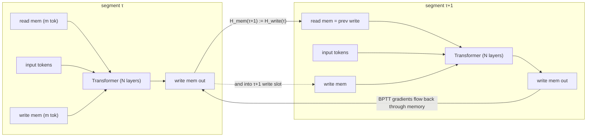

# Recurrent Memory Transformer — Bulatov, Kuratov & Burtsev, 2022

> **arXiv:** 2207.06881v2 · **Venue:** NeurIPS 2022 · **Affiliation:** Neural Networks & Deep Learning Lab, MIPT / AIRI (Moscow)

## TL;DR
Add a handful of **special `[mem]` tokens** to the input sequence and make the model **recurrent over
segments** by feeding the *output* memory tokens of one segment into the *input* of the next. No change to
the Transformer internals — memory and recurrence live entirely on the **input/output sequence**, so RMT
wraps any Transformer (encoder or decoder). Trained with **BPTT** across segments, RMT matches
Transformer-XL on language modeling with **up to 10× smaller memory**, and *beats* it on tasks that need
information carried across many segments (copy, reverse, associative retrieval, quadratic equations). It
can also be **bolted onto pretrained BERT/RoBERTa/DeBERTa/T5** for long-text classification (SOTA on
Hyperpartisan news).

## Problem & motivation
Two coupled limitations of vanilla Transformers:
1. **Blurred globals.** Self-attention forces *both* local and global information into the same per-token
   representations; distributed global features get "blurred" and hard to access.
2. **Quadratic cost** in sequence length limits inputs to long documents.

Transformer-XL addresses length by caching previous-segment hidden states, but its memory is
$m\times N$ vectors (per-layer, per-segment) of *token* representations, and its recurrence depth is
bounded by network depth. RMT instead adds a small, **dedicated** memory that is decoupled from token
representations and whose effective recurrence depth is unbounded.

## Key idea
Augment each segment's token embeddings $H^0_\tau$ with $m$ memory tokens placed at **both ends**:

$$
\tilde H^0_\tau = [\,H^{mem}_\tau \circ H^0_\tau \circ H^{mem}_\tau\,],\qquad
\bar H^N_\tau = \mathrm{Transformer}(\tilde H^0_\tau),
$$

then split the output back into read / body / write groups:

$$
[\,H^{read}_\tau \circ H^N_\tau \circ H^{write}_\tau\,] := \bar H^N_\tau .
$$

- The **leading** memory group acts as **read memory**: sequence tokens attend to memory states produced
  by the *previous* segment.
- The **trailing** memory group acts as **write memory**: it attends to all current-segment tokens and
  produces updated memory.

Recurrence is just passing write→next-read:

$$
H^{mem}_{\tau+1} := H^{write}_\tau,\qquad
\tilde H^0_{\tau+1} = [\,H^{mem}_{\tau+1}\circ H^0_{\tau+1}\circ H^{mem}_{\tau+1}\,].
$$

Placing memory at **both** ends solves a decoder-only causal-mask problem: memory at the start alone can't
gather info from later tokens (causal mask), and memory at the end alone can't be read by earlier tokens —
so read tokens sit up front and write tokens sit at the back. Memory tokens may attend to each other
within a read/write block; the causal mask applies only to the real input tokens.

Contrast with Transformer-XL: RMT stores only $m$ vectors per segment (vs $m\times N$), and because memory
is re-processed by **all $N$ layers each segment**, its effective depth grows as $\tau\times N$ —
recurrence depth is *not* capped by network depth. Training uses **BPTT** with gradients flowing through
memory across segments (Transformer-XL stops the gradient); the number of back-propagated segments (BPTT
unroll, 0–4 here) is a hyperparameter.

## How it works


Attention-map analysis (Fig. 6) shows interpretable read/write ops: on **copy** the model writes tokens
into memory in order and reads them back; on **reverse** it writes in reversed order; with many segments
it also learns to **rewrite** read→write memory to keep recent context alive. Transformer-XL, lacking
dedicated slots, must *mix* token and cached representations, which hurts when segment count grows.

## Training / data
Built on the Transformer-XL codebase. LM configs match Transformer-XL: **WikiText-103** 16 layers (10
heads, $d$=410, FF 2100), **enwik8** 12 layers (8 heads, $d$=512, FF 2048), Adam, linear-schedule lr from
2.5e-4, 200K steps (WT-103) / 400K (enwik8), on 2×A100. Algorithmic tasks (copy, reverse, associative
retrieval, quadratic equations) use small 4–6 layer models, char-level tokenization, constant lr 1e-4 with
plateau decay; loss computed only over the target span after a start-to-generate token. For long-text
classification, 10 memory tokens + recurrence are added to pretrained BERT/RoBERTa/DeBERTa/T5 (input 512,
extended to ~2000 tokens) and finetuned. A small **auxiliary memory loss** (weight 0.01, predicting a
fixed special token from memory) is used for the combined Tr-XL+RMT LM model.

## Results
Perplexity on **WikiText-103** (word-level), test set; lower is better.

| Model | memory | segment | ppl | Source |
|---|---:|---:|---:|---|
| Baseline (no mem) | 0 | 150 | 29.95 | Table 2 |
| Memory Transformer (MemTr) | 10 | 150 | 29.63 | Table 2 |
| Transformer-XL | 75 | 150 | 24.68 | Table 2 |
| **RMT** BPTT-3 | 10 | 150 | 25.04 | Table 2 |
| **RMT** BPTT-2 | 25 | 150 | 24.85 | Table 2 |
| **Tr-XL + RMT** BPTT-3 (2× steps) | 150+10 | 150 | **23.99** | Table 2 |

Small-segment (50-token) stress test — more recurrent steps: **RMT BPTT-3, mem 1** reaches **28.40** vs
**Transformer-XL mem 10 = 28.98** (RMT with a *single* memory vector beats XL's 10 cached per-layer
states); RMT mem 5 ≈ Tr-XL cache 50. On **enwik8**, RMT mem 5 ≈ Transformer-XL mem 40 (bpc).

**Algorithmic tasks** — RMT keeps ~1.0 accuracy as segments grow while Transformer-XL degrades toward the
memoryless baseline:

| Task (multi-segment) | Transformer-XL | RMT | Source |
|---|---:|---:|---|
| Copy (up to 9 segments, len 360) | drops to baseline | **solves perfectly** | Fig. 4a |
| Quadratic equations (30 mem, 6 segs) | 0.93 | **0.99** | Table 1 |
| Associative retrieval (≤4 segs) | on par | on par | Fig. 3 |

**Hyperpartisan news** (F1, long-text classification): augmenting pretrained models with 10 memory tokens
+ recurrence lifts most, and **RMT + RoBERTa-base [512] = 98.11** (2 segments = 97.20), beating Big Bird
[4096] 92.20 and Longformer [4096] 94.80 despite a 512 base window.

## Limitations & follow-ups
- **Deeper BPTT helps but is costly** — GPU-RAM heavy and can be unstable for larger memory with deep
  unrolls; gradient checkpointing suggested.
- There's an **optimal memory size**; growing memory past ~5–10 tokens adds little on these tasks (the win
  comes mostly from adding the *first* memory token + recurrence).
- Complementary to caching: **Tr-XL cache (short-term) + RMT memory (long-term)** gives the best LM
  numbers.
- Directly extends to book-length reasoning; the same authors' later **RMT-scaling** work pushes this to
  1M+ tokens. Compare to exact-lookup memory in
  [Memorizing Transformers](memory_2022_memorizing-transformer.md) and to the recurrent-cell design of
  [Block-Recurrent Transformers](memory_2022_block-recurrent-transformer.md).

## Links
- **arXiv:** [abs](https://arxiv.org/abs/2207.06881) · [html](https://arxiv.org/html/2207.06881v2) · [pdf](https://arxiv.org/pdf/2207.06881)
- **Code:** <https://github.com/booydar/LM-RMT>
- **BibTeX:**
  ```bibtex
  @inproceedings{bulatov2022rmt,
    title     = {Recurrent Memory Transformer},
    author    = {Bulatov, Aydar and Kuratov, Yuri and Burtsev, Mikhail S.},
    booktitle = {Advances in Neural Information Processing Systems (NeurIPS)},
    year      = {2022},
    url       = {https://arxiv.org/abs/2207.06881}
  }
  ```
- **Related papers:** [Transformer-XL](longseq_2019_transformer-xl.md) ·
  [Compressive Transformer](longseq_2019_compressive-transformer.md) ·
  [Memorizing Transformer](memory_2022_memorizing-transformer.md) ·
  [Block-Recurrent Transformer](memory_2022_block-recurrent-transformer.md)
- **In-repo:** [§6.5 in mixed_decoder](../mixed_decoder/mixed_decoder.md)
