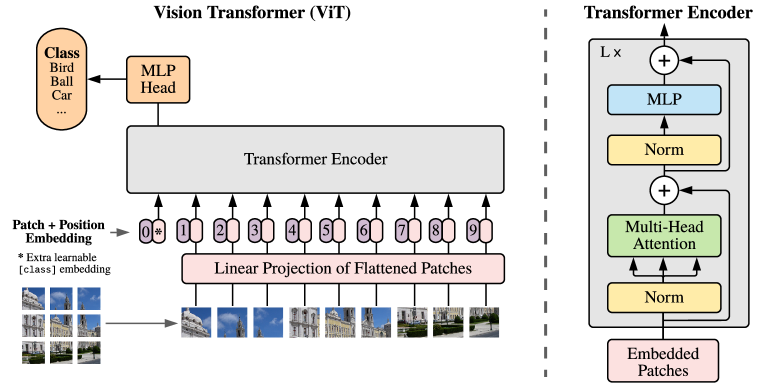
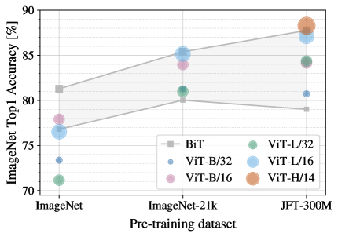

# An Image Is Worth 16×16 Words: Vision Transformer (ViT) — Dosovitskiy et al., 2020

> **arXiv:** 2010.11929v2 · **Title:** *An Image Is Worth 16×16 Words: Transformers for Image
> Recognition at Scale* · **Authors:** Dosovitskiy, Beyer, Kolesnikov, Weissenborn, Zhai,
> Unterthiner, Dehghani, Minderer, Heigold, Gelly, Uszkoreit, Houlsby (Google Research, Brain Team) ·
> **Venue:** ICLR 2021 · **Code:** github.com/google-research/vision_transformer

## TL;DR
A **pure Transformer** applied directly to a sequence of flattened image patches — no convolutions —
matches or beats state-of-the-art CNNs on image classification, **if pre-trained at scale**. Split an
image into 16×16 patches, linearly embed each like a word token, prepend a `[class]` token, add
learnable 1-D position embeddings, and run a standard Transformer encoder. Pre-trained on JFT-300M,
ViT-H/14 reaches **88.55 %** ImageNet top-1 using far less pre-training compute than the best ResNets.
The lesson: **large-scale training trumps convolutional inductive bias**.

## Why this matters for the multimodal thread
ViT is the direct analog of the repo's *"block of $N$ tokens → one latent"* compression
([multimodal thread](../context/multimodal/multimodal.md)): **patch size ⇔ compression ratio $N$**.
Chunking a high-resolution input into a short token sequence, then feeding it to a plain Transformer,
is exactly what the repo's [LCLM](../context/ctx_compression.md) encoder does to text spans. ViT is
also the vision tower every later VLM ([LLaVA](multimodal_2023_llava.md),
[Cambrian-1](multimodal_2024_cambrian-1.md), [Qwen3-VL](multimodal_2025_qwen3-vl.md)) builds on.

## Problem & motivation
By 2020 Transformers were the NLP standard (pre-train large, fine-tune) and scaled to 100B+ params
without saturating, yet vision was still CNN-dominated. Prior self-attention-for-vision work either
mixed attention with convolutions or used specialized attention patterns that didn't run efficiently
on accelerators. The question: can a **standard** Transformer with the fewest possible changes be
competitive — reusing the mature, hardware-efficient NLP stack almost verbatim?

## How it works (reimplementation-grade)
**Patchify.** Reshape $\mathbf{x}\in\mathbb{R}^{H\times W\times C}$ into $N$ flattened patches
$\mathbf{x}_p\in\mathbb{R}^{N\times(P^2\cdot C)}$ with patch size $P$; the sequence length is
$$N=\frac{H\,W}{P^2}.$$

**Sequence construction (Eq. 1).** Linearly project each patch and prepend a learnable class token,
then add 1-D position embeddings:
$$\mathbf{z}_0=[\,\mathbf{x}_{\text{class}};\ \mathbf{x}_p^1\mathbf{E};\ \cdots;\ \mathbf{x}_p^N\mathbf{E}\,]+\mathbf{E}_{pos},\quad \mathbf{E}\in\mathbb{R}^{(P^2C)\times D},\ \mathbf{E}_{pos}\in\mathbb{R}^{(N+1)\times D}.$$

**Encoder block (pre-norm, Eqs. 2–4).**
$$\mathbf{z}'_\ell=\text{MSA}(\text{LN}(\mathbf{z}_{\ell-1}))+\mathbf{z}_{\ell-1},\qquad
\mathbf{z}_\ell=\text{MLP}(\text{LN}(\mathbf{z}'_\ell))+\mathbf{z}'_\ell,\qquad \mathbf{y}=\text{LN}(\mathbf{z}_L^0).$$
LayerNorm precedes every block; residuals follow; the MLP has a **GELU** nonlinearity. The class-token
final state $\mathbf{z}_L^0$ is the image representation. Attention is standard scaled dot-product:
$A=\text{softmax}(\mathbf{q}\mathbf{k}^\top/\sqrt{D_h})$, $\text{SA}=A\mathbf{v}$.

*Figure 1 — Patchify → linear projection → prepend `[class]` + position embeddings → standard
pre-norm Transformer encoder → MLP head. The right panel is one encoder block (LN → MHSA → LN → MLP,
with residuals).*

**Model variants (Table 1).**
| Model | Layers | Hidden $D$ | MLP | Heads | Params |
|---|---:|---:|---:|---:|---:|
| ViT-Base | 12 | 768 | 3072 | 12 | 86M |
| ViT-Large | 24 | 1024 | 4096 | 16 | 307M |
| ViT-Huge | 32 | 1280 | 5120 | 16 | 632M |

Notation **ViT-L/16** = Large with 16×16 patches; smaller patches → longer sequence → more compute.
**Higher-resolution fine-tuning** keeps $P$ fixed (longer sequence) and **2-D-interpolates** the
pre-trained position embeddings — the only hand-coded 2-D bias beyond patch extraction. A **hybrid**
variant feeds CNN feature maps to ViT instead of raw patches.

## The scale finding

*Figure 2 (paper Fig. 3) — Pre-trained on ImageNet only, large ViT **underperforms** comparable
ResNets (it lacks locality/translation-equivariance and overfits). On ImageNet-21k it becomes
comparable; on **JFT-300M** ViT overtakes BiT ResNets. Convolutional bias helps on small data;
learning from data wins at scale.*

## Results
Pre-trained on JFT-300M (Table 2, headline):
| Metric | ViT-H/14 | ViT-L/16 |
|---|---:|---:|
| ImageNet top-1 | **88.55** | 87.76 |
| ImageNet-ReaL | 90.72 | — |
| CIFAR-100 | 94.55 | — |
| VTAB (19 tasks) | 77.63 | — |

- **ViT-L/16 (JFT) beats BiT-L (ResNet152×4)** on all tasks with **~2–4× less pre-training compute**;
  ViT-H/14 improves further. ViT does not saturate over the tried range → motivates further scaling.
- Depth-scaling helps most; width least; smaller patches (longer sequences) give robust gains at
  fixed param count — **compute predicts accuracy better than parameter count**.
- Preliminary masked-patch self-supervision gives ViT-B/16 = 79.9 % (+2 % over from-scratch, still
  ~4 % behind supervised pre-training).

## Limitations & follow-ups
- **Needs large-scale pre-training**; without it, trails CNNs of comparable size.
- **Lacks CNN inductive biases** — locality, 2-D neighborhood, translation equivariance must all be
  learned; 2-D structure enters only at patchify + position-embedding interpolation. This gap is
  exactly what [CPVT](multimodal_2021_cpvt.md) addresses with conditional positional encodings.
- Overfits more than ResNets on small data; needs strong regularization.
- **Relation to the repo.** The patchify-then-embed template and the "patch size = compression ratio"
  intuition anchor the [multimodal alignment thread](../context/multimodal/multimodal.md) and the
  [LCLM](../context/ctx_compression.md) compressor design.

## Links
- **arXiv:** [abs](https://arxiv.org/abs/2010.11929) · [html](https://arxiv.org/html/2010.11929v2) · [pdf](https://arxiv.org/pdf/2010.11929)
- **Code:** https://github.com/google-research/vision_transformer
- **OpenReview (ICLR 2021):** https://openreview.net/forum?id=YicbFdNTTy
- **Related:** [CPVT](multimodal_2021_cpvt.md) · [LLaVA](multimodal_2023_llava.md) · [Cambrian-1](multimodal_2024_cambrian-1.md) · [Qwen3-VL](multimodal_2025_qwen3-vl.md) · [Transformer](attention_2017_transformer.md) · [multimodal thread](../context/multimodal/multimodal.md)
