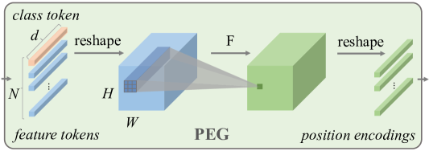
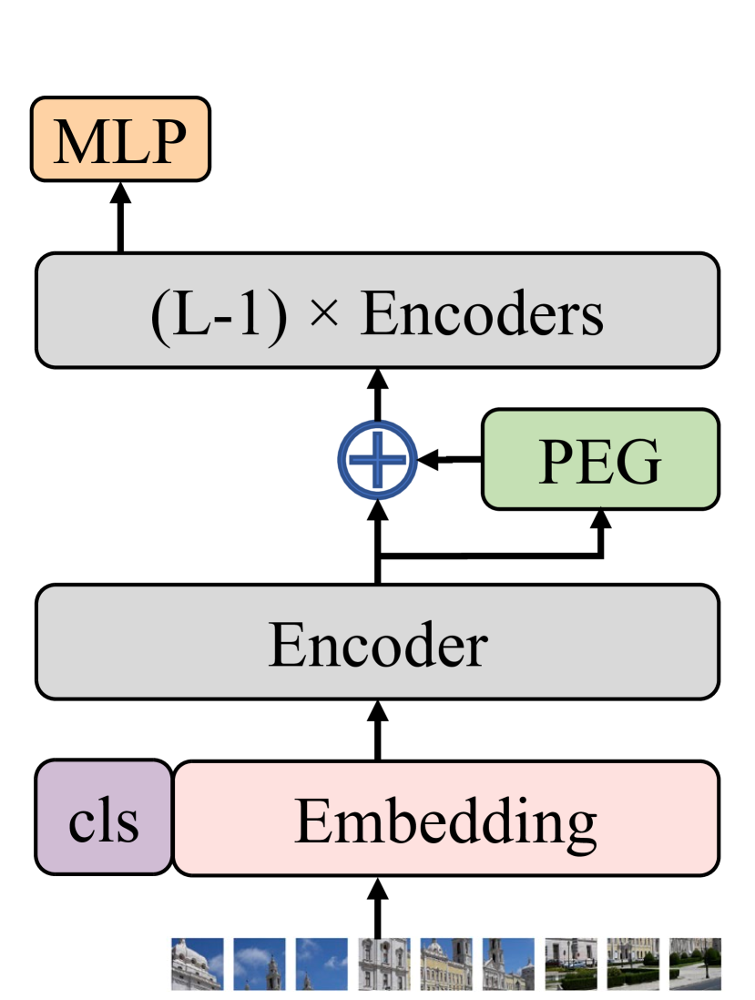

# Conditional Positional Encodings for Vision Transformers (CPVT) — Chu et al., 2021

> **arXiv:** 2102.10882v3 · **Title:** *Conditional Positional Encodings for Vision Transformers* ·
> **Authors:** Xiangxiang Chu, Zhi Tian, Bo Zhang, Xinlong Wang, Chunhua Shen (Meituan · BAAI ·
> Zhejiang University) · **Venue:** ICLR 2023 · **Code:** github.com/Meituan-AutoML/CPVT

## TL;DR
CPVT replaces ViT/DeiT's fixed **learnable absolute** position embeddings with **Conditional
Positional Encodings (CPE)** generated on-the-fly from each token's local neighborhood by a tiny
**Positional Encoding Generator (PEG)** — in its simplest form a single 2-D depthwise 3×3 convolution
with zero padding. This makes positions **resolution-agnostic** (no interpolation or fine-tuning when
the input size changes), biases the model toward **translation equivalence**, and — crucially — the
**zero padding still leaks absolute position**, which classification needs. CPE also enables dropping
the class token for **global average pooling (CPVT-GAP)**. With negligible extra params/FLOPs, CPVT
matches DeiT at the training resolution and **improves** (rather than degrades) at higher test
resolutions.

## Why this matters for the multimodal thread
The repo's compressor must stay **resolution-agnostic** as context length varies 4K → 1M
([multimodal thread](../context/multimodal/multimodal.md)): a fixed position table can't. CPVT is the
vision precedent for **content/locality-conditioned positions**, justifying the repo's per-window
($W=1024$) causal encoding plus [RoPE](positional_2021_rope-roformer.md) /
[YaRN](positional_2023_yarn-context-extension.md) on the decoder — and it is the conceptual bridge
from ViT's absolute grid to Qwen-VL's [M-RoPE](multimodal_2025_qwen3-vl.md).

## Problem & motivation
ViT/DeiT add one of $N$ **learnable absolute** PE vectors to each of $N=HW/S^2$ patch tokens. Two
problems:
1. **No length generalization.** The PE table is a fixed-size trained matrix; at a new resolution
   (different $N$) it must be **bicubically interpolated**, which *hurts* accuracy unless the model is
   re-fine-tuned — the opposite of the usual "higher resolution helps."
2. **Breaks translation equivalence.** A unique PE per position means responses don't shift
   consistently as an object translates. Relative PE (RPE) restores equivariance but adds compute,
   modifies the standard Transformer, and **cannot supply absolute position** (which classification
   needs, since the label is usually the centered object) — and empirically underperforms absolute PE.

Ablation (DeiT-tiny, ImageNet top-1): no-PE **68.2** · learnable **72.2** · sin-cos **72.3** · 2-D RPE
**70.5**.

## Key ideas
- **CPE** — position encoding **conditioned on the local neighborhood** of tokens, so it adapts to
  input size and is (softly) translation-equivariant.
- **PEG** — a plug-in that reshapes tokens to a 2-D grid, applies a function $\mathcal{F}$ (default:
  depthwise conv, kernel $k\ge3$, zero pad $\tfrac{k-1}{2}$), and adds the result back. No change to
  the Transformer API.
- **Zero padding = absolute position.** A depthwise conv is otherwise translation-equivariant; the
  **zeros at the borders** let edge tokens infer they are on a border, from which absolute positions
  propagate. Removing padding drops CPVT-S 72.4 → 70.5.
- **CPVT-GAP.** The class token isn't translation-invariant; replacing it with **global average
  pooling** makes the whole model translation-invariant, adds **>1 %** accuracy, and even *reduces*
  compute.

## How it works (reimplementation-grade)
Given the flattened token sequence $X\in\mathbb{R}^{B\times N\times C}$ (class token split off first):
$$X'=\text{reshape}(X)\in\mathbb{R}^{B\times C\times H'\times W'},\quad E=\text{DWConv}_k(X'),\quad Y=X+\text{flatten}(E),$$
with $H'=W'=\sqrt{N}$ (square input). The class token is concatenated back after PEG.



*Figure 1 (paper Fig. 2) — The PEG: feature tokens are reshaped to an $H\times W$ grid, passed through
a depthwise conv $\mathcal{F}$ (zero-padded), and reshaped back into per-token position encodings that
are added residually.*



*Figure 2 (paper Fig. 1b) — PEG is inserted **after the first encoder block** (position 0), where the
conv sees a post-attention **global** receptive field; the strong "‡" config places one PEG after each
of the first five blocks.*

**Why position 0.** Ablation: PEG at 0 beats at −1 (72.4 vs 70.6) because position 0 is
post-attention; a huge 27×27 kernel at −1 recovers 72.5, confirming the receptive-field explanation.

**Variants (matched to DeiT):** CPVT-Ti ($d$=192, 6M), CPVT-S ($d$=384, 22M), CPVT-B ($d$=768, 86M).
**Cost:** one depthwise 3×3 for CPVT-Ti adds only **1,728** params (vs DeiT-tiny's 37,632-param PE
table) and ~0.34M FLOPs — negligible.

```python
class PEG(nn.Module):
    def __init__(self, dim, k=3):
        super().__init__()
        self.proj = nn.Conv2d(dim, dim, k, 1, k // 2, groups=dim)  # depthwise, zero pad
    def forward(self, x, H, W):            # x: (B, N, C), cls already removed
        B, N, C = x.shape
        feat = x.transpose(1, 2).view(B, C, H, W)
        x = self.proj(feat) + feat          # residual PE
        return x.flatten(2).transpose(1, 2)
```

## Results
**Direct generalization to higher test resolution, no fine-tuning (Table 2, trained @224):**
| Model | 224 | 384 | 448 | 512 |
|---|---:|---:|---:|---:|
| DeiT-tiny | 72.2 | 71.2 | 68.8 | 65.9 |
| **CPVT-Ti** | 72.4 | **73.2** | 71.8 | 70.3 |
| **CPVT-Ti ‡** | 73.4 | **74.2** | 72.6 | 70.8 |
| DeiT-small | 79.9 | 78.1 | 75.9 | 72.6 |
| **CPVT-S** | 79.9 | **80.4** | 78.6 | 76.8 |

DeiT **degrades** as test resolution moves away from 224; CPVT **improves**. At 384², CPVT-Ti‡ 74.2 vs
DeiT-tiny 71.2 (**+3.0**), gap widening with resolution.

**Class token vs GAP / main comparison (Table 3/4):** CPVT-Ti‡ 73.4 → **CPVT-Ti-GAP 74.9** (beats
distilled DeiT-tiny 74.5); CPVT-S‡ 80.5 → **CPVT-S-GAP 81.5**; distilled CPVT-Ti **75.9**. It's the
positional info, not extra params: a **frozen random** 3×3 PEG still gives 71.3 (vs 68.2 no-PE);
12 stacked 1×1 convs (params, no locality) only 68.6.

**Pyramid transformers:** PEG lifts PVT-tiny **+3.1 %** and Swin-tiny **+1.15 %** on ImageNet, plus
gains on ADE20K segmentation and COCO detection.

## Limitations & follow-ups
- **Not strictly translation-equivariant** — the padding that supplies absolute info also breaks exact
  equivariance; CPE gives a *stronger bias*, not a guarantee.
- **PEG placement matters** (−1 needs a large kernel to match position 0); absolute cue **hinges on
  zero padding**; gains **saturate** beyond ~5 PEGs.
- **Adoption.** PEG became a standard block for hierarchical ViTs (the authors' Twins; echoed in CvT,
  PVTv2) — and its conditional-position idea foreshadows [M-RoPE](multimodal_2025_qwen3-vl.md).

## Links
- **arXiv:** [abs](https://arxiv.org/abs/2102.10882) · [ar5iv html](https://ar5iv.labs.arxiv.org/html/2102.10882) · [pdf](https://arxiv.org/pdf/2102.10882)
- **Code:** https://github.com/Meituan-AutoML/CPVT · (PEG reused in https://github.com/Meituan-AutoML/Twins)
- **Related:** [ViT](multimodal_2020_vit.md) · [RoPE](positional_2021_rope-roformer.md) · [YaRN](positional_2023_yarn-context-extension.md) · [Qwen3-VL / M-RoPE](multimodal_2025_qwen3-vl.md) · [multimodal thread](../context/multimodal/multimodal.md)
