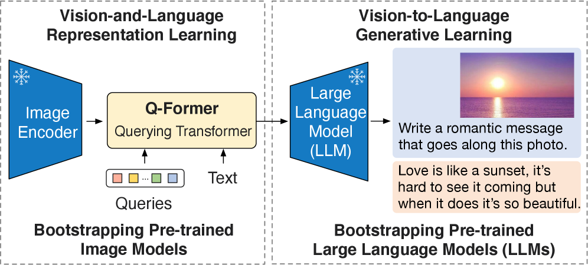
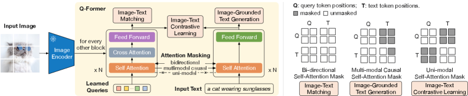

# BLIP-2: Bootstrapping Language-Image Pre-training with Frozen Image Encoders and Large Language Models — Li et al., 2023

> **arXiv:** 2301.12597v3 · **Venue:** ICML 2023 · **Affiliation:** Salesforce Research

## TL;DR
BLIP-2 bridges a **frozen** vision encoder and a **frozen** LLM with a single small trainable module — the **Q-Former** (Querying Transformer, ~188 M params, BERT-base initialization) — by training it in two stages: first a representation-learning stage with contrastive / matching / generative losses against the frozen vision encoder, then a generative-bridging stage that prepends the Q-Former's $K{=}32$ query outputs (linearly projected) as soft visual tokens to a frozen LLM. The result outperforms Flamingo-80B by **+8.7%** on zero-shot VQAv2 with **54× fewer** trainable parameters.

## Problem & motivation
Pre-Flamingo VLMs trained vision and language end-to-end at huge cost. Flamingo (arXiv:2204.14198, [local recap](multimodal_2022_flamingo-perceiver-resampler.md)) showed you can freeze both unimodal backbones and only train a small bridge — but its bridge (Perceiver Resampler + gated cross-attention) is **only** trained with a language-modeling loss against the frozen LM. The Q-Former argues this is sample-inefficient: the bridge has to *simultaneously* learn what visual features are informative **and** how to express them in LM-compatible tokens.

BLIP-2's hypothesis: separate the two skills. First teach the bridge to **extract** text-aligned visual representations using objectives that talk to the vision encoder only (stage 1); then teach it to **express** those representations in the LM's embedding space (stage 2). Both stages keep the multi-billion-parameter unimodal backbones frozen.

## Key idea
**Q-Former** — a small bidirectional Transformer (initialized from BERT-base) with two functional sub-transformers sharing self-attention weights:

- An **image sub-transformer** that holds $K{=}32$ learned query embeddings of dim 768. Every other Q-Former block inserts a cross-attention sub-layer where the queries attend to the frozen image encoder's patch features.
- A **text sub-transformer** that consumes the caption tokens through the *same* self-attention weights, with no image cross-attention.

The two sub-transformers interact only through the **shared self-attention layer**, whose attention mask is reconfigured per objective to control whether queries see text, text sees queries, both, or neither.

## How it works

### Stage 1 — Representation learning (vision encoder frozen; LLM not yet involved)

A single forward pass with the same input layout is reused for three objectives, distinguished only by their **attention masks** over the shared self-attention. Goal: drive the $K$ query outputs to encode the visual content that is most predictable from / by text.

| Objective | Attention mask in shared self-attn | Loss | What it teaches |
|---|---|---|---|
| **ITC** — Image-Text Contrastive | Uni-modal: queries ↔ queries only, text ↔ text only; queries and text don't see each other | Per-query max similarity to text [CLS] vs in-batch negatives | Aligns each query output with a text-aligned point in the same metric space |
| **ITM** — Image-Text Matching | Bi-directional: queries and text fully attend to each other | Binary classifier on the mean of query outputs (match vs non-match), with hard negatives | Forces queries to encode *details* needed for fine-grained matching |
| **ITG** — Image-grounded Text Generation | Multimodal causal: queries see each other; each text token sees all queries + earlier text; queries don't see text | Cross-entropy on text tokens conditioned only on queries | Forces queries to be a *complete* summary — the text decoder has no direct access to the image |

Because all three share the same parameters and input, the queries are pulled toward a representation that simultaneously aligns, discriminates, and generates.

### Stage 2 — Generative pre-training (LLM frozen)

The stage-1 Q-Former (still attached to the frozen image encoder) emits $K{=}32$ query vectors per image. A single fully-connected layer projects them to the LLM's embedding dimension. These projected vectors are **prepended** to the LLM's text embedding sequence as *soft visual tokens* — no special placeholder IDs, just continuous vectors in the input embedding slot.

- For **decoder-only** LLMs (OPT 2.7B / 6.7B): standard left-to-right language-modeling loss on the caption.
- For **encoder-decoder** LLMs (Flan-T5-XL / XXL): prefix-LM loss — a prefix split of the caption is appended to the visual tokens on the encoder side, and the suffix is the decoder target.

Only the Q-Former and the projection layer receive gradients; the image encoder and LLM stay frozen.

### Architecture / hyperparameter cheat-sheet
| Item | Value |
|---|---|
| Q-Former init | `bert-base-uncased`; cross-attention layers initialized randomly |
| Trainable params | ~188 M (Q-Former + projection) |
| Query tokens | $K = 32$, dim 768 |
| Image encoders | ViT-L/14 (CLIP) or ViT-g/14 (EVA-CLIP) — frozen |
| Image input | 224×224, random crop + horizontal flip |
| LLM backbones | OPT-2.7B / OPT-6.7B (decoder), Flan-T5-XL / Flan-T5-XXL (enc-dec) — frozen |
| Optimizer | AdamW, $\beta_1{=}0.9$, $\beta_2{=}0.98$, weight decay $0.05$ |
| Peak LR | $1\times10^{-4}$ (linear warmup over 2k steps; cosine decay) |
| Stage 1 / Stage 2 steps | 250 k / 80 k (per Table 14 / §A) |
| Batch size | Stage 1: 2320 (ViT-L) / 1680 (ViT-g); Stage 2: 1920 (OPT) / 1520 (Flan-T5) (per §A) |
| Precision | fp16 for OPT, bf16 for Flan-T5 |
| Compute | <6 days stage 1 + <3 days stage 2 on a **single** 16×A100-40GB node (per §3.1) |

### Pre-training data (per §3.1)
COCO, Visual Genome, CC3M, CC12M, SBU, plus 115 M images from LAION-400M. Web captions are filtered with **CapFilt** (Li et al., BLIP, 2022): a captioner generates 10 synthetic captions per image and a CLIP ViT-L/14 ranker keeps the top 2 against original alt-text.

## Results
| Benchmark | Setting | BLIP-2 | Comparator | Notes |
|---|---|---|---|---|
| Zero-shot VQAv2 (test-dev) | ViT-g + Flan-T5-XXL | **65.0** | 56.3 (Flamingo-80B) | per Table 2 — "+8.7% with 54× fewer trainable params" (abstract) |
| Zero-shot OK-VQA | ViT-g + Flan-T5-XXL | 45.9 | 50.6 (Flamingo-80B) | per Table 2; knowledge-heavy → favors larger LM |
| Zero-shot GQA | ViT-g + Flan-T5-XXL | 44.7 | n/a | per Table 2 |
| Zero-shot NoCaps (CIDEr) | ViT-g | 121.6 | 113.2 (BLIP) | per Table 3 |
| Image–text retrieval Flickr30K (R@1 I→T / T→I, zero-shot) | ViT-g | 97.6 / 89.7 | 96.7 / 86.7 (prior best) | per Table 5 |
| Trainable params | — | 188 M | Flamingo-80B: 10.2 B | per Table 1 |

## Limitations & follow-ups
- **No in-context few-shot improvement.** Unlike Flamingo, adding few-shot VQA exemplars in the prompt does *not* help (per §5). The authors attribute this to the pre-training data containing only single image–text pairs, not interleaved multi-image documents like Flamingo's M3W.
- **Inherits frozen-LM failure modes:** can hallucinate, output stale knowledge, mis-reason about uncommon scenes, and propagate biases / unsafe text from the LM.
- **Resolution and OCR limits** of the frozen ViT — fine print, dense documents, small objects all suffer.

Direct descendants and reuse of Q-Former:
- **InstructBLIP** (Dai et al., 2023, arXiv:2305.06500) — instruction-tunes the Q-Former with task-conditioned queries on 26 datasets.
- **MiniGPT-4** (Zhu et al., 2023, arXiv:2304.10592) — reuses the Q-Former + projection but swaps the LLM for Vicuna and adds a small instruction-tuning stage.
- **X-InstructBLIP** (Panagopoulou et al., 2023) — extends to audio, video, point clouds with the same recipe.
- **Lineage note.** Flamingo's Perceiver Resampler → BLIP-2's Q-Former is one of the cleanest design-evolution stories in VLMs; the BLIP-2 paper itself frames the Q-Former as "similar to the Perceiver Resampler in Flamingo" but with the added stage-1 representation-learning curriculum.

## Links
- **arXiv:** [abs](https://arxiv.org/abs/2301.12597) · [html](https://arxiv.org/html/2301.12597v3) · [pdf](https://arxiv.org/pdf/2301.12597)
- **Code:** [salesforce/LAVIS — `projects/blip2`](https://github.com/salesforce/LAVIS/tree/main/projects/blip2)
- **Hugging Face:** [Salesforce/blip2-opt-2.7b](https://huggingface.co/Salesforce/blip2-opt-2.7b) · [Salesforce/blip2-opt-6.7b](https://huggingface.co/Salesforce/blip2-opt-6.7b) · [Salesforce/blip2-flan-t5-xl](https://huggingface.co/Salesforce/blip2-flan-t5-xl) · [Salesforce/blip2-flan-t5-xxl](https://huggingface.co/Salesforce/blip2-flan-t5-xxl)
- **Project page:** <https://github.com/salesforce/LAVIS/blob/main/projects/blip2/README.md>
- **Talks / videos:** ICML 2023 oral (search the ICML site)
- **OpenReview / venue page:** [ICML 2023 page](https://icml.cc/virtual/2023/poster/24080)
- **Papers-with-Code:** <https://paperswithcode.com/paper/blip-2-bootstrapping-language-image-pre>
- **BibTeX:** see the arXiv "Export BibTeX" link on the abs page.
- **Related / successor papers:** [Flamingo / Perceiver Resampler (local recap)](multimodal_2022_flamingo-perceiver-resampler.md); InstructBLIP (arXiv:2305.06500); MiniGPT-4 (arXiv:2304.10592); LLaVA / LLaVA-1.5 (arXiv:2304.08485 / 2310.03744) — competing "concat-all-patch-tokens" design without a learned-query bottleneck.
