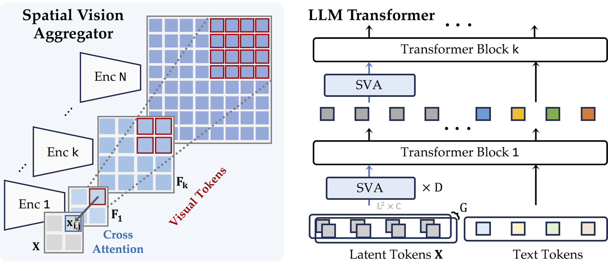
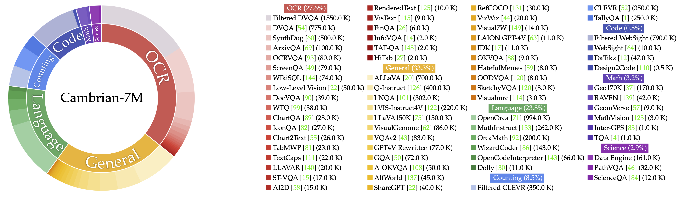

# Cambrian-1: A Fully Open, Vision-Centric Exploration of Multimodal LLMs — Tong et al., 2024

> **arXiv:** 2406.16860v2 · **Authors:** Shengbang Tong, Ellis Brown, Penghao Wu, … Rob Fergus,
> Yann LeCun, Saining Xie (NYU) · **Venue:** NeurIPS 2024 (Oral) · **License:** CC BY 4.0 ·
> **Project:** cambrian-mllm.github.io/cambrian-1 · **Code:** github.com/cambrian-mllm/cambrian

## TL;DR
Cambrian-1 is a family of fully-open MLLMs (8B/13B/34B) produced by a **vision-centric** study rather
than a language-first one. Using visual instruction tuning as a probe, the authors benchmark **20+
vision encoders**, show many popular MLLM benchmarks barely need vision (motivating the new
**CV-Bench**), and introduce the **Spatial Vision Aggregator (SVA)** — a spatially-aware, query-based
connector that fuses multiple vision encoders into the LLM at multiple depths while keeping visual
tokens fixed at **576**. With the curated **Cambrian-7M** instruction data and a two-stage recipe,
Cambrian-1-34B matches or beats LLaVA-NeXT and Mini-Gemini (and GPT-4V on several benchmarks) using
**~5× fewer visual tokens** (576 vs 2880).

## Why this matters for the multimodal thread
Cambrian-1 is the empirical backbone for the repo's **staged-unfreeze + connector-design** decisions
([multimodal thread](../context/multimodal/multimodal.md)). Its findings — *which encoder init, when
to unfreeze, how much adapter data, what connector* — validate [LCLM](../context/ctx_compression.md)'s
stage boundaries and small-LR decoder unfreeze, and its **SVA** is the attention-connector alternative
the repo weighs against its cheap MLP adapter (the [LLaVA-1.5](multimodal_2023_llava-1.5.md) verdict).

## Problem & motivation
MLLM progress has been **language-model-centric**: the vision components (encoders, connectors) are
under-explored and disconnected from visual-representation research, weakening real sensory grounding.
Worse, **benchmarks don't stress vision** — comparing vision-enabled vs vision-disabled models shows
some benchmarks (MMMU, AI2D) barely drop without images. Cambrian-1 is a systematic study across five
pillars: **visual representations, connector design, instruction-tuning data, training recipes, and
benchmarking**, released as an open cookbook.

## Key ideas / contributions
1. **MLLM-as-evaluator over 20+ vision encoders** — language-supervised (CLIP, SigLIP, EVA-CLIP,
   DFN, OpenCLIP-ConvNeXt) vs self-supervised (DINOv2, MAE, MoCo-v3, I-JEPA). Finding:
   language-supervised dominate (esp. OCR/Chart); high-res ConvNeXt helps; DINOv2 is competitive on
   vision-centric tasks and closes much of the gap when unfrozen + trained on 5M data.
2. **Spatial Vision Aggregator (SVA)** — a dynamic connector with learnable **spatially-localized**
   query tokens that cross-attend to multiple encoders at their native resolutions, and is inserted
   **multiple times across LLM layers** so the model can re-reference visual features.
3. **CV-Bench** — a vision-centric benchmark repurposing classic 2D/3D tasks (spatial relations,
   counting, depth order, relative distance) into ~2,600 VQA items.
4. **Cambrian-10M → Cambrian-7M** — a ~9.8M instruction pool curated to a 7M high-quality set via
   source thresholding and category-ratio balancing (plus a targeted Internet data engine).
5. **Recipe findings** — two-stage beats one-stage; more adapter data helps; **unfreezing the vision
   encoder** at a lower LR improves nearly all categories; a system prompt fixes the "answer-machine
   phenomenon."

## How it works (reimplementation-grade)
**Vision towers (final model):** SigLIP (SO400M/14@384), OpenAI CLIP ViT-L/14@336, DINOv2-giant@378,
OpenCLIP ConvNeXt-XXL — per-tower token lengths e.g. `[576, 576, 576, 9216]`, each aggregated by SVA
to **576** output tokens.

*Figure 1 (paper Fig. 6) — Left: SVA. Learnable queries arranged as a spatial grid cross-attend to a
**spatially-localized window** of each vision tower's feature map $F_k$ (spatial inductive bias),
producing a fixed set of visual tokens that preserve 2-D locality. Right: SVA blocks are injected at
**multiple points inside the LLM** (not just once before it) so visual features can be re-referenced.*

- **Spatial inductive bias:** each query is localized to a region of the aggregation space, so the 576
  output tokens keep 2-D structure (vs interpolate-then-concat, which loses information).
- **Multi-point aggregation:** repo knobs `--num_of_vision_sampler_layers`,
  `--start_of_vision_sampler_layers`, `--stride_of_vision_sampler_layers` control how many SVA blocks
  live inside the LLM and where; `--connector_depth` (D) and `--num_query_group` (G) size the module.
- **Net effect:** fixes visual tokens to **576** regardless of encoder count/resolution — vs 2880 for
  LLaVA-NeXT / Mini-Gemini-HD.

**Two-stage training.** (1) **SVA pretrain** on **2.5M** Cambrian-Alignment data — vision encoders and
LLM frozen, only SVA trained. (2) **Instruction tuning** on **Cambrian-7M** — unfreeze LLM + connector
(and, beneficially, the vision encoder at lower LR). LLM backbones: LLaMA-3-8B-Instruct, Vicuna-1.5-13B,
Hermes-2-Yi-34B. LR rule $\text{lr}=\text{base}\cdot\sqrt{\text{bs}/\text{base\_bs}}$.

**Data balancing.** Source cap $t\approx250\text{–}350\text{k}$ (elbow); final category mix General
34.5 % · OCR 27.2 % · Language 21.0 % · Counting 8.7 % · Math 7.2 % · Science 0.9 % · Code 0.9 %.

*Figure 2 (paper Fig. 7) — Composition/curation of the Cambrian-7M instruction-tuning mixture.*

## Results
All Cambrian-1 use **576** visual tokens; baselines use **2880**.
| Model | #Vis tok | MMBench | SEED-I | MMMU | ChartQA | MathVista |
|---|---:|---:|---:|---:|---:|---:|
| GPT-4V | — | 75.8 | — | 49.9 | 78.5 | 50.0 |
| Mini-Gemini-HD-34B | 2880 | 80.6 | 77.7 | 43.4 | 67.6 | 37.3 |
| LLaVA-NeXT-34B | 2880 | 79.3 | 81.8 | 46.5 | 68.7 | 47.3 |
| **Cambrian-1-8B** | 576 | 75.9 | 80.4 | 49.0 | 73.3 | 51.3 |
| **Cambrian-1-13B** | 576 | 75.7 | 79.3 | 48.0 | 73.8 | 41.3 |
| **Cambrian-1-34B** | 576 | **81.4** | **85.6** | **53.2** | **75.6** | **52.7** |

- Cambrian-1-34B exceeds both 34B baselines on most benchmarks and rivals GPT-4V / Gemini-Pro on
  several — with 5× fewer tokens; vision-centric column 67.0 vs LLaVA-NeXT-34B 62.5.
- **Data curation:** Cambrian-7M **54.1** avg vs Cambrian-10M 51.4 vs LLaVA-665K 32.0.
- **Multi-encoder ensembling** monotonically helps (SigLIP+DINOv2 51.6 → +ConvNeXt 54.5 → 4-way
  54.7), motivating SVA over interpolate-concat.

## Limitations & follow-ups
- Naïve multi-encoder combination relies on interpolation (info loss) + equal-weight concat — SVA's
  motivation; SVA's design space (query count, insertion schedule) only partly explored.
- CV-Bench inherits source datasets' characteristics; some popular benchmarks are weakly
  vision-dependent, complicating "multimodal" claims.
- "Answer-machine phenomenon" patched via system prompts, not fundamentally solved; training was
  TPU-first at release.
- **Relation to the repo.** Validates the [multimodal thread](../context/multimodal/multimodal.md)'s
  staged unfreeze and the connector-vs-MLP trade-off underpinning
  [LCLM](../context/ctx_compression.md); SVA is the spatially-aware sibling of the
  [Q-Former](multimodal_2023_blip2-qformer.md)/[resampler](multimodal_2022_flamingo-perceiver-resampler.md)
  bridges.

## Links
- **arXiv:** [abs](https://arxiv.org/abs/2406.16860) · [pdf](https://arxiv.org/pdf/2406.16860)
- **Project:** https://cambrian-mllm.github.io/cambrian-1 · **Code:** https://github.com/cambrian-mllm/cambrian
- **Models:** https://huggingface.co/nyu-visionx/cambrian-8b · **Data:** https://huggingface.co/datasets/nyu-visionx/Cambrian-10M · **Benchmark:** https://huggingface.co/datasets/nyu-visionx/CV-Bench
- **Related:** [LLaVA](multimodal_2023_llava.md) · [LLaVA-1.5](multimodal_2023_llava-1.5.md) · [BLIP-2 / Q-Former](multimodal_2023_blip2-qformer.md) · [Honeybee](multimodal_2023_honeybee.md) · [ViT](multimodal_2020_vit.md) · [Qwen3-VL](multimodal_2025_qwen3-vl.md) · [multimodal thread](../context/multimodal/multimodal.md)
