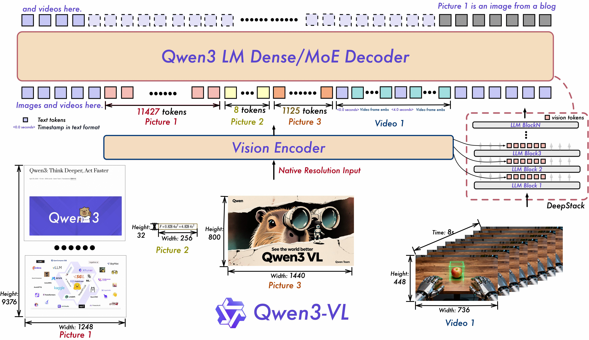

# Qwen3-VL: A Production VLM on the Qwen3 Backbone — Qwen Team, 2025

> **arXiv:** 2511.21631 (*Qwen3-VL Technical Report*) · **Developer:** Qwen team, Alibaba Cloud ·
> **Released:** Sep–Oct 2025 · **License:** Apache-2.0 · **Code:** github.com/QwenLM/Qwen3-VL ·
> **Models:** [huggingface.co/Qwen](https://huggingface.co/collections/Qwen/qwen3-vl-68d2a7c1b8a8afce4ebd2dbe)

## TL;DR
Qwen3-VL is Alibaba's 2025 open-weight vision-language family built on the
[Qwen3](backbone_2025_qwen3.md) LLM backbone, in **dense (2B/4B/8B/32B)** and **MoE (30B-A3B,
235B-A22B)** variants, each with an **Instruct** and a reasoning **Thinking** edition. It keeps
Qwen2-VL's **native dynamic-resolution ViT** and **Multimodal RoPE**, and adds three upgrades:
**Interleaved-MRoPE** (full-frequency temporal/height/width position coverage), **DeepStack**
(injecting multi-level ViT features into several LLM layers), and **text–timestamp alignment** for
video. It natively handles **256K context (→1M via YaRN)**, OCR in 32 languages, 2D/3D grounding,
GUI/computer-use agents, and visual coding; the 235B model reportedly matches or surpasses Gemini 2.5
Pro and GPT-5 on many multimodal benchmarks.

## Why this matters for the backbone / multimodal threads
Qwen3-VL is the **reference implementation** of the repo's whole recipe on the *identical* decoder
family it uses ([multimodal thread](../context/multimodal/multimodal.md)): same
[Qwen3](backbone_2025_qwen3.md) decoder, same soft-token ingestion path (visual tokens as embeddings),
same serving stacks (vLLM/SGLang). Its MLP patch-merge → visual-token pipeline is the vision analog of
the repo's *text span → latent → adapter → decoder* flow; its M-RoPE is where
[CPVT](multimodal_2021_cpvt.md)'s "content-conditioned positions" reach the LLM side.

## Problem & motivation
Build a **production VLM on the Qwen3 backbone** that does not trade away pure-text ability for vision.
Early-stage **joint text+vision pretraining** keeps text performance on par with the text-only
`Qwen3-235B-A22B-2507`. Dense + MoE options cover edge → cloud, and the family pushes VLMs from
perception toward **cognition and action** (agentic GUI control, spatial/embodied reasoning, long-video
understanding, visual coding).

## Architecture (reimplementation-grade)

*Figure 1 — Native-resolution images/video → **Vision Encoder** (ViT) → visual tokens interleaved with
text/timestamps → **Qwen3 LM Dense/MoE decoder**. **DeepStack** injects multi-level ViT features into
several LLM blocks; video frames are interleaved with textual timestamps.*

**Vision encoder + native dynamic resolution.** A ViT processes images at their **native, variable
resolution** (NaViT-style, from Qwen2-VL): patchify (patch size **16**, vs 14 in Qwen2.5-VL) into a
**variable number of visual tokens** proportional to resolution — no fixed-grid downscaling. Images and
video share one paradigm (video sampled at e.g. `fps=2`).

**Visual tokens: MLP patch-merge + DeepStack.** Adjacent ViT patches are **merged by an MLP** into
visual tokens fed to the LLM. **DeepStack** (new) tokenizes features from **multiple ViT layers** and
injects them across **multiple LLM layers** (low→high level), tightening vision–text alignment and
fine-grained detail.

**Positional encoding: M-RoPE → Interleaved-MRoPE.** M-RoPE (Qwen2-VL) decomposes each token's rotary
index into **temporal / height / width** sections:
$$\theta_i=\begin{cases} f(\text{pos}_t) & i\in\text{temporal}\\ f(\text{pos}_h) & i\in\text{height}\\ f(\text{pos}_w) & i\in\text{width}\end{cases}$$
For text, $t=h=w$ (reduces to 1-D RoPE); for images $t$ is constant while $h,w$ index the 2-D grid; for
video $t$ increments across frames. **Interleaved-MRoPE** spreads $t,h,w$ **across the whole frequency
spectrum** (rather than contiguous blocks that concentrated temporal info in high frequencies), giving
each axis full-frequency coverage and much better long-horizon video reasoning (`mrope_interleaved:
true`, `mrope_section: [24, 20, 20]`).

**Text–timestamp alignment (video).** Replaces Qwen2.5-VL's T-RoPE with an explicit
`timestamp, frame, timestamp, frame, …` interleaving, emitting time as seconds or `HH:MM:SS` —
improving event localization and temporal QA.

**LLM backbone & long context.** [Qwen3](backbone_2025_qwen3.md) dense + MoE, Thinking / Instruct
editions; **256K native → 1M via [YaRN](positional_2023_yarn-context-extension.md)** (`rope_type: yarn`,
`factor: 3.0`); 1M tokens ≈ two hours of video. Interleaved position IDs grow more slowly, so a
**smaller YaRN factor (2–3)** suffices.

**Released sizes.** Dense 2B/4B/8B/32B; MoE 30B-A3B, 235B-A22B; FP8/AWQ quantized variants. HF IDs:
`Qwen/Qwen3-VL-<size>-{Instruct|Thinking}`.

## Capabilities
- **OCR** in 32 languages (up from 10); robust to low light/blur/tilt; long multi-page document parsing
  with **QwenVL Markdown** / **QwenVL HTML** structured output.
- **Visual agent / GUI grounding** — operates PC & mobile GUIs, invokes tools; strong on OS World.
- **Spatial grounding** — 2D shifted to **relative coordinates** (boxes + points); new **3D grounding**
  (boxes, position/size/depth) for embodied AI.
- **Video temporal grounding** — second-level localization, >1.5 h video, video OCR.
- **Visual coding** — image/video → Draw.io / HTML / CSS / JS.
- **"Think with images"** — `image_zoom_in_tool`, `search_tool`; strong STEM/math in Thinking edition.

## Results
Concrete confirmable claims (per-benchmark tables are published as images in the repo/blog):
- **Long-context needle-in-haystack (video):** **100 %** at 256K, **99.5 %** at 1M tokens.
- **Multilingual OCR:** >70 % accuracy in **32 of 39** tested languages.
- **Positioning:** Qwen3-VL-235B-A22B-**Instruct** reportedly outperforms Gemini 2.5 Pro and GPT-5 on
  major perception benchmarks and sets open-source SOTA; the **Thinking** edition sets open-source
  records on most metrics and beats Gemini 2.5 Pro on **MathVision**; both are competitive with
  closed-source on MMMU / MathVista. Exact per-benchmark numbers are in the arXiv PDF and HF model
  cards.

*Eval setup:* inference via vLLM; VLMEvalKit / lmms-eval. Instruct sampling temp 0.7, top_p 0.8,
top_k 20; Thinking temp 0.6, top_p 0.95.

## Limitations & follow-ups
- Per the team, the Thinking model still lags closed-source SOTA on some multidisciplinary /
  general-visual-reasoning / video tasks.
- Public numeric tables are image-only; some benchmarks internally constructed.
- 1M context needs YaRN (not native); the 235B model is hardware-heavy (FP8 checkpoints provided).
- **Relation to the repo.** The deployed instance of the [multimodal
  thread](../context/multimodal/multimodal.md) recipe on the same [Qwen3](backbone_2025_qwen3.md)
  decoder as [LCLM](../context/ctx_compression.md) / [MixedDecoder](../mixed_decoder/mixed_decoder.md);
  its M-RoPE extends [RoPE](positional_2021_rope-roformer.md) to (t,h,w).

## Links
- **arXiv:** [abs](https://arxiv.org/abs/2511.21631) · [pdf](https://arxiv.org/pdf/2511.21631) · (M-RoPE origin: [Qwen2-VL 2409.12191](https://arxiv.org/abs/2409.12191); [Qwen2.5-VL 2502.13923](https://arxiv.org/abs/2502.13923))
- **Code:** https://github.com/QwenLM/Qwen3-VL · **Models:** https://huggingface.co/Qwen
- **Related:** [Qwen3](backbone_2025_qwen3.md) · [Qwen3-Embedding](backbone_2025_qwen3-embedding.md) · [ViT](multimodal_2020_vit.md) · [CPVT](multimodal_2021_cpvt.md) · [RoPE](positional_2021_rope-roformer.md) · [YaRN](positional_2023_yarn-context-extension.md) · [Cambrian-1](multimodal_2024_cambrian-1.md) · [multimodal thread](../context/multimodal/multimodal.md) · [Qwen overview](../qwen/overview.md)
