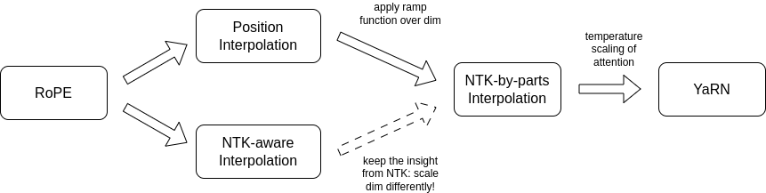
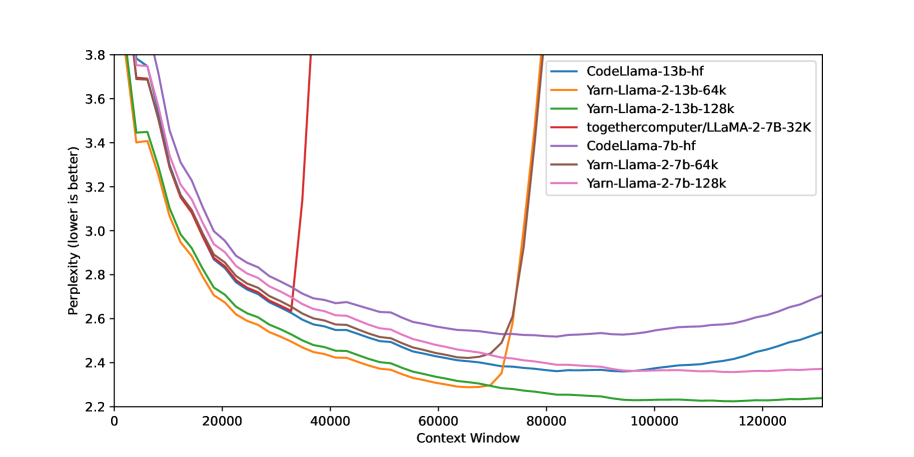

# YaRN: Efficient Context Window Extension of Large Language Models — Peng et al., 2023

> **arXiv:** 2309.00071v3 · **Venue:** preprint (cs.CL) · **Affiliation:** Nous Research, EleutherAI, Univ. of Geneva

## TL;DR
YaRN extends a RoPE LLM's context window to 64k–128k+ at **~10× less data and 2.5× fewer steps** than Position Interpolation. It is the union of two ideas: **NTK-by-parts** (a per-dimension *piecewise* RoPE-frequency interpolation that interpolates low frequencies, leaves high frequencies alone, and ramps in between) and a small **attention-temperature scaling** that compensates for the entropy shift the longer context induces.

## Problem & motivation
Three preceding RoPE-extension recipes had complementary weaknesses (§3):
- **PI** (Position Interpolation) — uniformly compresses all RoPE frequencies → kills high-frequency dimensions, caps at $s\!\approx\!8$.
- **[NTK-aware](p001_2023_positional_ntk-aware-rope.md)** — preserves high frequencies via a base change, great zero-shot, but *partially extrapolates* high-freq dims, which destabilizes fine-tuning.
- **NTK-by-parts** (predecessor of YaRN) — fixes the high-freq overshoot, but at very long contexts the *average attention entropy* still shifts, hurting log-likelihood.

YaRN's contribution: combine NTK-by-parts with a tiny softmax-temperature trick that exactly compensates for that entropy shift.

## Key idea
**(1) NTK-by-parts interpolation (§3.2).** For each RoPE dimension $d$, define its number of rotations in the training window as $r(d) = L / \lambda_d$ where $\lambda_d = 2\pi b^{2d/|D|}$. Interpolate frequency by a position-dependent ramp:

$$
g(m)=m,\qquad
h(\theta_d)=\bigl(1-\gamma(r(d))\bigr)\,\frac{\theta_d}{s} + \gamma(r(d))\,\theta_d,
$$

$$
\gamma(r) = \begin{cases}0 & r<\alpha\\ 1 & r>\beta\\ \dfrac{r-\alpha}{\beta-\alpha} & \text{otherwise}\end{cases}
$$

with $\alpha=1,\;\beta=32$ for the LLaMA family (§3.2). Low-freq dims (small $r$) → fully interpolate; high-freq dims (large $r$) → leave alone; mid-freq dims → smooth ramp.

**(2) Attention temperature (§3.3).** Divide the pre-softmax logits by a constant $t$:

$$
\operatorname{softmax}\!\bigl(\tfrac{q_m^\top k_n}{t\,\sqrt{|D|}}\bigr),\qquad \frac{1}{t} = 0.1\,\ln s + 1 .
$$

Implementationally this is **free** — just rescale the rotated $q,k$ by $1/\sqrt t$.

The combination is depicted in the paper's method-summary diagram:

## How it works
- **Training-free path.** Just plug in $h(\theta_d)$ + temperature; works at inference time on any RoPE checkpoint ("Dynamic-YaRN").
- **Optional fine-tuning.** ~400 PG-19 steps to recover any small perplexity gap; plus a 200-step continuation transfers from 64k → 128k.
- **Composes cleanly** with FlashAttention-2 (used in their fine-tuning runs).

**Hyperparameters that matter.**
| Symbol | Meaning | Recommended (LLaMA) |
|---|---|---|
| $s$ | extension factor $L'/L$ | 8, 16, 32 |
| $\alpha, \beta$ | ramp endpoints (in #rotations) | 1, 32 |
| $1/t$ | softmax temperature | $0.1\ln s + 1$ |

## Training / data
PG-19, chunked into 64k-token contiguous windows; `bf16`, AdamW $\beta=(0.9, 0.95)$, no weight decay, lr $2{\times}10^{-5}$, 20-step linear warmup, global batch 64, FSDP + FlashAttention-2 (§4.1).

| Setup | Steps | Compute (A100·h, 7B) |
|---|---|---|
| 4k → 64k ($s=16$) | 400 | ≈ 256 |
| 64k → 128k ($s=32$, transfer) | +200 | ≈ +128 |

## Results
**Long-sequence perplexity** on Proof-pile, sliding window $S=256$ (§4.2, Table 1):

| Model | Scale | 8k | 16k | 32k | 64k | 128k |
|---|---|---|---|---|---|---|
| Llama-2 7B + YaRN | $4k\!\times\!16$, 400 steps   | 3.51 | 2.99 | 2.65 | 2.42 | — |
| Llama-2 7B + YaRN | $4k\!\times\!32$, 400+200     | 3.56 | 3.04 | 2.70 | 2.45 | **2.37** |
| Llama-2 13B + YaRN | $4k\!\times\!16$              | 3.25 | 2.79 | 2.50 | 2.29 | — |
| Llama-2 13B + YaRN | $4k\!\times\!32$              | 3.29 | 2.83 | 2.53 | 2.31 | **2.24** |

**Headline ppl-vs-context plot** (Figure 1, paper):

**Passkey retrieval** (§4.3, Table 9): YaRN-Llama-2-7B/13B at $s=32$ → **99.4 %** on a 128k-token passkey task — i.e. successful extrapolation past the trained 64k.

**Standard benchmarks** (§4.4, Table 3) on the HF Open LLM Leaderboard show < 1 % drop on ARC-c / HellaSwag / MMLU / TruthfulQA after the context extension — i.e. extension is essentially free.

**Compute** (§4.5, Table 4): YaRN reaches 64k on Llama-2-7B with 256 A100·h vs PI's 640, and matches Code-Llama-style ~50k contexts at >10× less compute than NTK-aware fine-tuning.

## Limitations & follow-ups
- **Hyperparameter portability.** $\alpha=1,\beta=32$ are LLaMA-specific; the paper notes the ramp may need re-tuning per architecture (§3.2).
- **Perplexity ≠ retrieval.** Sometimes passkey accuracy outpaces what perplexity alone would predict (App. B.5).
- **Dynamic-YaRN trade-off.** The training-free variant can hurt very-short-context performance inside the original window (App. B.7).
- **Successor / alternative.** [Dual Chunk Attention (DCA, An et al. 2024)](p003_2024_positional_dca-dual-chunk-attention.md) achieves comparable extension *without any training* and stacks on top of YaRN.
- **Productionized in:** Qwen2 / Qwen2.5 long-context models (combined with DCA up to 128k, and with both up to 1M in Qwen2.5-1M).

## Links
- **arXiv:** [abs](https://arxiv.org/abs/2309.00071) · [html v3](https://arxiv.org/html/2309.00071v3) · [pdf](https://arxiv.org/pdf/2309.00071)
- **Code:** [jquesnelle/yarn](https://github.com/jquesnelle/yarn)
- **Hugging Face:** [`NousResearch/Yarn-Llama-2-7b-64k`](https://huggingface.co/NousResearch/Yarn-Llama-2-7b-64k) · [`-7b-128k`](https://huggingface.co/NousResearch/Yarn-Llama-2-7b-128k) · [`-13b-64k`](https://huggingface.co/NousResearch/Yarn-Llama-2-13b-64k) · [`-13b-128k`](https://huggingface.co/NousResearch/Yarn-Llama-2-13b-128k)
- **Project page:** —
- **Blog posts:** [EleutherAI — *YaRN: long context for LLaMA*](https://blog.eleuther.ai/yarn/)
- **Talks / videos:** —
- **OpenReview / venue page:** —
- **Papers-with-Code:** [paperswithcode.com/paper/yarn-efficient-context-window-extension-of](https://paperswithcode.com/paper/yarn-efficient-context-window-extension-of)
- **BibTeX:** available from the arXiv abs page
- **Related / successor papers:** [RoPE](p000_2021_positional_rope-roformer.md) · [NTK-aware RoPE](p001_2023_positional_ntk-aware-rope.md) · Position Interpolation ([Chen et al. 2306.15595](https://arxiv.org/abs/2306.15595)) · [DCA](p003_2024_positional_dca-dual-chunk-attention.md)
