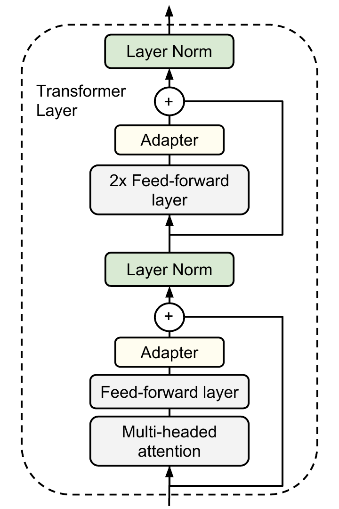
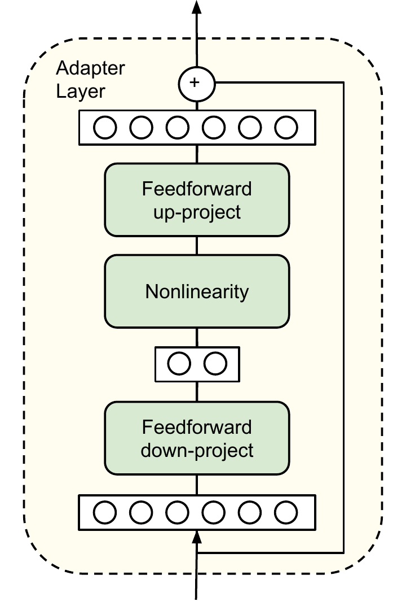
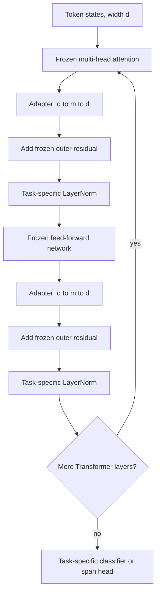
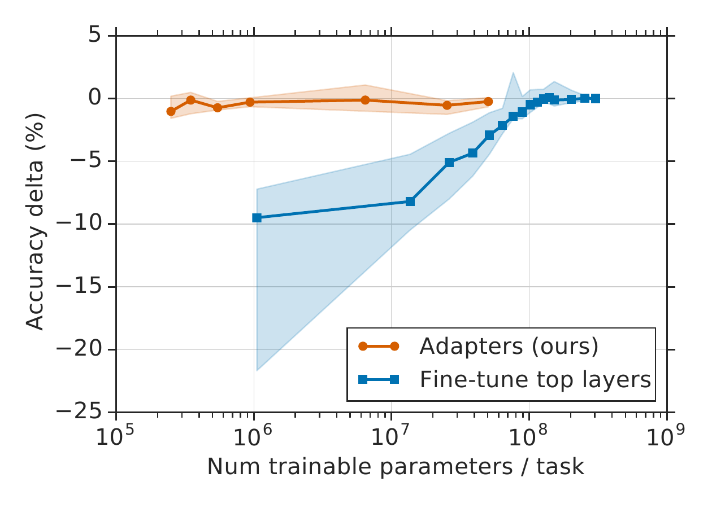
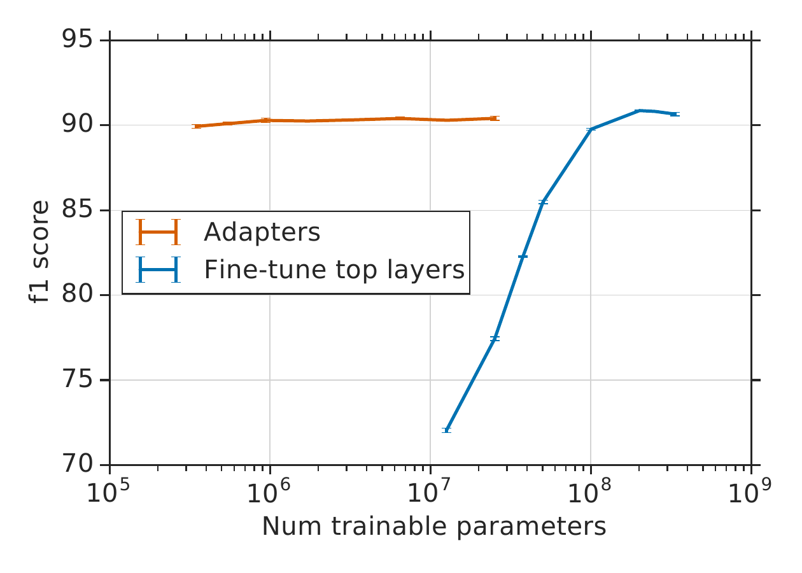

# Bottleneck Adapters: Parameter-Efficient Transfer Learning for NLP — Houlsby et al., 2019

> **arXiv:** 1902.00751v2 · **Venue:** ICML 2019 · **Affiliation:** Google Research; Jagiellonian University

## TL;DR

Houlsby et al. freeze a pretrained BERT and insert two small residual bottleneck modules into every Transformer layer, training only those adapters, task-specific layer-normalization parameters, and the output head. The resulting system is extensible: adding a task adds roughly 0.5–8% task-specific parameters rather than another full backbone, without requiring access to earlier tasks. On GLUE, task-tuned adapter widths score 80.0 versus 80.4 for full BERT-Large fine-tuning while training 3.6% as many parameters per task and requiring 1.3× rather than 9× backbone storage across the evaluated tasks (Table 1).

## Problem & motivation

Pretraining makes transfer effective, but conventional full fine-tuning duplicates every backbone weight for every downstream task. If the pretrained model has $P$ parameters and a service supports $N$ tasks, independent fine-tuned checkpoints require approximately $NP$ stored parameters. Task arrival is also awkward for multi-task training: jointly retraining on all old and new datasets requires retaining all data and risks interactions among tasks.

The paper seeks a transfer method with three properties:

1. **Performance:** remain close to full fine-tuning.
2. **Compactness:** add only a small parameter set per task while sharing one frozen backbone.
3. **Extensibility:** train a new task independently, without old task data or catastrophic forgetting.

Feature extraction is compact because only a new head is learned, but it cannot rewrite intermediate representations. Full fine-tuning can rewrite every layer, but is not compact. Multi-task learning shares parameters, but assumes simultaneous access to all tasks. Adapters occupy the middle: they inject task-specific transformations throughout the network while leaving pretrained weights immutable.

The target deployment model is therefore

$$
P_{\mathrm{total}} = P_{\mathrm{shared}} + \sum_{t=1}^{N} P_{\mathrm{task},t},
$$

with $P_{\mathrm{task},t}\ll P_{\mathrm{shared}}$. Switching tasks means selecting a different small set of adapter, layer-normalization, and head weights around the same backbone.

## Key idea

For a hidden vector $\mathbf{h}\in\mathbb{R}^{d}$, an adapter first projects to bottleneck width $m\ll d$, applies a nonlinearity, projects back to model width, and adds an internal residual connection:

$$
\operatorname{Adapter}(\mathbf{h})
= \mathbf{h} + W_{\mathrm{up}}\,f\!\left(W_{\mathrm{down}}\mathbf{h}+\mathbf{b}_{\mathrm{down}}\right)
+\mathbf{b}_{\mathrm{up}},
$$

where

$$
W_{\mathrm{down}}\in\mathbb{R}^{m\times d},\qquad
W_{\mathrm{up}}\in\mathbb{R}^{d\times m}.
$$

The two projections and biases contain

$$
P_{\mathrm{adapter}}=md+m+dm+d=2md+m+d
$$

parameters. A Transformer with $L$ layers receives two adapters per layer, so its adapter-only budget is

$$
P_{\mathrm{adapters,total}}=2L(2md+m+d).
$$

Task-specific layer-normalization scale and bias add $2d$ parameters for each adapted normalization site, and the task head adds an output-dependent amount. Because $m$ is the only adapter-specific capacity knob, it directly controls the storage–quality trade-off.

The residual path and near-zero projection initialization make the new module approximately the identity at step zero:

$$
W_{\mathrm{up}}f(W_{\mathrm{down}}\mathbf{h}+\mathbf{b}_{\mathrm{down}})
+\mathbf{b}_{\mathrm{up}}\approx \mathbf{0}
\quad\Longrightarrow\quad
\operatorname{Adapter}(\mathbf{h})\approx\mathbf{h}.
$$

Training therefore begins near the pretrained function instead of abruptly perturbing every layer.

## How it works

### Placement inside the original Transformer

The paper uses BERT's original post-layer-normalization Transformer. Each layer has an attention sublayer and a feed-forward sublayer. After each sublayer projects back to width $d$, the authors place an adapter **before** adding the Transformer's outer residual and before the following layer normalization. This yields two serial adapters per layer.

*Paper Figure 2, left panel. One adapter follows the attention output projection and another follows the feed-forward output projection. The surrounding Transformer residual paths remain intact.*

The adapter itself has a second, internal residual path:

*Paper Figure 2, right panel. Only the narrow $d\rightarrow m\rightarrow d$ branch is task-specific; the bypass preserves the incoming representation and makes near-identity initialization possible.*

The complete task path can be written schematically as:

### What trains and what stays frozen

For each task $t$, optimization updates:

- both adapter projection matrices and biases at every insertion point;
- new layer-normalization scale and bias parameters;
- the task-specific classification or span-prediction head.

All pretrained attention, feed-forward, embedding, and other BERT parameters remain frozen. Consequently, gradients need not produce optimizer states for the backbone, but forward and backward propagation still traverse the full network to train modules in early layers. “Few trainable parameters” is therefore a storage and optimizer-state claim, not a claim that only a small fraction of BERT's computation executes.

### Initialization

Main experiments draw adapter weights from a zero-mean Gaussian with standard deviation $10^{-2}$, truncated at two standard deviations (§3.6). Figure 6 sweeps standard deviations from $10^{-7}$ to $1$. MNLI is robust over a broad range, while CoLA degrades sharply once initialization becomes too large; near-identity initialization is thus a stability condition, not merely aesthetic.

### Capacity selection

The bottleneck width $m$ is selected on validation data:

- GLUE uses either one fixed $m=64$ or a per-task choice from $\{8,64,256\}$.
- The 17 additional classification tasks sweep $m\in\{2,4,8,16,32,64\}$.
- SQuAD sweeps adapter size, with reported points at $m=2$ and $m=64$.

On GLUE, the best width is not monotonic in dataset size or difficulty: MNLI selects 256, while small RTE selects 8 (§3.2). Yet fixed-width performance is fairly flat: mean validation accuracy over eight classification metrics is 86.2, 85.8, and 85.7 for widths 8, 64, and 256 respectively (§3.6). This supports using one operational default even though per-task tuning gives the strongest aggregate.

### Why adapters beat partial fine-tuning at equal budget

Fine-tuning only the top $k$ layers concentrates all task capacity near the output and leaves lower representations unchanged. Adapters distribute a much smaller transformation budget through the whole depth. On MNLI matched validation, tuning only BERT-Base's top layer uses about 9M trainable parameters and reaches $77.8\%\pm0.1\%$ accuracy; width-64 adapters use about 2M and reach $83.7\%\pm0.1\%$, versus $84.4\%\pm0.02\%$ for full fine-tuning (§3.4).

*Paper Figure 3, GLUE panel. Across tasks, adapters remain near full-fine-tuning performance with roughly two orders of magnitude fewer trainable parameters, whereas progressively freezing lower layers produces a steep quality loss.*

Layer-normalization-only tuning is smaller still—about 40K BERT-Base parameters—but loses approximately 3.5 points on CoLA and 4 points on MNLI (§3.4). The result isolates the bottleneck transformations as useful capacity rather than attributing the method entirely to task-specific normalization.

### Layer-ablation evidence

After training width-64 BERT-Base adapters, the authors remove adapters from contiguous layer spans without retraining. Removing any one layer's adapters costs at most 2%, but removing all adapters collapses MNLI to 37% and CoLA to 69%, their majority-class baselines (§3.6). Lower-layer adapters matter less: removing layers 0–4 barely changes MNLI, whereas spans that include upper layers cause much larger drops. Adapter influence is distributed but biased toward task-specialized upper representations.

The authors also tried normalization inside adapters, deeper adapters, alternative activations such as `tanh`, attention-internal placement, and parallel or multiplicative branches. None gave a significant consistent improvement, so they retained the simple serial bottleneck (§3.6).

## Training / data

### Shared optimization protocol

All experiments start from public pretrained BERT checkpoints. Classification reads BERT's first `[CLS]` representation through a task-specific linear head. Training uses Adam, batch size 32, four Google Cloud TPUs, 10% linear learning-rate warmup, then linear decay to zero (§3.1). Models and hyperparameters are selected by validation performance.

### GLUE

GLUE uses 330M-parameter, 24-layer BERT-Large. WNLI is omitted, following the original BERT evaluation; matched and mismatched MNLI are treated as separate tuning/storage entries. Adapter tuning sweeps:

| Hyperparameter | Values | Source |
|---|---|---|
| Learning rate | $3\times10^{-5}$, $3\times10^{-4}$, $3\times10^{-3}$ | §3.2 |
| Epochs | 3, 20 | §3.2 |
| Bottleneck width | fixed 64 or per-task 8, 64, 256 | §3.2 |
| Seeds | five reruns; select best validation model | §3.2 |

Test metrics come from the GLUE server: Matthews correlation for CoLA, Spearman correlation for STS-B, F1 for MRPC and QQP, and accuracy for the remaining tasks (Table 1). The unweighted “Total” mixes these task metrics in the benchmark's then-current convention.

### Seventeen additional classification tasks

The second suite uses 12-layer BERT-Base and spans 900–330K training examples, 2–157 classes, and average text lengths from 57 to 1.9K characters (Appendix Table 3). It includes 20 Newsgroups, eleven CrowdFlower datasets, customer complaints, news aggregation, SMS spam, and other public classification data.

Learning rates are $\{10^{-5},3\times10^{-5},10^{-4},3\times10^{-3}\}$; widths are $\{2,4,8,16,32,64\}$; and epochs are manually chosen from $\{20,50,100\}$ after inspecting validation curves (§3.3 and Appendix Table 4). The comparison includes full fine-tuning, variable fine-tuning of the top $n\in\{1,2,3,5,7,9,11,12\}$ layers, and a separate AutoML baseline. The latter searches more than 10K models per task on average for one week using 30 CPU machines (§3.3).

### SQuAD v1.1

SQuAD tests whether the recipe transfers beyond sentence classification. Full or partial fine-tuning sweeps $\{3\times10^{-5},5\times10^{-5},10^{-4}\}$ for 2, 3, or 5 epochs. Adapters sweep $\{3\times10^{-5},10^{-4},3\times10^{-4},10^{-3}\}$ for 3, 10, or 20 epochs (§3.5). Reported curves show validation F1 with standard error over three seeds.

*Paper Figure 5. Adapter quality is nearly flat across a broad parameter range: even the smallest tested bottleneck is close to full fine-tuning, while partial fine-tuning needs tens to hundreds of millions of trainable parameters to approach the same F1.*

## Results

### GLUE test set

| Method | Total storage for tasks | Trainable per task | CoLA | SST-2 | MRPC | STS-B | QQP | MNLI-m/mm | QNLI | RTE | Total | Source |
|---|---:|---:|---:|---:|---:|---:|---:|---:|---:|---:|---:|---|
| Full BERT-Large fine-tuning | 9.0× | 100% | **60.5** | **94.9** | 89.3 | **87.6** | **72.1** | **86.7 / 85.9** | 91.1 | 70.1 | **80.4** | Table 1 |
| Adapters, width 8–256 | 1.3× | 3.6% | 59.5 | 94.0 | 89.5 | 86.9 | 71.8 | 84.9 / 85.1 | 90.7 | **71.5** | 80.0 | Table 1 |
| Adapters, fixed width 64 | 1.2× | 2.1% | 56.9 | 94.2 | **89.6** | 87.3 | 71.8 | 85.3 / 84.6 | **91.4** | 68.8 | 79.6 | Table 1 |

The tuned-width adapter loses 0.4 aggregate points from full fine-tuning while reducing task-specific trained parameters by about $27.8\times$ ($100/3.6$). Across the nine stored GLUE entries used by the paper, its total footprint is 1.3 backbone equivalents instead of 9.0. This is a multi-task storage comparison, not a claim that one adapter-equipped inference request uses 1.3× compute.

### Additional classification suite

| Method | Mean test accuracy | Total storage for 17 tasks | Trainable per task | Source |
|---|---:|---:|---:|---|
| Full BERT-Base fine-tuning | **73.7** | 17.0× | 100% | Table 2 |
| Variable top-layer fine-tuning | **74.0** | 9.9× | 52.9% | Table 2 |
| Adapters | 73.3 | **1.19×** | **1.14%** | Table 2 |
| AutoML without BERT | 72.7 | n/a | n/a | Table 2 |

Adapters trail full fine-tuning by 0.4 mean accuracy and variable fine-tuning by 0.7 while reducing total stored parameters by roughly $14.3\times$ relative to 17 independent BERT-Base models. Per-task results are not uniformly close: adapters exceed full fine-tuning on datasets such as CrowdFlower corporate messaging (92.9 vs 92.5) and U.S. economic performance (77.3 vs 75.3), but underperform sharply on SMS spam (95.1 vs 99.3) and progressive stance (60.6 vs 63.8), all per Table 2.

### SQuAD and controlled parameter comparisons

| Setting | Trainable parameters | Validation result | Source |
|---|---:|---:|---|
| Full SQuAD fine-tuning | 100% | **90.7 F1** | §3.5 |
| Adapter width 64 | 2% | 90.4 F1 | §3.5 |
| Adapter width 2 | 0.1% | 89.9 F1 | §3.5 |
| MNLI full fine-tuning | full BERT-Base | **$84.4\%\pm0.02\%$ accuracy** | §3.4 |
| MNLI adapter width 64 | about 2M | $83.7\%\pm0.1\%$ accuracy | §3.4 |
| MNLI top-layer-only tuning | about 9M | $77.8\%\pm0.1\%$ accuracy | §3.4 |

The width-2 SQuAD result is the strongest compression example: 0.1% task-specific parameters gives up only 0.8 F1 to full fine-tuning. The MNLI comparison shows why distribution matters: inserting small transformations throughout depth is substantially more effective than spending a larger budget on one top layer.

## Limitations & follow-ups

- **Storage efficiency is not latency neutrality.** Adapters are serial nonlinear modules that execute twice per layer. The paper does not report inference throughput or latency, and unlike [LoRA](peft_2021_lora.md), these modules cannot generally be folded into one frozen linear weight because of the intervening nonlinearity.
- **The backbone is old and modest by current standards.** Results cover BERT-Base/Large, before decoder LLMs, pre-layer-normalized Transformers, quantized training, and modern distributed serving. Placement and optimization do not automatically transfer unchanged to every architecture.
- **Reported trainable percentages include more than bottlenecks.** Task-specific layer norms and heads also train. Implementations that freeze normalization are not reproducing the paper's exact “Houlsby adapter” recipe.
- **Model selection is generous.** GLUE runs sweep learning rate, epochs, width, and five seeds, then select the best validation model. The reported test score is a capability comparison, not an estimate of one-shot tuning robustness.
- **The GLUE aggregate is historical.** WNLI is omitted, MNLI matched/mismatched are counted separately for storage, and the total mixes heterogeneous metrics. It should not be compared directly with later GLUE leaderboard conventions.
- **The additional-task epoch choice is manual.** Epoch counts are selected from learning curves, which reduces procedural reproducibility and may favor methods differently across small datasets.
- **No direct training-memory or wall-clock measurements.** Freezing weights avoids backbone optimizer states and gradient updates, but activations and backward traversal remain. The paper establishes parameter efficiency, not a complete systems-efficiency profile.
- **No compositional or shared adapters.** Each task receives an isolated module set. This guarantees no forgetting but also prevents positive transfer between related tasks and makes multi-task composition an open problem.
- **Ablation evidence is narrow.** Layer-removal and initialization studies use only BERT-Base width-64 adapters on MNLI and CoLA; the higher-layer conclusion is suggestive, not universal.

The paper established the canonical serial bottleneck adapter. Later work explores single-adapter placement, adapter fusion, multilingual and domain adapters, parallel branches, and hypernetworks. [LoRA](peft_2021_lora.md) instead parameterizes low-rank updates to existing matrices and can merge them for inference, while [Prefix-Tuning](softtoken_2021_prefix-tuning.md) adapts learned continuous states rather than adding depth-wise modules.

## Links

- **arXiv:** [abs](https://arxiv.org/abs/1902.00751v2) · [html](https://arxiv.org/html/1902.00751v2) · [pdf](https://arxiv.org/pdf/1902.00751v2)
- **Code:** [google-research/adapter-bert](https://github.com/google-research/adapter-bert)
- **Hugging Face:** —
- **Project page:** [PMLR proceedings](https://proceedings.mlr.press/v97/houlsby19a.html)
- **Blog posts:** —
- **Talks / videos:** —
- **OpenReview / venue page:** —
- **Papers-with-Code:** —
- **BibTeX:** [PMLR citation](https://proceedings.mlr.press/v97/houlsby19a.html)
- **Related / successor papers:** [LoRA](peft_2021_lora.md) · [Prefix-Tuning](softtoken_2021_prefix-tuning.md) · [AdapterFusion](https://aclanthology.org/2021.eacl-main.39/) · [MAD-X](https://aclanthology.org/2020.emnlp-main.617/) · [BERT](bert-encoder_2018_bert-pretraining.md)