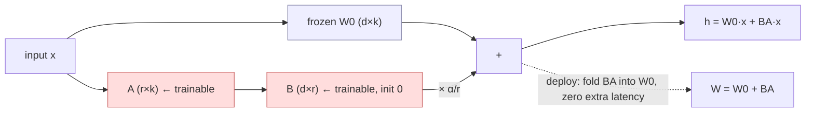

# LoRA: Low-Rank Adaptation of Large Language Models — Hu et al., 2021

> **arXiv:** 2106.09685v2 · **Venue:** ICLR 2022 · **Affiliation:** Microsoft

## TL;DR
Freeze the pretrained weights and learn each weight update as a **low-rank product** $\Delta W = BA$ with
rank $r\ll\min(d,k)$, injected in parallel to the frozen matrix. Only $A,B$ are trained — on GPT-3 175B
that's a **10,000× reduction** in trainable parameters and **3× less GPU memory**, yet quality **matches or
beats full fine-tuning** on RoBERTa, DeBERTa, GPT-2 and GPT-3. Unlike adapters, the low-rank update can be
**merged into $W$** at deployment, so there is **zero added inference latency**; unlike prompt/prefix
methods, it **doesn't consume input sequence length**. A rank as low as **1–2** often suffices, evidence
that adaptation updates are intrinsically low-rank.

## Problem & motivation
Full fine-tuning stores a complete 175B-parameter copy **per task** — prohibitive to deploy and switch.
Existing parameter-efficient methods each have a catch:
- **Adapter layers** add sequential modules → **extra inference latency** (noticeable at batch size 1,
  and worse under model sharding), even with tiny bottleneck dims.
- **Prefix/prompt tuning** is **hard to optimize**, non-monotonic in parameter count, and **eats into the
  usable sequence length** reserved for the actual task.

Motivated by findings that fine-tuning updates have a low **intrinsic dimension** (Aghajanyan et al.), LoRA
hypothesizes the **change in weights** $\Delta W$ itself is low-rank.

## Key idea
For a frozen pretrained weight $W_0\in\mathbb{R}^{d\times k}$, constrain its update to a rank-$r$
decomposition:

$$
W_0 + \Delta W = W_0 + BA,\qquad B\in\mathbb{R}^{d\times r},\ A\in\mathbb{R}^{r\times k},\ r\ll\min(d,k).
$$

The modified forward pass simply adds the two branches on the same input:

$$
h = W_0 x + \Delta W x = W_0 x + BA\,x .
$$

- **Init:** $A\sim\mathcal{N}(0,\sigma^2)$, $B=0$, so $\Delta W = 0$ at the start (training begins exactly
  at the pretrained model). $W_0$ is frozen; only $A,B$ get gradients.
- **Scaling:** $\Delta W x$ is scaled by $\alpha/r$ with $\alpha$ a constant; this makes tuning $\alpha$
  roughly equivalent to tuning the learning rate and avoids re-tuning hyperparameters when $r$ changes
  ($\alpha$ is set to the first $r$ tried and left alone).
- **No inference latency:** at deploy time compute $W = W_0 + BA$ once and run as normal; switch tasks by
  subtracting $BA$ and adding $B'A'$ — a cheap in-place swap.
- **Generalizes full fine-tuning:** raising $r$ toward the weight's rank recovers full-FT expressiveness
  (adapters converge to an MLP, prefix methods to a length-limited model).

**Where to apply it:** only the attention projections in most experiments. Given a fixed 18M budget on
GPT-3, adapting **both $W_q$ and $W_v$** (at $r=4$) beats putting all budget in one type at higher rank —
so it's better to spread low rank across more matrices. MLP, LayerNorm and biases are left frozen.

## How it works


Why it works — the paper's analysis: (1) subspace-similarity across $r=8$ vs $r=64$ shows the **top
singular direction is shared** (so $r=1$ already captures most signal); (2) $\Delta W$ correlates with $W$
but **amplifies directions not emphasized** in $W$ — amplification factor ≈**20** at $r=4$ — i.e. LoRA
boosts task-specific features latent in the pretrained weights.

## Training / data
Applied to **RoBERTa base/large, DeBERTa-XXL (1.5B)** on GLUE; **GPT-2 M/L** on E2E/WebNLG/DART NLG; and
**GPT-3 175B** on WikiSQL, MultiNLI, SAMSum. AdamW, linear decay. Typical ranks: RoBERTa/DeBERTa
$r_q=r_v=8$; GPT-2 $r_q=r_v=4$, $\alpha=32$; GPT-3 budgets 4.7M ($r=1$–2) and 37.7M ($r=8$), $\alpha$ tuned
once. On GPT-3, training VRAM drops **1.2TB → 350GB**, checkpoint **350GB → 35MB** (~10,000×), with ~**25%**
training speedup vs full FT. Only $A,B$ (and optionally biases) are trainable: $|\Theta| = 2\cdot L_{LoRA}
\cdot d_{model}\cdot r$.

## Results
RoBERTa/DeBERTa on GLUE (avg), and GPT-3 175B on three tasks; LoRA ≈ or > full FT at a fraction of params.

| Model | Method | # Trainable | Score | Source |
|---|---|---:|---:|---|
| RoBERTa-base | FT | 125M | 86.4 | Table 2 |
| RoBERTa-base | **LoRA** | 0.3M | **87.2** | Table 2 |
| RoBERTa-large | FT | 355M | 88.9 | Table 2 |
| RoBERTa-large | **LoRA** | 0.8M | **89.0** | Table 2 |
| DeBERTa-XXL | FT | 1500M | 91.1 | Table 2 |
| DeBERTa-XXL | **LoRA** | 4.7M | **91.3** | Table 2 |

GPT-3 175B (WikiSQL acc / MNLI-m acc / SAMSum R1-R2-RL):

| Method | # Trainable | WikiSQL | MNLI-m | SAMSum | Source |
|---|---:|---:|---:|---|---|
| Fine-Tune | 175,255M | 73.8 | 89.5 | 52.0/28.0/44.5 | Table 4 |
| PrefixEmbed | 3.2M | 63.1 | 88.6 | 48.3/24.2/40.5 | Table 4 |
| PrefixLayer | 20.2M | 70.1 | 89.5 | 50.8/27.3/43.5 | Table 4 |
| **LoRA** | 4.7M | 73.4 | 91.7 | 53.8/29.8/45.9 | Table 4 |
| **LoRA** | 37.7M | **74.0** | 91.6 | 53.4/29.2/45.1 | Table 4 |

- **Rank is tiny:** on GPT-3, $\{W_q,W_v\}$ at $r=1$ already gives WikiSQL 73.4 / MNLI 91.3; $r=64$ barely
  differs (Table 6) — the update's intrinsic rank is very low.
- **Which weights:** adapting $\{W_q,W_v\}$ > single type at higher rank (Table 5).
- **Scalability:** prefix methods **degrade** past ~256 (embed) / 32 (layer) special tokens, while LoRA's
  accuracy **stays stable** as parameters grow (Fig. 2).
- **Low-data:** MNLI-100 — LoRA 63.8 vs FT 60.2 vs PrefixEmbed 37.6 (Table 16); LoRA is sample-efficient.
- **No latency:** merged $W_0+BA$ runs identically to a fine-tuned model (adapters add up to +30% at batch
  1, Table 1). Combinable with prefix tuning (LoRA+PE) for a further WikiSQL gain.

## Limitations & follow-ups
- **Batching mixed tasks is awkward** if $A,B$ are folded into $W$ (must keep them separate to route
  per-sample LoRA modules).
- **Which matrices / what rank** are chosen heuristically; no principled selector.
- Only attention weights adapted here; MLP/LayerNorm/bias adaptation left to future work (later addressed
  by QLoRA, DoRA, AdaLoRA, etc.).
- Complementary to soft-prompt methods ([Prompt Tuning](softtoken_2021_prompt-tuning.md),
  [P-Tuning v2](softtoken_2021_p-tuning-v2.md), [Prefix-Tuning](softtoken_2021_prefix-tuning.md)) — LoRA
  edits weights, they edit activations/inputs; the two can be combined.

## Links
- **arXiv:** [abs](https://arxiv.org/abs/2106.09685) · [html](https://arxiv.org/html/2106.09685v2) · [pdf](https://arxiv.org/pdf/2106.09685)
- **Code:** <https://github.com/microsoft/LoRA>
- **BibTeX:**
  ```bibtex
  @inproceedings{hu2022lora,
    title     = {LoRA: Low-Rank Adaptation of Large Language Models},
    author    = {Hu, Edward J. and Shen, Yelong and Wallis, Phillip and Allen-Zhu, Zeyuan and Li, Yuanzhi and Wang, Shean and Wang, Lu and Chen, Weizhu},
    booktitle = {International Conference on Learning Representations (ICLR)},
    year      = {2022},
    url       = {https://arxiv.org/abs/2106.09685}
  }
  ```
- **Related papers:** [Prefix-Tuning](softtoken_2021_prefix-tuning.md) ·
  [Prompt Tuning](softtoken_2021_prompt-tuning.md) · [P-Tuning v2](softtoken_2021_p-tuning-v2.md)
- **In-repo:** [§6.6 in mixed_decoder](../mixed_decoder/mixed_decoder.md)
