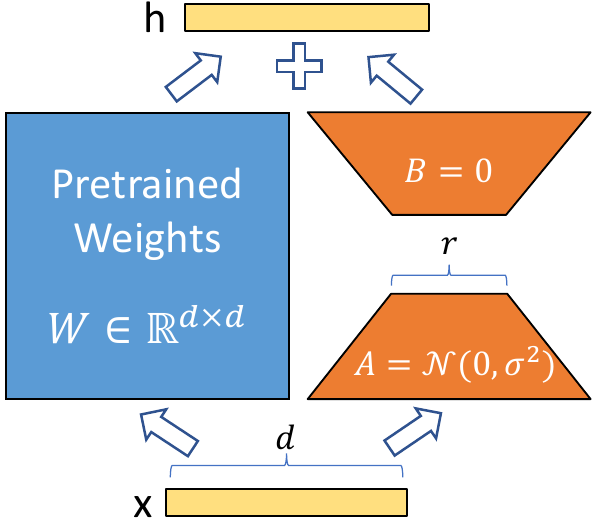
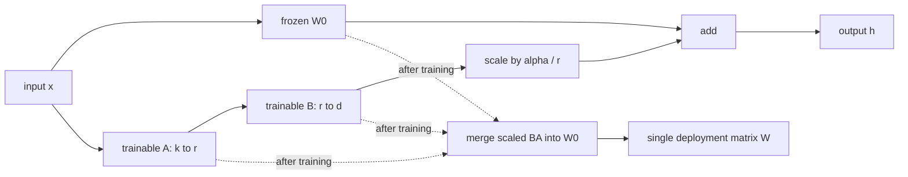
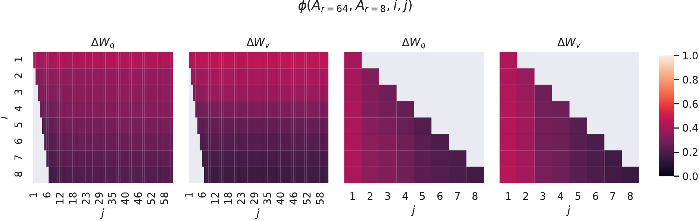
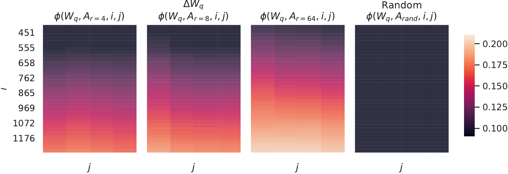
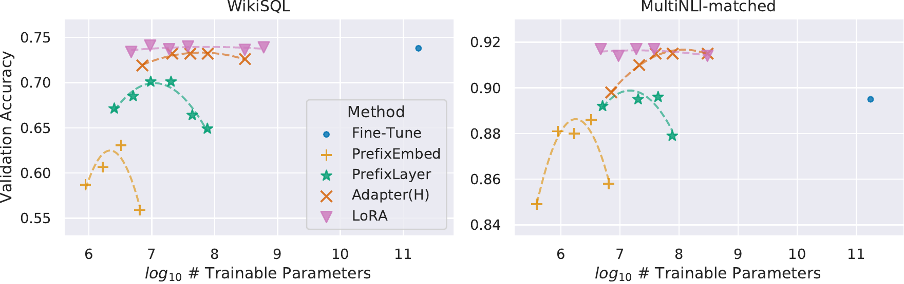

# LoRA: Low-Rank Adaptation of Large Language Models — Hu et al., 2021

> **Authors:** Edward J. Hu, Yelong Shen, Phillip Wallis, Y. Allen-Zhu, Yuanzhi Li, Shean Wang, Lu Wang, Weizhu Chen
> **arXiv:** 2106.09685v2 (16 October 2021) · **Venue:** ICLR 2022 · **Affiliation:** Microsoft

## TL;DR

LoRA freezes a pretrained model and represents each selected weight update as a low-rank product,
$\Delta W=BA$, trained in parallel with the frozen transformation. At deployment, the update can be
merged into the original matrix, $W_0\leftarrow W_0+(\alpha/r)BA$, so the adapted model has no extra
inference operations. On GPT-3 175B, the paper's most parameter-efficient setting trains 4.7M parameters
instead of 175.3B, nearly a 10,000-fold reduction; the reported training-memory footprint falls from
1.2 TB to 350 GB and throughput rises from 32.5 to 43.1 tokens/s/V100. LoRA matches or exceeds full
fine-tuning on the paper's RoBERTa, DeBERTa, GPT-2, and GPT-3 evaluations, although those comparisons
mix newly run and previously published baselines. Rank and subspace ablations suggest that useful GPT-3
adaptation updates are highly rank-deficient, but this is empirical evidence rather than a guarantee for
every architecture, task, or target matrix.

## Problem & motivation

Let a pretrained autoregressive language model with parameters $\Phi$ define $p_\Phi(y\mid x)$.
Conventional adaptation initializes $\Phi$ at pretrained weights $\Phi_0$ and learns a dense change
$\Delta\Phi$ by maximizing conditional likelihood over task data
$\mathcal{Z}=\{(x_i,y_i)\}_{i=1}^N$:

$$
\max_{\Delta\Phi}\sum_{(x,y)\in\mathcal{Z}}
\sum_{t=1}^{|y|}\log p_{\Phi_0+\Delta\Phi}
\left(y_t\mid x,y_{<t}\right).
$$

The adapted model has the same size as the base model. For GPT-3 175B, one FP16 task checkpoint is
about 350 GB before optimizer state, so storing and serving many task-specific copies is expensive
(§1 and §4.1). Full fine-tuning also retains gradients and optimizer states for every trainable weight;
the paper reports a 1.2 TB training-memory footprint for GPT-3 with Adam (§4.1).

Earlier parameter-efficient methods avoid a full task checkpoint but retain other costs:

- [Bottleneck adapters](peft_2019_bottleneck-adapters.md) insert trainable nonlinear modules between
  existing layers. They are compact, but their serial operations cannot generally be folded into the
  pretrained matrices and can increase latency, especially for online inference (§2 and Appendix B).
- [Prefix-Tuning](softtoken_2021_prefix-tuning.md) optimizes continuous prefix states. Prefixes reserve
  sequence positions, and the paper's GPT-3 sweep finds non-monotonic behavior as their parameter count
  grows (Figure 2 and Appendix E.2).
- Sparse updates and bias-only tuning reduce trainable parameters, but their task state is not always as
  small or competitive in the experiments summarized by the paper (§2, Tables 2–4).

Motivated by prior measurements of low intrinsic dimension during fine-tuning, the authors ask a more
specific question: can the *weight change* $\Delta W$, rather than the activation path or the pretrained
weight $W_0$, be constrained to a low-dimensional subspace?

## Key idea

For a frozen linear transformation $W_0\in\mathbb{R}^{d\times k}$, LoRA replaces an unconstrained dense
update with a rank-at-most-$r$ factorization:

$$
\Delta W=BA,
\qquad
B\in\mathbb{R}^{d\times r},
\quad
A\in\mathbb{R}^{r\times k},
\quad
r\ll\min(d,k).
$$

The forward pass is

$$
h=W_0x+\frac{\alpha}{r}BAx.
$$

$W_0$ remains frozen. The paper initializes $A$ with a random Gaussian and $B=0$, making the LoRA branch
exactly zero at step zero; training therefore starts from the pretrained function. The factor $\alpha/r$
controls update magnitude. The authors hold $\alpha$ fixed at the first rank they try, reducing the need
to retune the scale when changing $r$ (§4.1).



*Official Figure 1 (§1). Only $A$ and $B$ are trained; $B=0$ makes the initial update vanish. The paper's
schematic uses a square $d\times d$ weight, while the definition in §4.1 allows rectangular $d\times k$
matrices.*

For one adapted matrix, LoRA trains $r(d+k)$ parameters instead of $dk$. If a Transformer has $L$ layers
and LoRA targets $m$ square $d_{\text{model}}\times d_{\text{model}}$ projections per layer, the count is

$$
|\Theta_{\text{LoRA}}|=2Lmr d_{\text{model}}.
$$

The paper primarily targets attention projections. With
$W_q,W_k,W_v,W_o\in\mathbb{R}^{d_{\text{model}}\times d_{\text{model}}}$, its main runs adapt
$W_q$ and $W_v$ while freezing the key, output, MLP, LayerNorm, and other pretrained weights. Table 5
supports *distributing* a fixed parameter budget across more projection types: at an 18M budget on GPT-3,
adapting $W_q$ and $W_v$ at $r=4$ yields 73.7 WikiSQL / 91.3 MNLI, versus 70.4 / 91.0 for $W_q$ alone
at $r=8$. Adapting all four projections at $r=2$ yields 73.7 / 91.7.

## How it works

### Training and deployment path


```mermaid
flowchart LR
    X["input x"] --> W0["frozen W0"]
    X --> A["trainable A: k to r"]
    A --> B["trainable B: r to d"]
    W0 --> ADD["add"]
    B --> SCALE["scale by alpha / r"]
    SCALE --> ADD
    ADD --> H["output h"]
    A -. after training .-> MERGE["merge scaled BA into W0"]
    B -. after training .-> MERGE
    W0 -. after training .-> MERGE
    MERGE --> WD["single deployment matrix W"]
```

1. Choose target linear modules and replace each forward pass by the sum of a frozen branch and a
   trainable low-rank branch.
2. Freeze $W_0$ and optimize only $A,B$ (plus any explicitly chosen non-LoRA parameters). Backpropagation
   still traverses the frozen branch to compute gradients for earlier trainable LoRA modules, but no
   gradient or optimizer state is stored for $W_0$.
3. Save only $A,B$ and their configuration: target modules, rank $r$, and scale $\alpha$. A checkpoint is
   reusable only with the exact base model and compatible module naming/orientation.
4. For deployment, form $W=W_0+(\alpha/r)BA$. The forward pass then uses the original dense operation,
   which is why merged LoRA adds no inference latency. To change tasks, unmerge the old update and merge
   the new one, or keep branches separate and route them dynamically.

For a multi-head attention layer, the paper treats each projection as one matrix rather than allocating
separate factors per head. It also notes that the method applies to convolutions and other dense tensors
after reshaping, although the experiments focus on Transformer attention (§4.2).

### Why low rank can be enough

The paper tests its rank-deficiency hypothesis rather than deriving it. With a fixed GPT-3 setup,
Table 6 varies rank and matrix coverage. For $W_q,W_v$, moving from $r=1$ to $r=64$ changes WikiSQL
from 73.4 to 73.5 and MNLI from 91.3 to 91.4; the differences are within the reported run fluctuations.
Spreading capacity across all four projections is somewhat stronger for WikiSQL, but again larger rank
does not improve monotonically.

To compare learned subspaces, let $U_A^i$ and $U_B^j$ contain the top $i$ and $j$ left singular vectors
of matrices $A$ and $B$. Appendix G defines normalized subspace similarity as

$$
\phi(A,B,i,j)
=\frac{\left\|{U_A^i}^{\!\top}U_B^j\right\|_F^2}{\min(i,j)}.
$$

It is one minus a normalized projection-distance quantity: $\phi=1$ means the smaller subspace is
contained in the larger, while near-zero values indicate little overlap.



*Official Figure 3 (§7.2). For GPT-3 layer 48, the dominant directions of rank-8 and rank-64
$\Delta W_q,\Delta W_v$ overlap, while the remaining rank-64 directions contribute much less. Appendix H
shows related layers and seed comparisons; this evidence is specific to the analyzed GPT-3 runs.*

The authors also compare the singular directions of $\Delta W_q$ with those of pretrained $W_q$.
Table 7 and Figure 8 show more alignment than a random baseline, but not simply with $W_q$'s strongest
directions. They define a feature-amplification ratio

$$
\gamma=
\frac{\|\Delta W\|_F}
{\|U^\top W V^\top\|_F},
$$

where $U,V$ are singular-vector matrices of $\Delta W$. For the analyzed $r=4$ update,
$\gamma=6.91/0.32\approx21.5$; at $r=64$ it is about 2 (§7.3 and Appendix H.4). The interpretation is
that low-rank adaptation strongly amplifies a few task-relevant directions that exist but are not
dominant in the pretrained matrix.



*Official Figure 8 (Appendix H.3). Larger-rank updates recover more directions already emphasized by
$W_q$; all learned updates align more than the random control.*

## Training / data

All reported experiments use NVIDIA Tesla V100 GPUs (Appendix C). LoRA is evaluated across four scales:

| Backbone | Tasks | LoRA placement | Core recipe | Source |
|---|---|---|---|---|
| RoBERTa-base / large | GLUE | $W_q,W_v$; $r=8$ base, $r=16$ large | AdamW, linear decay, warmup ratio 0.06; tune learning rate, epochs, batch size; report median of five seeds at each run's best validation epoch | §5.1, Appendix D.1, Table 9 |
| DeBERTa-XXL 1.5B | GLUE | $r_q=r_v=8$, $\alpha=8$ | AdamW, linear decay, warmup ratio 0.1; tune learning rate, dropout, warmup steps, batch size; median of five seeds | §5.1, Appendix D.2, Table 10 |
| GPT-2 Medium / Large | E2E, DART, WebNLG | $r_q=r_v=4$, $\alpha=32$ | AdamW for 5 epochs, batch 8, learning rate $2\times10^{-4}$, 500 warmup steps; linear schedule; weight decay 0.01 on E2E/WebNLG and 0 on DART; mean of three seeds | §5.2, Appendix D.3, Table 11 |
| GPT-3 175B | WikiSQL, MNLI, SAMSum | task/budget dependent; main 4.7M and 37.7M rows | AdamW for 2 epochs, batch 128, weight decay 0.1, 250K warmup tokens, linear schedule; LoRA learning rate $2\times10^{-4}$ | §5.3, Appendix D.4, Table 12 |

GPT-3 uses maximum sequence lengths 384 for WikiSQL, 768 for MNLI, and 2048 for SAMSum. Its main
Table 4 rows aggregate the best configuration within a parameter budget: the 4.7M row uses $r_v=2$,
while the 37.7M row uses $r_q=r_k=r_v=r_o=4$ for WikiSQL and $r_q=r_v=8$ for MNLI/SAMSum
(Appendix E.2 and Table 15). Thus the row should not be read as one identical module selection across all
three tasks.

The GLUE comparison also has two regimes. Unmarked RoBERTa/DeBERTa rows use the authors' tuned setup.
Rows marked $\dagger$ constrain maximum sequence length to 128 and fix batch size to match the
Houlsby-adapter setup; they are not directly interchangeable with the main rows (Table 2 and Appendix D.1).

The system savings are specific to the stated GPT-3 configuration (§4.1): freezing most parameters cuts
reported training memory from 1.2 TB to 350 GB, and a rank-4 $W_q/W_v$ checkpoint is about 35 MB rather
than 350 GB in FP16. Throughput improves from 32.5 to 43.1 tokens/s per V100 under the same model-parallel
weight sharding, reported as roughly a 25% speedup. These are training-state and storage savings; LoRA
does not eliminate the frozen model's forward compute or memory.

## Results

### Encoder understanding

Table 2 reports the GLUE average below. Fine-tuning rows marked with $*$ were taken from prior work;
LoRA results are medians over five seeds. Metric definitions vary by GLUE task before averaging.

| Backbone | Method | Trainable parameters | GLUE average | Source |
|---|---|---:|---:|---|
| RoBERTa-base | Full fine-tuning | 125.0M | 86.4 | Table 2 |
| RoBERTa-base | LoRA | 0.3M | **87.2** | Table 2 |
| RoBERTa-large | Full fine-tuning | 355.0M | 88.9 | Table 2 |
| RoBERTa-large | LoRA | 0.8M | **89.0** | Table 2 |
| DeBERTa-XXL | Full fine-tuning | 1,500.0M | 91.1 | Table 2 |
| DeBERTa-XXL | LoRA | 4.7M | **91.3** | Table 2 |

### GPT-2 generation

On E2E, LoRA is competitive with or better than similarly compact adapters and Prefix-Tuning. The table
reports means and omits the confidence intervals shown for the authors' runs.

| Backbone | Trainable parameters | BLEU | NIST | METEOR | ROUGE-L | CIDEr | Source |
|---|---:|---:|---:|---:|---:|---:|---|
| GPT-2 Medium LoRA | 0.35M | **70.4** | **8.85** | **46.8** | 71.8 | **2.53** | Table 3 |
| GPT-2 Large LoRA | 0.77M | **70.4** | **8.89** | **46.8** | **72.0** | 2.47 | Table 3 |

Appendix E.1 extends the comparison to DART and WebNLG. On DART, GPT-2 Medium LoRA scores BLEU 47.1,
METEOR 0.39, TER 0.46 (Table 13); on WebNLG it scores BLEU 55.3/62.1/57.9 for unseen/seen/all categories,
METEOR 0.42, and TER 0.39 (Table 14).

### GPT-3 adaptation

| Method | Trainable parameters | WikiSQL accuracy | MNLI-m accuracy | SAMSum R-1 / R-2 / R-L | Source |
|---|---:|---:|---:|---:|---|
| Full fine-tuning | 175,255.8M | 73.8 | 89.5 | 52.0 / 28.0 / 44.5 | Table 4 |
| PrefixEmbed | 3.2M | 63.1 | 88.6 | 48.3 / 24.2 / 40.5 | Table 4 |
| PrefixLayer | 20.2M | 70.1 | 89.5 | 50.8 / 27.3 / 43.5 | Table 4 |
| LoRA | 4.7M | 73.4 | **91.7** | **53.8 / 29.8 / 45.9** | Table 4 |
| LoRA | 37.7M | **74.0** | 91.6 | 53.4 / 29.2 / 45.1 | Table 4 |

The paper estimates fluctuations of about $\pm0.5$ for WikiSQL, $\pm0.1$ for MNLI, and
$\pm0.2/\pm0.2/\pm0.1$ for SAMSum (Table 4). The small numerical differences should therefore not be
read as a precise universal ordering.



*Official Figure 2 (§5.3; detailed values in Appendix Table 15). LoRA remains stable over a broad
parameter range, whereas the tested prefix variants peak and then degrade. The points are task-specific
hyperparameter runs, not one shared sweep configuration.*

Three ablations sharpen the main result:

- **Matrix coverage (Table 5):** under an 18M budget, spreading low rank across $W_q,W_v$ or all four
  projections is generally better than assigning a higher rank to one projection. This argues against
  treating rank alone as the capacity knob.
- **Rank (Table 6):** $r=1$ is already competitive on the GPT-3 Q/V experiments, and increasing to 64
  gives no consistent gain. Appendix Table 18 is less extreme for GPT-2 Medium: E2E validation loss is
  best at $r=16$, while BLEU is best at $r=4$.
- **Low data (Appendix Table 16):** with only 100 MNLI training examples, LoRA reaches 63.8 accuracy,
  versus 60.2 for full fine-tuning, 48.3 for PrefixLayer, and 37.6 for PrefixEmbed. With 1K/10K/full data,
  LoRA scores 85.6/89.2/91.7.

## Limitations & follow-ups

- **The no-latency claim is conditional.** It holds when $(\alpha/r)BA$ is merged into $W_0$. Keeping
  the branch explicit costs extra operations; merging makes per-example routing across different task
  adapters awkward because one batch normally shares one dense weight (§4.1).
- **Savings are not total-compute reductions.** The frozen backbone still executes in full. The large
  gains concern trainable parameters, gradient/optimizer memory, task-checkpoint storage, and the
  measured training throughput—not the base model's inference FLOPs.
- **Target selection is empirical.** The paper studies attention projections and often chooses
  $W_q,W_v$; it does not derive an optimal rank or target set. Its strongest mechanistic analysis is on
  several layers of GPT-3 175B, so the low-rank conclusion may vary with model scale and task.
- **Comparisons are not uniformly rerun.** Some baselines come from prior papers, and restricted
  adapter-compatible GLUE rows use a different setup from the main tuned runs (Tables 2–4).
- **One low-rank update is globally shared.** The formulation does not condition rank or factors on the
  input, nor does it solve composition, interference, or continual-learning forgetting by itself.

Later work extends different parts of the design: [AdaLoRA](https://arxiv.org/abs/2303.10512) allocates
rank adaptively; [QLoRA](https://arxiv.org/abs/2305.14314) backpropagates through a quantized frozen
backbone; [DoRA](https://arxiv.org/abs/2402.09353) separates weight magnitude from direction; and
[LoRA+](https://arxiv.org/abs/2402.12354) uses different learning rates for the two factors. These are
successors, not evidence retroactively established by the original paper.

## Links

- **Primary paper:** [arXiv abstract](https://arxiv.org/abs/2106.09685) · [HTML](https://arxiv.org/html/2106.09685v2) · [PDF](https://arxiv.org/pdf/2106.09685) · [ICLR/OpenReview](https://openreview.net/forum?id=nZeVKeeFYf9)
- **Official implementation:** [microsoft/LoRA](https://github.com/microsoft/LoRA)
- **Related local recaps:** [Bottleneck Adapters](peft_2019_bottleneck-adapters.md) · [Prefix-Tuning](softtoken_2021_prefix-tuning.md) · [Prompt Tuning](softtoken_2021_prompt-tuning.md) · [P-Tuning v2](softtoken_2021_p-tuning-v2.md)
- **In-repo context:** [BERT overview §16.10](../bert/overview.md#1610-parameter-efficient-fine-tuning-peft) · [MixedDecoder §6.6](../mixed_decoder/mixed_decoder.md#66-parameter-efficient-fine-tuning)
- **BibTeX:**

  ```bibtex
  @inproceedings{hu2022lora,
    title     = {LoRA: Low-Rank Adaptation of Large Language Models},
    author    = {Hu, Edward J. and Shen, Yelong and Wallis, Phillip and
                 Allen-Zhu, Yelong and Li, Yuanzhi and Wang, Shean and
                 Wang, Lu and Chen, Weizhu},
    booktitle = {International Conference on Learning Representations},
    year      = {2022},
    url       = {https://openreview.net/forum?id=nZeVKeeFYf9}
  }
  ```